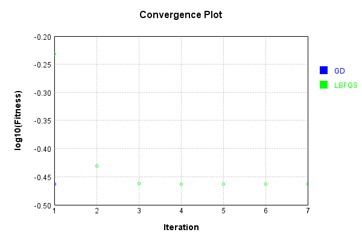
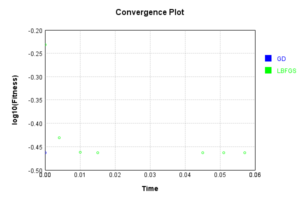
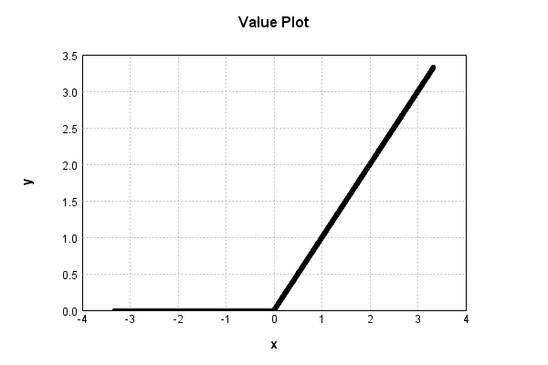

# MaxConstLayer
## MaxConstLayerTest
### Json Serialization
Code from [JsonTest.java:36](../../../../../../../src/main/java/com/simiacryptus/mindseye/test/unit/JsonTest.java#L36) executed in 0.00 seconds: 
```java
    JsonObject json = layer.getJson();
    NNLayer echo = NNLayer.fromJson(json);
    if ((echo == null)) throw new AssertionError("Failed to deserialize");
    if ((layer == echo)) throw new AssertionError("Serialization did not copy");
    if ((!layer.equals(echo))) throw new AssertionError("Serialization not equal");
    return new GsonBuilder().setPrettyPrinting().create().toJson(json);
```

Returns: 

```
    {
      "class": "com.simiacryptus.mindseye.layers.java.MaxConstLayer",
      "id": "7e521893-2880-4e0a-95c7-5a7f3d8097fc",
      "isFrozen": true,
      "name": "MaxConstLayer/7e521893-2880-4e0a-95c7-5a7f3d8097fc",
      "value": 0.0
    }
```


### Example Input/Output Pair
Code from [ReferenceIO.java:68](../../../../../../../src/main/java/com/simiacryptus/mindseye/test/unit/ReferenceIO.java#L68) executed in 0.00 seconds: 
```java
    SimpleEval eval = SimpleEval.run(layer, inputPrototype);
    return String.format("--------------------\nInput: \n[%s]\n--------------------\nOutput: \n%s\n--------------------\nDerivative: \n%s",
      Arrays.stream(inputPrototype).map(t -> t.prettyPrint()).reduce((a, b) -> a + ",\n" + b).get(),
      eval.getOutput().prettyPrint(),
      Arrays.stream(eval.getDerivative()).map(t -> t.prettyPrint()).reduce((a, b) -> a + ",\n" + b).get());
```

Returns: 

```
    --------------------
    Input: 
    [[
    	[ [ -1.928 ], [ 1.32 ], [ 1.22 ] ],
    	[ [ -1.876 ], [ -0.224 ], [ 0.672 ] ]
    ]]
    --------------------
    Output: 
    [
    	[ [ 0.0 ], [ 1.32 ], [ 1.22 ] ],
    	[ [ 0.0 ], [ 0.0 ], [ 0.672 ] ]
    ]
    --------------------
    Derivative: 
    [
    	[ [ 0.0 ], [ 1.0 ], [ 1.0 ] ],
    	[ [ 0.0 ], [ 0.0 ], [ 1.0 ] ]
    ]
```


### Batch Execution
Code from [BatchingTester.java:66](../../../../../../../src/main/java/com/simiacryptus/mindseye/test/unit/BatchingTester.java#L66) executed in 0.00 seconds: 
```java
    return test(reference, inputPrototype);
```

Returns: 

```
    ToleranceStatistics{absoluteTol=0.0000e+00 +- 0.0000e+00 [0.0000e+00 - 0.0000e+00] (120#), relativeTol=0.0000e+00 +- 0.0000e+00 [0.0000e+00 - 0.0000e+00] (70#)}
```


Code from [SingleDerivativeTester.java:77](../../../../../../../src/main/java/com/simiacryptus/mindseye/test/unit/SingleDerivativeTester.java#L77) executed in 0.00 seconds: 
```java
    return test(component, inputPrototype);
```
Logging: 
```
    Inputs: [
    	[ [ 0.08 ], [ -1.16 ], [ -0.428 ] ],
    	[ [ 0.108 ], [ -1.972 ], [ -0.228 ] ]
    ]
    Inputs Statistics: {meanExponent=-0.4524571236125617, negative=4, min=-0.228, max=-0.228, mean=-0.6, count=6.0, positive=2, stdDev=0.7447165008690667, zeros=0}
    Output: [
    	[ [ 0.08 ], [ 0.0 ], [ 0.0 ] ],
    	[ [ 0.108 ], [ 0.0 ], [ 0.0 ] ]
    ]
    Outputs Statistics: {meanExponent=-1.0317431287605534, negative=0, min=0.0, max=0.0, mean=0.03133333333333333, count=6.0, positive=2, stdDev=0.04504318915095699, zeros=4}
    Feedback for input 0
    Inputs Values: [
    	[ [ 0.08 ], [ -1.16 ], [ -0.428 ] ],
    	[ [ 0.108 ], [ -1.972 ], [ -0.228 ] ]
    ]
    Value Statistics: {meanExponent=-0.4524571236125617, negative=4, min=-0.228, max=-0.228, mean=-0.6, count=6.0, positive=2, stdDev=0.7447165008690667, zeros=0}
    Implemented Feedback: [ [ 1.0, 0.0, 0.0, 0.0, 0.0, 0.0 ], [ 0.0, 1.0, 0.0, 0.0, 0.0, 0.0 ], [ 0.0, 0.0, 0.0, 0.0, 0.0, 0.0 ], [ 0.0, 0.0, 0.0, 0.0, 0.0, 0.0 ], [ 0.0, 0.0, 0.0, 0.0, 0.0, 0.0 ], [ 0.0, 0.0, 0.0, 0.0, 0.0, 0.0 ] ]
    Implemented S
```
...[skipping 177 bytes](etc/335.txt)...
```
    000000000286, 0.0, 0.0, 0.0, 0.0, 0.0 ], [ 0.0, 1.0000000000000286, 0.0, 0.0, 0.0, 0.0 ], [ 0.0, 0.0, 0.0, 0.0, 0.0, 0.0 ], [ 0.0, 0.0, 0.0, 0.0, 0.0, 0.0 ], [ 0.0, 0.0, 0.0, 0.0, 0.0, 0.0 ], [ 0.0, 0.0, 0.0, 0.0, 0.0, 0.0 ] ]
    Measured Statistics: {meanExponent=1.2439824318537225E-14, negative=0, min=0.0, max=0.0, mean=0.05555555555555715, count=36.0, positive=2, stdDev=0.22906142364543217, zeros=34}
    Feedback Error: [ [ 2.864375403532904E-14, 0.0, 0.0, 0.0, 0.0, 0.0 ], [ 0.0, 2.864375403532904E-14, 0.0, 0.0, 0.0, 0.0 ], [ 0.0, 0.0, 0.0, 0.0, 0.0, 0.0 ], [ 0.0, 0.0, 0.0, 0.0, 0.0, 0.0 ], [ 0.0, 0.0, 0.0, 0.0, 0.0, 0.0 ], [ 0.0, 0.0, 0.0, 0.0, 0.0, 0.0 ] ]
    Error Statistics: {meanExponent=-13.542970064227774, negative=0, min=0.0, max=0.0, mean=1.5913196686293911E-15, count=36.0, positive=2, stdDev=6.561179077881874E-15, zeros=34}
    Finite-Difference Derivative Accuracy:
    absoluteTol: 1.5913e-15 +- 6.5612e-15 [0.0000e+00 - 2.8644e-14] (36#)
    relativeTol: 1.4322e-14 +- 0.0000e+00 [1.4322e-14 - 1.4322e-14] (2#)
    
```

Returns: 

```
    ToleranceStatistics{absoluteTol=1.5913e-15 +- 6.5612e-15 [0.0000e+00 - 2.8644e-14] (36#), relativeTol=1.4322e-14 +- 0.0000e+00 [1.4322e-14 - 1.4322e-14] (2#)}
```


### Performance
Now we execute larger-scale runs to benchmark performance:

Code from [PerformanceTester.java:66](../../../../../../../src/main/java/com/simiacryptus/mindseye/test/unit/PerformanceTester.java#L66) executed in 0.16 seconds: 
```java
    test(component, inputPrototype);
```
Logging: 
```
    100 batches
    Input Dimensions:
    	[100, 100, 1]
    Performance:
    	Evaluation performance: 0.003918s +- 0.000141s [0.003732s - 0.004145s]
    	Learning performance: 0.024131s +- 0.018710s [0.012154s - 0.061071s]
    
```

### Input Learning
In this test, we use a network to learn this target input, given it's pre-evaluated output:

Code from [LearningTester.java:127](../../../../../../../src/main/java/com/simiacryptus/mindseye/test/unit/LearningTester.java#L127) executed in 0.00 seconds: 
```java
    return Arrays.stream(input_target).map(x -> x.prettyPrint()).reduce((a, b) -> a + "\n" + b).orElse("");
```

Returns: 

```
    [
    	[ [ -1.584 ], [ 0.312 ], [ -0.924 ], [ -0.54 ], [ -0.688 ], [ -1.024 ], [ -1.436 ], [ 0.844 ], ... ],
    	[ [ -0.204 ], [ 1.944 ], [ -0.428 ], [ -0.376 ], [ 0.036 ], [ 1.928 ], [ -0.34 ], [ -0.128 ], ... ],
    	[ [ -1.876 ], [ -1.86 ], [ 1.972 ], [ -1.164 ], [ -0.004 ], [ -0.356 ], [ -0.104 ], [ 0.82 ], ... ],
    	[ [ -1.764 ], [ 1.744 ], [ 0.672 ], [ 0.088 ], [ -0.784 ], [ 0.188 ], [ 1.868 ], [ -0.668 ], ... ],
    	[ [ -0.544 ], [ -1.248 ], [ 0.556 ], [ 1.696 ], [ 0.064 ], [ 0.224 ], [ 0.944 ], [ -1.456 ], ... ],
    	[ [ -1.88 ], [ -0.3 ], [ 0.448 ], [ -0.936 ], [ 0.164 ], [ 1.96 ], [ -1.3 ], [ 0.48 ], ... ],
    	[ [ 0.284 ], [ -1.708 ], [ -0.844 ], [ 1.22 ], [ -1.284 ], [ 1.548 ], [ -0.244 ], [ -0.092 ], ... ],
    	[ [ 1.3 ], [ -0.388 ], [ -0.444 ], [ 1.368 ], [ -1.768 ], [ 0.548 ], [ -1.64 ], [ -1.376 ], ... ],
    	...
    ]
```


First, we use a conjugate gradient descent method, which converges the fastest for purely linear functions.

Code from [LearningTester.java:300](../../../../../../../src/main/java/com/simiacryptus/mindseye/test/unit/LearningTester.java#L300) executed in 0.03 seconds: 
```java
    return new IterativeTrainer(trainable)
      .setLineSearchFactory(label -> new QuadraticSearch())
      .setOrientation(new GradientDescent())
      .setMonitor(monitor)
      .setTimeout(30, TimeUnit.SECONDS)
      .setMaxIterations(250)
      .setTerminateThreshold(0)
      .run();
```
Logging: 
```
    Constructing line search parameters: GD
    F(0.0) = LineSearchPoint{point=PointSample{avg=0.8542190623999942}, derivative=-2.0408539136000003E-4}
    New Minimum: 0.8542190623999942 > 0.8542190623999719
    F(1.0E-10) = LineSearchPoint{point=PointSample{avg=0.8542190623999719}, derivative=-2.0408539135999593E-4}, delta = -2.2315482794965646E-14
    New Minimum: 0.8542190623999719 > 0.8542190623998549
    F(7.000000000000001E-10) = LineSearchPoint{point=PointSample{avg=0.8542190623998549}, derivative=-2.0408539135997146E-4}, delta = -1.3933298959045715E-13
    New Minimum: 0.8542190623998549 > 0.8542190623989986
    F(4.900000000000001E-9) = LineSearchPoint{point=PointSample{avg=0.8542190623989986}, derivative=-2.0408539135980002E-4}, delta = -9.956480084838404E-13
    New Minimum: 0.8542190623989986 > 0.8542190623929918
    F(3.430000000000001E-8) = LineSearchPoint{point=PointSample{avg=0.8542190623929918}, derivative=-2.040853913586E-4}, delta = -7.002398660915787E-12
    New Minimum: 0.8542190623929918 > 0.8542190623509958
    F(2.4010000
```
...[skipping 1592 bytes](etc/336.txt)...
```
    inimum: 0.8541787088477173 > 0.8539366210473907
    F(1.3841287201) = LineSearchPoint{point=PointSample{avg=0.8539366210473907}, derivative=-2.0402889526969318E-4}, delta = -2.824413526035796E-4
    Loops = 12
    New Minimum: 0.8539366210473907 > 0.3440055840000004
    F(5000.000000000243) = LineSearchPoint{point=PointSample{avg=0.3440055840000004}, derivative=3.3077275424231447E-18}, delta = -0.5102134783999939
    Right bracket at 5000.000000000243
    Converged to right
    Iteration 1 complete. Error: 0.3440055840000004 Total: 249806978208961.0300; Orientation: 0.0004; Line Search: 0.0227
    Zero gradient: 4.010141430244382E-16
    F(0.0) = LineSearchPoint{point=PointSample{avg=0.3440055840000004}, derivative=-1.608123429056246E-31}
    F(5000.000000000243) = LineSearchPoint{point=PointSample{avg=0.3440055840000004}, derivative=0.0}, delta = 0.0
    0.3440055840000004 <= 0.3440055840000004
    Converged to right
    Iteration 2 failed, aborting. Error: 0.3440055840000004 Total: 249806981482793.0300; Orientation: 0.0003; Line Search: 0.0022
    
```

Returns: 

```
    0.3440055840000004
```


This training run resulted in the following regressed input:

Code from [LearningTester.java:144](../../../../../../../src/main/java/com/simiacryptus/mindseye/test/unit/LearningTester.java#L144) executed in 0.01 seconds: 
```java
    return Arrays.stream(input_gd).map(x -> x.prettyPrint()).reduce((a, b) -> a + "\n" + b).orElse("");
```

Returns: 

```
    [
    	[ [ -1.328 ], [ 0.312 ], [ -0.832 ], [ -6.106226635438361E-14 ], [ -0.996 ], [ -0.46 ], [ -0.948 ], [ 0.844 ], ... ],
    	[ [ -0.468 ], [ 1.944 ], [ -4.374278717023117E-14 ], [ -3.6193270602780103E-14 ], [ 0.036 ], [ -0.028 ], [ -1.664 ], [ -9.481304630298837E-14 ], ... ],
    	[ [ -1.848 ], [ -4.6629367034256575E-14 ], [ 1.972 ], [ -1.564 ], [ -3.4861002973229915E-14 ], [ -0.668 ], [ -3.708144902248023E-14 ], [ 0.82 ], ... ],
    	[ [ -4.2299497238218464E-14 ], [ 1.744 ], [ 0.672 ], [ -1.412 ], [ -0.208 ], [ 0.188 ], [ 1.868 ], [ -0.772 ], ... ],
    	[ [ -8.548717289613705E-14 ], [ -1.656 ], [ 0.556 ], [ 1.696 ], [ -0.744 ], [ -1.488 ], [ -1.776 ], [ -4.163336342344337E-14 ], ... ],
    	[ [ -9.392486788328824E-14 ], [ -0.46 ], [ -0.068 ], [ -1.22 ], [ -1.756 ], [ -1.128 ], [ -1.56 ], [ -0.364 ], ... ],
    	[ [ 0.284 ], [ -2.5326962749261384E-15 ], [ -1.224 ], [ -0.184 ], [ -0.392 ], [ 1.548 ], [ -0.228 ], [ -1.432 ], ... ],
    	[ [ -1.644 ], [ -0.936 ], [ -9.037215420448774E-14 ], [ 1.368 ], [ -8.393286066166183E-14 ], [ 0.548 ], [ -1.912 ], [ -3.2862601528904634E-14 ], ... ],
    	...
    ]
```


Next, we run the same optimization using L-BFGS, which is nearly ideal for purely second-order or quadratic functions.

Code from [LearningTester.java:324](../../../../../../../src/main/java/com/simiacryptus/mindseye/test/unit/LearningTester.java#L324) executed in 0.07 seconds: 
```java
    return new IterativeTrainer(trainable)
      .setLineSearchFactory(label -> new ArmijoWolfeSearch())
      .setOrientation(new LBFGS())
      .setMonitor(monitor)
      .setTimeout(30, TimeUnit.SECONDS)
      .setMaxIterations(250)
      .setTerminateThreshold(0)
      .run();
```
Logging: 
```
    LBFGS Accumulation History: 1 points
    Constructing line search parameters: GD
    th(0)=0.8542190623999942;dx=-2.0408539136000003E-4
    New Minimum: 0.8542190623999942 > 0.8537794684811728
    WOLFE (weak): th(2.154434690031884)=0.8537794684811728; dx=-2.0399745363062507E-4 delta=4.3959391882142373E-4
    New Minimum: 0.8537794684811728 > 0.8533400640184382
    WOLFE (weak): th(4.308869380063768)=0.8533400640184382; dx=-2.0390951590125013E-4 delta=8.789983815560287E-4
    New Minimum: 0.8533400640184382 > 0.8515843407284581
    WOLFE (weak): th(12.926608140191302)=0.8515843407284581; dx=-2.0355776498375035E-4 delta=0.002634721671536111
    New Minimum: 0.8515843407284581 > 0.8437210982302856
    WOLFE (weak): th(51.70643256076521)=0.8437210982302856; dx=-2.019748858550014E-4 delta=0.010497964169708607
    New Minimum: 0.8437210982302856 > 0.8028205086570716
    WOLFE (weak): th(258.53216280382605)=0.8028205086570716; dx=-1.935328638350068E-4 delta=0.05139855374292268
    New Minimum: 0.8028205086570716 > 0.5867502564037014
    END: th(1551.192976
```
...[skipping 2417 bytes](etc/337.txt)...
```
    00000002)=0.3440056125226101; dx=-1.1409043505295157E-10 delta=2.8237382689311197E-6
    Iteration 6 complete. Error: 0.3440056125226101 Total: 249807053883832.9400; Orientation: 0.0006; Line Search: 0.0043
    LBFGS Accumulation History: 1 points
    th(0)=0.3440056125226101;dx=-1.1409043505294967E-11
    New Minimum: 0.3440056125226101 > 0.3440055923838227
    WOLF (strong): th(9694.956105143481)=0.3440055923838227; dx=3.5714175864842723E-12 delta=2.0138787359957888E-8
    New Minimum: 0.3440055923838227 > 0.3440055840265403
    END: th(4847.478052571741)=0.3440055840265403; dx=-3.480259067442283E-13 delta=2.8496069781613897E-8
    Iteration 7 complete. Error: 0.3440055840265403 Total: 249807059689696.9400; Orientation: 0.0005; Line Search: 0.0043
    LBFGS Accumulation History: 1 points
    th(0)=0.3440055840265403;dx=-1.0616317810421987E-14
    MAX ALPHA: th(0)=0.3440055840265403;th'(0)=-1.0616317810421987E-14;
    Iteration 8 failed, aborting. Error: 0.3440055840265403 Total: 249807063418639.9400; Orientation: 0.0005; Line Search: 0.0025
    
```

Returns: 

```
    0.3440055840265403
```


This training run resulted in the following regressed input:

Code from [LearningTester.java:154](../../../../../../../src/main/java/com/simiacryptus/mindseye/test/unit/LearningTester.java#L154) executed in 0.01 seconds: 
```java
    return Arrays.stream(input_lbgfs).map(x -> x.prettyPrint()).reduce((a, b) -> a + "\n" + b).orElse("");
```

Returns: 

```
    [
    	[ [ -1.328 ], [ 0.3120117129697362 ], [ -0.832 ], [ 9.058799254102131E-6 ], [ -0.996 ], [ -0.46 ], [ -0.948 ], [ 0.8440055968377557 ], ... ],
    	[ [ -0.468 ], [ 1.9439930760770032 ], [ 6.491177809468093E-6 ], [ 5.3660403224936105E-6 ], [ 0.036002596471123784 ], [ -0.028 ], [ -1.664 ], [ 1.4078643426757454E-5 ], ... ],
    	[ [ -1.848 ], [ 6.9239229967659735E-6 ], [ 1.971995095554544 ], [ -1.564 ], [ 5.164092568421292E-6 ], [ -0.668 ], [ 5.5102887182595795E-6 ], [ 0.8200027118698403 ], ... ],
    	[ [ 6.260380376242559E-6 ], [ 1.743989469867109 ], [ 0.6720065200274886 ], [ -1.412 ], [ -0.208 ], [ 0.18801234766267758 ], [ 1.8679914316452917 ], [ -0.772 ], ... ],
    	[ [ 1.2665009148251087E-5 ], [ -1.656 ], [ 0.5560098954399496 ], [ 1.695989642965184 ], [ -0.744 ], [ -1.488 ], [ -1.776 ], [ 6.173831338782994E-6 ], ... ],
    	[ [ 1.393439503099154E-5 ], [ -0.46 ], [ -0.068 ], [ -1.22 ], [ -1.756 ], [ -1.128 ], [ -1.56 ], [ -0.364 ], ... ],
    	[ [ 0.28401032818513683 ], [ 3.750458289914898E-7 ], [ -1.224 ], [ -0.184 ], [ -0.392 ], [ 1.5479944897112818 ], [ -0.228 ], [ -1.432 ], ... ],
    	[ [ -1.644 ], [ -0.936 ], [ 1.3415100806234094E-5 ], [ 1.367994489711282 ], [ 1.243421171502558E-5 ], [ 0.5479974323785554 ], [ -1.912 ], [ 4.8755957768893536E-6 ], ... ],
    	...
    ]
```


Code from [LearningTester.java:96](../../../../../../../src/main/java/com/simiacryptus/mindseye/test/unit/LearningTester.java#L96) executed in 0.00 seconds: 
```java
    return TestUtil.compare(runs);
```

Returns: 




Code from [LearningTester.java:99](../../../../../../../src/main/java/com/simiacryptus/mindseye/test/unit/LearningTester.java#L99) executed in 0.00 seconds: 
```java
    return TestUtil.compareTime(runs);
```

Returns: 




### Function Plots
Code from [ActivationLayerTestBase.java:110](../../../../../../../src/test/java/com/simiacryptus/mindseye/layers/java/ActivationLayerTestBase.java#L110) executed in 0.00 seconds: 
```java
    return plot("Value Plot", plotData, x -> new double[]{x[0], x[1]});
```

Returns: 




Code from [ActivationLayerTestBase.java:114](../../../../../../../src/test/java/com/simiacryptus/mindseye/layers/java/ActivationLayerTestBase.java#L114) executed in 0.00 seconds: 
```java
    return plot("Derivative Plot", plotData, x -> new double[]{x[0], x[2]});
```

Returns: 


