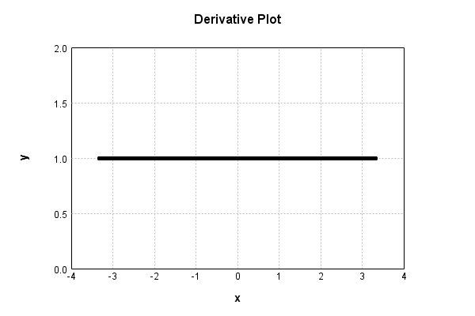

# MaxDropoutNoiseLayer
## MaxDropoutNoiseLayerTest
### Json Serialization
Code from [StandardLayerTests.java:68](../../../../../../../src/main/java/com/simiacryptus/mindseye/test/StandardLayerTests.java#L68) executed in 0.00 seconds: 
```java
    JsonObject json = layer.getJson();
    NNLayer echo = NNLayer.fromJson(json);
    if ((echo == null)) throw new AssertionError("Failed to deserialize");
    if ((layer == echo)) throw new AssertionError("Serialization did not copy");
    if ((!layer.equals(echo))) throw new AssertionError("Serialization not equal");
    return new GsonBuilder().setPrettyPrinting().create().toJson(json);
```

Returns: 

```
    {
      "class": "com.simiacryptus.mindseye.layers.java.MaxDropoutNoiseLayer",
      "id": "83e6f7ee-fa06-4b4c-bf96-acbb07502784",
      "isFrozen": false,
      "name": "MaxDropoutNoiseLayer/83e6f7ee-fa06-4b4c-bf96-acbb07502784",
      "kernelSize": [
        2,
        2,
        1
      ]
    }
```


### Example Input/Output Pair
Code from [StandardLayerTests.java:152](../../../../../../../src/main/java/com/simiacryptus/mindseye/test/StandardLayerTests.java#L152) executed in 0.00 seconds: 
```java
    SimpleEval eval = SimpleEval.run(layer, inputPrototype);
    return String.format("--------------------\nInput: \n[%s]\n--------------------\nOutput: \n%s\n--------------------\nDerivative: \n%s",
      Arrays.stream(inputPrototype).map(t -> t.prettyPrint()).reduce((a, b) -> a + ",\n" + b).get(),
      eval.getOutput().prettyPrint(),
      Arrays.stream(eval.getDerivative()).map(t -> t.prettyPrint()).reduce((a, b) -> a + ",\n" + b).get());
```

Returns: 

```
    --------------------
    Input: 
    [[
    	[ [ -0.04 ], [ 0.852 ], [ 1.216 ], [ -1.452 ] ],
    	[ [ -0.616 ], [ -0.58 ], [ 0.58 ], [ 1.72 ] ],
    	[ [ 0.932 ], [ -0.884 ], [ 0.448 ], [ 0.092 ] ],
    	[ [ 1.18 ], [ 0.904 ], [ 0.4 ], [ 0.528 ] ]
    ]]
    --------------------
    Output: 
    [
    	[ [ -0.0 ], [ 0.0 ], [ 0.0 ], [ -0.0 ] ],
    	[ [ -0.0 ], [ -0.0 ], [ 0.0 ], [ 0.0 ] ],
    	[ [ 0.0 ], [ -0.0 ], [ 0.0 ], [ 0.0 ] ],
    	[ [ 0.0 ], [ 0.0 ], [ 0.0 ], [ 0.528 ] ]
    ]
    --------------------
    Derivative: 
    [
    	[ [ 0.0 ], [ 0.0 ], [ 0.0 ], [ 0.0 ] ],
    	[ [ 0.0 ], [ 0.0 ], [ 0.0 ], [ 0.0 ] ],
    	[ [ 0.0 ], [ 0.0 ], [ 0.0 ], [ 0.0 ] ],
    	[ [ 0.0 ], [ 0.0 ], [ 0.0 ], [ 1.0 ] ]
    ]
```


### Batch Execution
Code from [StandardLayerTests.java:101](../../../../../../../src/main/java/com/simiacryptus/mindseye/test/StandardLayerTests.java#L101) executed in 0.00 seconds: 
```java
    return getBatchingTester().test(layer, inputPrototype);
```

Returns: 

```
    ToleranceStatistics{absoluteTol=0.0000e+00 +- 0.0000e+00 [0.0000e+00 - 0.0000e+00] (320#), relativeTol=0.0000e+00 +- 0.0000e+00 [0.0000e+00 - 0.0000e+00] (20#)}
```


### Differential Validation
Code from [StandardLayerTests.java:109](../../../../../../../src/main/java/com/simiacryptus/mindseye/test/StandardLayerTests.java#L109) executed in 0.00 seconds: 
```java
    return getDerivativeTester().test(layer, inputPrototype);
```
Logging: 
```
    Inputs: [
    	[ [ -0.856 ], [ 1.592 ], [ -0.292 ], [ -1.112 ] ],
    	[ [ -0.82 ], [ 0.096 ], [ 1.164 ], [ 1.384 ] ],
    	[ [ 0.088 ], [ 1.396 ], [ 1.968 ], [ -1.44 ] ],
    	[ [ -1.276 ], [ -1.512 ], [ -1.464 ], [ 0.3 ] ]
    ]
    Inputs Statistics: {meanExponent=-0.11131880648428726, negative=8, min=0.3, max=0.3, mean=-0.049, count=16.0, positive=8, stdDev=1.1872594493201558, zeros=0}
    Output: [
    	[ [ -0.0 ], [ 0.0 ], [ -0.0 ], [ -0.0 ] ],
    	[ [ -0.0 ], [ 0.0 ], [ 0.0 ], [ 0.0 ] ],
    	[ [ 0.0 ], [ 0.0 ], [ 0.0 ], [ -0.0 ] ],
    	[ [ -0.0 ], [ -0.0 ], [ -0.0 ], [ 0.3 ] ]
    ]
    Outputs Statistics: {meanExponent=-0.5228787452803376, negative=0, min=0.3, max=0.3, mean=0.01875, count=16.0, positive=1, stdDev=0.07261843774138907, zeros=15}
    Feedback for input 0
    Inputs Values: [
    	[ [ -0.856 ], [ 1.592 ], [ -0.292 ], [ -1.112 ] ],
    	[ [ -0.82 ], [ 0.096 ], [ 1.164 ], [ 1.384 ] ],
    	[ [ 0.088 ], [ 1.396 ], [ 1.968 ], [ -1.44 ] ],
    	[ [ -1.276 ], [ -1.512 ], [ -1.464 ], [ 0.3 ] ]
    ]
    Value Statistics: {meanExponent=-0.11131880648428726, negative=8, 
```
...[skipping 1096 bytes](etc/123.txt)...
```
    ed Statistics: {meanExponent=-4.7830642341045674E-14, negative=0, min=0.9999999999998899, max=0.9999999999998899, mean=0.00390624999999957, count=256.0, positive=1, stdDev=0.06237781024480294, zeros=255}
    Feedback Error: [ [ 0.0, 0.0, 0.0, 0.0, 0.0, 0.0, 0.0, 0.0, ... ], [ 0.0, 0.0, 0.0, 0.0, 0.0, 0.0, 0.0, 0.0, ... ], [ 0.0, 0.0, 0.0, 0.0, 0.0, 0.0, 0.0, 0.0, ... ], [ 0.0, 0.0, 0.0, 0.0, 0.0, 0.0, 0.0, 0.0, ... ], [ 0.0, 0.0, 0.0, 0.0, 0.0, 0.0, 0.0, 0.0, ... ], [ 0.0, 0.0, 0.0, 0.0, 0.0, 0.0, 0.0, 0.0, ... ], [ 0.0, 0.0, 0.0, 0.0, 0.0, 0.0, 0.0, 0.0, ... ], [ 0.0, 0.0, 0.0, 0.0, 0.0, 0.0, 0.0, 0.0, ... ], ... ]
    Error Statistics: {meanExponent=-12.958078098036825, negative=1, min=-1.1013412404281553E-13, max=-1.1013412404281553E-13, mean=-4.3021142204224816E-16, count=256.0, positive=0, stdDev=6.869925491021093E-15, zeros=255}
    Finite-Difference Derivative Accuracy:
    absoluteTol: 4.3021e-16 +- 6.8699e-15 [0.0000e+00 - 1.1013e-13] (256#)
    relativeTol: 5.5067e-14 +- 0.0000e+00 [5.5067e-14 - 5.5067e-14] (1#)
    
```

Returns: 

```
    ToleranceStatistics{absoluteTol=4.3021e-16 +- 6.8699e-15 [0.0000e+00 - 1.1013e-13] (256#), relativeTol=5.5067e-14 +- 0.0000e+00 [5.5067e-14 - 5.5067e-14] (1#)}
```


### Performance
Code from [StandardLayerTests.java:119](../../../../../../../src/main/java/com/simiacryptus/mindseye/test/StandardLayerTests.java#L119) executed in 0.72 seconds: 
```java
    getPerformanceTester().test(layer, permPrototype);
```
Logging: 
```
    100 batches
    Input Dimensions:
    	[100, 100, 1]
    Performance:
    	Evaluation performance: 0.058489s +- 0.006052s [0.052509s - 0.069820s]
    	Learning performance: 0.011995s +- 0.003950s [0.009466s - 0.019843s]
    
```

### Function Plots
Code from [ActivationLayerTestBase.java:110](../../../../../../../src/test/java/com/simiacryptus/mindseye/layers/java/ActivationLayerTestBase.java#L110) executed in 0.00 seconds: 
```java
    return plot("Value Plot", plotData, x -> new double[]{x[0], x[1]});
```

Returns: 


Code from [ActivationLayerTestBase.java:114](../../../../../../../src/test/java/com/simiacryptus/mindseye/layers/java/ActivationLayerTestBase.java#L114) executed in 0.00 seconds: 
```java
    return plot("Derivative Plot", plotData, x -> new double[]{x[0], x[2]});
```

Returns: 




