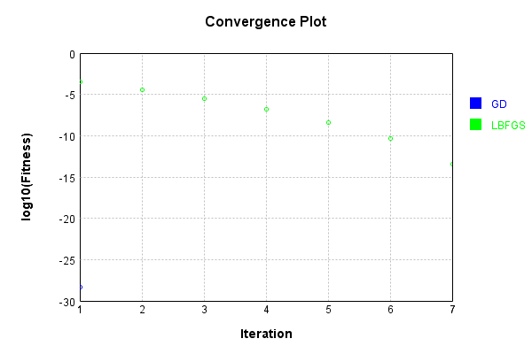
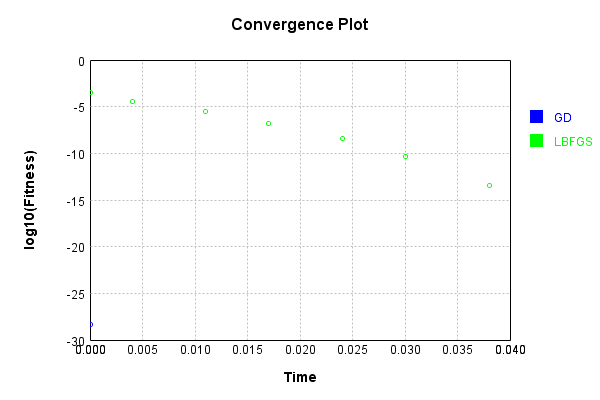

# MaxDropoutNoiseLayer
## MaxDropoutNoiseLayerTest
### Json Serialization
Code from [JsonTest.java:36](../../../../../../../src/main/java/com/simiacryptus/mindseye/test/unit/JsonTest.java#L36) executed in 0.00 seconds: 
```java
    JsonObject json = layer.getJson();
    NNLayer echo = NNLayer.fromJson(json);
    if ((echo == null)) throw new AssertionError("Failed to deserialize");
    if ((layer == echo)) throw new AssertionError("Serialization did not copy");
    if ((!layer.equals(echo))) throw new AssertionError("Serialization not equal");
    return new GsonBuilder().setPrettyPrinting().create().toJson(json);
```

Returns: 

```
    {
      "class": "com.simiacryptus.mindseye.layers.java.MaxDropoutNoiseLayer",
      "id": "91227108-68a7-447e-97fe-40dd10478fc4",
      "isFrozen": false,
      "name": "MaxDropoutNoiseLayer/91227108-68a7-447e-97fe-40dd10478fc4",
      "kernelSize": [
        2,
        2,
        1
      ]
    }
```


### Example Input/Output Pair
Code from [ReferenceIO.java:68](../../../../../../../src/main/java/com/simiacryptus/mindseye/test/unit/ReferenceIO.java#L68) executed in 0.00 seconds: 
```java
    SimpleEval eval = SimpleEval.run(layer, inputPrototype);
    return String.format("--------------------\nInput: \n[%s]\n--------------------\nOutput: \n%s\n--------------------\nDerivative: \n%s",
      Arrays.stream(inputPrototype).map(t -> t.prettyPrint()).reduce((a, b) -> a + ",\n" + b).get(),
      eval.getOutput().prettyPrint(),
      Arrays.stream(eval.getDerivative()).map(t -> t.prettyPrint()).reduce((a, b) -> a + ",\n" + b).get());
```

Returns: 

```
    --------------------
    Input: 
    [[
    	[ [ -0.456 ], [ -1.456 ], [ -1.928 ], [ -0.836 ] ],
    	[ [ -1.436 ], [ 0.904 ], [ 0.752 ], [ -0.624 ] ],
    	[ [ -0.916 ], [ -0.148 ], [ 1.892 ], [ -0.172 ] ],
    	[ [ -1.26 ], [ -1.464 ], [ -1.924 ], [ -1.592 ] ]
    ]]
    --------------------
    Output: 
    [
    	[ [ -0.0 ], [ -0.0 ], [ -0.0 ], [ -0.0 ] ],
    	[ [ -0.0 ], [ 0.0 ], [ 0.0 ], [ -0.0 ] ],
    	[ [ -0.0 ], [ -0.0 ], [ 0.0 ], [ -0.0 ] ],
    	[ [ -0.0 ], [ -0.0 ], [ -0.0 ], [ -1.592 ] ]
    ]
    --------------------
    Derivative: 
    [
    	[ [ 0.0 ], [ 0.0 ], [ 0.0 ], [ 0.0 ] ],
    	[ [ 0.0 ], [ 0.0 ], [ 0.0 ], [ 0.0 ] ],
    	[ [ 0.0 ], [ 0.0 ], [ 0.0 ], [ 0.0 ] ],
    	[ [ 0.0 ], [ 0.0 ], [ 0.0 ], [ 1.0 ] ]
    ]
```


### Batch Execution
Code from [BatchingTester.java:66](../../../../../../../src/main/java/com/simiacryptus/mindseye/test/unit/BatchingTester.java#L66) executed in 0.00 seconds: 
```java
    return test(reference, inputPrototype);
```

Returns: 

```
    ToleranceStatistics{absoluteTol=0.0000e+00 +- 0.0000e+00 [0.0000e+00 - 0.0000e+00] (320#), relativeTol=0.0000e+00 +- 0.0000e+00 [0.0000e+00 - 0.0000e+00] (20#)}
```


Code from [SingleDerivativeTester.java:77](../../../../../../../src/main/java/com/simiacryptus/mindseye/test/unit/SingleDerivativeTester.java#L77) executed in 0.00 seconds: 
```java
    return test(component, inputPrototype);
```
Logging: 
```
    Inputs: [
    	[ [ 1.76 ], [ 1.624 ], [ 0.344 ], [ 0.9 ] ],
    	[ [ 0.996 ], [ -1.764 ], [ 0.14 ], [ -1.532 ] ],
    	[ [ -0.548 ], [ 1.3 ], [ -1.996 ], [ -1.232 ] ],
    	[ [ -0.548 ], [ -0.028 ], [ -1.472 ], [ 1.144 ] ]
    ]
    Inputs Statistics: {meanExponent=-0.11382425345121731, negative=8, min=1.144, max=1.144, mean=-0.05699999999999998, count=16.0, positive=8, stdDev=1.233653516997378, zeros=0}
    Output: [
    	[ [ 0.0 ], [ 0.0 ], [ 0.0 ], [ 0.0 ] ],
    	[ [ 0.0 ], [ -0.0 ], [ 0.0 ], [ -0.0 ] ],
    	[ [ -0.0 ], [ 0.0 ], [ -0.0 ], [ -0.0 ] ],
    	[ [ -0.0 ], [ -0.0 ], [ -0.0 ], [ 1.144 ] ]
    ]
    Outputs Statistics: {meanExponent=0.05842602445700536, negative=0, min=1.144, max=1.144, mean=0.0715, count=16.0, positive=1, stdDev=0.27691830925383026, zeros=15}
    Feedback for input 0
    Inputs Values: [
    	[ [ 1.76 ], [ 1.624 ], [ 0.344 ], [ 0.9 ] ],
    	[ [ 0.996 ], [ -1.764 ], [ 0.14 ], [ -1.532 ] ],
    	[ [ -0.548 ], [ 1.3 ], [ -1.996 ], [ -1.232 ] ],
    	[ [ -0.548 ], [ -0.028 ], [ -1.472 ], [ 1.144 ] ]
    ]
    Value Statistics: {meanExponent=-0.1138242534512
```
...[skipping 1131 bytes](etc/338.txt)...
```
    ed Statistics: {meanExponent=-4.7830642341045674E-14, negative=0, min=0.9999999999998899, max=0.9999999999998899, mean=0.00390624999999957, count=256.0, positive=1, stdDev=0.06237781024480294, zeros=255}
    Feedback Error: [ [ 0.0, 0.0, 0.0, 0.0, 0.0, 0.0, 0.0, 0.0, ... ], [ 0.0, 0.0, 0.0, 0.0, 0.0, 0.0, 0.0, 0.0, ... ], [ 0.0, 0.0, 0.0, 0.0, 0.0, 0.0, 0.0, 0.0, ... ], [ 0.0, 0.0, 0.0, 0.0, 0.0, 0.0, 0.0, 0.0, ... ], [ 0.0, 0.0, 0.0, 0.0, 0.0, 0.0, 0.0, 0.0, ... ], [ 0.0, 0.0, 0.0, 0.0, 0.0, 0.0, 0.0, 0.0, ... ], [ 0.0, 0.0, 0.0, 0.0, 0.0, 0.0, 0.0, 0.0, ... ], [ 0.0, 0.0, 0.0, 0.0, 0.0, 0.0, 0.0, 0.0, ... ], ... ]
    Error Statistics: {meanExponent=-12.958078098036825, negative=1, min=-1.1013412404281553E-13, max=-1.1013412404281553E-13, mean=-4.3021142204224816E-16, count=256.0, positive=0, stdDev=6.869925491021093E-15, zeros=255}
    Finite-Difference Derivative Accuracy:
    absoluteTol: 4.3021e-16 +- 6.8699e-15 [0.0000e+00 - 1.1013e-13] (256#)
    relativeTol: 5.5067e-14 +- 0.0000e+00 [5.5067e-14 - 5.5067e-14] (1#)
    
```

Returns: 

```
    ToleranceStatistics{absoluteTol=4.3021e-16 +- 6.8699e-15 [0.0000e+00 - 1.1013e-13] (256#), relativeTol=5.5067e-14 +- 0.0000e+00 [5.5067e-14 - 5.5067e-14] (1#)}
```


### Performance
Now we execute larger-scale runs to benchmark performance:

Code from [PerformanceTester.java:66](../../../../../../../src/main/java/com/simiacryptus/mindseye/test/unit/PerformanceTester.java#L66) executed in 0.71 seconds: 
```java
    test(component, inputPrototype);
```
Logging: 
```
    100 batches
    Input Dimensions:
    	[100, 100, 1]
    Performance:
    	Evaluation performance: 0.062747s +- 0.009060s [0.052520s - 0.073338s]
    	Learning performance: 0.015146s +- 0.004673s [0.011737s - 0.023891s]
    
```

### Input Learning
In this test, we use a network to learn this target input, given it's pre-evaluated output:

Code from [LearningTester.java:127](../../../../../../../src/main/java/com/simiacryptus/mindseye/test/unit/LearningTester.java#L127) executed in 0.00 seconds: 
```java
    return Arrays.stream(input_target).map(x -> x.prettyPrint()).reduce((a, b) -> a + "\n" + b).orElse("");
```

Returns: 

```
    [
    	[ [ 1.592 ], [ 1.66 ], [ -1.432 ], [ -1.456 ], [ 0.24 ], [ 0.724 ], [ 0.948 ], [ 0.504 ], ... ],
    	[ [ 1.132 ], [ 1.676 ], [ -0.9 ], [ 1.716 ], [ -0.052 ], [ 1.904 ], [ 0.464 ], [ 0.992 ], ... ],
    	[ [ -1.652 ], [ -0.004 ], [ -1.08 ], [ 0.08 ], [ -0.692 ], [ -0.872 ], [ 1.436 ], [ -0.936 ], ... ],
    	[ [ 0.452 ], [ -0.508 ], [ 1.816 ], [ -0.052 ], [ 0.168 ], [ -1.136 ], [ 0.604 ], [ 1.676 ], ... ],
    	[ [ 1.108 ], [ -0.208 ], [ -1.972 ], [ 1.444 ], [ -1.728 ], [ -1.86 ], [ 0.016 ], [ 0.748 ], ... ],
    	[ [ -1.3 ], [ -0.524 ], [ -0.876 ], [ -0.076 ], [ -0.756 ], [ 0.9 ], [ -1.88 ], [ -1.7 ], ... ],
    	[ [ 1.872 ], [ 1.412 ], [ 1.196 ], [ -0.056 ], [ -1.056 ], [ -0.748 ], [ 0.948 ], [ -1.784 ], ... ],
    	[ [ 0.26 ], [ 0.652 ], [ -0.052 ], [ 1.384 ], [ -1.208 ], [ -0.488 ], [ -1.012 ], [ 1.268 ], ... ],
    	...
    ]
```


First, we use a conjugate gradient descent method, which converges the fastest for purely linear functions.

Code from [LearningTester.java:300](../../../../../../../src/main/java/com/simiacryptus/mindseye/test/unit/LearningTester.java#L300) executed in 0.03 seconds: 
```java
    return new IterativeTrainer(trainable)
      .setLineSearchFactory(label -> new QuadraticSearch())
      .setOrientation(new GradientDescent())
      .setMonitor(monitor)
      .setTimeout(30, TimeUnit.SECONDS)
      .setMaxIterations(250)
      .setTerminateThreshold(0)
      .run();
```
Logging: 
```
    Constructing line search parameters: GD
    F(0.0) = LineSearchPoint{point=PointSample{avg=7.398399999999999E-4}, derivative=-2.95936E-7}
    New Minimum: 7.398399999999999E-4 > 7.398399999999704E-4
    F(1.0E-10) = LineSearchPoint{point=PointSample{avg=7.398399999999704E-4}, derivative=-2.959359999999941E-7}, delta = -2.949029909160572E-17
    New Minimum: 7.398399999999704E-4 > 7.398399999997929E-4
    F(7.000000000000001E-10) = LineSearchPoint{point=PointSample{avg=7.398399999997929E-4}, derivative=-2.959359999999586E-7}, delta = -2.069741947274828E-16
    New Minimum: 7.398399999997929E-4 > 7.398399999985498E-4
    F(4.900000000000001E-9) = LineSearchPoint{point=PointSample{avg=7.398399999985498E-4}, derivative=-2.9593599999971E-7}, delta = -1.4500119854821136E-15
    New Minimum: 7.398399999985498E-4 > 7.398399999898494E-4
    F(3.430000000000001E-8) = LineSearchPoint{point=PointSample{avg=7.398399999898494E-4}, derivative=-2.9593599999796986E-7}, delta = -1.0150409159026541E-14
    New Minimum: 7.398399999898494E-4 > 7.3983999992894
```
...[skipping 1683 bytes](etc/339.txt)...
```
    94304431788718E-4
    F(1.3841287201) = LineSearchPoint{point=PointSample{avg=7.394304431788718E-4}, derivative=-2.9585407729661766E-7}, delta = -4.095568211280945E-7
    Loops = 12
    New Minimum: 7.394304431788718E-4 > 4.175095644688781E-29
    F(4999.999999998812) = LineSearchPoint{point=PointSample{avg=4.175095644688781E-29}, derivative=-7.030109827610432E-20}, delta = -7.398399999999999E-4
    Right bracket at 4999.999999998812
    Converged to right
    Iteration 1 complete. Error: 4.175095644688781E-29 Total: 249808086545774.9400; Orientation: 0.0003; Line Search: 0.0250
    Zero gradient: 1.2922996006636824E-16
    F(0.0) = LineSearchPoint{point=PointSample{avg=4.175095644688781E-29}, derivative=-1.670038257875513E-32}
    New Minimum: 4.175095644688781E-29 > 0.0
    F(4999.999999998812) = LineSearchPoint{point=PointSample{avg=0.0}, derivative=0.0}, delta = -4.175095644688781E-29
    0.0 <= 4.175095644688781E-29
    Converged to right
    Iteration 2 complete. Error: 0.0 Total: 249808090586767.9000; Orientation: 0.0003; Line Search: 0.0027
    
```

Returns: 

```
    0.0
```


Training Converged

Next, we run the same optimization using L-BFGS, which is nearly ideal for purely second-order or quadratic functions.

Code from [LearningTester.java:324](../../../../../../../src/main/java/com/simiacryptus/mindseye/test/unit/LearningTester.java#L324) executed in 0.06 seconds: 
```java
    return new IterativeTrainer(trainable)
      .setLineSearchFactory(label -> new ArmijoWolfeSearch())
      .setOrientation(new LBFGS())
      .setMonitor(monitor)
      .setTimeout(30, TimeUnit.SECONDS)
      .setMaxIterations(250)
      .setTerminateThreshold(0)
      .run();
```
Logging: 
```
    LBFGS Accumulation History: 1 points
    Constructing line search parameters: GD
    th(0)=7.398399999999999E-4;dx=-2.95936E-7
    New Minimum: 7.398399999999999E-4 > 7.39202562576894E-4
    WOLFE (weak): th(2.154434690031884)=7.39202562576894E-4; dx=-2.9580848504311415E-7 delta=6.374374231058215E-7
    New Minimum: 7.39202562576894E-4 > 7.385653998764346E-4
    WOLFE (weak): th(4.308869380063768)=7.385653998764346E-4; dx=-2.956809700862283E-7 delta=1.27460012356521E-6
    New Minimum: 7.385653998764346E-4 > 7.360194963010632E-4
    WOLFE (weak): th(12.926608140191302)=7.360194963010632E-4; dx=-2.951709102586848E-7 delta=3.8205036989367004E-6
    New Minimum: 7.360194963010632E-4 > 7.246173252959218E-4
    WOLFE (weak): th(51.70643256076521)=7.246173252959218E-4; dx=-2.9287564103473944E-7 delta=1.5222674704078046E-5
    New Minimum: 7.246173252959218E-4 > 6.65309028924099E-4
    WOLFE (weak): th(258.53216280382605)=6.65309028924099E-4; dx=-2.8063420517369734E-7 delta=7.453097107590085E-5
    New Minimum: 6.65309028924099E-4 > 3.519942652129609E-4
```
...[skipping 2615 bytes](etc/340.txt)...
```
    =-1.6543794125994397E-13 delta=4.094589046183902E-9
    Iteration 6 complete. Error: 4.135948531498313E-11 Total: 249808137857843.8800; Orientation: 0.0005; Line Search: 0.0047
    LBFGS Accumulation History: 1 points
    th(0)=4.135948531498313E-11;dx=-1.654379412599325E-14
    New Minimum: 4.135948531498313E-11 > 3.646684486457477E-11
    WOLF (strong): th(9694.956105143481)=3.646684486457477E-11; dx=1.5534477446815638E-14 delta=4.892640450408362E-12
    New Minimum: 3.646684486457477E-11 > 3.848573636992738E-14
    END: th(4847.478052571741)=3.848573636992738E-14; dx=-5.046583395888071E-16 delta=4.132099957861321E-11
    Iteration 7 complete. Error: 3.848573636992738E-14 Total: 249808145029609.8800; Orientation: 0.0005; Line Search: 0.0057
    LBFGS Accumulation History: 1 points
    th(0)=3.848573636992738E-14;dx=-1.539429454797095E-17
    MAX ALPHA: th(0)=3.848573636992738E-14;th'(0)=-1.539429454797095E-17;
    Iteration 8 failed, aborting. Error: 3.848573636992738E-14 Total: 249808149517164.8400; Orientation: 0.0005; Line Search: 0.0029
    
```

Returns: 

```
    3.848573636992738E-14
```


Training Converged

Code from [LearningTester.java:96](../../../../../../../src/main/java/com/simiacryptus/mindseye/test/unit/LearningTester.java#L96) executed in 0.00 seconds: 
```java
    return TestUtil.compare(runs);
```

Returns: 




Code from [LearningTester.java:99](../../../../../../../src/main/java/com/simiacryptus/mindseye/test/unit/LearningTester.java#L99) executed in 0.00 seconds: 
```java
    return TestUtil.compareTime(runs);
```

Returns: 




### Function Plots
Code from [ActivationLayerTestBase.java:110](../../../../../../../src/test/java/com/simiacryptus/mindseye/layers/java/ActivationLayerTestBase.java#L110) executed in 0.00 seconds: 
```java
    return plot("Value Plot", plotData, x -> new double[]{x[0], x[1]});
```

Returns: 


Code from [ActivationLayerTestBase.java:114](../../../../../../../src/test/java/com/simiacryptus/mindseye/layers/java/ActivationLayerTestBase.java#L114) executed in 0.00 seconds: 
```java
    return plot("Derivative Plot", plotData, x -> new double[]{x[0], x[2]});
```

Returns: 


