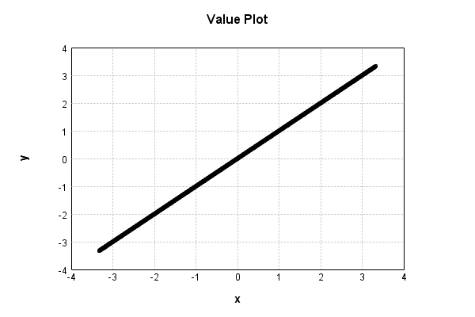

# MaxDropoutNoiseLayer
## MaxDropoutNoiseLayerTest
### Json Serialization
Code from [StandardLayerTests.java:69](../../../../../../../src/main/java/com/simiacryptus/mindseye/test/StandardLayerTests.java#L69) executed in 0.00 seconds: 
```java
    JsonObject json = layer.getJson();
    NNLayer echo = NNLayer.fromJson(json);
    if ((echo == null)) throw new AssertionError("Failed to deserialize");
    if ((layer == echo)) throw new AssertionError("Serialization did not copy");
    if ((!layer.equals(echo))) throw new AssertionError("Serialization not equal");
    return new GsonBuilder().setPrettyPrinting().create().toJson(json);
```

Returns: 

```
    {
      "class": "com.simiacryptus.mindseye.layers.java.MaxDropoutNoiseLayer",
      "id": "a4b07682-668e-4129-a64d-c51b8241c484",
      "isFrozen": false,
      "name": "MaxDropoutNoiseLayer/a4b07682-668e-4129-a64d-c51b8241c484",
      "kernelSize": [
        2,
        2,
        1
      ]
    }
```


### Example Input/Output Pair
Code from [StandardLayerTests.java:153](../../../../../../../src/main/java/com/simiacryptus/mindseye/test/StandardLayerTests.java#L153) executed in 0.00 seconds: 
```java
    SimpleEval eval = SimpleEval.run(layer, inputPrototype);
    return String.format("--------------------\nInput: \n[%s]\n--------------------\nOutput: \n%s\n--------------------\nDerivative: \n%s",
      Arrays.stream(inputPrototype).map(t -> t.prettyPrint()).reduce((a, b) -> a + ",\n" + b).get(),
      eval.getOutput().prettyPrint(),
      Arrays.stream(eval.getDerivative()).map(t -> t.prettyPrint()).reduce((a, b) -> a + ",\n" + b).get());
```

Returns: 

```
    --------------------
    Input: 
    [[
    	[ [ -1.144 ], [ 1.044 ], [ 1.064 ], [ 1.136 ] ],
    	[ [ 1.056 ], [ -0.316 ], [ -1.736 ], [ -0.784 ] ],
    	[ [ 1.46 ], [ -0.224 ], [ 1.484 ], [ 0.448 ] ],
    	[ [ -0.752 ], [ 0.448 ], [ -1.412 ], [ 1.84 ] ]
    ]]
    --------------------
    Output: 
    [
    	[ [ -0.0 ], [ 0.0 ], [ 0.0 ], [ 0.0 ] ],
    	[ [ 0.0 ], [ -0.0 ], [ -0.0 ], [ -0.0 ] ],
    	[ [ 0.0 ], [ -0.0 ], [ 0.0 ], [ 0.0 ] ],
    	[ [ -0.0 ], [ 0.0 ], [ -0.0 ], [ 1.84 ] ]
    ]
    --------------------
    Derivative: 
    [
    	[ [ 0.0 ], [ 0.0 ], [ 0.0 ], [ 0.0 ] ],
    	[ [ 0.0 ], [ 0.0 ], [ 0.0 ], [ 0.0 ] ],
    	[ [ 0.0 ], [ 0.0 ], [ 0.0 ], [ 0.0 ] ],
    	[ [ 0.0 ], [ 0.0 ], [ 0.0 ], [ 1.0 ] ]
    ]
```


### Batch Execution
Code from [StandardLayerTests.java:102](../../../../../../../src/main/java/com/simiacryptus/mindseye/test/StandardLayerTests.java#L102) executed in 0.00 seconds: 
```java
    return getBatchingTester().test(layer, inputPrototype);
```

Returns: 

```
    ToleranceStatistics{absoluteTol=0.0000e+00 +- 0.0000e+00 [0.0000e+00 - 0.0000e+00] (320#), relativeTol=0.0000e+00 +- 0.0000e+00 [0.0000e+00 - 0.0000e+00] (20#)}
```


### Differential Validation
Code from [StandardLayerTests.java:110](../../../../../../../src/main/java/com/simiacryptus/mindseye/test/StandardLayerTests.java#L110) executed in 0.07 seconds: 
```java
    return getDerivativeTester().test(layer, inputPrototype);
```
Logging: 
```
    Inputs: [
    	[ [ 1.376 ], [ 1.616 ], [ 0.468 ], [ -0.116 ] ],
    	[ [ -1.316 ], [ 1.608 ], [ 1.848 ], [ 0.096 ] ],
    	[ [ 0.376 ], [ -1.12 ], [ -0.36 ], [ -1.316 ] ],
    	[ [ 1.904 ], [ -1.72 ], [ 1.204 ], [ -1.416 ] ]
    ]
    Inputs Statistics: {meanExponent=-0.08105449030451532, negative=7, min=-1.416, max=-1.416, mean=0.19575, count=16.0, positive=9, stdDev=1.2540330687426071, zeros=0}
    Output: [
    	[ [ 0.0 ], [ 0.0 ], [ 0.0 ], [ -0.0 ] ],
    	[ [ -0.0 ], [ 0.0 ], [ 0.0 ], [ 0.0 ] ],
    	[ [ 0.0 ], [ -0.0 ], [ -0.0 ], [ -0.0 ] ],
    	[ [ 0.0 ], [ -0.0 ], [ 0.0 ], [ -1.416 ] ]
    ]
    Outputs Statistics: {meanExponent=0.15106325335375018, negative=1, min=-1.416, max=-1.416, mean=-0.0885, count=16.0, positive=0, stdDev=0.3427590261393564, zeros=15}
    Feedback for input 0
    Inputs Values: [
    	[ [ 1.376 ], [ 1.616 ], [ 0.468 ], [ -0.116 ] ],
    	[ [ -1.316 ], [ 1.608 ], [ 1.848 ], [ 0.096 ] ],
    	[ [ 0.376 ], [ -1.12 ], [ -0.36 ], [ -1.316 ] ],
    	[ [ 1.904 ], [ -1.72 ], [ 1.204 ], [ -1.416 ] ]
    ]
    Value Statistics: {meanExponent=-0.08105449030451532,
```
...[skipping 1116 bytes](etc/81.txt)...
```
    ed Statistics: {meanExponent=-4.7830642341045674E-14, negative=0, min=0.9999999999998899, max=0.9999999999998899, mean=0.00390624999999957, count=256.0, positive=1, stdDev=0.06237781024480294, zeros=255}
    Feedback Error: [ [ 0.0, 0.0, 0.0, 0.0, 0.0, 0.0, 0.0, 0.0, ... ], [ 0.0, 0.0, 0.0, 0.0, 0.0, 0.0, 0.0, 0.0, ... ], [ 0.0, 0.0, 0.0, 0.0, 0.0, 0.0, 0.0, 0.0, ... ], [ 0.0, 0.0, 0.0, 0.0, 0.0, 0.0, 0.0, 0.0, ... ], [ 0.0, 0.0, 0.0, 0.0, 0.0, 0.0, 0.0, 0.0, ... ], [ 0.0, 0.0, 0.0, 0.0, 0.0, 0.0, 0.0, 0.0, ... ], [ 0.0, 0.0, 0.0, 0.0, 0.0, 0.0, 0.0, 0.0, ... ], [ 0.0, 0.0, 0.0, 0.0, 0.0, 0.0, 0.0, 0.0, ... ], ... ]
    Error Statistics: {meanExponent=-12.958078098036825, negative=1, min=-1.1013412404281553E-13, max=-1.1013412404281553E-13, mean=-4.3021142204224816E-16, count=256.0, positive=0, stdDev=6.869925491021093E-15, zeros=255}
    Finite-Difference Derivative Accuracy:
    absoluteTol: 4.3021e-16 +- 6.8699e-15 [0.0000e+00 - 1.1013e-13] (256#)
    relativeTol: 5.5067e-14 +- 0.0000e+00 [5.5067e-14 - 5.5067e-14] (1#)
    
```

Returns: 

```
    ToleranceStatistics{absoluteTol=4.3021e-16 +- 6.8699e-15 [0.0000e+00 - 1.1013e-13] (256#), relativeTol=5.5067e-14 +- 0.0000e+00 [5.5067e-14 - 5.5067e-14] (1#)}
```


### Performance
Code from [StandardLayerTests.java:120](../../../../../../../src/main/java/com/simiacryptus/mindseye/test/StandardLayerTests.java#L120) executed in 0.01 seconds: 
```java
    getPerformanceTester().test(layer, permPrototype);
```
Logging: 
```
    Evaluation performance: 0.000626s +- 0.000133s [0.000491s - 0.000874s]
    Learning performance: 0.000039s +- 0.000002s [0.000037s - 0.000043s]
    
```

### Function Plots
Code from [ActivationLayerTestBase.java:103](../../../../../../../src/test/java/com/simiacryptus/mindseye/layers/java/ActivationLayerTestBase.java#L103) executed in 0.00 seconds: 
```java
    return plot("Value Plot", plotData, x -> new double[]{x[0], x[1]});
```

Returns: 




Code from [ActivationLayerTestBase.java:107](../../../../../../../src/test/java/com/simiacryptus/mindseye/layers/java/ActivationLayerTestBase.java#L107) executed in 0.00 seconds: 
```java
    return plot("Derivative Plot", plotData, x -> new double[]{x[0], x[2]});
```

Returns: 


