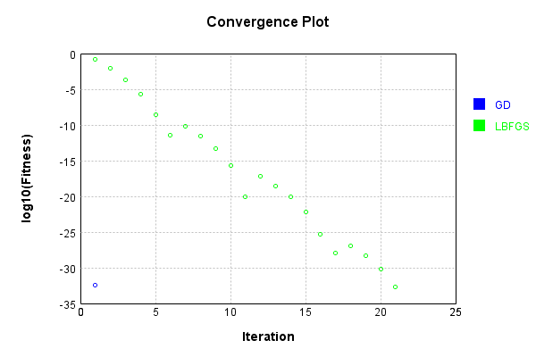
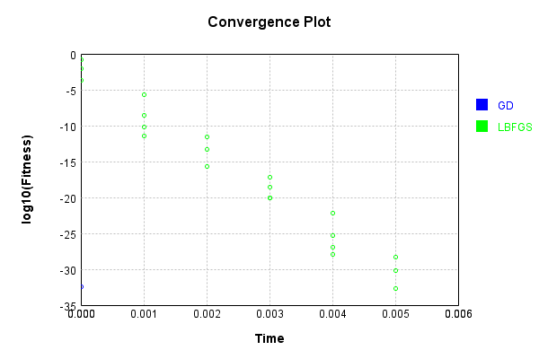

# MaxImageBandLayer
## MaxImageBandLayerTest
### Json Serialization
Code from [JsonTest.java:36](../../../../../../../src/main/java/com/simiacryptus/mindseye/test/unit/JsonTest.java#L36) executed in 0.00 seconds: 
```java
    JsonObject json = layer.getJson();
    NNLayer echo = NNLayer.fromJson(json);
    if ((echo == null)) throw new AssertionError("Failed to deserialize");
    if ((layer == echo)) throw new AssertionError("Serialization did not copy");
    if ((!layer.equals(echo))) throw new AssertionError("Serialization not equal");
    return new GsonBuilder().setPrettyPrinting().create().toJson(json);
```

Returns: 

```
    {
      "class": "com.simiacryptus.mindseye.layers.java.MaxImageBandLayer",
      "id": "0b377ef6-b2ee-42c6-8b80-6e35b8a56aba",
      "isFrozen": false,
      "name": "MaxImageBandLayer/0b377ef6-b2ee-42c6-8b80-6e35b8a56aba"
    }
```


### Example Input/Output Pair
Code from [ReferenceIO.java:68](../../../../../../../src/main/java/com/simiacryptus/mindseye/test/unit/ReferenceIO.java#L68) executed in 0.00 seconds: 
```java
    SimpleEval eval = SimpleEval.run(layer, inputPrototype);
    return String.format("--------------------\nInput: \n[%s]\n--------------------\nOutput: \n%s\n--------------------\nDerivative: \n%s",
      Arrays.stream(inputPrototype).map(t -> t.prettyPrint()).reduce((a, b) -> a + ",\n" + b).get(),
      eval.getOutput().prettyPrint(),
      Arrays.stream(eval.getDerivative()).map(t -> t.prettyPrint()).reduce((a, b) -> a + ",\n" + b).get());
```

Returns: 

```
    --------------------
    Input: 
    [[
    	[ [ -0.24, -1.484, -0.668 ], [ 0.228, -0.672, -0.984 ] ],
    	[ [ 1.924, 1.256, 1.348 ], [ -0.528, 0.264, 0.972 ] ]
    ]]
    --------------------
    Output: 
    [
    	[ [ -0.528, 0.264, 0.972 ] ]
    ]
    --------------------
    Derivative: 
    [
    	[ [ 0.0, 0.0, 0.0 ], [ 0.0, 0.0, 0.0 ] ],
    	[ [ 0.0, 0.0, 0.0 ], [ 1.0, 1.0, 1.0 ] ]
    ]
```


### Batch Execution
Code from [BatchingTester.java:66](../../../../../../../src/main/java/com/simiacryptus/mindseye/test/unit/BatchingTester.java#L66) executed in 0.00 seconds: 
```java
    return test(reference, inputPrototype);
```

Returns: 

```
    ToleranceStatistics{absoluteTol=0.0000e+00 +- 0.0000e+00 [0.0000e+00 - 0.0000e+00] (150#), relativeTol=0.0000e+00 +- 0.0000e+00 [0.0000e+00 - 0.0000e+00] (60#)}
```


Code from [SingleDerivativeTester.java:77](../../../../../../../src/main/java/com/simiacryptus/mindseye/test/unit/SingleDerivativeTester.java#L77) executed in 0.00 seconds: 
```java
    return test(component, inputPrototype);
```
Logging: 
```
    Inputs: [
    	[ [ 1.02, 0.516, 0.828 ], [ 1.72, -0.7, 1.216 ] ],
    	[ [ 1.084, 1.06, 1.076 ], [ 0.376, 0.32, 1.464 ] ]
    ]
    Inputs Statistics: {meanExponent=-0.07142778410000168, negative=1, min=1.464, max=1.464, mean=0.8316666666666667, count=12.0, positive=11, stdDev=0.6098337660561459, zeros=0}
    Output: [
    	[ [ 0.376, 0.32, 1.464 ] ]
    ]
    Outputs Statistics: {meanExponent=-0.25137370001001996, negative=0, min=1.464, max=1.464, mean=0.7200000000000001, count=3.0, positive=3, stdDev=0.5265839597506428, zeros=0}
    Feedback for input 0
    Inputs Values: [
    	[ [ 1.02, 0.516, 0.828 ], [ 1.72, -0.7, 1.216 ] ],
    	[ [ 1.084, 1.06, 1.076 ], [ 0.376, 0.32, 1.464 ] ]
    ]
    Value Statistics: {meanExponent=-0.07142778410000168, negative=1, min=1.464, max=1.464, mean=0.8316666666666667, count=12.0, positive=11, stdDev=0.6098337660561459, zeros=0}
    Implemented Feedback: [ [ 0.0, 0.0, 0.0 ], [ 0.0, 0.0, 0.0 ], [ 0.0, 0.0, 0.0 ], [ 1.0, 0.0, 0.0 ], [ 0.0, 0.0, 0.0 ], [ 0.0, 0.0, 0.0 ], [ 0.0, 0.0, 0.0 ], [ 0.0, 1.0, 0.0 ], ... ]
    Implemented
```
...[skipping 160 bytes](etc/341.txt)...
```
    eedback: [ [ 0.0, 0.0, 0.0 ], [ 0.0, 0.0, 0.0 ], [ 0.0, 0.0, 0.0 ], [ 0.9999999999998899, 0.0, 0.0 ], [ 0.0, 0.0, 0.0 ], [ 0.0, 0.0, 0.0 ], [ 0.0, 0.0, 0.0 ], [ 0.0, 0.9999999999998899, 0.0 ], ... ]
    Measured Statistics: {meanExponent=-4.7830642341045674E-14, negative=0, min=0.9999999999998899, max=0.9999999999998899, mean=0.08333333333332416, count=36.0, positive=3, stdDev=0.2763853991962529, zeros=33}
    Feedback Error: [ [ 0.0, 0.0, 0.0 ], [ 0.0, 0.0, 0.0 ], [ 0.0, 0.0, 0.0 ], [ -1.1013412404281553E-13, 0.0, 0.0 ], [ 0.0, 0.0, 0.0 ], [ 0.0, 0.0, 0.0 ], [ 0.0, 0.0, 0.0 ], [ 0.0, -1.1013412404281553E-13, 0.0 ], ... ]
    Error Statistics: {meanExponent=-12.958078098036827, negative=3, min=-1.1013412404281553E-13, max=-1.1013412404281553E-13, mean=-9.177843670234628E-15, count=36.0, positive=0, stdDev=3.0439463838706555E-14, zeros=33}
    Finite-Difference Derivative Accuracy:
    absoluteTol: 9.1778e-15 +- 3.0439e-14 [0.0000e+00 - 1.1013e-13] (36#)
    relativeTol: 5.5067e-14 +- 0.0000e+00 [5.5067e-14 - 5.5067e-14] (3#)
    
```

Returns: 

```
    ToleranceStatistics{absoluteTol=9.1778e-15 +- 3.0439e-14 [0.0000e+00 - 1.1013e-13] (36#), relativeTol=5.5067e-14 +- 0.0000e+00 [5.5067e-14 - 5.5067e-14] (3#)}
```


### Performance
Now we execute larger-scale runs to benchmark performance:

Code from [PerformanceTester.java:66](../../../../../../../src/main/java/com/simiacryptus/mindseye/test/unit/PerformanceTester.java#L66) executed in 0.01 seconds: 
```java
    test(component, inputPrototype);
```
Logging: 
```
    100 batches
    Input Dimensions:
    	[2, 2, 3]
    Performance:
    	Evaluation performance: 0.000698s +- 0.000153s [0.000519s - 0.000969s]
    	Learning performance: 0.000025s +- 0.000001s [0.000024s - 0.000027s]
    
```

### Input Learning
In this test, we use a network to learn this target input, given it's pre-evaluated output:

Code from [LearningTester.java:127](../../../../../../../src/main/java/com/simiacryptus/mindseye/test/unit/LearningTester.java#L127) executed in 0.00 seconds: 
```java
    return Arrays.stream(input_target).map(x -> x.prettyPrint()).reduce((a, b) -> a + "\n" + b).orElse("");
```

Returns: 

```
    [
    	[ [ -0.756, 1.676, 0.896 ], [ -0.96, -1.384, 1.956 ] ],
    	[ [ -0.856, -1.824, -0.692 ], [ 0.256, -0.392, -1.248 ] ]
    ]
```


First, we use a conjugate gradient descent method, which converges the fastest for purely linear functions.

Code from [LearningTester.java:300](../../../../../../../src/main/java/com/simiacryptus/mindseye/test/unit/LearningTester.java#L300) executed in 0.00 seconds: 
```java
    return new IterativeTrainer(trainable)
      .setLineSearchFactory(label -> new QuadraticSearch())
      .setOrientation(new GradientDescent())
      .setMonitor(monitor)
      .setTimeout(30, TimeUnit.SECONDS)
      .setMaxIterations(250)
      .setTerminateThreshold(0)
      .run();
```
Logging: 
```
    Constructing line search parameters: GD
    F(0.0) = LineSearchPoint{point=PointSample{avg=1.8508426666666669}, derivative=-2.4677902222222223}
    New Minimum: 1.8508426666666669 > 1.8508426664198874
    F(1.0E-10) = LineSearchPoint{point=PointSample{avg=1.8508426664198874}, derivative=-2.467790222057703}, delta = -2.467794857352601E-10
    New Minimum: 1.8508426664198874 > 1.8508426649392133
    F(7.000000000000001E-10) = LineSearchPoint{point=PointSample{avg=1.8508426649392133}, derivative=-2.4677902210705867}, delta = -1.7274535135669566E-9
    New Minimum: 1.8508426649392133 > 1.8508426545744945
    F(4.900000000000001E-9) = LineSearchPoint{point=PointSample{avg=1.8508426545744945}, derivative=-2.467790214160774}, delta = -1.2092172374522647E-8
    New Minimum: 1.8508426545744945 > 1.8508425820214631
    F(3.430000000000001E-8) = LineSearchPoint{point=PointSample{avg=1.8508425820214631}, derivative=-2.4677901657920858}, delta = -8.464520373507867E-8
    New Minimum: 1.8508425820214631 > 1.8508420741502813
    F(2.4010000000000004E-7) = 
```
...[skipping 1528 bytes](etc/342.txt)...
```
    97369526
    New Minimum: 1.3950419669297143 > 0.011044310114444185
    F(1.3841287201) = LineSearchPoint{point=PointSample{avg=0.011044310114444185}, derivative=-0.19063067438239611}, delta = -1.8397983565522227
    Loops = 12
    New Minimum: 0.011044310114444185 > 4.108650548026103E-33
    F(1.5) = LineSearchPoint{point=PointSample{avg=4.108650548026103E-33}, derivative=-4.8948499574584667E-17}, delta = -1.8508426666666669
    Right bracket at 1.5
    Converged to right
    Iteration 1 complete. Error: 4.108650548026103E-33 Total: 249808464968293.5300; Orientation: 0.0000; Line Search: 0.0011
    Zero gradient: 7.401486830834377E-17
    F(0.0) = LineSearchPoint{point=PointSample{avg=4.108650548026103E-33}, derivative=-5.4782007307014706E-33}
    New Minimum: 4.108650548026103E-33 > 0.0
    F(1.5) = LineSearchPoint{point=PointSample{avg=0.0}, derivative=0.0}, delta = -4.108650548026103E-33
    0.0 <= 4.108650548026103E-33
    Converged to right
    Iteration 2 complete. Error: 0.0 Total: 249808465171768.5300; Orientation: 0.0000; Line Search: 0.0001
    
```

Returns: 

```
    0.0
```


Training Converged

Next, we run the same optimization using L-BFGS, which is nearly ideal for purely second-order or quadratic functions.

Code from [LearningTester.java:324](../../../../../../../src/main/java/com/simiacryptus/mindseye/test/unit/LearningTester.java#L324) executed in 0.01 seconds: 
```java
    return new IterativeTrainer(trainable)
      .setLineSearchFactory(label -> new ArmijoWolfeSearch())
      .setOrientation(new LBFGS())
      .setMonitor(monitor)
      .setTimeout(30, TimeUnit.SECONDS)
      .setMaxIterations(250)
      .setTerminateThreshold(0)
      .run();
```
Logging: 
```
    LBFGS Accumulation History: 1 points
    Constructing line search parameters: GD
    th(0)=1.8508426666666669;dx=-2.4677902222222223
    New Minimum: 1.8508426666666669 > 0.3523056505781083
    WOLF (strong): th(2.154434690031884)=0.3523056505781083; dx=1.076671686095809 delta=1.4985370160885585
    New Minimum: 0.3523056505781083 > 0.14703519702526532
    END: th(1.077217345015942)=0.14703519702526532; dx=-0.6955592680632066 delta=1.7038074696414016
    Iteration 1 complete. Error: 0.14703519702526532 Total: 249808467710355.5300; Orientation: 0.0000; Line Search: 0.0002
    LBFGS Accumulation History: 1 points
    th(0)=0.14703519702526532;dx=-0.19604692936702042
    New Minimum: 0.14703519702526532 > 0.04402583250369712
    WOLF (strong): th(2.3207944168063896)=0.04402583250369712; dx=0.10727615003765797 delta=0.1030093645215682
    New Minimum: 0.04402583250369712 > 0.007536701118118869
    END: th(1.1603972084031948)=0.007536701118118869; dx=-0.044385389664681224 delta=0.13949849590714647
    Iteration 2 complete. Error: 0.007536701118118869 Tota
```
...[skipping 9641 bytes](etc/343.txt)...
```
    08472902091.5300; Orientation: 0.0000; Line Search: 0.0002
    LBFGS Accumulation History: 1 points
    th(0)=6.840903162463462E-31;dx=-9.121204216617947E-31
    New Minimum: 6.840903162463462E-31 > 5.300159206953673E-31
    WOLF (strong): th(2.8257016782407427)=5.300159206953673E-31; dx=8.025564070477653E-31 delta=1.5407439555097887E-31
    New Minimum: 5.300159206953673E-31 > 2.0543252740130515E-33
    END: th(1.4128508391203713)=2.0543252740130515E-33; dx=-4.65647062109625E-32 delta=6.8203599097233315E-31
    Iteration 21 complete. Error: 2.0543252740130515E-33 Total: 249808473169686.5300; Orientation: 0.0000; Line Search: 0.0002
    LBFGS Accumulation History: 1 points
    th(0)=2.0543252740130515E-33;dx=-2.7391003653507353E-33
    Armijo: th(3.043894859641584)=2.0543252740130515E-33; dx=2.7391003653507353E-33 delta=0.0
    New Minimum: 2.0543252740130515E-33 > 0.0
    END: th(1.521947429820792)=0.0; dx=0.0 delta=2.0543252740130515E-33
    Iteration 22 complete. Error: 0.0 Total: 249808473427592.5300; Orientation: 0.0000; Line Search: 0.0002
    
```

Returns: 

```
    0.0
```


Training Converged

Code from [LearningTester.java:96](../../../../../../../src/main/java/com/simiacryptus/mindseye/test/unit/LearningTester.java#L96) executed in 0.00 seconds: 
```java
    return TestUtil.compare(runs);
```

Returns: 




Code from [LearningTester.java:99](../../../../../../../src/main/java/com/simiacryptus/mindseye/test/unit/LearningTester.java#L99) executed in 0.00 seconds: 
```java
    return TestUtil.compareTime(runs);
```

Returns: 




