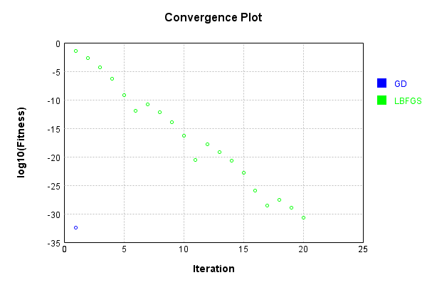
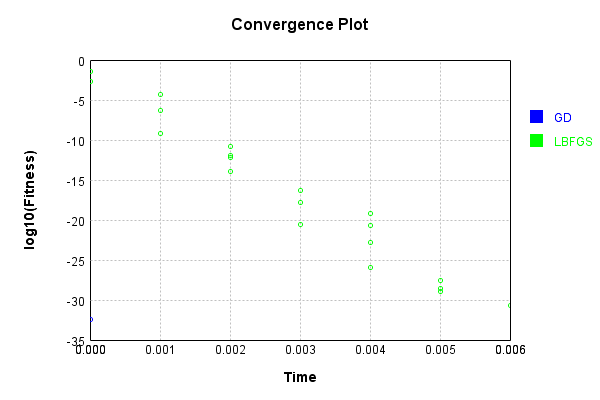

# MaxSubsampleLayer
## MaxSubsampleLayerTest
### Json Serialization
Code from [JsonTest.java:36](../../../../../../../src/main/java/com/simiacryptus/mindseye/test/unit/JsonTest.java#L36) executed in 0.00 seconds: 
```java
    JsonObject json = layer.getJson();
    NNLayer echo = NNLayer.fromJson(json);
    if ((echo == null)) throw new AssertionError("Failed to deserialize");
    if ((layer == echo)) throw new AssertionError("Serialization did not copy");
    if ((!layer.equals(echo))) throw new AssertionError("Serialization not equal");
    return new GsonBuilder().setPrettyPrinting().create().toJson(json);
```

Returns: 

```
    {
      "class": "com.simiacryptus.mindseye.layers.java.MaxSubsampleLayer",
      "id": "c9b33b06-e895-4a48-bfd6-bb131a24db27",
      "isFrozen": false,
      "name": "MaxSubsampleLayer/c9b33b06-e895-4a48-bfd6-bb131a24db27",
      "inner": [
        2,
        2,
        1
      ]
    }
```


### Example Input/Output Pair
Code from [ReferenceIO.java:68](../../../../../../../src/main/java/com/simiacryptus/mindseye/test/unit/ReferenceIO.java#L68) executed in 0.00 seconds: 
```java
    SimpleEval eval = SimpleEval.run(layer, inputPrototype);
    return String.format("--------------------\nInput: \n[%s]\n--------------------\nOutput: \n%s\n--------------------\nDerivative: \n%s",
      Arrays.stream(inputPrototype).map(t -> t.prettyPrint()).reduce((a, b) -> a + ",\n" + b).get(),
      eval.getOutput().prettyPrint(),
      Arrays.stream(eval.getDerivative()).map(t -> t.prettyPrint()).reduce((a, b) -> a + ",\n" + b).get());
```

Returns: 

```
    --------------------
    Input: 
    [[
    	[ [ -0.256, 1.144, -0.98 ], [ 1.8, -1.14, 1.984 ] ],
    	[ [ -1.216, -1.008, -1.016 ], [ -0.492, 1.952, -0.476 ] ]
    ]]
    --------------------
    Output: 
    [
    	[ [ 1.8, 1.952, 1.984 ] ]
    ]
    --------------------
    Derivative: 
    [
    	[ [ 0.0, 0.0, 0.0 ], [ 1.0, 0.0, 1.0 ] ],
    	[ [ 0.0, 0.0, 0.0 ], [ 0.0, 1.0, 0.0 ] ]
    ]
```


### Batch Execution
Code from [BatchingTester.java:66](../../../../../../../src/main/java/com/simiacryptus/mindseye/test/unit/BatchingTester.java#L66) executed in 0.00 seconds: 
```java
    return test(reference, inputPrototype);
```

Returns: 

```
    ToleranceStatistics{absoluteTol=0.0000e+00 +- 0.0000e+00 [0.0000e+00 - 0.0000e+00] (150#), relativeTol=0.0000e+00 +- 0.0000e+00 [0.0000e+00 - 0.0000e+00] (60#)}
```


Code from [SingleDerivativeTester.java:77](../../../../../../../src/main/java/com/simiacryptus/mindseye/test/unit/SingleDerivativeTester.java#L77) executed in 0.00 seconds: 
```java
    return test(component, inputPrototype);
```
Logging: 
```
    Inputs: [
    	[ [ 1.728, 1.22, -0.14 ], [ 0.532, -1.728, -0.816 ] ],
    	[ [ -1.452, 0.444, 1.076 ], [ -0.992, 1.72, -1.004 ] ]
    ]
    Inputs Statistics: {meanExponent=-0.048323931386046855, negative=6, min=-1.004, max=-1.004, mean=0.04900000000000001, count=12.0, positive=6, stdDev=1.183699426937993, zeros=0}
    Output: [
    	[ [ 1.728, 1.72, 1.076 ] ]
    ]
    Outputs Statistics: {meanExponent=0.1682948187935979, negative=0, min=1.076, max=1.076, mean=1.508, count=3.0, positive=3, stdDev=0.30548758840035783, zeros=0}
    Feedback for input 0
    Inputs Values: [
    	[ [ 1.728, 1.22, -0.14 ], [ 0.532, -1.728, -0.816 ] ],
    	[ [ -1.452, 0.444, 1.076 ], [ -0.992, 1.72, -1.004 ] ]
    ]
    Value Statistics: {meanExponent=-0.048323931386046855, negative=6, min=-1.004, max=-1.004, mean=0.04900000000000001, count=12.0, positive=6, stdDev=1.183699426937993, zeros=0}
    Implemented Feedback: [ [ 1.0, 0.0, 0.0 ], [ 0.0, 0.0, 0.0 ], [ 0.0, 0.0, 0.0 ], [ 0.0, 0.0, 0.0 ], [ 0.0, 0.0, 0.0 ], [ 0.0, 0.0, 0.0 ], [ 0.0, 0.0, 0.0 ], [ 0.0, 1.0, 0.0 ], ... ]
    Imple
```
...[skipping 96 bytes](etc/346.txt)...
```
    unt=36.0, positive=3, stdDev=0.2763853991962833, zeros=33}
    Measured Feedback: [ [ 0.9999999999998899, 0.0, 0.0 ], [ 0.0, 0.0, 0.0 ], [ 0.0, 0.0, 0.0 ], [ 0.0, 0.0, 0.0 ], [ 0.0, 0.0, 0.0 ], [ 0.0, 0.0, 0.0 ], [ 0.0, 0.0, 0.0 ], [ 0.0, 0.9999999999998899, 0.0 ], ... ]
    Measured Statistics: {meanExponent=-4.7830642341045674E-14, negative=0, min=0.0, max=0.0, mean=0.08333333333332416, count=36.0, positive=3, stdDev=0.2763853991962529, zeros=33}
    Feedback Error: [ [ -1.1013412404281553E-13, 0.0, 0.0 ], [ 0.0, 0.0, 0.0 ], [ 0.0, 0.0, 0.0 ], [ 0.0, 0.0, 0.0 ], [ 0.0, 0.0, 0.0 ], [ 0.0, 0.0, 0.0 ], [ 0.0, 0.0, 0.0 ], [ 0.0, -1.1013412404281553E-13, 0.0 ], ... ]
    Error Statistics: {meanExponent=-12.958078098036827, negative=3, min=0.0, max=0.0, mean=-9.177843670234628E-15, count=36.0, positive=0, stdDev=3.0439463838706555E-14, zeros=33}
    Finite-Difference Derivative Accuracy:
    absoluteTol: 9.1778e-15 +- 3.0439e-14 [0.0000e+00 - 1.1013e-13] (36#)
    relativeTol: 5.5067e-14 +- 0.0000e+00 [5.5067e-14 - 5.5067e-14] (3#)
    
```

Returns: 

```
    ToleranceStatistics{absoluteTol=9.1778e-15 +- 3.0439e-14 [0.0000e+00 - 1.1013e-13] (36#), relativeTol=5.5067e-14 +- 0.0000e+00 [5.5067e-14 - 5.5067e-14] (3#)}
```


### Performance
Now we execute larger-scale runs to benchmark performance:

Code from [PerformanceTester.java:66](../../../../../../../src/main/java/com/simiacryptus/mindseye/test/unit/PerformanceTester.java#L66) executed in 0.01 seconds: 
```java
    test(component, inputPrototype);
```
Logging: 
```
    100 batches
    Input Dimensions:
    	[2, 2, 3]
    Performance:
    	Evaluation performance: 0.001573s +- 0.000545s [0.000872s - 0.002507s]
    	Learning performance: 0.000052s +- 0.000021s [0.000034s - 0.000093s]
    
```

### Input Learning
In this test, we use a network to learn this target input, given it's pre-evaluated output:

Code from [LearningTester.java:127](../../../../../../../src/main/java/com/simiacryptus/mindseye/test/unit/LearningTester.java#L127) executed in 0.00 seconds: 
```java
    return Arrays.stream(input_target).map(x -> x.prettyPrint()).reduce((a, b) -> a + "\n" + b).orElse("");
```

Returns: 

```
    [
    	[ [ 0.568, -0.204, -0.188 ], [ 1.16, 0.404, -1.324 ] ],
    	[ [ -1.6, -1.732, 0.68 ], [ -0.32, 1.444, -0.216 ] ]
    ]
```


First, we use a conjugate gradient descent method, which converges the fastest for purely linear functions.

Code from [LearningTester.java:300](../../../../../../../src/main/java/com/simiacryptus/mindseye/test/unit/LearningTester.java#L300) executed in 0.00 seconds: 
```java
    return new IterativeTrainer(trainable)
      .setLineSearchFactory(label -> new QuadraticSearch())
      .setOrientation(new GradientDescent())
      .setMonitor(monitor)
      .setTimeout(30, TimeUnit.SECONDS)
      .setMaxIterations(250)
      .setTerminateThreshold(0)
      .run();
```
Logging: 
```
    Constructing line search parameters: GD
    F(0.0) = LineSearchPoint{point=PointSample{avg=0.4642186666666667}, derivative=-0.6189582222222222}
    New Minimum: 0.4642186666666667 > 0.4642186666047708
    F(1.0E-10) = LineSearchPoint{point=PointSample{avg=0.4642186666047708}, derivative=-0.6189582221809582}, delta = -6.189593282357464E-11
    New Minimum: 0.4642186666047708 > 0.4642186662333958
    F(7.000000000000001E-10) = LineSearchPoint{point=PointSample{avg=0.4642186662333958}, derivative=-0.6189582219333749}, delta = -4.3327091914235893E-10
    New Minimum: 0.4642186662333958 > 0.4642186636337713
    F(4.900000000000001E-9) = LineSearchPoint{point=PointSample{avg=0.4642186636337713}, derivative=-0.6189582202002919}, delta = -3.0328954347957904E-9
    New Minimum: 0.4642186636337713 > 0.4642186454363999
    F(3.430000000000001E-8) = LineSearchPoint{point=PointSample{avg=0.4642186454363999}, derivative=-0.6189582080687108}, delta = -2.1230266822325206E-8
    New Minimum: 0.4642186454363999 > 0.4642185180548093
    F(2.4010000000000004E-7
```
...[skipping 1601 bytes](etc/347.txt)...
```
    .0027700760350494965
    F(1.3841287201) = LineSearchPoint{point=PointSample{avg=0.0027700760350494965}, derivative=-0.04781298760901154}, delta = -0.46144859063161725
    Loops = 12
    New Minimum: 0.0027700760350494965 > 4.108650548026103E-33
    F(1.4999999999999998) = LineSearchPoint{point=PointSample{avg=4.108650548026103E-33}, derivative=-2.368475785867E-17}, delta = -0.4642186666666667
    Right bracket at 1.4999999999999998
    Converged to right
    Iteration 1 complete. Error: 4.108650548026103E-33 Total: 249808628020674.3800; Orientation: 0.0000; Line Search: 0.0014
    Zero gradient: 7.401486830834377E-17
    F(0.0) = LineSearchPoint{point=PointSample{avg=4.108650548026103E-33}, derivative=-5.4782007307014706E-33}
    New Minimum: 4.108650548026103E-33 > 0.0
    F(1.4999999999999998) = LineSearchPoint{point=PointSample{avg=0.0}, derivative=0.0}, delta = -4.108650548026103E-33
    0.0 <= 4.108650548026103E-33
    Converged to right
    Iteration 2 complete. Error: 0.0 Total: 249808628260056.3800; Orientation: 0.0000; Line Search: 0.0002
    
```

Returns: 

```
    0.0
```


Training Converged

Next, we run the same optimization using L-BFGS, which is nearly ideal for purely second-order or quadratic functions.

Code from [LearningTester.java:324](../../../../../../../src/main/java/com/simiacryptus/mindseye/test/unit/LearningTester.java#L324) executed in 0.01 seconds: 
```java
    return new IterativeTrainer(trainable)
      .setLineSearchFactory(label -> new ArmijoWolfeSearch())
      .setOrientation(new LBFGS())
      .setMonitor(monitor)
      .setTimeout(30, TimeUnit.SECONDS)
      .setMaxIterations(250)
      .setTerminateThreshold(0)
      .run();
```
Logging: 
```
    LBFGS Accumulation History: 1 points
    Constructing line search parameters: GD
    th(0)=0.4642186666666667;dx=-0.6189582222222222
    New Minimum: 0.4642186666666667 > 0.07792600534909082
    WOLF (strong): th(2.154434690031884)=0.07792600534909082; dx=0.22536908002894732 delta=0.3862926613175759
    New Minimum: 0.07792600534909082 > 0.036878598243614016
    END: th(1.077217345015942)=0.036878598243614016; dx=-0.17445653367688238 delta=0.4273400684230527
    Iteration 1 complete. Error: 0.036878598243614016 Total: 249808631261733.3800; Orientation: 0.0001; Line Search: 0.0002
    LBFGS Accumulation History: 1 points
    th(0)=0.036878598243614016;dx=-0.049171464324818684
    New Minimum: 0.036878598243614016 > 0.011042328789925735
    WOLF (strong): th(2.3207944168063896)=0.011042328789925735; dx=0.026906442256003832 delta=0.025836269453688283
    New Minimum: 0.011042328789925735 > 0.001890315912383504
    END: th(1.1603972084031948)=0.001890315912383504; dx=-0.01113251103440744 delta=0.03498828233123051
    Iteration 2 complete. Error: 0.001890
```
...[skipping 9118 bytes](etc/348.txt)...
```
    42668.3800; Orientation: 0.0000; Line Search: 0.0002
    LBFGS Accumulation History: 1 points
    th(0)=1.0357908031573807E-29;dx=-1.3810544042098407E-29
    New Minimum: 1.0357908031573807E-29 > 5.5220263365470826E-30
    WOLF (strong): th(2.623149071368624)=5.5220263365470826E-30; dx=1.0079889344490704E-29 delta=4.835881695026724E-30
    New Minimum: 5.5220263365470826E-30 > 2.0132387685327904E-31
    END: th(1.311574535684312)=2.0132387685327904E-31; dx=-1.9228484564762163E-30 delta=1.0156584154720527E-29
    Iteration 20 complete. Error: 2.0132387685327904E-31 Total: 249808636883787.3800; Orientation: 0.0000; Line Search: 0.0003
    LBFGS Accumulation History: 1 points
    th(0)=2.0132387685327904E-31;dx=-2.684318358043721E-31
    Armijo: th(2.8257016782407427)=2.0132387685327904E-31; dx=2.684318358043721E-31 delta=0.0
    New Minimum: 2.0132387685327904E-31 > 0.0
    END: th(1.4128508391203713)=0.0; dx=0.0 delta=2.0132387685327904E-31
    Iteration 21 complete. Error: 0.0 Total: 249808637215787.3800; Orientation: 0.0000; Line Search: 0.0003
    
```

Returns: 

```
    0.0
```


Training Converged

Code from [LearningTester.java:96](../../../../../../../src/main/java/com/simiacryptus/mindseye/test/unit/LearningTester.java#L96) executed in 0.00 seconds: 
```java
    return TestUtil.compare(runs);
```

Returns: 




Code from [LearningTester.java:99](../../../../../../../src/main/java/com/simiacryptus/mindseye/test/unit/LearningTester.java#L99) executed in 0.00 seconds: 
```java
    return TestUtil.compareTime(runs);
```

Returns: 




