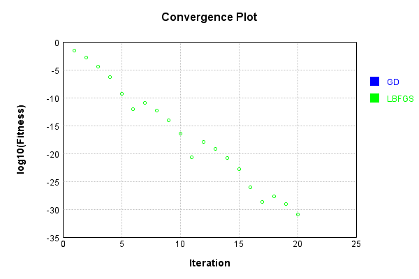
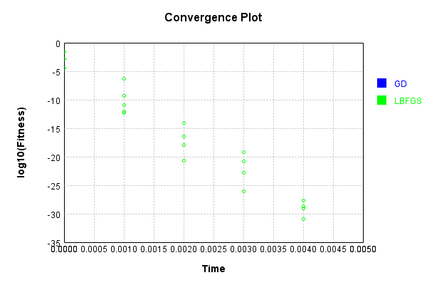

# MonitoringSynapse
## MonitoringSynapseTest
### Json Serialization
Code from [JsonTest.java:36](../../../../../../../src/main/java/com/simiacryptus/mindseye/test/unit/JsonTest.java#L36) executed in 0.00 seconds: 
```java
    JsonObject json = layer.getJson();
    NNLayer echo = NNLayer.fromJson(json);
    if ((echo == null)) throw new AssertionError("Failed to deserialize");
    if ((layer == echo)) throw new AssertionError("Serialization did not copy");
    if ((!layer.equals(echo))) throw new AssertionError("Serialization not equal");
    return new GsonBuilder().setPrettyPrinting().create().toJson(json);
```

Returns: 

```
    {
      "class": "com.simiacryptus.mindseye.layers.java.MonitoringSynapse",
      "id": "37e79a7d-6d5f-4471-b408-00aa331b5caf",
      "isFrozen": false,
      "name": "MonitoringSynapse/37e79a7d-6d5f-4471-b408-00aa331b5caf",
      "totalBatches": 0,
      "totalItems": 0
    }
```


### Example Input/Output Pair
Code from [ReferenceIO.java:68](../../../../../../../src/main/java/com/simiacryptus/mindseye/test/unit/ReferenceIO.java#L68) executed in 0.00 seconds: 
```java
    SimpleEval eval = SimpleEval.run(layer, inputPrototype);
    return String.format("--------------------\nInput: \n[%s]\n--------------------\nOutput: \n%s\n--------------------\nDerivative: \n%s",
      Arrays.stream(inputPrototype).map(t -> t.prettyPrint()).reduce((a, b) -> a + ",\n" + b).get(),
      eval.getOutput().prettyPrint(),
      Arrays.stream(eval.getDerivative()).map(t -> t.prettyPrint()).reduce((a, b) -> a + ",\n" + b).get());
```

Returns: 

```
    --------------------
    Input: 
    [[ -0.212, -1.144, 1.976 ]]
    --------------------
    Output: 
    [ -0.212, -1.144, 1.976 ]
    --------------------
    Derivative: 
    [ 1.0, 1.0, 1.0 ]
```


### Batch Execution
Code from [BatchingTester.java:66](../../../../../../../src/main/java/com/simiacryptus/mindseye/test/unit/BatchingTester.java#L66) executed in 0.00 seconds: 
```java
    return test(reference, inputPrototype);
```

Returns: 

```
    ToleranceStatistics{absoluteTol=0.0000e+00 +- 0.0000e+00 [0.0000e+00 - 0.0000e+00] (60#), relativeTol=0.0000e+00 +- 0.0000e+00 [0.0000e+00 - 0.0000e+00] (60#)}
```


Code from [SingleDerivativeTester.java:77](../../../../../../../src/main/java/com/simiacryptus/mindseye/test/unit/SingleDerivativeTester.java#L77) executed in 0.00 seconds: 
```java
    return test(component, inputPrototype);
```
Logging: 
```
    Inputs: [ 0.852, -0.62, -0.024 ]
    Inputs Statistics: {meanExponent=-0.6323191580078132, negative=2, min=-0.024, max=-0.024, mean=0.06933333333333333, count=3.0, positive=1, stdDev=0.604554565132232, zeros=0}
    Output: [ 0.852, -0.62, -0.024 ]
    Outputs Statistics: {meanExponent=-0.6323191580078132, negative=2, min=-0.024, max=-0.024, mean=0.06933333333333333, count=3.0, positive=1, stdDev=0.604554565132232, zeros=0}
    Feedback for input 0
    Inputs Values: [ 0.852, -0.62, -0.024 ]
    Value Statistics: {meanExponent=-0.6323191580078132, negative=2, min=-0.024, max=-0.024, mean=0.06933333333333333, count=3.0, positive=1, stdDev=0.604554565132232, zeros=0}
    Implemented Feedback: [ [ 1.0, 0.0, 0.0 ], [ 0.0, 1.0, 0.0 ], [ 0.0, 0.0, 1.0 ] ]
    Implemented Statistics: {meanExponent=0.0, negative=0, min=1.0, max=1.0, mean=0.3333333333333333, count=9.0, positive=3, stdDev=0.4714045207910317, zeros=6}
    Measured Feedback: [ [ 0.9999999999998899, 0.0, 0.0 ], [ 0.0, 0.9999999999998899, 0.0 ], [ 0.0, 0.0, 0.999999999999994 ] ]
    Measured Statistics: {meanExponent=-3.275498961392841E-14, negative=0, min=0.999999999999994, max=0.999999999999994, mean=0.33333333333330817, count=9.0, positive=3, stdDev=0.47140452079099615, zeros=6}
    Feedback Error: [ [ -1.1013412404281553E-13, 0.0, 0.0 ], [ 0.0, -1.1013412404281553E-13, 0.0 ], [ 0.0, 0.0, -5.995204332975845E-15 ] ]
    Error Statistics: {meanExponent=-13.379450735480562, negative=3, min=-5.995204332975845E-15, max=-5.995204332975845E-15, mean=-2.5140383602067435E-14, count=9.0, positive=0, stdDev=4.5468723124825996E-14, zeros=6}
    Finite-Difference Derivative Accuracy:
    absoluteTol: 2.5140e-14 +- 4.5469e-14 [0.0000e+00 - 1.1013e-13] (9#)
    relativeTol: 3.7711e-14 +- 2.4546e-14 [2.9976e-15 - 5.5067e-14] (3#)
    
```

Returns: 

```
    ToleranceStatistics{absoluteTol=2.5140e-14 +- 4.5469e-14 [0.0000e+00 - 1.1013e-13] (9#), relativeTol=3.7711e-14 +- 2.4546e-14 [2.9976e-15 - 5.5067e-14] (3#)}
```


### Performance
Now we execute larger-scale runs to benchmark performance:

Code from [PerformanceTester.java:66](../../../../../../../src/main/java/com/simiacryptus/mindseye/test/unit/PerformanceTester.java#L66) executed in 0.01 seconds: 
```java
    test(component, inputPrototype);
```
Logging: 
```
    100 batches
    Input Dimensions:
    	[3]
    Performance:
    	Evaluation performance: 0.000462s +- 0.000406s [0.000164s - 0.001260s]
    	Learning performance: 0.000428s +- 0.000469s [0.000147s - 0.001360s]
    
```

### Input Learning
In this test, we use a network to learn this target input, given it's pre-evaluated output:

Code from [LearningTester.java:127](../../../../../../../src/main/java/com/simiacryptus/mindseye/test/unit/LearningTester.java#L127) executed in 0.00 seconds: 
```java
    return Arrays.stream(input_target).map(x -> x.prettyPrint()).reduce((a, b) -> a + "\n" + b).orElse("");
```

Returns: 

```
    [ -0.54, 0.396, -1.272 ]
```


First, we use a conjugate gradient descent method, which converges the fastest for purely linear functions.

Code from [LearningTester.java:300](../../../../../../../src/main/java/com/simiacryptus/mindseye/test/unit/LearningTester.java#L300) executed in 0.00 seconds: 
```java
    return new IterativeTrainer(trainable)
      .setLineSearchFactory(label -> new QuadraticSearch())
      .setOrientation(new GradientDescent())
      .setMonitor(monitor)
      .setTimeout(30, TimeUnit.SECONDS)
      .setMaxIterations(250)
      .setTerminateThreshold(0)
      .run();
```
Logging: 
```
    Constructing line search parameters: GD
    F(0.0) = LineSearchPoint{point=PointSample{avg=0.357216}, derivative=-0.476288}
    New Minimum: 0.357216 > 0.3572159999523712
    F(1.0E-10) = LineSearchPoint{point=PointSample{avg=0.3572159999523712}, derivative=-0.47628799996824744}, delta = -4.762878980102414E-11
    New Minimum: 0.3572159999523712 > 0.3572159996665984
    F(7.000000000000001E-10) = LineSearchPoint{point=PointSample{avg=0.3572159996665984}, derivative=-0.4762879997777322}, delta = -3.334015841183202E-10
    New Minimum: 0.3572159996665984 > 0.35721599766618883
    F(4.900000000000001E-9) = LineSearchPoint{point=PointSample{avg=0.35721599766618883}, derivative=-0.47628799844412584}, delta = -2.3338111443393927E-9
    New Minimum: 0.35721599766618883 > 0.35721598366332175
    F(3.430000000000001E-8) = LineSearchPoint{point=PointSample{avg=0.35721598366332175}, derivative=-0.47628798910888104}, delta = -1.6336678232420354E-8
    New Minimum: 0.35721598366332175 > 0.35721588564326034
    F(2.4010000000000004E-7) = LineSearchPoint{p
```
...[skipping 1011 bytes](etc/350.txt)...
```
    = LineSearchPoint{point=PointSample{avg=0.3552965914357708}, derivative=-0.47500667074861225}, delta = -0.0019194085642291747
    New Minimum: 0.3552965914357708 > 0.34388872319019664
    F(0.028247524900000005) = LineSearchPoint{point=PointSample{avg=0.34388872319019664}, derivative=-0.4673186952402858}, delta = -0.013327276809803335
    New Minimum: 0.34388872319019664 > 0.2692456361816266
    F(0.19773267430000002) = LineSearchPoint{point=PointSample{avg=0.2692456361816266}, derivative=-0.4135028666820011}, delta = -0.08797036381837336
    New Minimum: 0.2692456361816266 > 0.0021315719336352508
    F(1.3841287201) = LineSearchPoint{point=PointSample{avg=0.0021315719336352508}, derivative=-0.03679206677400743}, delta = -0.35508442806636475
    Loops = 12
    New Minimum: 0.0021315719336352508 > 0.0
    F(1.5) = LineSearchPoint{point=PointSample{avg=0.0}, derivative=0.0}, delta = -0.357216
    Right bracket at 1.5
    Converged to right
    Iteration 1 complete. Error: 0.0 Total: 249808784218469.2200; Orientation: 0.0000; Line Search: 0.0011
    
```

Returns: 

```
    0.0
```


Training Converged

Next, we run the same optimization using L-BFGS, which is nearly ideal for purely second-order or quadratic functions.

Code from [LearningTester.java:324](../../../../../../../src/main/java/com/simiacryptus/mindseye/test/unit/LearningTester.java#L324) executed in 0.01 seconds: 
```java
    return new IterativeTrainer(trainable)
      .setLineSearchFactory(label -> new ArmijoWolfeSearch())
      .setOrientation(new LBFGS())
      .setMonitor(monitor)
      .setTimeout(30, TimeUnit.SECONDS)
      .setMaxIterations(250)
      .setTerminateThreshold(0)
      .run();
```
Logging: 
```
    LBFGS Accumulation History: 1 points
    Constructing line search parameters: GD
    th(0)=0.357216;dx=-0.476288
    New Minimum: 0.357216 > 0.06799563114868193
    WOLF (strong): th(2.154434690031884)=0.06799563114868193; dx=0.20779959309727059 delta=0.2892203688513181
    New Minimum: 0.06799563114868193 > 0.028378060375693997
    END: th(1.077217345015942)=0.028378060375693997; dx=-0.13424420345136467 delta=0.32883793962430596
    Iteration 1 complete. Error: 0.028378060375693997 Total: 249808787283412.2200; Orientation: 0.0000; Line Search: 0.0002
    LBFGS Accumulation History: 1 points
    th(0)=0.028378060375693997;dx=-0.03783741383425866
    New Minimum: 0.028378060375693997 > 0.008497065724102968
    WOLF (strong): th(2.3207944168063896)=0.008497065724102968; dx=0.02070449201436824 delta=0.01988099465159103
    New Minimum: 0.008497065724102968 > 0.001454597019561149
    END: th(1.1603972084031948)=0.001454597019561149; dx=-0.008566460909945204 delta=0.026923463356132847
    Iteration 2 complete. Error: 0.001454597019561149 Total: 2498087875
```
...[skipping 9103 bytes](etc/351.txt)...
```
    : 249808791389665.2200; Orientation: 0.0000; Line Search: 0.0002
    LBFGS Accumulation History: 1 points
    th(0)=8.414516322357459E-30;dx=-1.1219355096476612E-29
    New Minimum: 8.414516322357459E-30 > 4.733165431326071E-30
    WOLF (strong): th(2.623149071368624)=4.733165431326071E-30; dx=8.414516322357459E-30 delta=3.681350891031388E-30
    New Minimum: 4.733165431326071E-30 > 1.314768175368353E-31
    END: th(1.311574535684312)=1.314768175368353E-31; dx=-1.4024193870595765E-30 delta=8.283039504820624E-30
    Iteration 20 complete. Error: 1.314768175368353E-31 Total: 249808791688608.2200; Orientation: 0.0000; Line Search: 0.0002
    LBFGS Accumulation History: 1 points
    th(0)=1.314768175368353E-31;dx=-1.7530242338244706E-31
    Armijo: th(2.8257016782407427)=1.314768175368353E-31; dx=1.7530242338244706E-31 delta=0.0
    New Minimum: 1.314768175368353E-31 > 0.0
    END: th(1.4128508391203713)=0.0; dx=0.0 delta=1.314768175368353E-31
    Iteration 21 complete. Error: 0.0 Total: 249808791985270.2200; Orientation: 0.0000; Line Search: 0.0002
    
```

Returns: 

```
    0.0
```


Training Converged

Code from [LearningTester.java:96](../../../../../../../src/main/java/com/simiacryptus/mindseye/test/unit/LearningTester.java#L96) executed in 0.00 seconds: 
```java
    return TestUtil.compare(runs);
```

Returns: 




Code from [LearningTester.java:99](../../../../../../../src/main/java/com/simiacryptus/mindseye/test/unit/LearningTester.java#L99) executed in 0.00 seconds: 
```java
    return TestUtil.compareTime(runs);
```

Returns: 




