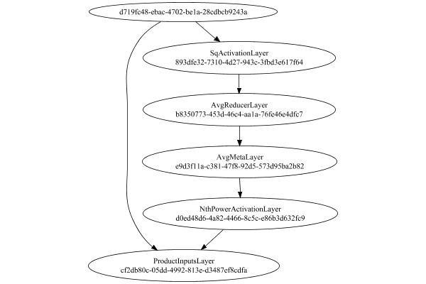

# NormalizationMetaLayer
## NormalizationMetaLayerTest
### Network Diagram
This is a network with the following layout:

Code from [StandardLayerTests.java:72](../../../../../../../src/main/java/com/simiacryptus/mindseye/test/unit/StandardLayerTests.java#L72) executed in 0.23 seconds: 
```java
    return Graphviz.fromGraph(TestUtil.toGraph((DAGNetwork) layer))
      .height(400).width(600).render(Format.PNG).toImage();
```

Returns: 




### Json Serialization
Code from [JsonTest.java:36](../../../../../../../src/main/java/com/simiacryptus/mindseye/test/unit/JsonTest.java#L36) executed in 0.00 seconds: 
```java
    JsonObject json = layer.getJson();
    NNLayer echo = NNLayer.fromJson(json);
    if ((echo == null)) throw new AssertionError("Failed to deserialize");
    if ((layer == echo)) throw new AssertionError("Serialization did not copy");
    if ((!layer.equals(echo))) throw new AssertionError("Serialization not equal");
    return new GsonBuilder().setPrettyPrinting().create().toJson(json);
```

Returns: 

```
    {
      "class": "com.simiacryptus.mindseye.layers.java.NormalizationMetaLayer",
      "id": "9e335a94-74a9-4ec8-98f1-7ba5b82a6cdb",
      "isFrozen": false,
      "name": "NormalizationMetaLayer/9e335a94-74a9-4ec8-98f1-7ba5b82a6cdb",
      "inputs": [
        "d719fc48-ebac-4702-be1a-28cdbcb9243a"
      ],
      "nodes": {
        "bb2192cc-ea9f-4223-b40d-ba8bfdffe4b6": "893dfe32-7310-4d27-943c-3fbd3e617f64",
        "cf39e519-b51f-42e6-a712-b629ae281e5f": "b8350773-453d-46c4-aa1a-76fe46e4dfc7",
        "d53458fd-d018-4d9b-ad4a-7d90ffaf79b3": "e9d3f11a-c381-47f8-92d5-573d95ba2b82",
        "65755b2c-b148-426c-93fe-bb2a5039e1ab": "d0ed48d6-4a82-4466-8c5c-e86b3d632fc9",
        "4337ecb4-ea74-4f87-b472-7d5c63d45c75": "cf2db80c-05dd-4992-813e-d3487ef8cdfa"
      },
      "layers": {
        "893dfe32-7310-4d27-943c-3fbd3e617f64": {
          "class": "com.simiacryptus.mindseye.layers.java.SqActivationLayer",
          "id": "893dfe32-7310-4d27-943c-3fbd3e617f64",
          "isFrozen": true,
          "name": "SqActivationLayer/893dfe32-7310-4d27-943c-3fbd3e617f64"
        },
        "b8350773-453d
```
...[skipping 728 bytes](etc/352.txt)...
```
    "isFrozen": false,
          "name": "NthPowerActivationLayer/d0ed48d6-4a82-4466-8c5c-e86b3d632fc9",
          "power": -0.5
        },
        "cf2db80c-05dd-4992-813e-d3487ef8cdfa": {
          "class": "com.simiacryptus.mindseye.layers.java.ProductInputsLayer",
          "id": "cf2db80c-05dd-4992-813e-d3487ef8cdfa",
          "isFrozen": false,
          "name": "ProductInputsLayer/cf2db80c-05dd-4992-813e-d3487ef8cdfa"
        }
      },
      "links": {
        "bb2192cc-ea9f-4223-b40d-ba8bfdffe4b6": [
          "d719fc48-ebac-4702-be1a-28cdbcb9243a"
        ],
        "cf39e519-b51f-42e6-a712-b629ae281e5f": [
          "bb2192cc-ea9f-4223-b40d-ba8bfdffe4b6"
        ],
        "d53458fd-d018-4d9b-ad4a-7d90ffaf79b3": [
          "cf39e519-b51f-42e6-a712-b629ae281e5f"
        ],
        "65755b2c-b148-426c-93fe-bb2a5039e1ab": [
          "d53458fd-d018-4d9b-ad4a-7d90ffaf79b3"
        ],
        "4337ecb4-ea74-4f87-b472-7d5c63d45c75": [
          "65755b2c-b148-426c-93fe-bb2a5039e1ab",
          "d719fc48-ebac-4702-be1a-28cdbcb9243a"
        ]
      },
      "labels": {},
      "head": "4337ecb4-ea74-4f87-b472-7d5c63d45c75"
    }
```


### Example Input/Output Pair
Code from [ReferenceIO.java:68](../../../../../../../src/main/java/com/simiacryptus/mindseye/test/unit/ReferenceIO.java#L68) executed in 0.00 seconds: 
```java
    SimpleEval eval = SimpleEval.run(layer, inputPrototype);
    return String.format("--------------------\nInput: \n[%s]\n--------------------\nOutput: \n%s\n--------------------\nDerivative: \n%s",
      Arrays.stream(inputPrototype).map(t -> t.prettyPrint()).reduce((a, b) -> a + ",\n" + b).get(),
      eval.getOutput().prettyPrint(),
      Arrays.stream(eval.getDerivative()).map(t -> t.prettyPrint()).reduce((a, b) -> a + ",\n" + b).get());
```

Returns: 

```
    --------------------
    Input: 
    [[ 0.916, 1.272, 0.844 ]]
    --------------------
    Output: 
    [ 0.8911877712975576, 1.2375445907101454, 0.8211380774837757 ]
    --------------------
    Derivative: 
    [ 0.1203530072525254, -0.21099104168927463, 0.18736641040929403 ]
```


### Differential Validation
Code from [BatchDerivativeTester.java:76](../../../../../../../src/main/java/com/simiacryptus/mindseye/test/unit/BatchDerivativeTester.java#L76) executed in 0.00 seconds: 
```java
    return test(component, inputPrototype);
```
Logging: 
```
    Inputs: [ 0.944, 1.056, -1.092 ],
    [ 0.944, 1.056, -1.092 ],
    [ 0.944, 1.056, -1.092 ],
    [ 0.944, 1.056, -1.092 ],
    [ 0.944, 1.056, -1.092 ],
    [ 0.944, 1.056, -1.092 ],
    [ 0.944, 1.056, -1.092 ],
    [ 0.944, 1.056, -1.092 ],
    [ 0.944, 1.056, -1.092 ],
    [ 0.944, 1.056, -1.092 ]
    Inputs Statistics: {meanExponent=0.012286183621526961, negative=1, min=-1.092, max=-1.092, mean=0.30266666666666664, count=3.0, positive=2, stdDev=0.9872376726109181, zeros=0},
    {meanExponent=0.012286183621526961, negative=1, min=-1.092, max=-1.092, mean=0.30266666666666664, count=3.0, positive=2, stdDev=0.9872376726109181, zeros=0},
    {meanExponent=0.012286183621526961, negative=1, min=-1.092, max=-1.092, mean=0.30266666666666664, count=3.0, positive=2, stdDev=0.9872376726109181, zeros=0},
    {meanExponent=0.012286183621526961, negative=1, min=-1.092, max=-1.092, mean=0.30266666666666664, count=3.0, positive=2, stdDev=0.9872376726109181, zeros=0},
    {meanExponent=0.012286183621526961, negative=1, min=-1.092, max=-1.092, mean=0.30266666666666664, count=3
```
...[skipping 1594 bytes](etc/353.txt)...
```
    stics: {meanExponent=-0.07158088317487946, negative=0, min=1.2686307826382224, max=1.2686307826382224, mean=0.8852332621702628, count=9.0, positive=9, stdDev=0.271394222603909, zeros=0}
    Measured: [ [ 0.9414532601059733, -0.030182139520995577, 0.031211076096937518 ], [ -0.030181954125962918, 0.934671060597303, 0.034913870663455526 ], [ 0.031208292011752903, 0.03491097072538807, 0.9323393102822486 ] ]
    Measured Statistics: {meanExponent=-1.0057702666836614, negative=2, min=0.9323393102822486, max=0.9323393102822486, mean=0.3200381940929, count=9.0, positive=7, stdDev=0.4363470287868067, zeros=0}
    Feedback Error: [ [ 0.2325242114587398, -0.7391111881682291, -0.677717972550296 ], [ -0.7083219093512952, 0.25653110537197066, -0.6432260845618768 ], [ -1.2374224906264695, -1.2337198119128343, -0.3362914723559738 ] ]
    Error Statistics: {meanExponent=-0.23950980953401999, negative=7, min=-0.3362914723559738, max=-0.3362914723559738, mean=-0.5651950680773628, count=9.0, positive=2, stdDev=0.5090605948478811, zeros=0}
    
```

Returns: 

```
    java.lang.AssertionError: ToleranceStatistics{absoluteTol=6.7387e-01 +- 3.5282e-01 [2.3252e-01 - 1.2374e+00] (9#), relativeTol=6.8543e-01 +- 3.7923e-01 [1.4089e-01 - 1.0000e+00] (9#)}
    	at com.simiacryptus.mindseye.test.unit.BatchDerivativeTester.lambda$test$9(BatchDerivativeTester.java:107)
    	at java.util.stream.IntPipeline$4$1.accept(IntPipeline.java:250)
    	at java.util.stream.Streams$RangeIntSpliterator.forEachRemaining(Streams.java:110)
    	at java.util.Spliterator$OfInt.forEachRemaining(Spliterator.java:693)
    	at java.util.stream.AbstractPipeline.copyInto(AbstractPipeline.java:481)
    	at java.util.stream.AbstractPipeline.wrapAndCopyInto(AbstractPipeline.java:471)
    	at java.util.stream.ReduceOps$ReduceOp.evaluateSequential(ReduceOps.java:708)
    	at java.util.stream.AbstractPipeline.evaluate(AbstractPipeline.java:234)
    	at java.util.stream.ReferencePipeline.reduce(ReferencePipeline.java:479)
    	at com.simiacryptus.mindseye.test.unit.BatchDerivativeTester.test(BatchDerivativeTester.java:138)
    	at com.simiacryptu
```
...[skipping 3029 bytes](etc/354.txt)...
```
    unner.java:268)
    	at org.junit.runners.ParentRunner.run(ParentRunner.java:363)
    	at org.junit.runners.Suite.runChild(Suite.java:128)
    	at org.junit.runners.Suite.runChild(Suite.java:27)
    	at org.junit.runners.ParentRunner$3.run(ParentRunner.java:290)
    	at org.junit.runners.ParentRunner$1.schedule(ParentRunner.java:71)
    	at org.junit.runners.ParentRunner.runChildren(ParentRunner.java:288)
    	at org.junit.runners.ParentRunner.access$000(ParentRunner.java:58)
    	at org.junit.runners.ParentRunner$2.evaluate(ParentRunner.java:268)
    	at org.junit.runners.ParentRunner.run(ParentRunner.java:363)
    	at org.junit.runner.JUnitCore.run(JUnitCore.java:137)
    	at com.intellij.junit4.JUnit4IdeaTestRunner.startRunnerWithArgs(JUnit4IdeaTestRunner.java:68)
    	at com.intellij.rt.execution.junit.IdeaTestRunner$Repeater.startRunnerWithArgs(IdeaTestRunner.java:47)
    	at com.intellij.rt.execution.junit.JUnitStarter.prepareStreamsAndStart(JUnitStarter.java:242)
    	at com.intellij.rt.execution.junit.JUnitStarter.main(JUnitStarter.java:70)
    
```


