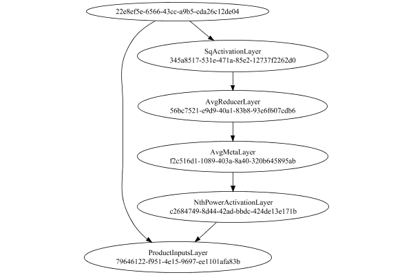

# NormalizationMetaLayer
## NormalizationMetaLayerTest
### Json Serialization
Code from [StandardLayerTests.java:69](../../../../../../../src/main/java/com/simiacryptus/mindseye/test/StandardLayerTests.java#L69) executed in 0.00 seconds: 
```java
    JsonObject json = layer.getJson();
    NNLayer echo = NNLayer.fromJson(json);
    if ((echo == null)) throw new AssertionError("Failed to deserialize");
    if ((layer == echo)) throw new AssertionError("Serialization did not copy");
    if ((!layer.equals(echo))) throw new AssertionError("Serialization not equal");
    return new GsonBuilder().setPrettyPrinting().create().toJson(json);
```

Returns: 

```
    {
      "class": "com.simiacryptus.mindseye.layers.java.NormalizationMetaLayer",
      "id": "a228975e-bdbc-4539-a923-7fb3fb3048d9",
      "isFrozen": false,
      "name": "NormalizationMetaLayer/a228975e-bdbc-4539-a923-7fb3fb3048d9",
      "inputs": [
        "22e8ef5e-6566-43cc-a9b5-cda26c12de04"
      ],
      "nodes": {
        "c49439b4-84ad-4734-9173-5696e454e006": "345a8517-531e-471a-85e2-12737f2262d0",
        "c0728fee-2a2e-442d-8658-aeb22a1deb55": "56bc7521-e9d9-40a1-83b8-93e6f607cdb6",
        "d8386e65-b4fc-491c-8852-9256b9de64d7": "f2c516d1-1089-403a-8a40-320b645895ab",
        "ef34be21-6855-4bd9-994f-d24a4ca00a54": "c2684749-8d44-42ad-bbdc-424de13e171b",
        "80bbdf4d-c32b-408b-a8d8-db2d5684236d": "79646122-f951-4e15-9697-ee1101afa83b"
      },
      "layers": {
        "345a8517-531e-471a-85e2-12737f2262d0": {
          "class": "com.simiacryptus.mindseye.layers.java.SqActivationLayer",
          "id": "345a8517-531e-471a-85e2-12737f2262d0",
          "isFrozen": true,
          "name": "SqActivationLayer/345a8517-531e-471a-85e2-12737f2262d0"
        },
        "56bc7521-e9d9
```
...[skipping 728 bytes](etc/86.txt)...
```
    "isFrozen": false,
          "name": "NthPowerActivationLayer/c2684749-8d44-42ad-bbdc-424de13e171b",
          "power": -0.5
        },
        "79646122-f951-4e15-9697-ee1101afa83b": {
          "class": "com.simiacryptus.mindseye.layers.java.ProductInputsLayer",
          "id": "79646122-f951-4e15-9697-ee1101afa83b",
          "isFrozen": false,
          "name": "ProductInputsLayer/79646122-f951-4e15-9697-ee1101afa83b"
        }
      },
      "links": {
        "c49439b4-84ad-4734-9173-5696e454e006": [
          "22e8ef5e-6566-43cc-a9b5-cda26c12de04"
        ],
        "c0728fee-2a2e-442d-8658-aeb22a1deb55": [
          "c49439b4-84ad-4734-9173-5696e454e006"
        ],
        "d8386e65-b4fc-491c-8852-9256b9de64d7": [
          "c0728fee-2a2e-442d-8658-aeb22a1deb55"
        ],
        "ef34be21-6855-4bd9-994f-d24a4ca00a54": [
          "d8386e65-b4fc-491c-8852-9256b9de64d7"
        ],
        "80bbdf4d-c32b-408b-a8d8-db2d5684236d": [
          "ef34be21-6855-4bd9-994f-d24a4ca00a54",
          "22e8ef5e-6566-43cc-a9b5-cda26c12de04"
        ]
      },
      "labels": {},
      "head": "80bbdf4d-c32b-408b-a8d8-db2d5684236d"
    }
```


### Network Diagram
Code from [StandardLayerTests.java:80](../../../../../../../src/main/java/com/simiacryptus/mindseye/test/StandardLayerTests.java#L80) executed in 0.20 seconds: 
```java
    return Graphviz.fromGraph(TestUtil.toGraph((DAGNetwork) layer))
      .height(400).width(600).render(Format.PNG).toImage();
```

Returns: 




### Example Input/Output Pair
Code from [StandardLayerTests.java:153](../../../../../../../src/main/java/com/simiacryptus/mindseye/test/StandardLayerTests.java#L153) executed in 0.00 seconds: 
```java
    SimpleEval eval = SimpleEval.run(layer, inputPrototype);
    return String.format("--------------------\nInput: \n[%s]\n--------------------\nOutput: \n%s\n--------------------\nDerivative: \n%s",
      Arrays.stream(inputPrototype).map(t -> t.prettyPrint()).reduce((a, b) -> a + ",\n" + b).get(),
      eval.getOutput().prettyPrint(),
      Arrays.stream(eval.getDerivative()).map(t -> t.prettyPrint()).reduce((a, b) -> a + ",\n" + b).get());
```

Returns: 

```
    --------------------
    Input: 
    [[ 0.656, 0.028, 1.624 ]]
    --------------------
    Output: 
    [ 0.6486369516428477, 0.027685723545731306, 1.6057719656524159 ]
    --------------------
    Derivative: 
    [ 0.5008970610894781, 0.96795174665796, -0.21902162621990173 ]
```


### Differential Validation
Code from [StandardLayerTests.java:110](../../../../../../../src/main/java/com/simiacryptus/mindseye/test/StandardLayerTests.java#L110) executed in 0.00 seconds: 
```java
    return getDerivativeTester().test(layer, inputPrototype);
```
Logging: 
```
    Inputs: [ -0.72, 0.284, 0.38 ],
    [ 0.32, -0.896, -0.108 ],
    [ 1.324, -0.692, 0.92 ]
    Inputs Statistics: {meanExponent=-0.3698551889682946, negative=1, min=0.38, max=0.38, mean=-0.018666666666666665, count=3.0, positive=2, stdDev=0.4974637898603497, zeros=0},
    {meanExponent=-0.503039418843673, negative=2, min=-0.108, max=-0.108, mean=-0.228, count=3.0, positive=1, stdDev=0.5036294934440066, zeros=0},
    {meanExponent=-0.024739364364668597, negative=1, min=0.92, max=0.92, mean=0.5173333333333333, count=3.0, positive=2, stdDev=0.8708881800910048, zeros=0}
    Output: [ -0.7119186054616621, 0.28081233882098894, 0.37573481954921056 ]
    Outputs Statistics: {meanExponent=-0.374757342351947, negative=1, min=0.37573481954921056, max=0.37573481954921056, mean=-0.018457149030487525, count=3.0, positive=2, stdDev=0.49188017714590765, zeros=0}
    Feedback for input 0
    Inputs Values: [ -0.72, 0.284, 0.38 ]
    Value Statistics: {meanExponent=-0.3698551889682946, negative=1, min=0.38, max=0.38, mean=-0.018666666666666665, count=3.0, posit
```
...[skipping 291 bytes](etc/87.txt)...
```
    cs: {meanExponent=-0.517643193590985, negative=4, min=1.2464151919621043, max=1.2464151919621043, mean=0.46085365909306236, count=9.0, positive=5, stdDev=0.7073811294093925, zeros=0}
    Measured: [ [ 1.2274107999510342, 0.059467550881375786, 0.07956925822116823 ], [ 0.0594802607967182, 1.3546827461508038, -0.031392359864934605 ], [ 0.07958248343986618, -0.03139086846792871, 1.3361397463407254 ] ]
    Measured Statistics: {meanExponent=-0.8121641741948362, negative=2, min=1.3361397463407254, max=1.3361397463407254, mean=0.45928329082764763, count=9.0, positive=7, stdDev=0.6009447711398532, zeros=0}
    Feedback Error: [ [ -0.3442298261749577, 0.3325284820122518, -0.17003858680030742 ], [ 0.135800511844392, -0.131177286852036, 0.06706406789353633 ], [ 0.18170112920788042, -0.17550635989811328, 0.08972455437862115 ] ]
    Error Statistics: {meanExponent=-0.7974403807607425, negative=4, min=0.08972455437862115, max=0.08972455437862115, mean=-0.0015703682654147405, count=9.0, positive=5, stdDev=0.2027520155412887, zeros=0}
    
```

Returns: 

```
    java.lang.AssertionError: ToleranceStatistics{absoluteTol=1.8086e-01 +- 9.1648e-02 [6.7064e-02 - 3.4423e-01] (9#), relativeTol=5.8188e-01 +- 4.0890e-01 [3.4743e-02 - 1.0000e+00] (9#)}
    	at com.simiacryptus.mindseye.test.BatchDerivativeTester.lambda$test$6(BatchDerivativeTester.java:89)
    	at java.util.stream.IntPipeline$4$1.accept(IntPipeline.java:250)
    	at java.util.stream.Streams$RangeIntSpliterator.forEachRemaining(Streams.java:110)
    	at java.util.Spliterator$OfInt.forEachRemaining(Spliterator.java:693)
    	at java.util.stream.AbstractPipeline.copyInto(AbstractPipeline.java:481)
    	at java.util.stream.AbstractPipeline.wrapAndCopyInto(AbstractPipeline.java:471)
    	at java.util.stream.ReduceOps$ReduceOp.evaluateSequential(ReduceOps.java:708)
    	at java.util.stream.AbstractPipeline.evaluate(AbstractPipeline.java:234)
    	at java.util.stream.ReferencePipeline.reduce(ReferencePipeline.java:479)
    	at com.simiacryptus.mindseye.test.BatchDerivativeTester.test(BatchDerivativeTester.java:120)
    	at com.simiacryptus.mindseye.
```
...[skipping 1985 bytes](etc/88.txt)...
```
    unner.java:268)
    	at org.junit.runners.ParentRunner.run(ParentRunner.java:363)
    	at org.junit.runners.Suite.runChild(Suite.java:128)
    	at org.junit.runners.Suite.runChild(Suite.java:27)
    	at org.junit.runners.ParentRunner$3.run(ParentRunner.java:290)
    	at org.junit.runners.ParentRunner$1.schedule(ParentRunner.java:71)
    	at org.junit.runners.ParentRunner.runChildren(ParentRunner.java:288)
    	at org.junit.runners.ParentRunner.access$000(ParentRunner.java:58)
    	at org.junit.runners.ParentRunner$2.evaluate(ParentRunner.java:268)
    	at org.junit.runners.ParentRunner.run(ParentRunner.java:363)
    	at org.junit.runner.JUnitCore.run(JUnitCore.java:137)
    	at com.intellij.junit4.JUnit4IdeaTestRunner.startRunnerWithArgs(JUnit4IdeaTestRunner.java:68)
    	at com.intellij.rt.execution.junit.IdeaTestRunner$Repeater.startRunnerWithArgs(IdeaTestRunner.java:47)
    	at com.intellij.rt.execution.junit.JUnitStarter.prepareStreamsAndStart(JUnitStarter.java:242)
    	at com.intellij.rt.execution.junit.JUnitStarter.main(JUnitStarter.java:70)
    
```


