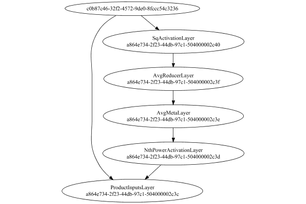

# NormalizationMetaLayer
## NormalizationMetaLayerTest
### Json Serialization
Code from [LayerTestBase.java:84](../../../../../../../../MindsEye/src/test/java/com/simiacryptus/mindseye/layers/LayerTestBase.java#L84) executed in 0.01 seconds: 
```java
    JsonObject json = layer.getJson();
    NNLayer echo = NNLayer.fromJson(json);
    assert (echo != null) : "Failed to deserialize";
    assert (layer != echo) : "Serialization did not copy";
    Assert.assertEquals("Serialization not equal", layer, echo);
    return new GsonBuilder().setPrettyPrinting().create().toJson(json);
```

Returns: 

```
    {
      "class": "com.simiacryptus.mindseye.layers.java.NormalizationMetaLayer",
      "id": "79cb4e2c-4a9a-4706-8f49-c2d5000000c0",
      "isFrozen": false,
      "name": "NormalizationMetaLayer/79cb4e2c-4a9a-4706-8f49-c2d5000000c0",
      "inputs": [
        "a39d0484-b77a-439c-8eb6-ccce2559ef12"
      ],
      "nodes": {
        "2b12645b-dcf5-4cf0-b329-cc3951d1767d": "79cb4e2c-4a9a-4706-8f49-c2d5000000c5",
        "e9298d96-807e-447e-a076-2d90b561881a": "79cb4e2c-4a9a-4706-8f49-c2d5000000c4",
        "90f17dc1-eaeb-442b-b37e-4c8f96f51257": "79cb4e2c-4a9a-4706-8f49-c2d5000000c3",
        "aeef2d02-7118-47ba-a72b-49a79fe6f009": "79cb4e2c-4a9a-4706-8f49-c2d5000000c2",
        "4814aaa2-ee6f-456d-a2c1-a9d8cafbfc3b": "79cb4e2c-4a9a-4706-8f49-c2d5000000c1"
      },
      "layers": {
        "79cb4e2c-4a9a-4706-8f49-c2d5000000c5": {
          "class": "com.simiacryptus.mindseye.layers.java.SqActivationLayer",
          "id": "79cb4e2c-4a9a-4706-8f49-c2d5000000c5",
          "isFrozen": true,
          "name": "SqActivationLayer/79cb4e2c-4a9a-4706-8f49-c2d5000000c5"
        },
        "79cb4e2c-4a9a-4706-8f49-c2d5000000c4": {
          "class": "com.simiacryptus.mindseye.layers.java.AvgReducerLayer",
          "id": "79cb4e2c-4a9a-4706-8f49-c2d5000000c4",
          "isFrozen": false,
          "name": "AvgReducerLayer/79cb4e2c-4a9a-4706-8f49-c2d5000000c4"
        },
        "79cb4e2c-4a9a-4706-8f49-c2d5000000c3": {
          "class": "com.simiacryptus.mindseye.layers.java.AvgMetaLayer",
          "id": "79cb4e2c-4a9a-4706-8f49-c2d5000000c3",
          "isFrozen": false,
          "name": "AvgMetaLayer/79cb4e2c-4a9a-4706-8f49-c2d5000000c3"
        },
        "79cb4e2c-4a9a-4706-8f49-c2d5000000c2": {
          "class": "com.simiacryptus.mindseye.layers.java.NthPowerActivationLayer",
          "id": "79cb4e2c-4a9a-4706-8f49-c2d5000000c2",
          "isFrozen": false,
          "name": "NthPowerActivationLayer/79cb4e2c-4a9a-4706-8f49-c2d5000000c2",
          "power": -0.5
        },
        "79cb4e2c-4a9a-4706-8f49-c2d5000000c1": {
          "class": "com.simiacryptus.mindseye.layers.java.ProductInputsLayer",
          "id": "79cb4e2c-4a9a-4706-8f49-c2d5000000c1",
          "isFrozen": false,
          "name": "ProductInputsLayer/79cb4e2c-4a9a-4706-8f49-c2d5000000c1"
        }
      },
      "links": {
        "2b12645b-dcf5-4cf0-b329-cc3951d1767d": [
          "a39d0484-b77a-439c-8eb6-ccce2559ef12"
        ],
        "e9298d96-807e-447e-a076-2d90b561881a": [
          "2b12645b-dcf5-4cf0-b329-cc3951d1767d"
        ],
        "90f17dc1-eaeb-442b-b37e-4c8f96f51257": [
          "e9298d96-807e-447e-a076-2d90b561881a"
        ],
        "aeef2d02-7118-47ba-a72b-49a79fe6f009": [
          "90f17dc1-eaeb-442b-b37e-4c8f96f51257"
        ],
        "4814aaa2-ee6f-456d-a2c1-a9d8cafbfc3b": [
          "a39d0484-b77a-439c-8eb6-ccce2559ef12",
          "aeef2d02-7118-47ba-a72b-49a79fe6f009"
        ]
      },
      "labels": {},
      "head": "4814aaa2-ee6f-456d-a2c1-a9d8cafbfc3b"
    }
```


### Network Diagram
Code from [LayerTestBase.java:95](../../../../../../../../MindsEye/src/test/java/com/simiacryptus/mindseye/layers/LayerTestBase.java#L95) executed in 2.04 seconds: 
```java
    return Graphviz.fromGraph(toGraph((DAGNetwork) layer))
      .height(400).width(600).render(Format.PNG).toImage();
```

Returns: 




### Example Input/Output Pair
Code from [LayerTestBase.java:121](../../../../../../../../MindsEye/src/test/java/com/simiacryptus/mindseye/layers/LayerTestBase.java#L121) executed in 0.01 seconds: 
```java
    SimpleEval eval = SimpleEval.run(layer, inputPrototype);
    return String.format("--------------------\nInput: \n[%s]\n--------------------\nOutput: \n%s",
      Arrays.stream(inputPrototype).map(t->t.prettyPrint()).reduce((a,b)->a+",\n"+b).get(),
      eval.getOutput().prettyPrint());
```

Returns: 

```
    --------------------
    Input: 
    [[ 0.1, 1.092, 1.488 ]]
    --------------------
    Output: 
    [ 0.09370506162885352, 1.0232592729870804, 1.3943313170373404 ]
```


### Differential Validation
Code from [LayerTestBase.java:139](../../../../../../../../MindsEye/src/test/java/com/simiacryptus/mindseye/layers/LayerTestBase.java#L139) executed in 0.00 seconds: 
```java
    getDerivativeTester().test(layer, inputPrototype);
```
Logging: 
```
    Component: NormalizationMetaLayer/79cb4e2c-4a9a-4706-8f49-c2d5000000c0
    Inputs: [ 0.1, 1.092, 1.488 ]
    output=[ 0.09370506162885352, 1.0232592729870804, 1.3943313170373404 ]
    measured/actual: [ [ 0.9370506162884039, 0.0, 0.0 ], [ 0.0, 0.9370506163008939, 0.0 ], [ 0.0, 0.0, 0.9370506162786895 ] ]
    implemented/expected: [ [ 0.0, 0.0, 0.0 ], [ 0.0, 0.0, 0.0 ], [ 0.0, 0.0, 0.0 ] ]
    error: [ [ 0.9370506162884039, 0.0, 0.0 ], [ 0.0, 0.9370506163008939, 0.0 ], [ 0.0, 0.0, 0.9370506162786895 ] ]
    
```

Returns: 

```
    java.lang.AssertionError: ToleranceStatistics{absoluteTol=3.1235e-01 +- 4.4173e-01 [0.0000e+00 - 9.3705e-01] (9#), relativeTol=1.0000e+00 +- 0.0000e+00 [1.0000e+00 - 1.0000e+00] (3#)}
    	at com.simiacryptus.mindseye.layers.DerivativeTester.testFeedback(DerivativeTester.java:224)
    	at com.simiacryptus.mindseye.layers.DerivativeTester.lambda$test$0(DerivativeTester.java:71)
    	at java.util.stream.IntPipeline$4$1.accept(IntPipeline.java:250)
    	at java.util.stream.Streams$RangeIntSpliterator.forEachRemaining(Streams.java:110)
    	at java.util.Spliterator$OfInt.forEachRemaining(Spliterator.java:693)
    	at java.util.stream.AbstractPipeline.copyInto(AbstractPipeline.java:481)
    	at java.util.stream.AbstractPipeline.wrapAndCopyInto(AbstractPipeline.java:471)
    	at java.util.stream.ReduceOps$ReduceOp.evaluateSequential(ReduceOps.java:708)
    	at java.util.stream.AbstractPipeline.evaluate(AbstractPipeline.java:234)
    	at java.util.stream.ReferencePipeline.reduce(ReferencePipeline.java:479)
    	at com.simiacryptus.mindseye.layers.DerivativeTester.test(DerivativeTester.java:72)
    	at com.simiacryptus.mindseye.layers.LayerTestBase.lambda$test$15(LayerTestBase.java:140)
    	at com.simiacryptus.util.io.NotebookOutput.lambda$code$1(NotebookOutput.java:142)
    	at com.simiacryptus.util.io.MarkdownNotebookOutput.lambda$null$1(MarkdownNotebookOutput.java:136)
    	at com.simiacryptus.util.lang.TimedResult.time(TimedResult.java:59)
    	at com.simiacryptus.util.io.MarkdownNotebookOutput.lambda$code$2(MarkdownNotebookOutput.java:136)
    	at com.simiacryptus.util.test.SysOutInterceptor.withOutput(SysOutInterceptor.java:77)
    	at com.simiacryptus.util.io.MarkdownNotebookOutput.code(MarkdownNotebookOutput.java:134)
    	at com.simiacryptus.util.io.NotebookOutput.code(NotebookOutput.java:141)
    	at com.simiacryptus.mindseye.layers.LayerTestBase.test(LayerTestBase.java:139)
    	at com.simiacryptus.mindseye.layers.LayerTestBase.test(LayerTestBase.java:69)
    	at sun.reflect.NativeMethodAccessorImpl.invoke0(Native Method)
    	at sun.reflect.NativeMethodAccessorImpl.invoke(Nat
```
...[skipping 75 bytes](etc/1.txt)...
```
    l.invoke(DelegatingMethodAccessorImpl.java:43)
    	at java.lang.reflect.Method.invoke(Method.java:498)
    	at org.junit.runners.model.FrameworkMethod$1.runReflectiveCall(FrameworkMethod.java:50)
    	at org.junit.internal.runners.model.ReflectiveCallable.run(ReflectiveCallable.java:12)
    	at org.junit.runners.model.FrameworkMethod.invokeExplosively(FrameworkMethod.java:47)
    	at org.junit.internal.runners.statements.InvokeMethod.evaluate(InvokeMethod.java:17)
    	at org.junit.runners.ParentRunner.runLeaf(ParentRunner.java:325)
    	at org.junit.runners.BlockJUnit4ClassRunner.runChild(BlockJUnit4ClassRunner.java:78)
    	at org.junit.runners.BlockJUnit4ClassRunner.runChild(BlockJUnit4ClassRunner.java:57)
    	at org.junit.runners.ParentRunner$3.run(ParentRunner.java:290)
    	at org.junit.runners.ParentRunner$1.schedule(ParentRunner.java:71)
    	at org.junit.runners.ParentRunner.runChildren(ParentRunner.java:288)
    	at org.junit.runners.ParentRunner.access$000(ParentRunner.java:58)
    	at org.junit.runners.ParentRunner$2.evaluate(ParentRunner.java:268)
    	at org.junit.runners.ParentRunner.run(ParentRunner.java:363)
    	at org.junit.runners.Suite.runChild(Suite.java:128)
    	at org.junit.runners.Suite.runChild(Suite.java:27)
    	at org.junit.runners.ParentRunner$3.run(ParentRunner.java:290)
    	at org.junit.runners.ParentRunner$1.schedule(ParentRunner.java:71)
    	at org.junit.runners.ParentRunner.runChildren(ParentRunner.java:288)
    	at org.junit.runners.ParentRunner.access$000(ParentRunner.java:58)
    	at org.junit.runners.ParentRunner$2.evaluate(ParentRunner.java:268)
    	at org.junit.runners.ParentRunner.run(ParentRunner.java:363)
    	at org.junit.runner.JUnitCore.run(JUnitCore.java:137)
    	at com.intellij.junit4.JUnit4IdeaTestRunner.startRunnerWithArgs(JUnit4IdeaTestRunner.java:68)
    	at com.intellij.rt.execution.junit.IdeaTestRunner$Repeater.startRunnerWithArgs(IdeaTestRunner.java:47)
    	at com.intellij.rt.execution.junit.JUnitStarter.prepareStreamsAndStart(JUnitStarter.java:242)
    	at com.intellij.rt.execution.junit.JUnitStarter.main(JUnitStarter.java:70)
    
```


