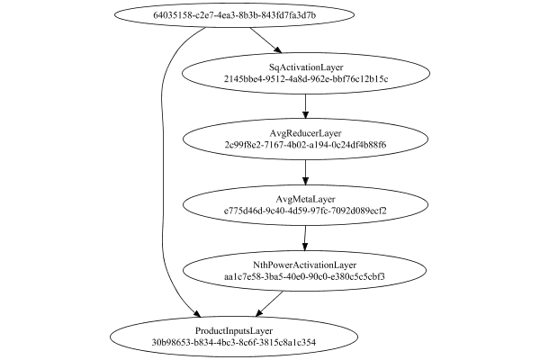

# NormalizationMetaLayer
## NormalizationMetaLayerTest
### Json Serialization
Code from [StandardLayerTests.java:68](../../../../../../../src/main/java/com/simiacryptus/mindseye/test/StandardLayerTests.java#L68) executed in 0.00 seconds: 
```java
    JsonObject json = layer.getJson();
    NNLayer echo = NNLayer.fromJson(json);
    if ((echo == null)) throw new AssertionError("Failed to deserialize");
    if ((layer == echo)) throw new AssertionError("Serialization did not copy");
    if ((!layer.equals(echo))) throw new AssertionError("Serialization not equal");
    return new GsonBuilder().setPrettyPrinting().create().toJson(json);
```

Returns: 

```
    {
      "class": "com.simiacryptus.mindseye.layers.java.NormalizationMetaLayer",
      "id": "b0aa93ea-5be5-4705-b985-b988da17746d",
      "isFrozen": false,
      "name": "NormalizationMetaLayer/b0aa93ea-5be5-4705-b985-b988da17746d",
      "inputs": [
        "64035158-c2e7-4ea3-8b3b-843fd7fa3d7b"
      ],
      "nodes": {
        "3c4ac7b4-ad78-4b45-8648-2f2dc78eb8cb": "2145bbe4-9512-4a8d-962e-bbf76c12b15c",
        "24fa724b-c906-474a-ac30-af7c37465f21": "2c99f8e2-7167-4b02-a194-0c24df4b88f6",
        "5d418d41-2e81-4111-8bf4-e31302e9e324": "e775d46d-9c40-4d59-97fc-7092d089ecf2",
        "a5e98bf4-1f78-446f-b024-0224dc70063f": "aa1c7e58-3ba5-40e0-90c0-e380c5c5cbf3",
        "10840803-3ca6-4c74-8a3a-3a9b7041be1b": "30b98653-b834-4bc3-8c6f-3815c8a1c354"
      },
      "layers": {
        "2145bbe4-9512-4a8d-962e-bbf76c12b15c": {
          "class": "com.simiacryptus.mindseye.layers.java.SqActivationLayer",
          "id": "2145bbe4-9512-4a8d-962e-bbf76c12b15c",
          "isFrozen": true,
          "name": "SqActivationLayer/2145bbe4-9512-4a8d-962e-bbf76c12b15c"
        },
        "2c99f8e2-7167
```
...[skipping 728 bytes](etc/128.txt)...
```
    "isFrozen": false,
          "name": "NthPowerActivationLayer/aa1c7e58-3ba5-40e0-90c0-e380c5c5cbf3",
          "power": -0.5
        },
        "30b98653-b834-4bc3-8c6f-3815c8a1c354": {
          "class": "com.simiacryptus.mindseye.layers.java.ProductInputsLayer",
          "id": "30b98653-b834-4bc3-8c6f-3815c8a1c354",
          "isFrozen": false,
          "name": "ProductInputsLayer/30b98653-b834-4bc3-8c6f-3815c8a1c354"
        }
      },
      "links": {
        "3c4ac7b4-ad78-4b45-8648-2f2dc78eb8cb": [
          "64035158-c2e7-4ea3-8b3b-843fd7fa3d7b"
        ],
        "24fa724b-c906-474a-ac30-af7c37465f21": [
          "3c4ac7b4-ad78-4b45-8648-2f2dc78eb8cb"
        ],
        "5d418d41-2e81-4111-8bf4-e31302e9e324": [
          "24fa724b-c906-474a-ac30-af7c37465f21"
        ],
        "a5e98bf4-1f78-446f-b024-0224dc70063f": [
          "5d418d41-2e81-4111-8bf4-e31302e9e324"
        ],
        "10840803-3ca6-4c74-8a3a-3a9b7041be1b": [
          "a5e98bf4-1f78-446f-b024-0224dc70063f",
          "64035158-c2e7-4ea3-8b3b-843fd7fa3d7b"
        ]
      },
      "labels": {},
      "head": "10840803-3ca6-4c74-8a3a-3a9b7041be1b"
    }
```


### Network Diagram
Code from [StandardLayerTests.java:79](../../../../../../../src/main/java/com/simiacryptus/mindseye/test/StandardLayerTests.java#L79) executed in 0.15 seconds: 
```java
    return Graphviz.fromGraph(TestUtil.toGraph((DAGNetwork) layer))
      .height(400).width(600).render(Format.PNG).toImage();
```

Returns: 




### Example Input/Output Pair
Code from [StandardLayerTests.java:152](../../../../../../../src/main/java/com/simiacryptus/mindseye/test/StandardLayerTests.java#L152) executed in 0.00 seconds: 
```java
    SimpleEval eval = SimpleEval.run(layer, inputPrototype);
    return String.format("--------------------\nInput: \n[%s]\n--------------------\nOutput: \n%s\n--------------------\nDerivative: \n%s",
      Arrays.stream(inputPrototype).map(t -> t.prettyPrint()).reduce((a, b) -> a + ",\n" + b).get(),
      eval.getOutput().prettyPrint(),
      Arrays.stream(eval.getDerivative()).map(t -> t.prettyPrint()).reduce((a, b) -> a + ",\n" + b).get());
```

Returns: 

```
    --------------------
    Input: 
    [[ 1.704, 1.14, 0.584 ]]
    --------------------
    Output: 
    [ 1.3845162537393438, 0.9262608739805468, 0.4745055705303854 ]
    --------------------
    Derivative: 
    [ -0.23190895525599264, 0.11377885608389982, 0.45456329421329733 ]
```


### Differential Validation
Code from [StandardLayerTests.java:109](../../../../../../../src/main/java/com/simiacryptus/mindseye/test/StandardLayerTests.java#L109) executed in 0.00 seconds: 
```java
    return getDerivativeTester().test(layer, inputPrototype);
```
Logging: 
```
    Inputs: [ -0.58, -0.616, -0.416 ],
    [ -0.76, 1.856, 0.64 ],
    [ -0.696, 1.124, 0.52 ]
    Inputs Statistics: {meanExponent=-0.27596598788196486, negative=3, min=-0.416, max=-0.416, mean=-0.5373333333333333, count=3.0, positive=0, stdDev=0.08704532663439726, zeros=0},
    {meanExponent=-0.014809487284159392, negative=1, min=0.64, max=0.64, mean=0.5786666666666668, count=3.0, positive=2, stdDev=1.0688577496041691, zeros=0},
    {meanExponent=-0.13020703517386548, negative=1, min=0.52, max=0.52, mean=0.31600000000000006, count=3.0, positive=2, stdDev=0.756884843728996, zeros=0}
    Output: [ -0.47125553237606765, -0.5005058757649271, -0.33800396804904165 ]
    Outputs Statistics: {meanExponent=-0.36613751973493686, negative=3, min=-0.33800396804904165, max=-0.33800396804904165, mean=-0.4365884587300122, count=3.0, positive=0, stdDev=0.07072515817920894, zeros=0}
    Feedback for input 0
    Inputs Values: [ -0.58, -0.616, -0.416 ]
    Value Statistics: {meanExponent=-0.27596598788196486, negative=3, min=-0.416, max=-0.416, mean=-0.537333333
```
...[skipping 319 bytes](etc/129.txt)...
```
    nExponent=-0.5913955103664971, negative=2, min=1.1540938905889053, max=1.1540938905889053, mean=0.39810295608490864, count=9.0, positive=7, stdDev=0.5432653115675855, zeros=0}
    Measured: [ [ 1.0566455316973755, -0.05390620833711779, -0.03640419264372419 ], [ -0.05390651960923698, 1.050149478915019, -0.03866398647800473 ], [ -0.03640283330330618, -0.03866231950810928, 1.0812892841838284 ] ]
    Measured Statistics: {meanExponent=-0.9067462726248158, negative=6, min=1.0812892841838284, max=1.0812892841838284, mean=0.3255709149907471, count=9.0, positive=3, stdDev=0.5213214342300849, zeros=0}
    Feedback Error: [ [ 0.1274366740025027, -0.2607954169582958, -0.10151653241282589 ], [ 0.13533693108193118, -0.2769737550647471, -0.10781778181898172 ], [ 0.09139793859202816, -0.18705182086398867, -0.07280460640507691 ] ]
    Error Statistics: {meanExponent=-0.8633629229872635, negative=6, min=-0.07280460640507691, max=-0.07280460640507691, mean=-0.07253204109416156, count=9.0, positive=3, stdDev=0.15000355049121747, zeros=0}
    
```

Returns: 

```
    java.lang.AssertionError: ToleranceStatistics{absoluteTol=1.5124e-01 +- 6.9924e-02 [7.2805e-02 - 2.7697e-01] (9#), relativeTol=5.9183e-01 +- 4.0634e-01 [3.2569e-02 - 1.0000e+00] (9#)}
    	at com.simiacryptus.mindseye.test.BatchDerivativeTester.lambda$test$6(BatchDerivativeTester.java:89)
    	at java.util.stream.IntPipeline$4$1.accept(IntPipeline.java:250)
    	at java.util.stream.Streams$RangeIntSpliterator.forEachRemaining(Streams.java:110)
    	at java.util.Spliterator$OfInt.forEachRemaining(Spliterator.java:693)
    	at java.util.stream.AbstractPipeline.copyInto(AbstractPipeline.java:481)
    	at java.util.stream.AbstractPipeline.wrapAndCopyInto(AbstractPipeline.java:471)
    	at java.util.stream.ReduceOps$ReduceOp.evaluateSequential(ReduceOps.java:708)
    	at java.util.stream.AbstractPipeline.evaluate(AbstractPipeline.java:234)
    	at java.util.stream.ReferencePipeline.reduce(ReferencePipeline.java:479)
    	at com.simiacryptus.mindseye.test.BatchDerivativeTester.test(BatchDerivativeTester.java:120)
    	at com.simiacryptus.mindseye.
```
...[skipping 1985 bytes](etc/130.txt)...
```
    unner.java:268)
    	at org.junit.runners.ParentRunner.run(ParentRunner.java:363)
    	at org.junit.runners.Suite.runChild(Suite.java:128)
    	at org.junit.runners.Suite.runChild(Suite.java:27)
    	at org.junit.runners.ParentRunner$3.run(ParentRunner.java:290)
    	at org.junit.runners.ParentRunner$1.schedule(ParentRunner.java:71)
    	at org.junit.runners.ParentRunner.runChildren(ParentRunner.java:288)
    	at org.junit.runners.ParentRunner.access$000(ParentRunner.java:58)
    	at org.junit.runners.ParentRunner$2.evaluate(ParentRunner.java:268)
    	at org.junit.runners.ParentRunner.run(ParentRunner.java:363)
    	at org.junit.runner.JUnitCore.run(JUnitCore.java:137)
    	at com.intellij.junit4.JUnit4IdeaTestRunner.startRunnerWithArgs(JUnit4IdeaTestRunner.java:68)
    	at com.intellij.rt.execution.junit.IdeaTestRunner$Repeater.startRunnerWithArgs(IdeaTestRunner.java:47)
    	at com.intellij.rt.execution.junit.JUnitStarter.prepareStreamsAndStart(JUnitStarter.java:242)
    	at com.intellij.rt.execution.junit.JUnitStarter.main(JUnitStarter.java:70)
    
```


