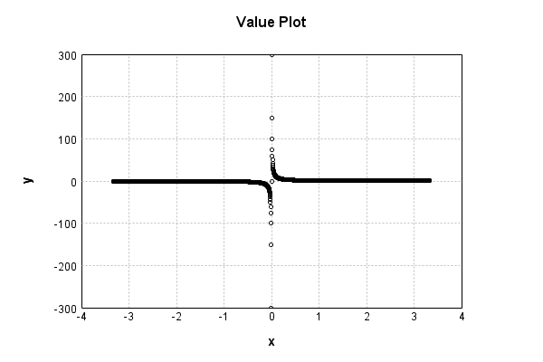
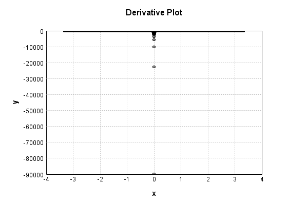

# NthPowerActivationLayer
## InvPowerTest
### Json Serialization
Code from [StandardLayerTests.java:68](../../../../../../../../src/main/java/com/simiacryptus/mindseye/test/StandardLayerTests.java#L68) executed in 0.00 seconds: 
```java
    JsonObject json = layer.getJson();
    NNLayer echo = NNLayer.fromJson(json);
    if ((echo == null)) throw new AssertionError("Failed to deserialize");
    if ((layer == echo)) throw new AssertionError("Serialization did not copy");
    if ((!layer.equals(echo))) throw new AssertionError("Serialization not equal");
    return new GsonBuilder().setPrettyPrinting().create().toJson(json);
```

Returns: 

```
    {
      "class": "com.simiacryptus.mindseye.layers.java.NthPowerActivationLayer",
      "id": "c392ef83-7085-4cad-97b5-466fb5fc47f8",
      "isFrozen": false,
      "name": "NthPowerActivationLayer/c392ef83-7085-4cad-97b5-466fb5fc47f8",
      "power": -1.0
    }
```


### Example Input/Output Pair
Code from [StandardLayerTests.java:152](../../../../../../../../src/main/java/com/simiacryptus/mindseye/test/StandardLayerTests.java#L152) executed in 0.00 seconds: 
```java
    SimpleEval eval = SimpleEval.run(layer, inputPrototype);
    return String.format("--------------------\nInput: \n[%s]\n--------------------\nOutput: \n%s\n--------------------\nDerivative: \n%s",
      Arrays.stream(inputPrototype).map(t -> t.prettyPrint()).reduce((a, b) -> a + ",\n" + b).get(),
      eval.getOutput().prettyPrint(),
      Arrays.stream(eval.getDerivative()).map(t -> t.prettyPrint()).reduce((a, b) -> a + ",\n" + b).get());
```

Returns: 

```
    --------------------
    Input: 
    [[
    	[ [ -0.532 ], [ 1.98 ], [ -0.716 ] ],
    	[ [ -1.888 ], [ -0.88 ], [ -1.672 ] ]
    ]]
    --------------------
    Output: 
    [
    	[ [ -1.8796992481203008 ], [ 0.5050505050505051 ], [ -1.3966480446927374 ] ],
    	[ [ -0.5296610169491526 ], [ -1.1363636363636365 ], [ -0.5980861244019139 ] ]
    ]
    --------------------
    Derivative: 
    [
    	[ [ -3.5332692633840237 ], [ -0.2550760126517702 ], [ -1.950625760744047 ] ],
    	[ [ -0.2805407928756105 ], [ -1.2913223140495869 ], [ -0.3577070122021016 ] ]
    ]
```


### Batch Execution
Code from [StandardLayerTests.java:101](../../../../../../../../src/main/java/com/simiacryptus/mindseye/test/StandardLayerTests.java#L101) executed in 0.00 seconds: 
```java
    return getBatchingTester().test(layer, inputPrototype);
```

Returns: 

```
    ToleranceStatistics{absoluteTol=0.0000e+00 +- 0.0000e+00 [0.0000e+00 - 0.0000e+00] (120#), relativeTol=0.0000e+00 +- 0.0000e+00 [0.0000e+00 - 0.0000e+00] (120#)}
```


### Differential Validation
Code from [StandardLayerTests.java:109](../../../../../../../../src/main/java/com/simiacryptus/mindseye/test/StandardLayerTests.java#L109) executed in 0.00 seconds: 
```java
    return getDerivativeTester().test(layer, inputPrototype);
```
Logging: 
```
    Inputs: [
    	[ [ 0.324 ], [ -1.072 ], [ -1.064 ] ],
    	[ [ -0.668 ], [ -1.004 ], [ 1.008 ] ]
    ]
    Inputs Statistics: {meanExponent=-0.10039131151392576, negative=4, min=1.008, max=1.008, mean=-0.4126666666666667, count=6.0, positive=2, stdDev=0.7994578718662346, zeros=0}
    Output: [
    	[ [ 3.0864197530864197 ], [ -0.9328358208955223 ], [ -0.9398496240601504 ] ],
    	[ [ -1.497005988023952 ], [ -0.9960159362549801 ], [ 0.9920634920634921 ] ]
    ]
    Outputs Statistics: {meanExponent=0.10039131151392577, negative=4, min=0.9920634920634921, max=0.9920634920634921, mean=-0.047870687347448815, count=6.0, positive=2, stdDev=1.6063935749752107, zeros=0}
    Feedback for input 0
    Inputs Values: [
    	[ [ 0.324 ], [ -1.072 ], [ -1.064 ] ],
    	[ [ -0.668 ], [ -1.004 ], [ 1.008 ] ]
    ]
    Value Statistics: {meanExponent=-0.10039131151392576, negative=4, min=1.008, max=1.008, mean=-0.4126666666666667, count=6.0, positive=2, stdDev=0.7994578718662346, zeros=0}
    Implemented Feedback: [ [ -9.525986892242036, 0.0, 0.0, 0.0, 0.0, 0.0 ], [ 0.0, -2.2410269
```
...[skipping 667 bytes](etc/131.txt)...
```
    0, 0.0, 0.0, 0.0, -0.8834003421931413, 0.0 ], [ 0.0, 0.0, 0.0, 0.0, 0.0, -0.9840923440762595 ] ]
    Measured Statistics: {meanExponent=0.20078470763323983, negative=6, min=-0.9840923440762595, max=-0.9840923440762595, mean=-0.4303975900687984, count=36.0, positive=0, stdDev=1.6032430293405169, zeros=30}
    Feedback Error: [ [ 0.0029392122463587356, 0.0, 0.0, 0.0, 0.0, 0.0 ], [ 0.0, -3.355333040846453E-4, 0.0, 0.0, 0.0, 0.0 ], [ 0.0, 0.0, -8.118132989121118E-5, 0.0, 0.0, 0.0 ], [ 0.0, 0.0, 0.0, -9.881937841194066E-5, 0.0, 0.0 ], [ 0.0, 0.0, 0.0, 0.0, -8.302634713541757E-5, 0.0 ], [ 0.0, 0.0, 0.0, 0.0, 0.0, 9.762820895087287E-5 ] ]
    Error Statistics: {meanExponent=-3.6988239809673495, negative=4, min=9.762820895087287E-5, max=9.762820895087287E-5, mean=6.773000266073316E-5, count=36.0, positive=2, stdDev=4.893075273989574E-4, zeros=30}
    Finite-Difference Derivative Accuracy:
    absoluteTol: 1.0098e-04 +- 4.8354e-04 [0.0000e+00 - 2.9392e-03] (36#)
    relativeTol: 7.0366e-05 +- 3.8789e-05 [4.6644e-05 - 1.5430e-04] (6#)
    
```

Returns: 

```
    ToleranceStatistics{absoluteTol=1.0098e-04 +- 4.8354e-04 [0.0000e+00 - 2.9392e-03] (36#), relativeTol=7.0366e-05 +- 3.8789e-05 [4.6644e-05 - 1.5430e-04] (6#)}
```


### Performance
Code from [StandardLayerTests.java:119](../../../../../../../../src/main/java/com/simiacryptus/mindseye/test/StandardLayerTests.java#L119) executed in 0.22 seconds: 
```java
    getPerformanceTester().test(layer, permPrototype);
```
Logging: 
```
    100 batches
    Input Dimensions:
    	[100, 100, 1]
    Performance:
    	Evaluation performance: 0.021254s +- 0.017293s [0.011854s - 0.055800s]
    	Learning performance: 0.010505s +- 0.000296s [0.010097s - 0.010859s]
    
```

### Function Plots
Code from [ActivationLayerTestBase.java:110](../../../../../../../../src/test/java/com/simiacryptus/mindseye/layers/java/ActivationLayerTestBase.java#L110) executed in 0.00 seconds: 
```java
    return plot("Value Plot", plotData, x -> new double[]{x[0], x[1]});
```

Returns: 




Code from [ActivationLayerTestBase.java:114](../../../../../../../../src/test/java/com/simiacryptus/mindseye/layers/java/ActivationLayerTestBase.java#L114) executed in 0.00 seconds: 
```java
    return plot("Derivative Plot", plotData, x -> new double[]{x[0], x[2]});
```

Returns: 




