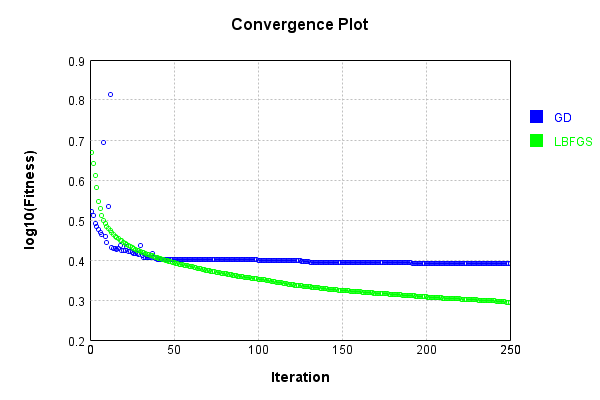
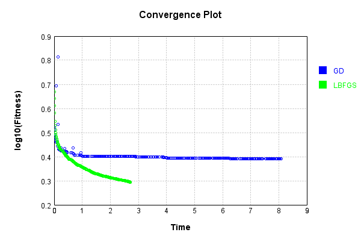

# NthPowerActivationLayer
## InvPowerTest
### Json Serialization
Code from [JsonTest.java:36](../../../../../../../../src/main/java/com/simiacryptus/mindseye/test/unit/JsonTest.java#L36) executed in 0.00 seconds: 
```java
    JsonObject json = layer.getJson();
    NNLayer echo = NNLayer.fromJson(json);
    if ((echo == null)) throw new AssertionError("Failed to deserialize");
    if ((layer == echo)) throw new AssertionError("Serialization did not copy");
    if ((!layer.equals(echo))) throw new AssertionError("Serialization not equal");
    return new GsonBuilder().setPrettyPrinting().create().toJson(json);
```

Returns: 

```
    {
      "class": "com.simiacryptus.mindseye.layers.java.NthPowerActivationLayer",
      "id": "50533a72-6a83-46c4-8f73-31296a0d4061",
      "isFrozen": false,
      "name": "NthPowerActivationLayer/50533a72-6a83-46c4-8f73-31296a0d4061",
      "power": -1.0
    }
```


### Example Input/Output Pair
Code from [ReferenceIO.java:68](../../../../../../../../src/main/java/com/simiacryptus/mindseye/test/unit/ReferenceIO.java#L68) executed in 0.00 seconds: 
```java
    SimpleEval eval = SimpleEval.run(layer, inputPrototype);
    return String.format("--------------------\nInput: \n[%s]\n--------------------\nOutput: \n%s\n--------------------\nDerivative: \n%s",
      Arrays.stream(inputPrototype).map(t -> t.prettyPrint()).reduce((a, b) -> a + ",\n" + b).get(),
      eval.getOutput().prettyPrint(),
      Arrays.stream(eval.getDerivative()).map(t -> t.prettyPrint()).reduce((a, b) -> a + ",\n" + b).get());
```

Returns: 

```
    --------------------
    Input: 
    [[
    	[ [ -1.924 ], [ -0.708 ], [ -0.828 ] ],
    	[ [ -1.484 ], [ -1.78 ], [ -0.708 ] ]
    ]]
    --------------------
    Output: 
    [
    	[ [ -0.5197505197505198 ], [ -1.4124293785310735 ], [ -1.2077294685990339 ] ],
    	[ [ -0.6738544474393531 ], [ -0.5617977528089888 ], [ -1.4124293785310735 ] ]
    ]
    --------------------
    Derivative: 
    [
    	[ [ -0.27014060278093543 ], [ -1.9949567493376745 ], [ -1.4586104693225048 ] ],
    	[ [ -0.4540798163337959 ], [ -0.3156167150612296 ], [ -1.9949567493376745 ] ]
    ]
```


### Batch Execution
Code from [BatchingTester.java:66](../../../../../../../../src/main/java/com/simiacryptus/mindseye/test/unit/BatchingTester.java#L66) executed in 0.00 seconds: 
```java
    return test(reference, inputPrototype);
```

Returns: 

```
    ToleranceStatistics{absoluteTol=0.0000e+00 +- 0.0000e+00 [0.0000e+00 - 0.0000e+00] (120#), relativeTol=0.0000e+00 +- 0.0000e+00 [0.0000e+00 - 0.0000e+00] (120#)}
```


Code from [SingleDerivativeTester.java:77](../../../../../../../../src/main/java/com/simiacryptus/mindseye/test/unit/SingleDerivativeTester.java#L77) executed in 0.00 seconds: 
```java
    return test(component, inputPrototype);
```
Logging: 
```
    Inputs: [
    	[ [ -1.744 ], [ -1.672 ], [ -1.62 ] ],
    	[ [ -0.648 ], [ 1.376 ], [ -0.288 ] ]
    ]
    Inputs Statistics: {meanExponent=0.013980615961915596, negative=5, min=-0.288, max=-0.288, mean=-0.766, count=6.0, positive=1, stdDev=1.1058336222054381, zeros=0}
    Output: [
    	[ [ -0.573394495412844 ], [ -0.5980861244019139 ], [ -0.6172839506172839 ] ],
    	[ [ -1.5432098765432098 ], [ 0.7267441860465117 ], [ -3.4722222222222223 ] ]
    ]
    Outputs Statistics: {meanExponent=-0.013980615961915596, negative=5, min=-3.4722222222222223, max=-3.4722222222222223, mean=-1.0129087471918272, count=6.0, positive=1, stdDev=1.2830694934376428, zeros=0}
    Feedback for input 0
    Inputs Values: [
    	[ [ -1.744 ], [ -1.672 ], [ -1.62 ] ],
    	[ [ -0.648 ], [ 1.376 ], [ -0.288 ] ]
    ]
    Value Statistics: {meanExponent=0.013980615961915596, negative=5, min=-0.288, max=-0.288, mean=-0.766, count=6.0, positive=1, stdDev=1.1058336222054381, zeros=0}
    Implemented Feedback: [ [ -0.32878124736975, 0.0, 0.0, 0.0, 0.0, 0.0 ], [ 0.0, -2.381496723060509, 0.0, 0.0, 
```
...[skipping 653 bytes](etc/355.txt)...
```
    0.0, 0.0, -0.38106299809714805, 0.0 ], [ 0.0, 0.0, 0.0, 0.0, 0.0, -12.060514839258296 ] ]
    Measured Statistics: {meanExponent=-0.027917236051949585, negative=6, min=-12.060514839258296, max=-12.060514839258296, mean=-0.44550248253684266, count=36.0, positive=0, stdDev=2.00447059094547, zeros=30}
    Feedback Error: [ [ -1.8853216585013044E-5, 0.0, 0.0, 0.0, 0.0, 0.0 ], [ 0.0, -3.675716510351812E-4, 0.0, 0.0, 0.0, 0.0 ], [ 0.0, 0.0, -2.1395239758026374E-5, 0.0, 0.0, 0.0 ], [ 0.0, 0.0, 0.0, 3.8380721253727934E-5, 0.0, 0.0 ], [ 0.0, 0.0, 0.0, 0.0, -2.352240746666956E-5, 0.0 ], [ 0.0, 0.0, 0.0, 0.0, 0.0, -0.004187678764466796 ] ]
    Error Statistics: {meanExponent=-4.041897852733951, negative=5, min=-0.004187678764466796, max=-0.004187678764466796, mean=-1.2724001550160993E-4, count=36.0, positive=1, stdDev=6.890363875424781E-4, zeros=30}
    Finite-Difference Derivative Accuracy:
    absoluteTol: 1.2937e-04 +- 6.8864e-04 [0.0000e+00 - 4.1877e-03] (36#)
    relativeTol: 6.2764e-05 +- 5.2376e-05 [2.8671e-05 - 1.7364e-04] (6#)
    
```

Returns: 

```
    ToleranceStatistics{absoluteTol=1.2937e-04 +- 6.8864e-04 [0.0000e+00 - 4.1877e-03] (36#), relativeTol=6.2764e-05 +- 5.2376e-05 [2.8671e-05 - 1.7364e-04] (6#)}
```


### Performance
Now we execute larger-scale runs to benchmark performance:

Code from [PerformanceTester.java:66](../../../../../../../../src/main/java/com/simiacryptus/mindseye/test/unit/PerformanceTester.java#L66) executed in 0.38 seconds: 
```java
    test(component, inputPrototype);
```
Logging: 
```
    100 batches
    Input Dimensions:
    	[100, 100, 1]
    Performance:
    	Evaluation performance: 0.034888s +- 0.038195s [0.014466s - 0.111259s]
    	Learning performance: 0.015073s +- 0.003347s [0.012016s - 0.020885s]
    
```

### Input Learning
In this test, we use a network to learn this target input, given it's pre-evaluated output:

Code from [LearningTester.java:127](../../../../../../../../src/main/java/com/simiacryptus/mindseye/test/unit/LearningTester.java#L127) executed in 0.00 seconds: 
```java
    return Arrays.stream(input_target).map(x -> x.prettyPrint()).reduce((a, b) -> a + "\n" + b).orElse("");
```

Returns: 

```
    [
    	[ [ 0.468 ], [ 1.98 ], [ 1.26 ], [ -1.732 ], [ -1.52 ], [ 1.368 ], [ 1.596 ], [ -1.076 ], ... ],
    	[ [ 0.892 ], [ -0.692 ], [ 1.9 ], [ -1.924 ], [ 0.728 ], [ 1.296 ], [ 0.292 ], [ -1.752 ], ... ],
    	[ [ -1.252 ], [ -0.748 ], [ 0.992 ], [ 1.616 ], [ 0.468 ], [ -1.924 ], [ -1.42 ], [ -0.372 ], ... ],
    	[ [ -1.596 ], [ -1.504 ], [ 0.732 ], [ -1.932 ], [ -1.548 ], [ -0.736 ], [ 0.228 ], [ 0.512 ], ... ],
    	[ [ 0.276 ], [ 1.348 ], [ 0.384 ], [ -1.6 ], [ -0.4 ], [ -0.464 ], [ 0.364 ], [ -0.324 ], ... ],
    	[ [ 1.996 ], [ -1.96 ], [ -1.856 ], [ 0.564 ], [ -1.44 ], [ 0.56 ], [ 0.316 ], [ -1.548 ], ... ],
    	[ [ 0.728 ], [ -0.296 ], [ 0.464 ], [ 0.764 ], [ 1.22 ], [ -1.58 ], [ 1.16 ], [ -1.356 ], ... ],
    	[ [ -1.872 ], [ 0.544 ], [ 0.464 ], [ 0.432 ], [ 0.94 ], [ -0.388 ], [ 1.564 ], [ 0.672 ], ... ],
    	...
    ]
```


First, we use a conjugate gradient descent method, which converges the fastest for purely linear functions.

Code from [LearningTester.java:300](../../../../../../../../src/main/java/com/simiacryptus/mindseye/test/unit/LearningTester.java#L300) executed in 8.18 seconds: 
```java
    return new IterativeTrainer(trainable)
      .setLineSearchFactory(label -> new QuadraticSearch())
      .setOrientation(new GradientDescent())
      .setMonitor(monitor)
      .setTimeout(30, TimeUnit.SECONDS)
      .setMaxIterations(250)
      .setTerminateThreshold(0)
      .run();
```
Logging: 
```
    Constructing line search parameters: GD
    F(0.0) = LineSearchPoint{point=PointSample{avg=4.945254529855626}, derivative=-0.16991812530416395}
    New Minimum: 4.945254529855626 > 4.945254529838639
    F(1.0E-10) = LineSearchPoint{point=PointSample{avg=4.945254529838639}, derivative=-0.16991812529991282}, delta = -1.6987300455184595E-11
    New Minimum: 4.945254529838639 > 4.9452545297367045
    F(7.000000000000001E-10) = LineSearchPoint{point=PointSample{avg=4.9452545297367045}, derivative=-0.16991812527440606}, delta = -1.1892176132732857E-10
    New Minimum: 4.9452545297367045 > 4.945254529023031
    F(4.900000000000001E-9) = LineSearchPoint{point=PointSample{avg=4.945254529023031}, derivative=-0.16991812509585885}, delta = -8.325953260168717E-10
    New Minimum: 4.945254529023031 > 4.9452545240274555
    F(3.430000000000001E-8) = LineSearchPoint{point=PointSample{avg=4.9452545240274555}, derivative=-0.16991812384602833}, delta = -5.828170834831781E-9
    New Minimum: 4.9452545240274555 > 4.945254489058313
    F(2.4010000000000004E-7) = 
```
...[skipping 473148 bytes](etc/356.txt)...
```
    232748856755) = LineSearchPoint{point=PointSample{avg=2.4641940843048995}, derivative=2.879879694029065E-7}, delta = -4.497435937267369E-5
    Right bracket at 36.48232748856755
    New Minimum: 2.4641940843048995 > 2.46419349561652
    F(33.728904296197406) = LineSearchPoint{point=PointSample{avg=2.46419349561652}, derivative=1.3715534327916534E-7}, delta = -4.556304775205078E-5
    Right bracket at 33.728904296197406
    New Minimum: 2.46419349561652 > 2.4641933689879547
    F(32.46665072570824) = LineSearchPoint{point=PointSample{avg=2.4641933689879547}, derivative=6.293252326817696E-8}, delta = -4.56896763174619E-5
    Right bracket at 32.46665072570824
    New Minimum: 2.4641933689879547 > 2.4641933429762735
    F(31.89762760130045) = LineSearchPoint{point=PointSample{avg=2.4641933429762735}, derivative=2.837801477198151E-8}, delta = -4.571568799871528E-5
    Right bracket at 31.89762760130045
    Converged to right
    Iteration 250 complete. Error: 2.4641933429762735 Total: 249817792613069.2500; Orientation: 0.0003; Line Search: 0.0359
    
```

Returns: 

```
    2.4641933429762735
```


This training run resulted in the following regressed input:

Code from [LearningTester.java:144](../../../../../../../../src/main/java/com/simiacryptus/mindseye/test/unit/LearningTester.java#L144) executed in 0.00 seconds: 
```java
    return Arrays.stream(input_gd).map(x -> x.prettyPrint()).reduce((a, b) -> a + "\n" + b).orElse("");
```

Returns: 

```
    [
    	[ [ -3613.0517006107607 ], [ -3.7016610878821803 ], [ 1.260589812464053 ], [ 3.7693798952583015 ], [ 3.938428546537082 ], [ -4.000259547069352 ], [ 1.5851773825543773 ], [ 4.183411338931371 ], ... ],
    	[ [ -4.3337946819256254 ], [ 4.914450032461126 ], [ 1.8252200983530402 ], [ -1.9081531938108285 ], [ -4.558555149983973 ], [ 1.2960712517150523 ], [ 44.23105590787698 ], [ 3.757477541933303 ], ... ],
    	[ [ 4.017673442088125 ], [ 4.552762386247374 ], [ 0.9919999995700529 ], [ -3.8548220464960297 ], [ 14.504023304365171 ], [ 3.7743926434181927 ], [ -1.422874357550636 ], [ -167.35068678303597 ], ... ],
    	[ [ 3.8548302510618955 ], [ 3.8687212154806403 ], [ -4.616132066127478 ], [ 3.7781669086819036 ], [ 3.8503481183145447 ], [ -0.7359999999999992 ], [ -6.490683160751211 ], [ -5.021682985868889 ], ... ],
    	[ [ -7.802982252453311 ], [ -3.97156263807329 ], [ -4.83058700938359 ], [ 3.8556979292627203 ], [ 5.292886963173342 ], [ 5.149708108282462 ], [ -11.172594178517793 ], [ 5.720373162901226 ], ... ],
    	[ [ 1.8875659578802844 ], [ 3.6835542277511313 ], [ 3.718437433835321 ], [ -101.18986741985366 ], [ 3.8997841825990944 ], [ -9.08453273996525 ], [ -5.770252172150844 ], [ -1.5414421200515276 ], ... ],
    	[ [ -4.571171832033121 ], [ -21.32066035612937 ], [ -4.752101855021078 ], [ -4.502458020269895 ], [ -4.047968922886089 ], [ 3.8312303005790733 ], [ 1.1599522152434607 ], [ -1.3567880879979737 ], ... ],
    	[ [ 3.7258048088067217 ], [ -3.819244608562565 ], [ -5.160114060070302 ], [ 16.22317148480385 ], [ 0.939999999748957 ], [ -30.215986181969438 ], [ 1.5597559128959073 ], [ -4.653872305674648 ], ... ],
    	...
    ]
```


Next, we run the same optimization using L-BFGS, which is nearly ideal for purely second-order or quadratic functions.

Code from [LearningTester.java:324](../../../../../../../../src/main/java/com/simiacryptus/mindseye/test/unit/LearningTester.java#L324) executed in 2.73 seconds: 
```java
    return new IterativeTrainer(trainable)
      .setLineSearchFactory(label -> new ArmijoWolfeSearch())
      .setOrientation(new LBFGS())
      .setMonitor(monitor)
      .setTimeout(30, TimeUnit.SECONDS)
      .setMaxIterations(250)
      .setTerminateThreshold(0)
      .run();
```
Logging: 
```
    LBFGS Accumulation History: 1 points
    Constructing line search parameters: GD
    th(0)=4.945254529855626;dx=-0.16991812530416395
    New Minimum: 4.945254529855626 > 4.654437183440897
    END: th(2.154434690031884)=4.654437183440897; dx=-0.10820391302697374 delta=0.29081734641472945
    Iteration 1 complete. Error: 4.654437183440897 Total: 249817812753346.2000; Orientation: 0.0008; Line Search: 0.0052
    LBFGS Accumulation History: 1 points
    th(0)=4.654437183440897;dx=-0.07299951846785736
    New Minimum: 4.654437183440897 > 4.376023652481672
    END: th(4.641588833612779)=4.376023652481672; dx=-0.04945611973136138 delta=0.2784135309592246
    Iteration 2 complete. Error: 4.376023652481672 Total: 249817819499355.2000; Orientation: 0.0005; Line Search: 0.0045
    LBFGS Accumulation History: 1 points
    th(0)=4.376023652481672;dx=-0.03460046981461842
    New Minimum: 4.376023652481672 > 4.092155505366208
    END: th(10.000000000000002)=4.092155505366208; dx=-0.023349250953514554 delta=0.2838681471154638
    Iteration 3 complete. Error: 4.09215550
```
...[skipping 117479 bytes](etc/357.txt)...
```
    07661905
    Armijo: th(172.78172497211708)=1.9652076453164529; dx=-1.385307134149381E-5 delta=-0.0012922418738783303
    Armijo: th(43.19543124302927)=1.9659292575199903; dx=1.9561260791270657E-5 delta=-0.002013854077415722
    New Minimum: 1.9639154034425745 > 1.963181189516114
    WOLF (strong): th(8.639086248605853)=1.963181189516114; dx=2.3533408208380863E-4 delta=7.342139264605585E-4
    New Minimum: 1.963181189516114 > 1.9618220989044952
    END: th(1.4398477081009755)=1.9618220989044952; dx=-4.283784369468157E-4 delta=0.0020933045380793214
    Iteration 249 complete. Error: 1.9618220989044952 Total: 249820526184489.5000; Orientation: 0.0005; Line Search: 0.0164
    LBFGS Accumulation History: 1 points
    th(0)=1.9618220989044952;dx=-1.1445595219557413E-4
    New Minimum: 1.9618220989044952 > 1.9615431305318936
    END: th(3.1020578506956435)=1.9615431305318936; dx=-6.877017070312333E-5 delta=2.789683726016623E-4
    Iteration 250 complete. Error: 1.9615431305318936 Total: 249820533217756.4700; Orientation: 0.0005; Line Search: 0.0047
    
```

Returns: 

```
    1.9615431305318936
```


This training run resulted in the following regressed input:

Code from [LearningTester.java:154](../../../../../../../../src/main/java/com/simiacryptus/mindseye/test/unit/LearningTester.java#L154) executed in 0.00 seconds: 
```java
    return Arrays.stream(input_lbgfs).map(x -> x.prettyPrint()).reduce((a, b) -> a + "\n" + b).orElse("");
```

Returns: 

```
    [
    	[ [ 0.44458429816980893 ], [ -1.9873207401758366 ], [ 1.6661595762176074 ], [ 1.8686850855925135 ], [ 2.316249351797861 ], [ -2.2605252926638015 ], [ 1.2099705311901048 ], [ 2.2089394044207262 ], ... ],
    	[ [ -2.003299084009465 ], [ 2.095901066501395 ], [ 1.2854316211232732 ], [ -1.8669172685784603 ], [ -2.0884941409254703 ], [ 1.4027576239205335 ], [ 0.292 ], [ 1.815652107731373 ], ... ],
    	[ [ 1.9491270627438357 ], [ 2.29279298337365 ], [ 0.953123001869091 ], [ -2.1270935702296705 ], [ 0.7454599126539901 ], [ 2.25530706709889 ], [ -1.5900162955965664 ], [ -0.37200000000000005 ], ... ],
    	[ [ 2.082257691161866 ], [ 1.878469046395951 ], [ -2.0718310270720903 ], [ 2.2794825931116174 ], [ 1.9047832565254341 ], [ -0.7355731230477455 ], [ -2.7727905385016776 ], [ -2.381525895842503 ], ... ],
    	[ [ 0.276 ], [ -1.862293137040942 ], [ 0.384 ], [ 2.0963706165382283 ], [ -0.40000000075771197 ], [ 2.299765036291538 ], [ 0.364 ], [ 2.51818286663904 ], ... ],
    	[ [ 1.2828246438629618 ], [ 1.7768686893664434 ], [ 1.7889042256125103 ], [ 0.6405645132144938 ], [ 1.8573933343449414 ], [ 0.5600001122085724 ], [ -2.6225692164825873 ], [ -1.2000187573562502 ], ... ],
    	[ [ -2.2152258716588933 ], [ -0.296 ], [ 0.4574260957759378 ], [ -2.055934235935148 ], [ -2.0266221969535727 ], [ 1.8217351252985963 ], [ 1.729465841192582 ], [ -1.511716395980449 ], ... ],
    	[ [ 1.92185449865926 ], [ 0.5440000008601593 ], [ -2.416519587905123 ], [ 0.4319999999999993 ], [ 1.7832268744174322 ], [ -0.388 ], [ 1.4578896270035118 ], [ -2.119955961281231 ], ... ],
    	...
    ]
```


Code from [LearningTester.java:96](../../../../../../../../src/main/java/com/simiacryptus/mindseye/test/unit/LearningTester.java#L96) executed in 0.00 seconds: 
```java
    return TestUtil.compare(runs);
```

Returns: 




Code from [LearningTester.java:99](../../../../../../../../src/main/java/com/simiacryptus/mindseye/test/unit/LearningTester.java#L99) executed in 0.00 seconds: 
```java
    return TestUtil.compareTime(runs);
```

Returns: 




### Function Plots
Code from [ActivationLayerTestBase.java:110](../../../../../../../../src/test/java/com/simiacryptus/mindseye/layers/java/ActivationLayerTestBase.java#L110) executed in 0.00 seconds: 
```java
    return plot("Value Plot", plotData, x -> new double[]{x[0], x[1]});
```

Returns: 


Code from [ActivationLayerTestBase.java:114](../../../../../../../../src/test/java/com/simiacryptus/mindseye/layers/java/ActivationLayerTestBase.java#L114) executed in 0.00 seconds: 
```java
    return plot("Derivative Plot", plotData, x -> new double[]{x[0], x[2]});
```

Returns: 


