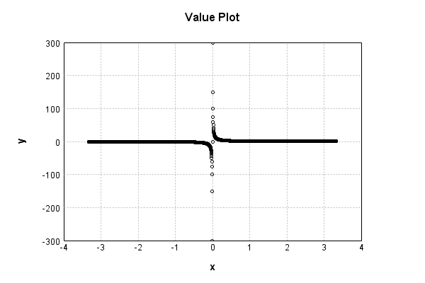
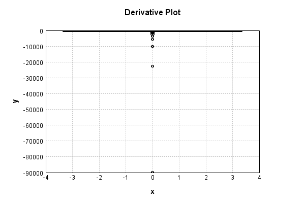

# NthPowerActivationLayer
## InvPowerTest
### Json Serialization
Code from [LayerTestBase.java:84](../../../../../../../../../MindsEye/src/test/java/com/simiacryptus/mindseye/layers/LayerTestBase.java#L84) executed in 0.00 seconds: 
```java
    JsonObject json = layer.getJson();
    NNLayer echo = NNLayer.fromJson(json);
    assert (echo != null) : "Failed to deserialize";
    assert (layer != echo) : "Serialization did not copy";
    Assert.assertEquals("Serialization not equal", layer, echo);
    return new GsonBuilder().setPrettyPrinting().create().toJson(json);
```

Returns: 

```
    {
      "class": "com.simiacryptus.mindseye.layers.java.NthPowerActivationLayer",
      "id": "ff6064d4-4ed4-46f2-9d30-740100000076",
      "isFrozen": false,
      "name": "NthPowerActivationLayer/ff6064d4-4ed4-46f2-9d30-740100000076",
      "power": -1.0
    }
```


### Example Input/Output Pair
Code from [LayerTestBase.java:121](../../../../../../../../../MindsEye/src/test/java/com/simiacryptus/mindseye/layers/LayerTestBase.java#L121) executed in 0.00 seconds: 
```java
    SimpleEval eval = SimpleEval.run(layer, inputPrototype);
    return String.format("--------------------\nInput: \n[%s]\n--------------------\nOutput: \n%s",
      Arrays.stream(inputPrototype).map(t->t.prettyPrint()).reduce((a,b)->a+",\n"+b).get(),
      eval.getOutput().prettyPrint());
```

Returns: 

```
    --------------------
    Input: 
    [[ 0.876, 0.74, 1.96 ]]
    --------------------
    Output: 
    [ 1.1415525114155252, 1.3513513513513513, 0.5102040816326531 ]
```


### Differential Validation
Code from [LayerTestBase.java:139](../../../../../../../../../MindsEye/src/test/java/com/simiacryptus/mindseye/layers/LayerTestBase.java#L139) executed in 0.00 seconds: 
```java
    getDerivativeTester().test(layer, inputPrototype);
```
Logging: 
```
    Feedback for input 0
    Inputs: [ 0.876, 0.74, 1.96 ]
    Output: [ 1.1415525114155252, 1.3513513513513513, 0.5102040816326531 ]
    Measured: [ [ -1.3029933927821702, 0.0, 0.0 ], [ 0.0, -1.8259037310519588, 0.0 ], [ 0.0, 0.0, -0.2602949245611441 ] ]
    Implemented: [ [ -1.3031421363190927, 0.0, 0.0 ], [ 0.0, -1.8261504747991235, 0.0 ], [ 0.0, 0.0, -0.2603082049146189 ] ]
    Error: [ [ 1.487435369225132E-4, 0.0, 0.0 ], [ 0.0, 2.467437471647127E-4, 0.0 ], [ 0.0, 0.0, 1.3280353474809381E-5 ] ]
    Finite-Difference Derivative Accuracy:
    absoluteTol: 4.5419e-05 +- 8.4733e-05 [0.0000e+00 - 2.4674e-04] (9#)
    relativeTol: 5.0049e-05 +- 1.7873e-05 [2.5510e-05 - 6.7563e-05] (3#)
    
```

### Performance
Code from [LayerTestBase.java:144](../../../../../../../../../MindsEye/src/test/java/com/simiacryptus/mindseye/layers/LayerTestBase.java#L144) executed in 0.02 seconds: 
```java
    getPerformanceTester().test(layer, inputPrototype);
```
Logging: 
```
    Evaluation performance: 0.5956 +- 0.7210 [0.3847 - 7.4294]
    Learning performance: 0.0180 +- 0.0135 [0.0114 - 0.1339]
    
```

### Function Plots
Code from [ActivationLayerTestBase.java:73](../../../../../../../../../MindsEye/src/test/java/com/simiacryptus/mindseye/layers/java/ActivationLayerTestBase.java#L73) executed in 0.13 seconds: 
```java
    return plot("Value Plot", plotData, x -> new double[]{x[0], x[1]});
```

Returns: 




Code from [ActivationLayerTestBase.java:77](../../../../../../../../../MindsEye/src/test/java/com/simiacryptus/mindseye/layers/java/ActivationLayerTestBase.java#L77) executed in 0.01 seconds: 
```java
    return plot("Derivative Plot", plotData, x -> new double[]{x[0], x[2]});
```

Returns: 




