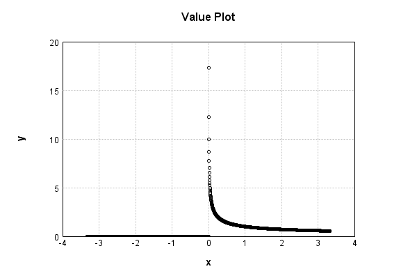

# NthPowerActivationLayer
## InvSqrtPowerTest
### Json Serialization
Code from [StandardLayerTests.java:68](../../../../../../../../src/main/java/com/simiacryptus/mindseye/test/StandardLayerTests.java#L68) executed in 0.00 seconds: 
```java
    JsonObject json = layer.getJson();
    NNLayer echo = NNLayer.fromJson(json);
    if ((echo == null)) throw new AssertionError("Failed to deserialize");
    if ((layer == echo)) throw new AssertionError("Serialization did not copy");
    if ((!layer.equals(echo))) throw new AssertionError("Serialization not equal");
    return new GsonBuilder().setPrettyPrinting().create().toJson(json);
```

Returns: 

```
    {
      "class": "com.simiacryptus.mindseye.layers.java.NthPowerActivationLayer",
      "id": "802eedf7-c709-48c1-a7d8-33ac3072b352",
      "isFrozen": false,
      "name": "NthPowerActivationLayer/802eedf7-c709-48c1-a7d8-33ac3072b352",
      "power": -0.5
    }
```


### Example Input/Output Pair
Code from [StandardLayerTests.java:152](../../../../../../../../src/main/java/com/simiacryptus/mindseye/test/StandardLayerTests.java#L152) executed in 0.00 seconds: 
```java
    SimpleEval eval = SimpleEval.run(layer, inputPrototype);
    return String.format("--------------------\nInput: \n[%s]\n--------------------\nOutput: \n%s\n--------------------\nDerivative: \n%s",
      Arrays.stream(inputPrototype).map(t -> t.prettyPrint()).reduce((a, b) -> a + ",\n" + b).get(),
      eval.getOutput().prettyPrint(),
      Arrays.stream(eval.getDerivative()).map(t -> t.prettyPrint()).reduce((a, b) -> a + ",\n" + b).get());
```

Returns: 

```
    --------------------
    Input: 
    [[
    	[ [ -1.344 ], [ -1.408 ], [ -1.112 ] ],
    	[ [ -1.484 ], [ -0.38 ], [ -0.288 ] ]
    ]]
    --------------------
    Output: 
    [
    	[ [ 0.0 ], [ 0.0 ], [ 0.0 ] ],
    	[ [ 0.0 ], [ 0.0 ], [ 0.0 ] ]
    ]
    --------------------
    Derivative: 
    [
    	[ [ 0.0 ], [ 0.0 ], [ 0.0 ] ],
    	[ [ 0.0 ], [ 0.0 ], [ 0.0 ] ]
    ]
```


### Batch Execution
Code from [StandardLayerTests.java:101](../../../../../../../../src/main/java/com/simiacryptus/mindseye/test/StandardLayerTests.java#L101) executed in 0.00 seconds: 
```java
    return getBatchingTester().test(layer, inputPrototype);
```

Returns: 

```
    ToleranceStatistics{absoluteTol=0.0000e+00 +- 0.0000e+00 [0.0000e+00 - 0.0000e+00] (120#), relativeTol=0.0000e+00 +- 0.0000e+00 [0.0000e+00 - 0.0000e+00] (56#)}
```


### Differential Validation
Code from [StandardLayerTests.java:109](../../../../../../../../src/main/java/com/simiacryptus/mindseye/test/StandardLayerTests.java#L109) executed in 0.00 seconds: 
```java
    return getDerivativeTester().test(layer, inputPrototype);
```
Logging: 
```
    Inputs: [
    	[ [ -1.184 ], [ -0.92 ], [ -0.96 ] ],
    	[ [ 0.304 ], [ -1.616 ], [ -1.576 ] ]
    ]
    Inputs Statistics: {meanExponent=-0.015286347337852951, negative=5, min=-1.576, max=-1.576, mean=-0.992, count=6.0, positive=1, stdDev=0.6394164005820725, zeros=0}
    Output: [
    	[ [ 0.0 ], [ 0.0 ], [ 0.0 ] ],
    	[ [ 1.8136906252750291 ], [ 0.0 ], [ 0.0 ] ]
    ]
    Outputs Statistics: {meanExponent=0.2585632081956231, negative=0, min=0.0, max=0.0, mean=0.3022817708791715, count=6.0, positive=1, stdDev=0.6759225880448438, zeros=5}
    Feedback for input 0
    Inputs Values: [
    	[ [ -1.184 ], [ -0.92 ], [ -0.96 ] ],
    	[ [ 0.304 ], [ -1.616 ], [ -1.576 ] ]
    ]
    Value Statistics: {meanExponent=-0.015286347337852951, negative=5, min=-1.576, max=-1.576, mean=-0.992, count=6.0, positive=1, stdDev=0.6394164005820725, zeros=0}
    Implemented Feedback: [ [ 0.0, 0.0, 0.0, 0.0, 0.0, 0.0 ], [ 0.0, -2.983043791570772, 0.0, 0.0, 0.0, 0.0 ], [ 0.0, 0.0, 0.0, 0.0, 0.0, 0.0 ], [ 0.0, 0.0, 0.0, 0.0, 0.0, 0.0 ], [ 0.0, 0.0, 0.0, 0.0, 0.0, 0.0 ], [ 0.0, 0.0, 0.0
```
...[skipping 188 bytes](etc/132.txt)...
```
    ros=35}
    Measured Feedback: [ [ 0.0, 0.0, 0.0, 0.0, 0.0, 0.0 ], [ 0.0, -2.9823080449475903, 0.0, 0.0, 0.0, 0.0 ], [ 0.0, 0.0, 0.0, 0.0, 0.0, 0.0 ], [ 0.0, 0.0, 0.0, 0.0, 0.0, 0.0 ], [ 0.0, 0.0, 0.0, 0.0, 0.0, 0.0 ], [ 0.0, 0.0, 0.0, 0.0, 0.0, 0.0 ] ]
    Measured Statistics: {meanExponent=0.4745525000530734, negative=1, min=0.0, max=0.0, mean=-0.08284189013743307, count=36.0, positive=0, stdDev=0.49009923143582723, zeros=35}
    Feedback Error: [ [ 0.0, 0.0, 0.0, 0.0, 0.0, 0.0 ], [ 0.0, 7.357466231816545E-4, 0.0, 0.0, 0.0, 0.0 ], [ 0.0, 0.0, 0.0, 0.0, 0.0, 0.0 ], [ 0.0, 0.0, 0.0, 0.0, 0.0, 0.0 ], [ 0.0, 0.0, 0.0, 0.0, 0.0, 0.0 ], [ 0.0, 0.0, 0.0, 0.0, 0.0, 0.0 ] ]
    Error Statistics: {meanExponent=-3.133271722482771, negative=0, min=0.0, max=0.0, mean=2.0437406199490403E-5, count=36.0, positive=1, stdDev=1.2090932563579993E-4, zeros=35}
    Finite-Difference Derivative Accuracy:
    absoluteTol: 2.0437e-05 +- 1.2091e-04 [0.0000e+00 - 7.3575e-04] (36#)
    relativeTol: 1.2334e-04 +- 0.0000e+00 [1.2334e-04 - 1.2334e-04] (1#)
    
```

Returns: 

```
    ToleranceStatistics{absoluteTol=2.0437e-05 +- 1.2091e-04 [0.0000e+00 - 7.3575e-04] (36#), relativeTol=1.2334e-04 +- 0.0000e+00 [1.2334e-04 - 1.2334e-04] (1#)}
```


### Performance
Code from [StandardLayerTests.java:119](../../../../../../../../src/main/java/com/simiacryptus/mindseye/test/StandardLayerTests.java#L119) executed in 0.26 seconds: 
```java
    getPerformanceTester().test(layer, permPrototype);
```
Logging: 
```
    100 batches
    Input Dimensions:
    	[100, 100, 1]
    Performance:
    	Evaluation performance: 0.024365s +- 0.016263s [0.015487s - 0.056881s]
    	Learning performance: 0.010632s +- 0.001290s [0.009834s - 0.013195s]
    
```

### Function Plots
Code from [ActivationLayerTestBase.java:110](../../../../../../../../src/test/java/com/simiacryptus/mindseye/layers/java/ActivationLayerTestBase.java#L110) executed in 0.00 seconds: 
```java
    return plot("Value Plot", plotData, x -> new double[]{x[0], x[1]});
```

Returns: 




Code from [ActivationLayerTestBase.java:114](../../../../../../../../src/test/java/com/simiacryptus/mindseye/layers/java/ActivationLayerTestBase.java#L114) executed in 0.00 seconds: 
```java
    return plot("Derivative Plot", plotData, x -> new double[]{x[0], x[2]});
```

Returns: 


