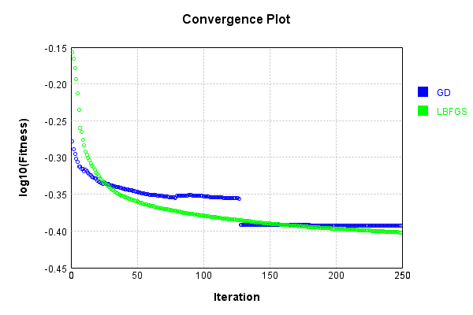
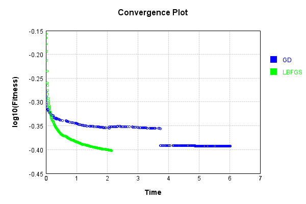

# NthPowerActivationLayer
## InvSqrtPowerTest
### Json Serialization
Code from [JsonTest.java:36](../../../../../../../../src/main/java/com/simiacryptus/mindseye/test/unit/JsonTest.java#L36) executed in 0.00 seconds: 
```java
    JsonObject json = layer.getJson();
    NNLayer echo = NNLayer.fromJson(json);
    if ((echo == null)) throw new AssertionError("Failed to deserialize");
    if ((layer == echo)) throw new AssertionError("Serialization did not copy");
    if ((!layer.equals(echo))) throw new AssertionError("Serialization not equal");
    return new GsonBuilder().setPrettyPrinting().create().toJson(json);
```

Returns: 

```
    {
      "class": "com.simiacryptus.mindseye.layers.java.NthPowerActivationLayer",
      "id": "8607a73b-c8c6-4660-bb87-d0d55b9a4f2e",
      "isFrozen": false,
      "name": "NthPowerActivationLayer/8607a73b-c8c6-4660-bb87-d0d55b9a4f2e",
      "power": -0.5
    }
```


### Example Input/Output Pair
Code from [ReferenceIO.java:68](../../../../../../../../src/main/java/com/simiacryptus/mindseye/test/unit/ReferenceIO.java#L68) executed in 0.00 seconds: 
```java
    SimpleEval eval = SimpleEval.run(layer, inputPrototype);
    return String.format("--------------------\nInput: \n[%s]\n--------------------\nOutput: \n%s\n--------------------\nDerivative: \n%s",
      Arrays.stream(inputPrototype).map(t -> t.prettyPrint()).reduce((a, b) -> a + ",\n" + b).get(),
      eval.getOutput().prettyPrint(),
      Arrays.stream(eval.getDerivative()).map(t -> t.prettyPrint()).reduce((a, b) -> a + ",\n" + b).get());
```

Returns: 

```
    --------------------
    Input: 
    [[
    	[ [ 0.54 ], [ 0.456 ], [ 1.272 ] ],
    	[ [ -0.44 ], [ 0.968 ], [ 1.184 ] ]
    ]]
    --------------------
    Output: 
    [
    	[ [ 1.3608276348795434 ], [ 1.4808721943977308 ], [ 0.8866586276648858 ] ],
    	[ [ 0.0 ], [ 1.016394535227177 ], [ 0.9190182776172597 ] ]
    ]
    --------------------
    Derivative: 
    [
    	[ [ -1.260025587851429 ], [ -1.6237633710501433 ], [ -0.3485293347739331 ] ],
    	[ [ 0.0 ], [ -0.5249971772867651 ], [ -0.38809893480458607 ] ]
    ]
```


### Batch Execution
Code from [BatchingTester.java:66](../../../../../../../../src/main/java/com/simiacryptus/mindseye/test/unit/BatchingTester.java#L66) executed in 0.00 seconds: 
```java
    return test(reference, inputPrototype);
```

Returns: 

```
    ToleranceStatistics{absoluteTol=0.0000e+00 +- 0.0000e+00 [0.0000e+00 - 0.0000e+00] (120#), relativeTol=0.0000e+00 +- 0.0000e+00 [0.0000e+00 - 0.0000e+00] (52#)}
```


Code from [SingleDerivativeTester.java:77](../../../../../../../../src/main/java/com/simiacryptus/mindseye/test/unit/SingleDerivativeTester.java#L77) executed in 0.00 seconds: 
```java
    return test(component, inputPrototype);
```
Logging: 
```
    Inputs: [
    	[ [ 1.068 ], [ -0.224 ], [ -0.404 ] ],
    	[ [ -1.648 ], [ -0.708 ], [ -1.672 ] ]
    ]
    Inputs Statistics: {meanExponent=-0.12076210428480516, negative=5, min=-1.672, max=-1.672, mean=-0.598, count=6.0, positive=1, stdDev=0.9328401077712444, zeros=0}
    Output: [
    	[ [ 0.9676412496452295 ], [ 0.0 ], [ 0.0 ] ],
    	[ [ 0.0 ], [ 0.0 ], [ 0.0 ] ]
    ]
    Outputs Statistics: {meanExponent=-0.014285626346268803, negative=0, min=0.0, max=0.0, mean=0.16127354160753823, count=6.0, positive=1, stdDev=0.3606186020065963, zeros=5}
    Feedback for input 0
    Inputs Values: [
    	[ [ 1.068 ], [ -0.224 ], [ -0.404 ] ],
    	[ [ -1.648 ], [ -0.708 ], [ -1.672 ] ]
    ]
    Value Statistics: {meanExponent=-0.12076210428480516, negative=5, min=-1.672, max=-1.672, mean=-0.598, count=6.0, positive=1, stdDev=0.9328401077712444, zeros=0}
    Implemented Feedback: [ [ -0.45301556631330964, 0.0, 0.0, 0.0, 0.0, 0.0 ], [ 0.0, 0.0, 0.0, 0.0, 0.0, 0.0 ], [ 0.0, 0.0, 0.0, 0.0, 0.0, 0.0 ], [ 0.0, 0.0, 0.0, 0.0, 0.0, 0.0 ], [ 0.0, 0.0, 0.0, 0.0, 0.0, 0.0 ], [ 0.0, 
```
...[skipping 199 bytes](etc/358.txt)...
```
    zeros=35}
    Measured Feedback: [ [ -0.4529837559053007, 0.0, 0.0, 0.0, 0.0, 0.0 ], [ 0.0, 0.0, 0.0, 0.0, 0.0, 0.0 ], [ 0.0, 0.0, 0.0, 0.0, 0.0, 0.0 ], [ 0.0, 0.0, 0.0, 0.0, 0.0, 0.0 ], [ 0.0, 0.0, 0.0, 0.0, 0.0, 0.0 ], [ 0.0, 0.0, 0.0, 0.0, 0.0, 0.0 ] ]
    Measured Statistics: {meanExponent=-0.343917371601256, negative=1, min=0.0, max=0.0, mean=-0.012582882108480575, count=36.0, positive=0, stdDev=0.07444133445510781, zeros=35}
    Feedback Error: [ [ 3.181040800892543E-5, 0.0, 0.0, 0.0, 0.0, 0.0 ], [ 0.0, 0.0, 0.0, 0.0, 0.0, 0.0 ], [ 0.0, 0.0, 0.0, 0.0, 0.0, 0.0 ], [ 0.0, 0.0, 0.0, 0.0, 0.0, 0.0 ], [ 0.0, 0.0, 0.0, 0.0, 0.0, 0.0 ], [ 0.0, 0.0, 0.0, 0.0, 0.0, 0.0 ] ]
    Error Statistics: {meanExponent=-4.497430760478035, negative=0, min=0.0, max=0.0, mean=8.83622444692373E-7, count=36.0, positive=1, stdDev=5.227580880937607E-6, zeros=35}
    Finite-Difference Derivative Accuracy:
    absoluteTol: 8.8362e-07 +- 5.2276e-06 [0.0000e+00 - 3.1810e-05] (36#)
    relativeTol: 3.5111e-05 +- 0.0000e+00 [3.5111e-05 - 3.5111e-05] (1#)
    
```

Returns: 

```
    ToleranceStatistics{absoluteTol=8.8362e-07 +- 5.2276e-06 [0.0000e+00 - 3.1810e-05] (36#), relativeTol=3.5111e-05 +- 0.0000e+00 [3.5111e-05 - 3.5111e-05] (1#)}
```


### Performance
Now we execute larger-scale runs to benchmark performance:

Code from [PerformanceTester.java:66](../../../../../../../../src/main/java/com/simiacryptus/mindseye/test/unit/PerformanceTester.java#L66) executed in 0.20 seconds: 
```java
    test(component, inputPrototype);
```
Logging: 
```
    100 batches
    Input Dimensions:
    	[100, 100, 1]
    Performance:
    	Evaluation performance: 0.018532s +- 0.018526s [0.008916s - 0.055575s]
    	Learning performance: 0.012218s +- 0.000182s [0.012023s - 0.012457s]
    
```

### Input Learning
In this test, we use a network to learn this target input, given it's pre-evaluated output:

Code from [LearningTester.java:127](../../../../../../../../src/main/java/com/simiacryptus/mindseye/test/unit/LearningTester.java#L127) executed in 0.00 seconds: 
```java
    return Arrays.stream(input_target).map(x -> x.prettyPrint()).reduce((a, b) -> a + "\n" + b).orElse("");
```

Returns: 

```
    [
    	[ [ -0.436 ], [ -0.268 ], [ -1.54 ], [ -0.8 ], [ -1.416 ], [ -1.444 ], [ -1.976 ], [ 1.26 ], ... ],
    	[ [ 1.456 ], [ -0.216 ], [ -0.2 ], [ -1.068 ], [ 1.88 ], [ -1.304 ], [ 0.808 ], [ 1.556 ], ... ],
    	[ [ -0.828 ], [ 0.756 ], [ -0.976 ], [ 0.304 ], [ -0.508 ], [ -0.876 ], [ 0.68 ], [ 1.32 ], ... ],
    	[ [ -1.16 ], [ 1.428 ], [ -1.428 ], [ -1.06 ], [ 0.68 ], [ 0.784 ], [ 1.192 ], [ 1.816 ], ... ],
    	[ [ 1.84 ], [ 1.268 ], [ 0.984 ], [ 0.54 ], [ -1.404 ], [ -1.736 ], [ -0.756 ], [ -1.676 ], ... ],
    	[ [ -1.504 ], [ 1.036 ], [ -1.572 ], [ -0.536 ], [ -0.816 ], [ -1.236 ], [ 1.724 ], [ 0.996 ], ... ],
    	[ [ -0.208 ], [ 0.704 ], [ 0.468 ], [ -0.744 ], [ 1.532 ], [ -1.636 ], [ 0.488 ], [ -1.748 ], ... ],
    	[ [ 1.968 ], [ -0.868 ], [ 1.596 ], [ 1.088 ], [ 0.228 ], [ 0.648 ], [ -1.936 ], [ -0.984 ], ... ],
    	...
    ]
```


First, we use a conjugate gradient descent method, which converges the fastest for purely linear functions.

Code from [LearningTester.java:300](../../../../../../../../src/main/java/com/simiacryptus/mindseye/test/unit/LearningTester.java#L300) executed in 6.09 seconds: 
```java
    return new IterativeTrainer(trainable)
      .setLineSearchFactory(label -> new QuadraticSearch())
      .setOrientation(new GradientDescent())
      .setMonitor(monitor)
      .setTimeout(30, TimeUnit.SECONDS)
      .setMaxIterations(250)
      .setTerminateThreshold(0)
      .run();
```
Logging: 
```
    Constructing line search parameters: GD
    F(0.0) = LineSearchPoint{point=PointSample{avg=0.7048040852882952}, derivative=-7.121308778244463E-4}
    New Minimum: 0.7048040852882952 > 0.7048040852882239
    F(1.0E-10) = LineSearchPoint{point=PointSample{avg=0.7048040852882239}, derivative=-7.121308778236128E-4}, delta = -7.127631818093505E-14
    New Minimum: 0.7048040852882239 > 0.7048040852877966
    F(7.000000000000001E-10) = LineSearchPoint{point=PointSample{avg=0.7048040852877966}, derivative=-7.121308778186114E-4}, delta = -4.986011603591578E-13
    New Minimum: 0.7048040852877966 > 0.7048040852848059
    F(4.900000000000001E-9) = LineSearchPoint{point=PointSample{avg=0.7048040852848059}, derivative=-7.121308777836017E-4}, delta = -3.4893199440944045E-12
    New Minimum: 0.7048040852848059 > 0.7048040852638675
    F(3.430000000000001E-8) = LineSearchPoint{point=PointSample{avg=0.7048040852638675}, derivative=-7.121308775385341E-4}, delta = -2.4427682099315007E-11
    New Minimum: 0.7048040852638675 > 0.7048040851173084
    F(2.40100000
```
...[skipping 451306 bytes](etc/359.txt)...
```
    2.8400; Orientation: 0.0003; Line Search: 0.0184
    F(0.0) = LineSearchPoint{point=PointSample{avg=0.40490156164547286}, derivative=-7.1967404386155156E-9}
    New Minimum: 0.40490156164547286 > 0.4048991953564862
    F(1926.4369624670785) = LineSearchPoint{point=PointSample{avg=0.4048991953564862}, derivative=4.38519823725201E-9}, delta = -2.3662889866438164E-6
    0.4048991953564862 <= 0.40490156164547286
    New Minimum: 0.4048991953564862 > 0.4048975674018915
    F(1197.0419787421297) = LineSearchPoint{point=PointSample{avg=0.4048975674018915}, derivative=1.6032542030542126E-10}, delta = -3.994243581384449E-6
    Right bracket at 1197.0419787421297
    New Minimum: 0.4048975674018915 > 0.4048975651123233
    F(1170.9560007115874) = LineSearchPoint{point=PointSample{avg=0.4048975651123233}, derivative=1.5216809614341493E-11}, delta = -3.996533149586146E-6
    Right bracket at 1170.9560007115874
    Converged to right
    Iteration 250 complete. Error: 0.4048975651123233 Total: 249827192984044.8000; Orientation: 0.0003; Line Search: 0.0098
    
```

Returns: 

```
    0.4048975651123233
```


This training run resulted in the following regressed input:

Code from [LearningTester.java:144](../../../../../../../../src/main/java/com/simiacryptus/mindseye/test/unit/LearningTester.java#L144) executed in 0.05 seconds: 
```java
    return Arrays.stream(input_gd).map(x -> x.prettyPrint()).reduce((a, b) -> a + "\n" + b).orElse("");
```

Returns: 

```
    [
    	[ [ -0.848 ], [ 130.9675052250084 ], [ -0.732 ], [ 127.72681938331388 ], [ 130.73648276982559 ], [ -1.236 ], [ 130.99557275059624 ], [ -0.488 ], ... ],
    	[ [ 1.454610015632811 ], [ -1.076 ], [ -1.984 ], [ 130.00710421973506 ], [ 4.457667422140435 ], [ -1.66 ], [ 0.808 ], [ -0.808 ], ... ],
    	[ [ 131.16868410332552 ], [ 0.7559999999999998 ], [ 131.17754732612931 ], [ -127.78125325955517 ], [ -0.4 ], [ 131.01105424694325 ], [ -1.916 ], [ -1.404 ], ... ],
    	[ [ -0.52 ], [ -1.44 ], [ -1.172 ], [ 128.92236314483162 ], [ 0.68 ], [ -1.648 ], [ -0.512 ], [ -1.384 ], ... ],
    	[ [ -1.34 ], [ 1.2691749308795237 ], [ -0.288 ], [ -0.252 ], [ 131.0948825921174 ], [ 130.95697231004303 ], [ 131.16991626541656 ], [ 131.005964525546 ], ... ],
    	[ [ 130.7601158154422 ], [ 1.0360000034672385 ], [ -1.808 ], [ 131.14845193481574 ], [ 128.5558456137099 ], [ 126.26522706883992 ], [ 2.130047091685106 ], [ 0.9960000000192247 ], ... ],
    	[ [ -0.264 ], [ 0.704 ], [ 0.468 ], [ -1.152 ], [ -0.456 ], [ 130.86181045950926 ], [ -0.36 ], [ -1.944 ], ... ],
    	[ [ -0.572 ], [ 131.17230814096575 ], [ -0.968 ], [ -0.616 ], [ -1.448 ], [ -1.072 ], [ -1.452 ], [ -0.208 ], ... ],
    	...
    ]
```


Next, we run the same optimization using L-BFGS, which is nearly ideal for purely second-order or quadratic functions.

Code from [LearningTester.java:324](../../../../../../../../src/main/java/com/simiacryptus/mindseye/test/unit/LearningTester.java#L324) executed in 2.16 seconds: 
```java
    return new IterativeTrainer(trainable)
      .setLineSearchFactory(label -> new ArmijoWolfeSearch())
      .setOrientation(new LBFGS())
      .setMonitor(monitor)
      .setTimeout(30, TimeUnit.SECONDS)
      .setMaxIterations(250)
      .setTerminateThreshold(0)
      .run();
```
Logging: 
```
    LBFGS Accumulation History: 1 points
    Constructing line search parameters: GD
    th(0)=0.7048040852882952;dx=-7.121308778244463E-4
    New Minimum: 0.7048040852882952 > 0.7032888768694027
    WOLFE (weak): th(2.154434690031884)=0.7032888768694027; dx=-6.946071947455877E-4 delta=0.0015152084188925219
    New Minimum: 0.7032888768694027 > 0.7018105188976065
    WOLFE (weak): th(4.308869380063768)=0.7018105188976065; dx=-6.779118420370968E-4 delta=0.0029935663906887067
    New Minimum: 0.7018105188976065 > 0.696232882748109
    END: th(12.926608140191302)=0.696232882748109; dx=-6.183336214340687E-4 delta=0.008571202540186174
    Iteration 1 complete. Error: 0.696232882748109 Total: 249827262011224.7500; Orientation: 0.0006; Line Search: 0.0131
    LBFGS Accumulation History: 1 points
    th(0)=0.696232882748109;dx=-5.403880642415906E-4
    New Minimum: 0.696232882748109 > 0.6826824934885423
    END: th(27.849533001676672)=0.6826824934885423; dx=-4.393301725045482E-4 delta=0.013550389259566753
    Iteration 2 complete. Error: 0.6826824934885423 Total
```
...[skipping 117191 bytes](etc/360.txt)...
```
    1836324534; dx=2.1892118656284158E-7 delta=7.684510119093657E-5
    END: th(199.19957442113127)=0.3964483873996518; dx=-2.234736334980755E-7 delta=5.1476064784450326E-5
    Iteration 248 complete. Error: 0.39642301836324534 Total: 249829395963035.6200; Orientation: 0.0005; Line Search: 0.0076
    LBFGS Accumulation History: 1 points
    th(0)=0.3964483873996518;dx=-2.0342284884770077E-7
    New Minimum: 0.3964483873996518 > 0.3963740822842752
    END: th(429.16247337247313)=0.3963740822842752; dx=-1.2574413390772076E-7 delta=7.430511537664941E-5
    Iteration 249 complete. Error: 0.3963740822842752 Total: 249829401649778.6000; Orientation: 0.0005; Line Search: 0.0038
    LBFGS Accumulation History: 1 points
    th(0)=0.3963740822842752;dx=-2.612175547641179E-7
    New Minimum: 0.3963740822842752 > 0.39627046704304464
    END: th(924.6025202935407)=0.39627046704304464; dx=-7.600830979872536E-8 delta=1.0361524123053689E-4
    Iteration 250 complete. Error: 0.39627046704304464 Total: 249829407489556.6000; Orientation: 0.0005; Line Search: 0.0040
    
```

Returns: 

```
    0.39627046704304464
```


This training run resulted in the following regressed input:

Code from [LearningTester.java:154](../../../../../../../../src/main/java/com/simiacryptus/mindseye/test/unit/LearningTester.java#L154) executed in 0.00 seconds: 
```java
    return Arrays.stream(input_lbgfs).map(x -> x.prettyPrint()).reduce((a, b) -> a + "\n" + b).orElse("");
```

Returns: 

```
    [
    	[ [ -0.848 ], [ 3.421905256853059 ], [ -0.732 ], [ 3.5936542114238197 ], [ 3.421207184888171 ], [ -1.236 ], [ 3.4404479925553813 ], [ -0.488 ], ... ],
    	[ [ 1.4391914749409531 ], [ -1.076 ], [ -1.984 ], [ 3.48983587987174 ], [ 1.7224724917407062 ], [ -1.66 ], [ 0.8080003341960431 ], [ -0.808 ], ... ],
    	[ [ 3.4285622508775035 ], [ 0.7560083740516811 ], [ 3.426808546620686 ], [ 0.30400000000000005 ], [ -0.4 ], [ 3.439563563450704 ], [ -1.916 ], [ -1.404 ], ... ],
    	[ [ -0.52 ], [ -1.44 ], [ -1.172 ], [ 3.540032180558999 ], [ 0.6799999999816648 ], [ -1.648 ], [ -0.512 ], [ -1.384 ], ... ],
    	[ [ -1.34 ], [ 1.3096763382091958 ], [ -0.288 ], [ -0.252 ], [ 3.422923193823847 ], [ 3.44260807425571 ], [ 3.425063272512859 ], [ 3.439855645475737 ], ... ],
    	[ [ 3.4212533316666778 ], [ 1.0355233300792612 ], [ -1.808 ], [ 3.43058637079777 ], [ 3.5566151910679418 ], [ 3.4201159735470843 ], [ 1.614804621930551 ], [ 0.9957896675955857 ], ... ],
    	[ [ -0.264 ], [ 0.7039999997505971 ], [ 0.468 ], [ -1.152 ], [ -0.456 ], [ 3.4215023272970124 ], [ -0.36 ], [ -1.944 ], ... ],
    	[ [ -0.572 ], [ 3.4280577831923544 ], [ -0.968 ], [ -0.616 ], [ -1.448 ], [ -1.072 ], [ -1.452 ], [ -0.208 ], ... ],
    	...
    ]
```


Code from [LearningTester.java:96](../../../../../../../../src/main/java/com/simiacryptus/mindseye/test/unit/LearningTester.java#L96) executed in 0.01 seconds: 
```java
    return TestUtil.compare(runs);
```

Returns: 




Code from [LearningTester.java:99](../../../../../../../../src/main/java/com/simiacryptus/mindseye/test/unit/LearningTester.java#L99) executed in 0.00 seconds: 
```java
    return TestUtil.compareTime(runs);
```

Returns: 




### Function Plots
Code from [ActivationLayerTestBase.java:110](../../../../../../../../src/test/java/com/simiacryptus/mindseye/layers/java/ActivationLayerTestBase.java#L110) executed in 0.00 seconds: 
```java
    return plot("Value Plot", plotData, x -> new double[]{x[0], x[1]});
```

Returns: 


Code from [ActivationLayerTestBase.java:114](../../../../../../../../src/test/java/com/simiacryptus/mindseye/layers/java/ActivationLayerTestBase.java#L114) executed in 0.00 seconds: 
```java
    return plot("Derivative Plot", plotData, x -> new double[]{x[0], x[2]});
```

Returns: 


