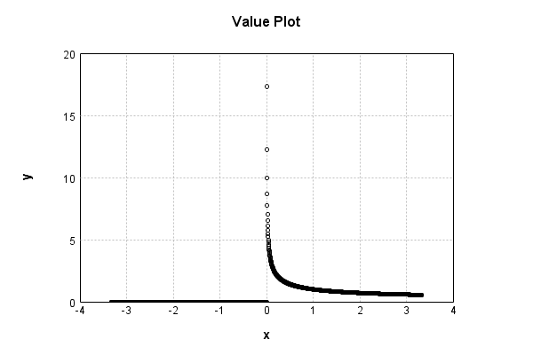
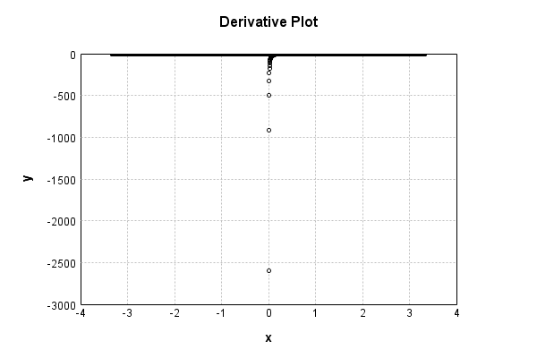

# NthPowerActivationLayer
## InvSqrtPowerTest
### Json Serialization
Code from [StandardLayerTests.java:69](../../../../../../../../src/main/java/com/simiacryptus/mindseye/test/StandardLayerTests.java#L69) executed in 0.00 seconds: 
```java
    JsonObject json = layer.getJson();
    NNLayer echo = NNLayer.fromJson(json);
    if ((echo == null)) throw new AssertionError("Failed to deserialize");
    if ((layer == echo)) throw new AssertionError("Serialization did not copy");
    if ((!layer.equals(echo))) throw new AssertionError("Serialization not equal");
    return new GsonBuilder().setPrettyPrinting().create().toJson(json);
```

Returns: 

```
    {
      "class": "com.simiacryptus.mindseye.layers.java.NthPowerActivationLayer",
      "id": "773568be-db9f-4e3f-a7bd-7873aa0ad405",
      "isFrozen": false,
      "name": "NthPowerActivationLayer/773568be-db9f-4e3f-a7bd-7873aa0ad405",
      "power": -0.5
    }
```


### Example Input/Output Pair
Code from [StandardLayerTests.java:153](../../../../../../../../src/main/java/com/simiacryptus/mindseye/test/StandardLayerTests.java#L153) executed in 0.00 seconds: 
```java
    SimpleEval eval = SimpleEval.run(layer, inputPrototype);
    return String.format("--------------------\nInput: \n[%s]\n--------------------\nOutput: \n%s\n--------------------\nDerivative: \n%s",
      Arrays.stream(inputPrototype).map(t -> t.prettyPrint()).reduce((a, b) -> a + ",\n" + b).get(),
      eval.getOutput().prettyPrint(),
      Arrays.stream(eval.getDerivative()).map(t -> t.prettyPrint()).reduce((a, b) -> a + ",\n" + b).get());
```

Returns: 

```
    --------------------
    Input: 
    [[
    	[ [ -0.44 ], [ -0.72 ], [ -1.86 ] ],
    	[ [ -1.488 ], [ -0.608 ], [ -1.92 ] ]
    ]]
    --------------------
    Output: 
    [
    	[ [ 0.0 ], [ 0.0 ], [ 0.0 ] ],
    	[ [ 0.0 ], [ 0.0 ], [ 0.0 ] ]
    ]
    --------------------
    Derivative: 
    [
    	[ [ 0.0 ], [ 0.0 ], [ 0.0 ] ],
    	[ [ 0.0 ], [ 0.0 ], [ 0.0 ] ]
    ]
```


### Batch Execution
Code from [StandardLayerTests.java:102](../../../../../../../../src/main/java/com/simiacryptus/mindseye/test/StandardLayerTests.java#L102) executed in 0.00 seconds: 
```java
    return getBatchingTester().test(layer, inputPrototype);
```

Returns: 

```
    ToleranceStatistics{absoluteTol=0.0000e+00 +- 0.0000e+00 [0.0000e+00 - 0.0000e+00] (120#), relativeTol=0.0000e+00 +- 0.0000e+00 [0.0000e+00 - 0.0000e+00] (68#)}
```


### Differential Validation
Code from [StandardLayerTests.java:110](../../../../../../../../src/main/java/com/simiacryptus/mindseye/test/StandardLayerTests.java#L110) executed in 0.00 seconds: 
```java
    return getDerivativeTester().test(layer, inputPrototype);
```
Logging: 
```
    Inputs: [
    	[ [ 1.34 ], [ 1.096 ], [ -1.936 ] ],
    	[ [ 1.776 ], [ 0.536 ], [ 1.52 ] ]
    ]
    Inputs Statistics: {meanExponent=0.10237867409427627, negative=1, min=1.52, max=1.52, mean=0.7219999999999999, count=6.0, positive=5, stdDev=1.2496052710089427, zeros=0}
    Output: [
    	[ [ 0.8638684255813601 ], [ 0.9552008998760876 ], [ 0.0 ] ],
    	[ [ 0.7503752814845802 ], [ 1.3658959117703826 ], [ 0.8111071056538127 ] ]
    ]
    Outputs Statistics: {meanExponent=-0.032736669159328276, negative=0, min=0.8111071056538127, max=0.8111071056538127, mean=0.7910746040610372, count=6.0, positive=5, stdDev=0.4063070846857003, zeros=1}
    Feedback for input 0
    Inputs Values: [
    	[ [ 1.34 ], [ 1.096 ], [ -1.936 ] ],
    	[ [ 1.776 ], [ 0.536 ], [ 1.52 ] ]
    ]
    Value Statistics: {meanExponent=0.10237867409427627, negative=1, min=1.52, max=1.52, mean=0.7219999999999999, count=6.0, positive=5, stdDev=1.2496052710089427, zeros=0}
    Implemented Feedback: [ [ -0.3223389647691642, 0.0, 0.0, 0.0, 0.0, 0.0 ], [ 0.0, -0.21125430221975794, 0.0, 0.0, 0.0, 0.0 ], [ 
```
...[skipping 588 bytes](etc/90.txt)...
```
    739783749871059, 0.0, 0.0 ], [ 0.0, 0.0, 0.0, 0.0, 0.0, 0.0 ], [ 0.0, 0.0, 0.0, 0.0, 0.0, -0.2667983835913379 ] ]
    Measured Statistics: {meanExponent=-0.3992709143724792, negative=5, min=-0.2667983835913379, max=-0.2667983835913379, mean=-0.06972444669104158, count=36.0, positive=0, stdDev=0.2271545282650283, zeros=31}
    Feedback Error: [ [ 1.8040237392658032E-5, 0.0, 0.0, 0.0, 0.0, 0.0 ], [ 0.0, 8.920793507449787E-6, 0.0, 0.0, 0.0, 0.0 ], [ 0.0, 0.0, 2.981754404518533E-5, 0.0, 0.0, 0.0 ], [ 0.0, 0.0, 0.0, 1.7825912705693447E-4, 0.0, 0.0 ], [ 0.0, 0.0, 0.0, 0.0, 0.0, 0.0 ], [ 0.0, 0.0, 0.0, 0.0, 0.0, 1.3164321100489484E-5 ] ]
    Error Statistics: {meanExponent=-4.58968643065926, negative=0, min=1.3164321100489484E-5, max=1.3164321100489484E-5, mean=6.894500641742142E-6, count=36.0, positive=5, stdDev=2.9595656295611234E-5, zeros=31}
    Finite-Difference Derivative Accuracy:
    absoluteTol: 6.8945e-06 +- 2.9596e-05 [0.0000e+00 - 1.7826e-04] (36#)
    relativeTol: 3.5588e-05 +- 1.7718e-05 [2.1114e-05 - 6.9957e-05] (5#)
    
```

Returns: 

```
    ToleranceStatistics{absoluteTol=6.8945e-06 +- 2.9596e-05 [0.0000e+00 - 1.7826e-04] (36#), relativeTol=3.5588e-05 +- 1.7718e-05 [2.1114e-05 - 6.9957e-05] (5#)}
```


### Performance
Code from [StandardLayerTests.java:120](../../../../../../../../src/main/java/com/simiacryptus/mindseye/test/StandardLayerTests.java#L120) executed in 0.00 seconds: 
```java
    getPerformanceTester().test(layer, permPrototype);
```
Logging: 
```
    Evaluation performance: 0.000203s +- 0.000012s [0.000190s - 0.000224s]
    Learning performance: 0.000043s +- 0.000004s [0.000038s - 0.000048s]
    
```

### Function Plots
Code from [ActivationLayerTestBase.java:103](../../../../../../../../src/test/java/com/simiacryptus/mindseye/layers/java/ActivationLayerTestBase.java#L103) executed in 0.00 seconds: 
```java
    return plot("Value Plot", plotData, x -> new double[]{x[0], x[1]});
```

Returns: 




Code from [ActivationLayerTestBase.java:107](../../../../../../../../src/test/java/com/simiacryptus/mindseye/layers/java/ActivationLayerTestBase.java#L107) executed in 0.00 seconds: 
```java
    return plot("Derivative Plot", plotData, x -> new double[]{x[0], x[2]});
```

Returns: 




