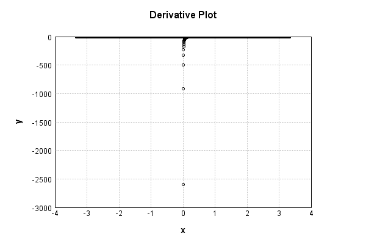

# NthPowerActivationLayer
## InvSqrtPowerTest
### Json Serialization
Code from [LayerTestBase.java:84](../../../../../../../../../MindsEye/src/test/java/com/simiacryptus/mindseye/layers/LayerTestBase.java#L84) executed in 0.00 seconds: 
```java
    JsonObject json = layer.getJson();
    NNLayer echo = NNLayer.fromJson(json);
    assert (echo != null) : "Failed to deserialize";
    assert (layer != echo) : "Serialization did not copy";
    Assert.assertEquals("Serialization not equal", layer, echo);
    return new GsonBuilder().setPrettyPrinting().create().toJson(json);
```

Returns: 

```
    {
      "class": "com.simiacryptus.mindseye.layers.java.NthPowerActivationLayer",
      "id": "0910987d-3688-428c-a892-e2c400000e78",
      "isFrozen": false,
      "name": "NthPowerActivationLayer/0910987d-3688-428c-a892-e2c400000e78",
      "power": -0.5
    }
```


### Example Input/Output Pair
Code from [LayerTestBase.java:121](../../../../../../../../../MindsEye/src/test/java/com/simiacryptus/mindseye/layers/LayerTestBase.java#L121) executed in 0.00 seconds: 
```java
    SimpleEval eval = SimpleEval.run(layer, inputPrototype);
    return String.format("--------------------\nInput: \n[%s]\n--------------------\nOutput: \n%s",
      Arrays.stream(inputPrototype).map(t->t.prettyPrint()).reduce((a,b)->a+",\n"+b).get(),
      eval.getOutput().prettyPrint());
```

Returns: 

```
    --------------------
    Input: 
    [[ -0.376, -1.204, 0.856 ]]
    --------------------
    Output: 
    [ 0.0, 0.0, 1.0808442529177924 ]
```


### Differential Validation
Code from [LayerTestBase.java:139](../../../../../../../../../MindsEye/src/test/java/com/simiacryptus/mindseye/layers/LayerTestBase.java#L139) executed in 0.00 seconds: 
```java
    getDerivativeTester().test(layer, inputPrototype);
```
Logging: 
```
    Finite-Difference Derivative Accuracy:
    absoluteTol: 6.1461e-07 +- 1.7384e-06 [0.0000e+00 - 5.5315e-06] (9#)
    relativeTol: 4.3808e-06 +- 0.0000e+00 [4.3808e-06 - 4.3808e-06] (1#)
    
```

### Performance
Code from [LayerTestBase.java:144](../../../../../../../../../MindsEye/src/test/java/com/simiacryptus/mindseye/layers/LayerTestBase.java#L144) executed in 0.00 seconds: 
```java
    getPerformanceTester().test(layer, inputPrototype);
```
Logging: 
```
    Evaluation performance: 0.0172 +- 0.0188 [0.0114 - 0.1995]
    Learning performance: 0.0008 +- 0.0046 [0.0000 - 0.0456]
    
```

### Function Plots
Code from [ActivationLayerTestBase.java:73](../../../../../../../../../MindsEye/src/test/java/com/simiacryptus/mindseye/layers/java/ActivationLayerTestBase.java#L73) executed in 0.00 seconds: 
```java
    return plot("Value Plot", plotData, x -> new double[]{x[0], x[1]});
```

Returns: 


Code from [ActivationLayerTestBase.java:77](../../../../../../../../../MindsEye/src/test/java/com/simiacryptus/mindseye/layers/java/ActivationLayerTestBase.java#L77) executed in 0.00 seconds: 
```java
    return plot("Derivative Plot", plotData, x -> new double[]{x[0], x[2]});
```

Returns: 




