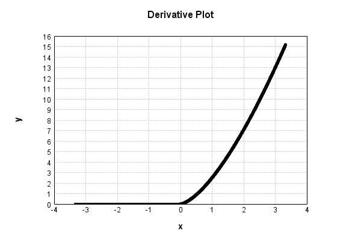

# NthPowerActivationLayer
## NthPowerTest
### Json Serialization
Code from [StandardLayerTests.java:68](../../../../../../../../src/main/java/com/simiacryptus/mindseye/test/StandardLayerTests.java#L68) executed in 0.00 seconds: 
```java
    JsonObject json = layer.getJson();
    NNLayer echo = NNLayer.fromJson(json);
    if ((echo == null)) throw new AssertionError("Failed to deserialize");
    if ((layer == echo)) throw new AssertionError("Serialization did not copy");
    if ((!layer.equals(echo))) throw new AssertionError("Serialization not equal");
    return new GsonBuilder().setPrettyPrinting().create().toJson(json);
```

Returns: 

```
    {
      "class": "com.simiacryptus.mindseye.layers.java.NthPowerActivationLayer",
      "id": "e5896bdd-a477-4c23-8981-b75a1243c3f1",
      "isFrozen": false,
      "name": "NthPowerActivationLayer/e5896bdd-a477-4c23-8981-b75a1243c3f1",
      "power": 2.5
    }
```


### Example Input/Output Pair
Code from [StandardLayerTests.java:152](../../../../../../../../src/main/java/com/simiacryptus/mindseye/test/StandardLayerTests.java#L152) executed in 0.00 seconds: 
```java
    SimpleEval eval = SimpleEval.run(layer, inputPrototype);
    return String.format("--------------------\nInput: \n[%s]\n--------------------\nOutput: \n%s\n--------------------\nDerivative: \n%s",
      Arrays.stream(inputPrototype).map(t -> t.prettyPrint()).reduce((a, b) -> a + ",\n" + b).get(),
      eval.getOutput().prettyPrint(),
      Arrays.stream(eval.getDerivative()).map(t -> t.prettyPrint()).reduce((a, b) -> a + ",\n" + b).get());
```

Returns: 

```
    --------------------
    Input: 
    [[
    	[ [ 0.968 ], [ -1.952 ], [ 1.524 ] ],
    	[ [ 0.904 ], [ -0.44 ], [ 0.968 ] ]
    ]]
    --------------------
    Output: 
    [
    	[ [ 0.9219097186414557 ], [ 0.0 ], [ 2.8672292437617584 ] ],
    	[ [ 0.7770001026724669 ], [ 0.0 ], [ 0.9219097186414557 ] ]
    ]
    --------------------
    Derivative: 
    [
    	[ [ 2.380965182441776 ], [ 0.0 ], [ 4.703460045540942 ] ],
    	[ [ 2.148783469780052 ], [ 0.0 ], [ 2.380965182441776 ] ]
    ]
```


### Batch Execution
Code from [StandardLayerTests.java:101](../../../../../../../../src/main/java/com/simiacryptus/mindseye/test/StandardLayerTests.java#L101) executed in 0.00 seconds: 
```java
    return getBatchingTester().test(layer, inputPrototype);
```

Returns: 

```
    ToleranceStatistics{absoluteTol=0.0000e+00 +- 0.0000e+00 [0.0000e+00 - 0.0000e+00] (120#), relativeTol=0.0000e+00 +- 0.0000e+00 [0.0000e+00 - 0.0000e+00] (54#)}
```


### Differential Validation
Code from [StandardLayerTests.java:109](../../../../../../../../src/main/java/com/simiacryptus/mindseye/test/StandardLayerTests.java#L109) executed in 0.00 seconds: 
```java
    return getDerivativeTester().test(layer, inputPrototype);
```
Logging: 
```
    Inputs: [
    	[ [ -0.068 ], [ 1.572 ], [ 1.044 ] ],
    	[ [ -0.044 ], [ -0.656 ], [ -0.32 ] ]
    ]
    Inputs Statistics: {meanExponent=-0.4978052587903963, negative=4, min=-0.32, max=-0.32, mean=0.25466666666666665, count=6.0, positive=2, stdDev=0.7864779434641226, zeros=0}
    Output: [
    	[ [ 0.0 ], [ 3.0983562688686455 ], [ 1.1136564754879417 ] ],
    	[ [ 0.0 ], [ 0.0 ], [ 0.0 ] ]
    ]
    Outputs Statistics: {meanExponent=0.2689413004620406, negative=0, min=0.0, max=0.0, mean=0.7020021240594311, count=6.0, positive=2, stdDev=1.146240261400298, zeros=4}
    Feedback for input 0
    Inputs Values: [
    	[ [ -0.068 ], [ 1.572 ], [ 1.044 ] ],
    	[ [ -0.044 ], [ -0.656 ], [ -0.32 ] ]
    ]
    Value Statistics: {meanExponent=-0.4978052587903963, negative=4, min=-0.32, max=-0.32, mean=0.25466666666666665, count=6.0, positive=2, stdDev=0.7864779434641226, zeros=0}
    Implemented Feedback: [ [ 0.0, 0.0, 0.0, 0.0, 0.0, 0.0 ], [ 0.0, 0.0, 0.0, 0.0, 0.0, 0.0 ], [ 0.0, 0.0, 4.927411369065911, 0.0, 0.0, 0.0 ], [ 0.0, 0.0, 0.0, 0.0, 0.0, 0.0 ], [ 0.0, 0.0, 0.0, 0
```
...[skipping 260 bytes](etc/133.txt)...
```
     [ [ 0.0, 0.0, 0.0, 0.0, 0.0, 0.0 ], [ 0.0, 0.0, 0.0, 0.0, 0.0, 0.0 ], [ 0.0, 0.0, 4.927646457977275, 0.0, 0.0, 0.0 ], [ 0.0, 0.0, 0.0, 0.0, 0.0, 0.0 ], [ 0.0, 0.0, 0.0, 0.0, 2.6669934885581448, 0.0 ], [ 0.0, 0.0, 0.0, 0.0, 0.0, 0.0 ] ]
    Measured Statistics: {meanExponent=0.5593307482369424, negative=0, min=0.0, max=0.0, mean=0.210962220737095, count=36.0, positive=2, stdDev=0.9097064815704716, zeros=34}
    Feedback Error: [ [ 0.0, 0.0, 0.0, 0.0, 0.0, 0.0 ], [ 0.0, 0.0, 0.0, 0.0, 0.0, 0.0 ], [ 0.0, 0.0, 2.3508891136359011E-4, 0.0, 0.0, 0.0 ], [ 0.0, 0.0, 0.0, 0.0, 0.0, 0.0 ], [ 0.0, 0.0, 0.0, 0.0, 1.9158365407001554E-4, 0.0 ], [ 0.0, 0.0, 0.0, 0.0, 0.0, 0.0 ] ]
    Error Statistics: {meanExponent=-3.6732047014178537, negative=0, min=0.0, max=0.0, mean=1.1852015706489047E-5, count=36.0, positive=2, stdDev=4.91353467491949E-5, zeros=34}
    Finite-Difference Derivative Accuracy:
    absoluteTol: 1.1852e-05 +- 4.9135e-05 [0.0000e+00 - 2.3509e-04] (36#)
    relativeTol: 2.9887e-05 +- 6.0321e-06 [2.3855e-05 - 3.5919e-05] (2#)
    
```

Returns: 

```
    ToleranceStatistics{absoluteTol=1.1852e-05 +- 4.9135e-05 [0.0000e+00 - 2.3509e-04] (36#), relativeTol=2.9887e-05 +- 6.0321e-06 [2.3855e-05 - 3.5919e-05] (2#)}
```


### Performance
Code from [StandardLayerTests.java:119](../../../../../../../../src/main/java/com/simiacryptus/mindseye/test/StandardLayerTests.java#L119) executed in 0.44 seconds: 
```java
    getPerformanceTester().test(layer, permPrototype);
```
Logging: 
```
    100 batches
    Input Dimensions:
    	[100, 100, 1]
    Performance:
    	Evaluation performance: 0.016193s +- 0.000808s [0.015539s - 0.017691s]
    	Learning performance: 0.054235s +- 0.085778s [0.010022s - 0.225779s]
    
```

### Function Plots
Code from [ActivationLayerTestBase.java:110](../../../../../../../../src/test/java/com/simiacryptus/mindseye/layers/java/ActivationLayerTestBase.java#L110) executed in 0.00 seconds: 
```java
    return plot("Value Plot", plotData, x -> new double[]{x[0], x[1]});
```

Returns: 


Code from [ActivationLayerTestBase.java:114](../../../../../../../../src/test/java/com/simiacryptus/mindseye/layers/java/ActivationLayerTestBase.java#L114) executed in 0.01 seconds: 
```java
    return plot("Derivative Plot", plotData, x -> new double[]{x[0], x[2]});
```

Returns: 




