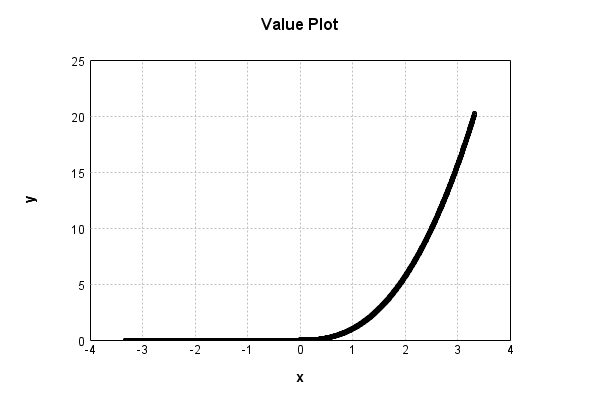

# NthPowerActivationLayer
## NthPowerTest
### Json Serialization
Code from [StandardLayerTests.java:69](../../../../../../../../src/main/java/com/simiacryptus/mindseye/test/StandardLayerTests.java#L69) executed in 0.00 seconds: 
```java
    JsonObject json = layer.getJson();
    NNLayer echo = NNLayer.fromJson(json);
    if ((echo == null)) throw new AssertionError("Failed to deserialize");
    if ((layer == echo)) throw new AssertionError("Serialization did not copy");
    if ((!layer.equals(echo))) throw new AssertionError("Serialization not equal");
    return new GsonBuilder().setPrettyPrinting().create().toJson(json);
```

Returns: 

```
    {
      "class": "com.simiacryptus.mindseye.layers.java.NthPowerActivationLayer",
      "id": "72c79933-0e26-4119-9cab-6a395e3a2195",
      "isFrozen": false,
      "name": "NthPowerActivationLayer/72c79933-0e26-4119-9cab-6a395e3a2195",
      "power": 2.5
    }
```


### Example Input/Output Pair
Code from [StandardLayerTests.java:153](../../../../../../../../src/main/java/com/simiacryptus/mindseye/test/StandardLayerTests.java#L153) executed in 0.00 seconds: 
```java
    SimpleEval eval = SimpleEval.run(layer, inputPrototype);
    return String.format("--------------------\nInput: \n[%s]\n--------------------\nOutput: \n%s\n--------------------\nDerivative: \n%s",
      Arrays.stream(inputPrototype).map(t -> t.prettyPrint()).reduce((a, b) -> a + ",\n" + b).get(),
      eval.getOutput().prettyPrint(),
      Arrays.stream(eval.getDerivative()).map(t -> t.prettyPrint()).reduce((a, b) -> a + ",\n" + b).get());
```

Returns: 

```
    --------------------
    Input: 
    [[
    	[ [ -0.424 ], [ 1.264 ], [ 1.936 ] ],
    	[ [ -0.844 ], [ -1.496 ], [ 0.016 ] ]
    ]]
    --------------------
    Output: 
    [
    	[ [ 0.0 ], [ 1.7962537378215317 ], [ 5.2151089095452425 ] ],
    	[ [ 0.0 ], [ 0.0 ], [ 3.23817232401242E-5 ] ]
    ]
    --------------------
    Derivative: 
    [
    	[ [ 0.0 ], [ 3.5527170447419536 ], [ 6.73438650509458 ] ],
    	[ [ 0.0 ], [ 0.0 ], [ 0.005059644256269407 ] ]
    ]
```


### Batch Execution
Code from [StandardLayerTests.java:102](../../../../../../../../src/main/java/com/simiacryptus/mindseye/test/StandardLayerTests.java#L102) executed in 0.00 seconds: 
```java
    return getBatchingTester().test(layer, inputPrototype);
```

Returns: 

```
    ToleranceStatistics{absoluteTol=0.0000e+00 +- 0.0000e+00 [0.0000e+00 - 0.0000e+00] (120#), relativeTol=0.0000e+00 +- 0.0000e+00 [0.0000e+00 - 0.0000e+00] (62#)}
```


### Differential Validation
Code from [StandardLayerTests.java:110](../../../../../../../../src/main/java/com/simiacryptus/mindseye/test/StandardLayerTests.java#L110) executed in 0.00 seconds: 
```java
    return getDerivativeTester().test(layer, inputPrototype);
```
Logging: 
```
    Inputs: [
    	[ [ -1.288 ], [ 0.288 ], [ 0.88 ] ],
    	[ [ 0.52 ], [ 1.092 ], [ 1.28 ] ]
    ]
    Inputs Statistics: {meanExponent=-0.10412883756923687, negative=1, min=1.28, max=1.28, mean=0.462, count=6.0, positive=5, stdDev=0.8501850778899067, zeros=0}
    Output: [
    	[ [ 0.0 ], [ 0.044512421358178206 ], [ 0.7264515928814528 ] ],
    	[ [ 0.19498821297709257 ], [ 1.2461106159949173 ], [ 1.8536380004736632 ] ]
    ]
    Outputs Statistics: {meanExponent=-0.36734444421960727, negative=0, min=1.8536380004736632, max=1.8536380004736632, mean=0.677616807280884, count=6.0, positive=5, stdDev=0.6833144657590149, zeros=1}
    Feedback for input 0
    Inputs Values: [
    	[ [ -1.288 ], [ 0.288 ], [ 0.88 ] ],
    	[ [ 0.52 ], [ 1.092 ], [ 1.28 ] ]
    ]
    Value Statistics: {meanExponent=-0.10412883756923687, negative=1, min=1.28, max=1.28, mean=0.462, count=6.0, positive=5, stdDev=0.8501850778899067, zeros=0}
    Implemented Feedback: [ [ 0.0, 0.0, 0.0, 0.0, 0.0, 0.0 ], [ 0.0, 0.9374433316206372, 0.0, 0.0, 0.0, 0.0 ], [ 0.0, 0.0, 0.3863925465119636, 0.0, 0.0, 0.0
```
...[skipping 545 bytes](etc/91.txt)...
```
    , 0.0, 0.0 ], [ 0.0, 0.0, 0.0, 0.0, 2.0639588282445054, 0.0 ], [ 0.0, 0.0, 0.0, 0.0, 0.0, 3.6205988544701917 ] ]
    Measured Statistics: {meanExponent=0.17758694457889238, negative=0, min=3.6205988544701917, max=3.6205988544701917, mean=0.27393451902208726, count=36.0, positive=5, stdDev=0.8136907181947864, zeros=31}
    Feedback Error: [ [ 0.0, 0.0, 0.0, 0.0, 0.0, 0.0 ], [ 0.0, 1.3521250615644576E-4, 0.0, 0.0, 0.0, 0.0 ], [ 0.0, 0.0, 1.0062888175149665E-4, 0.0, 0.0, 0.0 ], [ 0.0, 0.0, 0.0, 1.9593824922736758E-4, 0.0, 0.0 ], [ 0.0, 0.0, 0.0, 0.0, 1.7589392219630184E-4, 0.0 ], [ 0.0, 0.0, 0.0, 0.0, 0.0, 2.1213479506831945E-4 ] ]
    Error Statistics: {meanExponent=-3.8004557051528094, negative=0, min=2.1213479506831945E-4, max=2.1213479506831945E-4, mean=2.277245428888698E-5, count=36.0, positive=5, stdDev=5.8706233353027924E-5, zeros=31}
    Finite-Difference Derivative Accuracy:
    absoluteTol: 2.2772e-05 +- 5.8706e-05 [0.0000e+00 - 2.1213e-04] (36#)
    relativeTol: 6.1712e-05 +- 3.7319e-05 [2.9296e-05 - 1.3020e-04] (5#)
    
```

Returns: 

```
    ToleranceStatistics{absoluteTol=2.2772e-05 +- 5.8706e-05 [0.0000e+00 - 2.1213e-04] (36#), relativeTol=6.1712e-05 +- 3.7319e-05 [2.9296e-05 - 1.3020e-04] (5#)}
```


### Performance
Code from [StandardLayerTests.java:120](../../../../../../../../src/main/java/com/simiacryptus/mindseye/test/StandardLayerTests.java#L120) executed in 0.00 seconds: 
```java
    getPerformanceTester().test(layer, permPrototype);
```
Logging: 
```
    Evaluation performance: 0.000234s +- 0.000026s [0.000203s - 0.000270s]
    Learning performance: 0.000042s +- 0.000003s [0.000038s - 0.000046s]
    
```

### Function Plots
Code from [ActivationLayerTestBase.java:103](../../../../../../../../src/test/java/com/simiacryptus/mindseye/layers/java/ActivationLayerTestBase.java#L103) executed in 0.00 seconds: 
```java
    return plot("Value Plot", plotData, x -> new double[]{x[0], x[1]});
```

Returns: 




Code from [ActivationLayerTestBase.java:107](../../../../../../../../src/test/java/com/simiacryptus/mindseye/layers/java/ActivationLayerTestBase.java#L107) executed in 0.00 seconds: 
```java
    return plot("Derivative Plot", plotData, x -> new double[]{x[0], x[2]});
```

Returns: 


