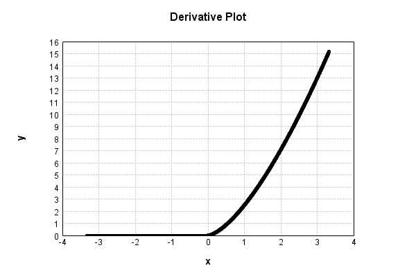

# NthPowerActivationLayer
## NthPowerTest
### Json Serialization
Code from [LayerTestBase.java:84](../../../../../../../../../MindsEye/src/test/java/com/simiacryptus/mindseye/layers/LayerTestBase.java#L84) executed in 0.00 seconds: 
```java
    JsonObject json = layer.getJson();
    NNLayer echo = NNLayer.fromJson(json);
    assert (echo != null) : "Failed to deserialize";
    assert (layer != echo) : "Serialization did not copy";
    Assert.assertEquals("Serialization not equal", layer, echo);
    return new GsonBuilder().setPrettyPrinting().create().toJson(json);
```

Returns: 

```
    {
      "class": "com.simiacryptus.mindseye.layers.java.NthPowerActivationLayer",
      "id": "e2d0bffa-47dc-4875-864f-3d3d0000152f",
      "isFrozen": false,
      "name": "NthPowerActivationLayer/e2d0bffa-47dc-4875-864f-3d3d0000152f",
      "power": 2.5
    }
```


### Example Input/Output Pair
Code from [LayerTestBase.java:121](../../../../../../../../../MindsEye/src/test/java/com/simiacryptus/mindseye/layers/LayerTestBase.java#L121) executed in 0.00 seconds: 
```java
    SimpleEval eval = SimpleEval.run(layer, inputPrototype);
    return String.format("--------------------\nInput: \n[%s]\n--------------------\nOutput: \n%s",
      Arrays.stream(inputPrototype).map(t->t.prettyPrint()).reduce((a,b)->a+",\n"+b).get(),
      eval.getOutput().prettyPrint());
```

Returns: 

```
    --------------------
    Input: 
    [[ 0.536, -0.616, -0.476 ]]
    --------------------
    Output: 
    [ 0.21033520748123938, 0.0, 0.0 ]
```


### Differential Validation
Code from [LayerTestBase.java:139](../../../../../../../../../MindsEye/src/test/java/com/simiacryptus/mindseye/layers/LayerTestBase.java#L139) executed in 0.00 seconds: 
```java
    getDerivativeTester().test(layer, inputPrototype);
```
Logging: 
```
    Feedback for input 0
    Inputs: [ 0.536, -0.616, -0.476 ]
    Output: [ 0.21033520748123938, 0.0, 0.0 ]
    Measured: [ [ 0.9811783564772636, 0.0, 0.0 ], [ 0.0, 0.0, 0.0 ], [ 0.0, 0.0, 0.0 ] ]
    Implemented: [ [ 0.9810410796699597, 0.0, 0.0 ], [ 0.0, 0.0, 0.0 ], [ 0.0, 0.0, 0.0 ] ]
    Error: [ [ 1.372768073039099E-4, 0.0, 0.0 ], [ 0.0, 0.0, 0.0 ], [ 0.0, 0.0, 0.0 ] ]
    Finite-Difference Derivative Accuracy:
    absoluteTol: 1.5253e-05 +- 4.3142e-05 [0.0000e+00 - 1.3728e-04] (9#)
    relativeTol: 6.9960e-05 +- 0.0000e+00 [6.9960e-05 - 6.9960e-05] (1#)
    
```

### Performance
Code from [LayerTestBase.java:144](../../../../../../../../../MindsEye/src/test/java/com/simiacryptus/mindseye/layers/LayerTestBase.java#L144) executed in 0.00 seconds: 
```java
    getPerformanceTester().test(layer, inputPrototype);
```
Logging: 
```
    Evaluation performance: 0.1672 +- 0.0462 [0.1283 - 0.3733]
    Learning performance: 0.0023 +- 0.0057 [0.0000 - 0.0570]
    
```

### Function Plots
Code from [ActivationLayerTestBase.java:73](../../../../../../../../../MindsEye/src/test/java/com/simiacryptus/mindseye/layers/java/ActivationLayerTestBase.java#L73) executed in 0.00 seconds: 
```java
    return plot("Value Plot", plotData, x -> new double[]{x[0], x[1]});
```

Returns: 


Code from [ActivationLayerTestBase.java:77](../../../../../../../../../MindsEye/src/test/java/com/simiacryptus/mindseye/layers/java/ActivationLayerTestBase.java#L77) executed in 0.01 seconds: 
```java
    return plot("Derivative Plot", plotData, x -> new double[]{x[0], x[2]});
```

Returns: 




