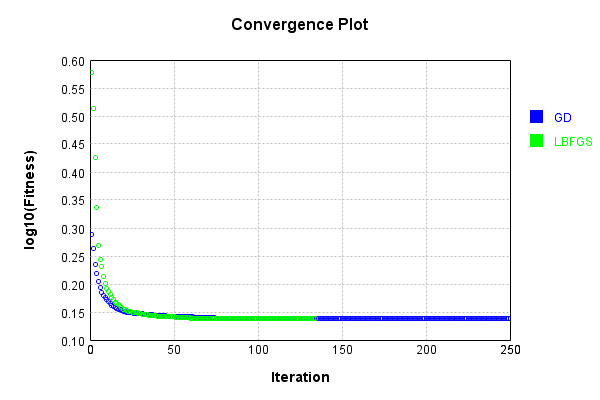
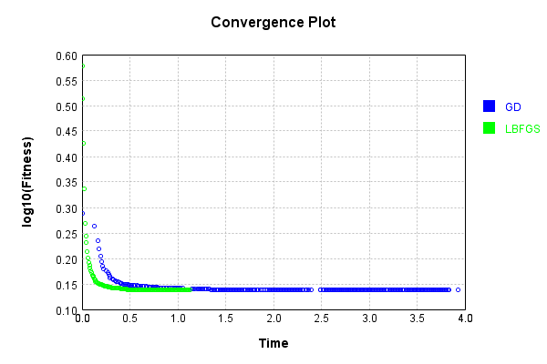
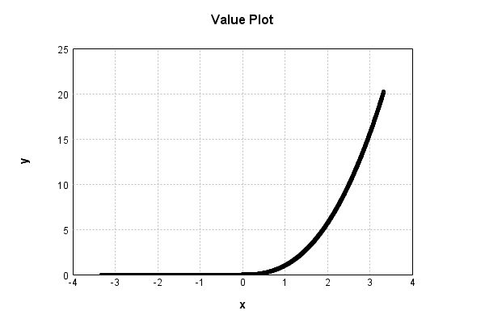

# NthPowerActivationLayer
## NthPowerTest
### Json Serialization
Code from [JsonTest.java:36](../../../../../../../../src/main/java/com/simiacryptus/mindseye/test/unit/JsonTest.java#L36) executed in 0.00 seconds: 
```java
    JsonObject json = layer.getJson();
    NNLayer echo = NNLayer.fromJson(json);
    if ((echo == null)) throw new AssertionError("Failed to deserialize");
    if ((layer == echo)) throw new AssertionError("Serialization did not copy");
    if ((!layer.equals(echo))) throw new AssertionError("Serialization not equal");
    return new GsonBuilder().setPrettyPrinting().create().toJson(json);
```

Returns: 

```
    {
      "class": "com.simiacryptus.mindseye.layers.java.NthPowerActivationLayer",
      "id": "fd6c278e-6deb-4a80-bead-87e4c9bfef69",
      "isFrozen": false,
      "name": "NthPowerActivationLayer/fd6c278e-6deb-4a80-bead-87e4c9bfef69",
      "power": 2.5
    }
```


### Example Input/Output Pair
Code from [ReferenceIO.java:68](../../../../../../../../src/main/java/com/simiacryptus/mindseye/test/unit/ReferenceIO.java#L68) executed in 0.00 seconds: 
```java
    SimpleEval eval = SimpleEval.run(layer, inputPrototype);
    return String.format("--------------------\nInput: \n[%s]\n--------------------\nOutput: \n%s\n--------------------\nDerivative: \n%s",
      Arrays.stream(inputPrototype).map(t -> t.prettyPrint()).reduce((a, b) -> a + ",\n" + b).get(),
      eval.getOutput().prettyPrint(),
      Arrays.stream(eval.getDerivative()).map(t -> t.prettyPrint()).reduce((a, b) -> a + ",\n" + b).get());
```

Returns: 

```
    --------------------
    Input: 
    [[
    	[ [ 1.628 ], [ 0.508 ], [ -0.544 ] ],
    	[ [ 1.804 ], [ -1.352 ], [ 0.48 ] ]
    ]]
    --------------------
    Output: 
    [
    	[ [ 3.38170719395668 ], [ 0.18393284174602426 ], [ 0.0 ] ],
    	[ [ 4.371105946543166 ], [ 0.0 ], [ 0.15962580242554772 ] ]
    ]
    --------------------
    Derivative: 
    [
    	[ [ 5.193039302759031 ], [ 0.9051813078052374 ], [ 0.0 ] ],
    	[ [ 6.057519327249398 ], [ 0.0 ], [ 0.8313843876330611 ] ]
    ]
```


### Batch Execution
Code from [BatchingTester.java:66](../../../../../../../../src/main/java/com/simiacryptus/mindseye/test/unit/BatchingTester.java#L66) executed in 0.00 seconds: 
```java
    return test(reference, inputPrototype);
```

Returns: 

```
    ToleranceStatistics{absoluteTol=0.0000e+00 +- 0.0000e+00 [0.0000e+00 - 0.0000e+00] (120#), relativeTol=0.0000e+00 +- 0.0000e+00 [0.0000e+00 - 0.0000e+00] (48#)}
```


Code from [SingleDerivativeTester.java:77](../../../../../../../../src/main/java/com/simiacryptus/mindseye/test/unit/SingleDerivativeTester.java#L77) executed in 0.00 seconds: 
```java
    return test(component, inputPrototype);
```
Logging: 
```
    Inputs: [
    	[ [ 0.332 ], [ -1.76 ], [ 0.62 ] ],
    	[ [ 0.544 ], [ 0.552 ], [ 1.004 ] ]
    ]
    Inputs Statistics: {meanExponent=-0.16028097812453013, negative=1, min=1.004, max=1.004, mean=0.21533333333333338, count=6.0, positive=5, stdDev=0.9057841292984156, zeros=0}
    Output: [
    	[ [ 0.06351045282811327 ], [ 0.0 ], [ 0.302676862677014 ] ],
    	[ [ 0.21827160868107426 ], [ 0.2263850243369292 ], [ 1.010030019990012 ] ]
    ]
    Outputs Statistics: {meanExponent=-0.6035992682806652, negative=0, min=1.010030019990012, max=1.010030019990012, mean=0.3034789947521905, count=6.0, positive=5, stdDev=0.3321905013103455, zeros=1}
    Feedback for input 0
    Inputs Values: [
    	[ [ 0.332 ], [ -1.76 ], [ 0.62 ] ],
    	[ [ 0.544 ], [ 0.552 ], [ 1.004 ] ]
    ]
    Value Statistics: {meanExponent=-0.16028097812453013, negative=1, min=1.004, max=1.004, mean=0.21533333333333338, count=6.0, positive=5, stdDev=0.9057841292984156, zeros=0}
    Implemented Feedback: [ [ 0.47824136165747944, 0.0, 0.0, 0.0, 0.0, 0.0 ], [ 0.0, 1.0030864369534662, 0.0, 0.0, 0.0, 0.0 ], 
```
...[skipping 569 bytes](etc/361.txt)...
```
    89, 0.0, 0.0 ], [ 0.0, 0.0, 0.0, 0.0, 1.2206188620883518, 0.0 ], [ 0.0, 0.0, 0.0, 0.0, 0.0, 2.515202867758859 ] ]
    Measured Statistics: {meanExponent=0.035840838919486744, negative=0, min=2.515202867758859, max=2.515202867758859, mean=0.17341193534833416, count=36.0, positive=5, stdDev=0.5005654359605521, zeros=31}
    Feedback Error: [ [ 1.0804187543889121E-4, 0.0, 0.0, 0.0, 0.0, 0.0 ], [ 0.0, 1.3829740374471378E-4, 0.0, 0.0, 0.0, 0.0 ], [ 0.0, 0.0, 0.0, 0.0, 0.0, 0.0 ], [ 0.0, 0.0, 0.0, 1.3931052311844105E-4, 0.0, 0.0 ], [ 0.0, 0.0, 0.0, 0.0, 1.476416165211436E-4, 0.0 ], [ 0.0, 0.0, 0.0, 0.0, 0.0, 1.8787774388906442E-4 ] ]
    Error Statistics: {meanExponent=-3.8477051615109006, negative=0, min=1.8787774388906442E-4, max=1.8787774388906442E-4, mean=2.0032476742007058E-5, count=36.0, positive=5, stdDev=5.0787118248941373E-5, zeros=31}
    Finite-Difference Derivative Accuracy:
    absoluteTol: 2.0032e-05 +- 5.0787e-05 [0.0000e+00 - 1.8788e-04] (36#)
    relativeTol: 6.9528e-05 +- 2.4516e-05 [3.7350e-05 - 1.1294e-04] (5#)
    
```

Returns: 

```
    ToleranceStatistics{absoluteTol=2.0032e-05 +- 5.0787e-05 [0.0000e+00 - 1.8788e-04] (36#), relativeTol=6.9528e-05 +- 2.4516e-05 [3.7350e-05 - 1.1294e-04] (5#)}
```


### Performance
Now we execute larger-scale runs to benchmark performance:

Code from [PerformanceTester.java:66](../../../../../../../../src/main/java/com/simiacryptus/mindseye/test/unit/PerformanceTester.java#L66) executed in 0.18 seconds: 
```java
    test(component, inputPrototype);
```
Logging: 
```
    100 batches
    Input Dimensions:
    	[100, 100, 1]
    Performance:
    	Evaluation performance: 0.009742s +- 0.000307s [0.009162s - 0.010026s]
    	Learning performance: 0.014691s +- 0.002139s [0.012070s - 0.016582s]
    
```

### Input Learning
In this test, we use a network to learn this target input, given it's pre-evaluated output:

Code from [LearningTester.java:127](../../../../../../../../src/main/java/com/simiacryptus/mindseye/test/unit/LearningTester.java#L127) executed in 0.01 seconds: 
```java
    return Arrays.stream(input_target).map(x -> x.prettyPrint()).reduce((a, b) -> a + "\n" + b).orElse("");
```

Returns: 

```
    [
    	[ [ 0.804 ], [ -1.6 ], [ -1.684 ], [ -1.18 ], [ 1.496 ], [ -1.388 ], [ 1.248 ], [ -0.444 ], ... ],
    	[ [ 1.128 ], [ -0.556 ], [ -0.516 ], [ -1.356 ], [ 0.064 ], [ -1.22 ], [ 1.004 ], [ 1.648 ], ... ],
    	[ [ -0.124 ], [ 0.872 ], [ 0.78 ], [ 1.088 ], [ 0.916 ], [ 0.388 ], [ -1.116 ], [ 0.1 ], ... ],
    	[ [ 1.764 ], [ 1.312 ], [ 0.8 ], [ 0.264 ], [ -0.268 ], [ 1.876 ], [ -1.804 ], [ -0.68 ], ... ],
    	[ [ -1.136 ], [ -1.168 ], [ 1.228 ], [ 0.356 ], [ 1.636 ], [ -1.708 ], [ 0.212 ], [ -0.188 ], ... ],
    	[ [ 0.04 ], [ 0.82 ], [ -1.5 ], [ 0.724 ], [ -0.26 ], [ 1.776 ], [ -1.22 ], [ -0.636 ], ... ],
    	[ [ -1.94 ], [ 1.068 ], [ 0.032 ], [ 0.448 ], [ 0.108 ], [ -1.404 ], [ 1.648 ], [ 0.196 ], ... ],
    	[ [ -1.356 ], [ 0.824 ], [ 0.824 ], [ 0.14 ], [ 1.768 ], [ -1.192 ], [ -1.652 ], [ -0.672 ], ... ],
    	...
    ]
```


First, we use a conjugate gradient descent method, which converges the fastest for purely linear functions.

Code from [LearningTester.java:300](../../../../../../../../src/main/java/com/simiacryptus/mindseye/test/unit/LearningTester.java#L300) executed in 3.99 seconds: 
```java
    return new IterativeTrainer(trainable)
      .setLineSearchFactory(label -> new QuadraticSearch())
      .setOrientation(new GradientDescent())
      .setMonitor(monitor)
      .setTimeout(30, TimeUnit.SECONDS)
      .setMaxIterations(250)
      .setTerminateThreshold(0)
      .run();
```
Logging: 
```
    Constructing line search parameters: GD
    F(0.0) = LineSearchPoint{point=PointSample{avg=4.128423807940761}, derivative=-0.02914888764955115}
    New Minimum: 4.128423807940761 > 4.12842380793786
    F(1.0E-10) = LineSearchPoint{point=PointSample{avg=4.12842380793786}, derivative=-0.029148887649517407}, delta = -2.900790718740609E-12
    New Minimum: 4.12842380793786 > 4.128423807920361
    F(7.000000000000001E-10) = LineSearchPoint{point=PointSample{avg=4.128423807920361}, derivative=-0.02914888764931495}, delta = -2.0400570122092176E-11
    New Minimum: 4.128423807920361 > 4.128423807797937
    F(4.900000000000001E-9) = LineSearchPoint{point=PointSample{avg=4.128423807797937}, derivative=-0.029148887647897748}, delta = -1.4282441895829834E-10
    New Minimum: 4.128423807797937 > 4.12842380694097
    F(3.430000000000001E-8) = LineSearchPoint{point=PointSample{avg=4.12842380694097}, derivative=-0.02914888763797735}, delta = -9.997913608117415E-10
    New Minimum: 4.12842380694097 > 4.1284238009421195
    F(2.4010000000000004E-7) = LineSear
```
...[skipping 301654 bytes](etc/362.txt)...
```
    point=PointSample{avg=1.3741241840095373}, derivative=-8.546059166587053E-9}, delta = -8.713002230820166E-7
    F(588.5885384089614) = LineSearchPoint{point=PointSample{avg=1.3741253283443653}, derivative=1.3013059548521875E-8}, delta = 2.7303460492511533E-7
    F(45.27604141607396) = LineSearchPoint{point=PointSample{avg=1.3741245481764204}, derivative=-1.022197072123705E-8}, delta = -5.071333399886413E-7
    New Minimum: 1.3741236800445762 > 1.374123360331217
    F(316.9322899125177) = LineSearchPoint{point=PointSample{avg=1.374123360331217}, derivative=1.4561481835684083E-9}, delta = -1.6949785432984754E-6
    1.374123360331217 <= 1.3741250553097604
    New Minimum: 1.374123360331217 > 1.3741233355503786
    F(283.089526472234) = LineSearchPoint{point=PointSample{avg=1.3741233355503786}, derivative=8.006278174533612E-12}, delta = -1.7197593817908086E-6
    Right bracket at 283.089526472234
    Converged to right
    Iteration 250 complete. Error: 1.3741233355503786 Total: 249833903174124.2000; Orientation: 0.0003; Line Search: 0.0920
    
```

Returns: 

```
    1.3741233355503786
```


This training run resulted in the following regressed input:

Code from [LearningTester.java:144](../../../../../../../../src/main/java/com/simiacryptus/mindseye/test/unit/LearningTester.java#L144) executed in 0.00 seconds: 
```java
    return Arrays.stream(input_gd).map(x -> x.prettyPrint()).reduce((a, b) -> a + "\n" + b).orElse("");
```

Returns: 

```
    [
    	[ [ -0.976 ], [ -1.22 ], [ -0.18 ], [ -1.784 ], [ 1.496 ], [ -1.384 ], [ -1.944 ], [ 0.23161056227279342 ], ... ],
    	[ [ 1.128 ], [ 0.23272482480634463 ], [ -0.144 ], [ 0.2284566458369634 ], [ -1.02 ], [ -1.98 ], [ 1.0039999999999998 ], [ -1.656 ], ... ],
    	[ [ 0.23300624085717245 ], [ 0.8719999999999998 ], [ -1.856 ], [ 1.0879999999999999 ], [ 0.9160000000000003 ], [ -1.724 ], [ -0.25867804255679827 ], [ 0.23561689172626527 ], ... ],
    	[ [ 1.764 ], [ -0.8 ], [ -1.204 ], [ -1.936 ], [ 0.18527311603606542 ], [ -1.36 ], [ -1.036 ], [ 0.05181345469143417 ], ... ],
    	[ [ -0.424 ], [ -0.644 ], [ 1.228 ], [ 0.35777148480064064 ], [ -0.648 ], [ -0.068 ], [ -0.172 ], [ 0.2330141095417004 ], ... ],
    	[ [ -0.24 ], [ -1.336 ], [ -1.948 ], [ 0.723999999999818 ], [ -1.592 ], [ -1.02 ], [ -0.476 ], [ 0.2330401719715 ], ... ],
    	[ [ -1.616 ], [ -0.784 ], [ -0.412 ], [ -0.592 ], [ -1.764 ], [ -0.468 ], [ 1.648 ], [ 0.2609051061170472 ], ... ],
    	[ [ -1.908 ], [ -0.504 ], [ -0.484 ], [ -1.088 ], [ 1.768 ], [ -1.348 ], [ -1.456 ], [ 0.2322625101594639 ], ... ],
    	...
    ]
```


Next, we run the same optimization using L-BFGS, which is nearly ideal for purely second-order or quadratic functions.

Code from [LearningTester.java:324](../../../../../../../../src/main/java/com/simiacryptus/mindseye/test/unit/LearningTester.java#L324) executed in 1.15 seconds: 
```java
    return new IterativeTrainer(trainable)
      .setLineSearchFactory(label -> new ArmijoWolfeSearch())
      .setOrientation(new LBFGS())
      .setMonitor(monitor)
      .setTimeout(30, TimeUnit.SECONDS)
      .setMaxIterations(250)
      .setTerminateThreshold(0)
      .run();
```
Logging: 
```
    LBFGS Accumulation History: 1 points
    Constructing line search parameters: GD
    th(0)=4.128423807940761;dx=-0.02914888764955115
    New Minimum: 4.128423807940761 > 4.06640230268387
    WOLFE (weak): th(2.154434690031884)=4.06640230268387; dx=-0.028429197893816226 delta=0.062021505256891096
    New Minimum: 4.06640230268387 > 4.005915752359402
    WOLFE (weak): th(4.308869380063768)=4.005915752359402; dx=-0.027723927668714322 delta=0.12250805558135891
    New Minimum: 4.005915752359402 > 3.7787087065738976
    END: th(12.926608140191302)=3.7787087065738976; dx=-0.02504299353635724 delta=0.34971510136686357
    Iteration 1 complete. Error: 3.7787087065738976 Total: 249833934810145.1000; Orientation: 0.0011; Line Search: 0.0110
    LBFGS Accumulation History: 1 points
    th(0)=3.7787087065738976;dx=-0.02156756810851153
    New Minimum: 3.7787087065738976 > 3.255210526421897
    END: th(27.849533001676672)=3.255210526421897; dx=-0.0162320967895393 delta=0.5234981801520004
    Iteration 2 complete. Error: 3.255210526421897 Total: 249833942483758.06
```
...[skipping 70223 bytes](etc/363.txt)...
```
    3345 > 1.3730405336207245
    WOLFE (weak): th(226.62349268998256)=1.3730405336207245; dx=-7.083547220772418E-9 delta=1.610917609973228E-6
    New Minimum: 1.3730405336207245 > 1.373038933993128
    WOLFE (weak): th(453.2469853799651)=1.373038933993128; dx=-7.0333878636810234E-9 delta=3.2105452065778195E-6
    New Minimum: 1.373038933993128 > 1.3730326515950613
    WOLFE (weak): th(1359.7409561398954)=1.3730326515950613; dx=-6.8254774559386794E-9 delta=9.492943273237131E-6
    New Minimum: 1.3730326515950613 > 1.3730069765245865
    END: th(5438.963824559582)=1.3730069765245865; dx=-5.706420020427763E-9 delta=3.516801374803258E-5
    Iteration 134 complete. Error: 1.3730069765245865 Total: 249835060518385.9400; Orientation: 0.0005; Line Search: 0.0096
    LBFGS Accumulation History: 1 points
    th(0)=1.3730069765245865;dx=-2.955993471387725E-8
    MAX ALPHA: th(0)=1.3730069765245865;th'(0)=-2.955993471387725E-8;
    Iteration 135 failed, aborting. Error: 1.3730069765245865 Total: 249835066105957.9400; Orientation: 0.0005; Line Search: 0.0037
    
```

Returns: 

```
    1.3730069765245865
```


This training run resulted in the following regressed input:

Code from [LearningTester.java:154](../../../../../../../../src/main/java/com/simiacryptus/mindseye/test/unit/LearningTester.java#L154) executed in 0.00 seconds: 
```java
    return Arrays.stream(input_lbgfs).map(x -> x.prettyPrint()).reduce((a, b) -> a + "\n" + b).orElse("");
```

Returns: 

```
    [
    	[ [ -0.976 ], [ -1.22 ], [ -0.18 ], [ -1.784 ], [ 1.496 ], [ -1.384 ], [ -1.944 ], [ 0.22553430641206798 ], ... ],
    	[ [ 1.128 ], [ 0.22700243641802426 ], [ -0.144 ], [ 0.2228502573980424 ], [ -1.02 ], [ -1.98 ], [ 1.004 ], [ -1.656 ], ... ],
    	[ [ 0.22694409794962533 ], [ 0.872 ], [ -1.856 ], [ 1.088 ], [ 0.916 ], [ -1.724 ], [ 0.2270666314881827 ], [ 0.23235732095356837 ], ... ],
    	[ [ 1.764 ], [ -0.8 ], [ -1.204 ], [ -1.936 ], [ 0.22706122875543483 ], [ -1.36 ], [ -1.036 ], [ 0.05180295115610932 ], ... ],
    	[ [ -0.424 ], [ -0.644 ], [ 1.228 ], [ 0.3600066958971521 ], [ -0.648 ], [ -0.068 ], [ -0.172 ], [ 0.22693900486431068 ], ... ],
    	[ [ -0.24 ], [ -1.336 ], [ -1.948 ], [ 0.7239999999999072 ], [ -1.592 ], [ -1.02 ], [ -0.476 ], [ 0.22685172015317115 ], ... ],
    	[ [ -1.616 ], [ -0.784 ], [ -0.412 ], [ -0.592 ], [ -1.764 ], [ -0.468 ], [ 1.648 ], [ 0.2562736144309547 ], ... ],
    	[ [ -1.908 ], [ -0.504 ], [ -0.484 ], [ -1.088 ], [ 1.768 ], [ -1.348 ], [ -1.456 ], [ 0.22702512683111992 ], ... ],
    	...
    ]
```


Code from [LearningTester.java:96](../../../../../../../../src/main/java/com/simiacryptus/mindseye/test/unit/LearningTester.java#L96) executed in 0.00 seconds: 
```java
    return TestUtil.compare(runs);
```

Returns: 




Code from [LearningTester.java:99](../../../../../../../../src/main/java/com/simiacryptus/mindseye/test/unit/LearningTester.java#L99) executed in 0.00 seconds: 
```java
    return TestUtil.compareTime(runs);
```

Returns: 




### Function Plots
Code from [ActivationLayerTestBase.java:110](../../../../../../../../src/test/java/com/simiacryptus/mindseye/layers/java/ActivationLayerTestBase.java#L110) executed in 0.00 seconds: 
```java
    return plot("Value Plot", plotData, x -> new double[]{x[0], x[1]});
```

Returns: 




Code from [ActivationLayerTestBase.java:114](../../../../../../../../src/test/java/com/simiacryptus/mindseye/layers/java/ActivationLayerTestBase.java#L114) executed in 0.00 seconds: 
```java
    return plot("Derivative Plot", plotData, x -> new double[]{x[0], x[2]});
```

Returns: 


