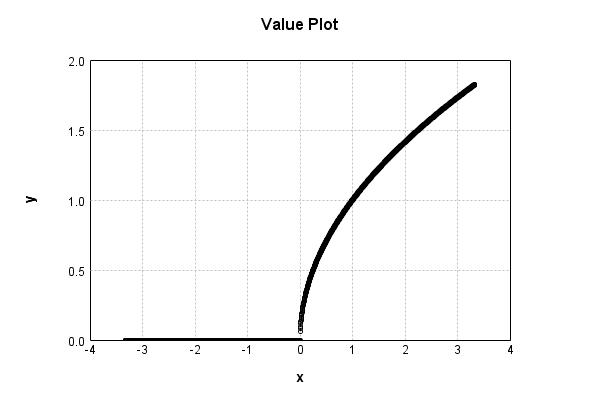
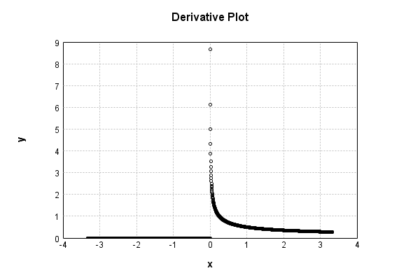

# NthPowerActivationLayer
## SqrtPowerTest
### Json Serialization
Code from [StandardLayerTests.java:69](../../../../../../../../src/main/java/com/simiacryptus/mindseye/test/StandardLayerTests.java#L69) executed in 0.00 seconds: 
```java
    JsonObject json = layer.getJson();
    NNLayer echo = NNLayer.fromJson(json);
    if ((echo == null)) throw new AssertionError("Failed to deserialize");
    if ((layer == echo)) throw new AssertionError("Serialization did not copy");
    if ((!layer.equals(echo))) throw new AssertionError("Serialization not equal");
    return new GsonBuilder().setPrettyPrinting().create().toJson(json);
```

Returns: 

```
    {
      "class": "com.simiacryptus.mindseye.layers.java.NthPowerActivationLayer",
      "id": "ba08efea-5446-47e2-bb44-fffaa35a370f",
      "isFrozen": false,
      "name": "NthPowerActivationLayer/ba08efea-5446-47e2-bb44-fffaa35a370f",
      "power": 0.5
    }
```


### Example Input/Output Pair
Code from [StandardLayerTests.java:153](../../../../../../../../src/main/java/com/simiacryptus/mindseye/test/StandardLayerTests.java#L153) executed in 0.00 seconds: 
```java
    SimpleEval eval = SimpleEval.run(layer, inputPrototype);
    return String.format("--------------------\nInput: \n[%s]\n--------------------\nOutput: \n%s\n--------------------\nDerivative: \n%s",
      Arrays.stream(inputPrototype).map(t -> t.prettyPrint()).reduce((a, b) -> a + ",\n" + b).get(),
      eval.getOutput().prettyPrint(),
      Arrays.stream(eval.getDerivative()).map(t -> t.prettyPrint()).reduce((a, b) -> a + ",\n" + b).get());
```

Returns: 

```
    --------------------
    Input: 
    [[
    	[ [ 1.036 ], [ 1.448 ], [ 0.48 ] ],
    	[ [ 1.668 ], [ -0.808 ], [ -0.888 ] ]
    ]]
    --------------------
    Output: 
    [
    	[ [ 1.0178408519999578 ], [ 1.2033287165193058 ], [ 0.6928203230275509 ] ],
    	[ [ 1.2915107432770352 ], [ 0.0 ], [ 0.0 ] ]
    ]
    --------------------
    Derivative: 
    [
    	[ [ 0.4912359324324121 ], [ 0.41551405957158355 ], [ 0.7216878364870322 ] ],
    	[ [ 0.38714350817656934 ], [ 0.0 ], [ 0.0 ] ]
    ]
```


### Batch Execution
Code from [StandardLayerTests.java:102](../../../../../../../../src/main/java/com/simiacryptus/mindseye/test/StandardLayerTests.java#L102) executed in 0.00 seconds: 
```java
    return getBatchingTester().test(layer, inputPrototype);
```

Returns: 

```
    ToleranceStatistics{absoluteTol=0.0000e+00 +- 0.0000e+00 [0.0000e+00 - 0.0000e+00] (120#), relativeTol=0.0000e+00 +- 0.0000e+00 [0.0000e+00 - 0.0000e+00] (52#)}
```


### Differential Validation
Code from [StandardLayerTests.java:110](../../../../../../../../src/main/java/com/simiacryptus/mindseye/test/StandardLayerTests.java#L110) executed in 0.00 seconds: 
```java
    return getDerivativeTester().test(layer, inputPrototype);
```
Logging: 
```
    Inputs: [
    	[ [ 1.716 ], [ 1.308 ], [ -0.568 ] ],
    	[ [ 1.612 ], [ 1.284 ], [ -1.232 ] ]
    ]
    Inputs Statistics: {meanExponent=0.0853356887070445, negative=2, min=-1.232, max=-1.232, mean=0.6866666666666666, count=6.0, positive=4, stdDev=1.1484846054209386, zeros=0}
    Output: [
    	[ [ 1.3099618315050252 ], [ 1.1436782764396638 ], [ 0.0 ] ],
    	[ [ 1.2696456198483104 ], [ 1.1331372379372235 ], [ 0.0 ] ]
    ]
    Outputs Statistics: {meanExponent=0.0833818860878552, negative=0, min=0.0, max=0.0, mean=0.8094038276217037, count=6.0, positive=4, stdDev=0.5757882514414496, zeros=2}
    Feedback for input 0
    Inputs Values: [
    	[ [ 1.716 ], [ 1.308 ], [ -0.568 ] ],
    	[ [ 1.612 ], [ 1.284 ], [ -1.232 ] ]
    ]
    Value Statistics: {meanExponent=0.0853356887070445, negative=2, min=-1.232, max=-1.232, mean=0.6866666666666666, count=6.0, positive=4, stdDev=1.1484846054209386, zeros=0}
    Implemented Feedback: [ [ 0.38169051034528706, 0.0, 0.0, 0.0, 0.0, 0.0 ], [ 0.0, 0.39381067613160986, 0.0, 0.0, 0.0, 0.0 ], [ 0.0, 0.0, 0.4371858854891681, 0.0, 0.
```
...[skipping 398 bytes](etc/92.txt)...
```
    53263, 0.0, 0.0, 0.0, 0.0 ], [ 0.0, 0.0, 0.43717752980843017, 0.0, 0.0, 0.0 ], [ 0.0, 0.0, 0.0, 0.4412442274759343, 0.0, 0.0 ], [ 0.0, 0.0, 0.0, 0.0, 0.0, 0.0 ], [ 0.0, 0.0, 0.0, 0.0, 0.0, 0.0 ] ]
    Measured Statistics: {meanExponent=-0.38441933633076064, negative=0, min=0.0, max=0.0, mean=0.0459419798852038, count=36.0, positive=4, stdDev=0.1302350590259618, zeros=32}
    Feedback Error: [ [ -5.560596847253851E-6, 0.0, 0.0, 0.0, 0.0, 0.0 ], [ 0.0, -6.1072970772291235E-6, 0.0, 0.0, 0.0, 0.0 ], [ 0.0, 0.0, -8.355680737925919E-6, 0.0, 0.0, 0.0 ], [ 0.0, 0.0, 0.0, -8.591035445593143E-6, 0.0, 0.0 ], [ 0.0, 0.0, 0.0, 0.0, 0.0, 0.0 ], [ 0.0, 0.0, 0.0, 0.0, 0.0, 0.0 ] ]
    Error Statistics: {meanExponent=-5.15325054910403, negative=4, min=0.0, max=0.0, mean=-7.948502807778343E-7, count=36.0, positive=0, stdDev=2.2918834723511627E-6, zeros=32}
    Finite-Difference Derivative Accuracy:
    absoluteTol: 7.9485e-07 +- 2.2919e-06 [0.0000e+00 - 8.5910e-06] (36#)
    relativeTol: 8.5824e-06 +- 1.0780e-06 [7.2842e-06 - 9.7349e-06] (4#)
    
```

Returns: 

```
    ToleranceStatistics{absoluteTol=7.9485e-07 +- 2.2919e-06 [0.0000e+00 - 8.5910e-06] (36#), relativeTol=8.5824e-06 +- 1.0780e-06 [7.2842e-06 - 9.7349e-06] (4#)}
```


### Performance
Code from [StandardLayerTests.java:120](../../../../../../../../src/main/java/com/simiacryptus/mindseye/test/StandardLayerTests.java#L120) executed in 0.00 seconds: 
```java
    getPerformanceTester().test(layer, permPrototype);
```
Logging: 
```
    Evaluation performance: 0.000168s +- 0.000010s [0.000152s - 0.000182s]
    Learning performance: 0.000041s +- 0.000002s [0.000039s - 0.000044s]
    
```

### Function Plots
Code from [ActivationLayerTestBase.java:103](../../../../../../../../src/test/java/com/simiacryptus/mindseye/layers/java/ActivationLayerTestBase.java#L103) executed in 0.00 seconds: 
```java
    return plot("Value Plot", plotData, x -> new double[]{x[0], x[1]});
```

Returns: 




Code from [ActivationLayerTestBase.java:107](../../../../../../../../src/test/java/com/simiacryptus/mindseye/layers/java/ActivationLayerTestBase.java#L107) executed in 0.00 seconds: 
```java
    return plot("Derivative Plot", plotData, x -> new double[]{x[0], x[2]});
```

Returns: 




