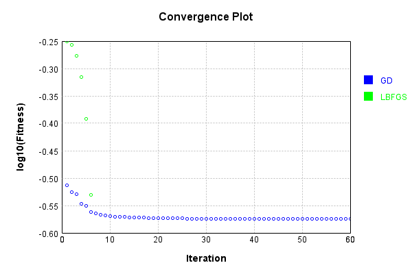
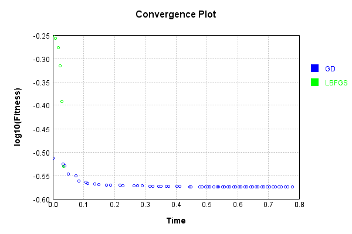

# NthPowerActivationLayer
## SqrtPowerTest
### Json Serialization
Code from [JsonTest.java:36](../../../../../../../../src/main/java/com/simiacryptus/mindseye/test/unit/JsonTest.java#L36) executed in 0.00 seconds: 
```java
    JsonObject json = layer.getJson();
    NNLayer echo = NNLayer.fromJson(json);
    if ((echo == null)) throw new AssertionError("Failed to deserialize");
    if ((layer == echo)) throw new AssertionError("Serialization did not copy");
    if ((!layer.equals(echo))) throw new AssertionError("Serialization not equal");
    return new GsonBuilder().setPrettyPrinting().create().toJson(json);
```

Returns: 

```
    {
      "class": "com.simiacryptus.mindseye.layers.java.NthPowerActivationLayer",
      "id": "4312bf9a-0e3d-4bba-a702-79d3a2a597f2",
      "isFrozen": false,
      "name": "NthPowerActivationLayer/4312bf9a-0e3d-4bba-a702-79d3a2a597f2",
      "power": 0.5
    }
```


### Example Input/Output Pair
Code from [ReferenceIO.java:68](../../../../../../../../src/main/java/com/simiacryptus/mindseye/test/unit/ReferenceIO.java#L68) executed in 0.00 seconds: 
```java
    SimpleEval eval = SimpleEval.run(layer, inputPrototype);
    return String.format("--------------------\nInput: \n[%s]\n--------------------\nOutput: \n%s\n--------------------\nDerivative: \n%s",
      Arrays.stream(inputPrototype).map(t -> t.prettyPrint()).reduce((a, b) -> a + ",\n" + b).get(),
      eval.getOutput().prettyPrint(),
      Arrays.stream(eval.getDerivative()).map(t -> t.prettyPrint()).reduce((a, b) -> a + ",\n" + b).get());
```

Returns: 

```
    --------------------
    Input: 
    [[
    	[ [ 1.224 ], [ 0.484 ], [ 0.98 ] ],
    	[ [ 0.436 ], [ -0.78 ], [ 0.292 ] ]
    ]]
    --------------------
    Output: 
    [
    	[ [ 1.1063453348751464 ], [ 0.6957010852370434 ], [ 0.9899494936611666 ] ],
    	[ [ 0.6603029607687672 ], [ 0.0 ], [ 0.5403702434442518 ] ]
    ]
    --------------------
    Derivative: 
    [
    	[ [ 0.45193845378886705 ], [ 0.7186994682200862 ], [ 0.5050762722761053 ] ],
    	[ [ 0.7572281660192283 ], [ 0.0 ], [ 0.9252915127470067 ] ]
    ]
```


### Batch Execution
Code from [BatchingTester.java:66](../../../../../../../../src/main/java/com/simiacryptus/mindseye/test/unit/BatchingTester.java#L66) executed in 0.00 seconds: 
```java
    return test(reference, inputPrototype);
```

Returns: 

```
    ToleranceStatistics{absoluteTol=0.0000e+00 +- 0.0000e+00 [0.0000e+00 - 0.0000e+00] (120#), relativeTol=0.0000e+00 +- 0.0000e+00 [0.0000e+00 - 0.0000e+00] (54#)}
```


Code from [SingleDerivativeTester.java:77](../../../../../../../../src/main/java/com/simiacryptus/mindseye/test/unit/SingleDerivativeTester.java#L77) executed in 0.00 seconds: 
```java
    return test(component, inputPrototype);
```
Logging: 
```
    Inputs: [
    	[ [ -0.236 ], [ 0.988 ], [ 0.696 ] ],
    	[ [ -1.176 ], [ 1.416 ], [ -1.256 ] ]
    ]
    Inputs Statistics: {meanExponent=-0.07821026638944269, negative=3, min=-1.256, max=-1.256, mean=0.072, count=6.0, positive=3, stdDev=1.0368799351901838, zeros=0}
    Output: [
    	[ [ 0.0 ], [ 0.9939818911831342 ], [ 0.8342661445845684 ] ],
    	[ [ 0.0 ], [ 1.1899579824514812 ], [ 0.0 ] ]
    ]
    Outputs Statistics: {meanExponent=-0.0019284270746766131, negative=0, min=0.0, max=0.0, mean=0.5030343363698639, count=6.0, positive=3, stdDev=0.5134424243277889, zeros=3}
    Feedback for input 0
    Inputs Values: [
    	[ [ -0.236 ], [ 0.988 ], [ 0.696 ] ],
    	[ [ -1.176 ], [ 1.416 ], [ -1.256 ] ]
    ]
    Value Statistics: {meanExponent=-0.07821026638944269, negative=3, min=-1.256, max=-1.256, mean=0.072, count=6.0, positive=3, stdDev=1.0368799351901838, zeros=0}
    Implemented Feedback: [ [ 0.0, 0.0, 0.0, 0.0, 0.0, 0.0 ], [ 0.0, 0.0, 0.0, 0.0, 0.0, 0.0 ], [ 0.0, 0.0, 0.5030272728659586, 0.0, 0.0, 0.0 ], [ 0.0, 0.0, 0.0, 0.420182903408009, 0.0, 0.0 ], [ 0.0
```
...[skipping 317 bytes](etc/364.txt)...
```
    0, 0.0, 0.0, 0.0, 0.0, 0.0 ], [ 0.0, 0.0, 0.5030145450868329, 0.0, 0.0, 0.0 ], [ 0.0, 0.0, 0.0, 0.42017548518735737, 0.0, 0.0 ], [ 0.0, 0.0, 0.0, 0.0, 0.5993076007759779, 0.0 ], [ 0.0, 0.0, 0.0, 0.0, 0.0, 0.0 ] ]
    Measured Statistics: {meanExponent=-0.29911298694219746, negative=0, min=0.0, max=0.0, mean=0.04229160086250467, count=36.0, positive=3, stdDev=0.14184810040073784, zeros=33}
    Feedback Error: [ [ 0.0, 0.0, 0.0, 0.0, 0.0, 0.0 ], [ 0.0, 0.0, 0.0, 0.0, 0.0, 0.0 ], [ 0.0, 0.0, -1.2727779125754068E-5, 0.0, 0.0, 0.0 ], [ 0.0, 0.0, 0.0, -7.41822065164488E-6, 0.0, 0.0 ], [ 0.0, 0.0, 0.0, 0.0, -2.152608075234319E-5, 0.0 ], [ 0.0, 0.0, 0.0, 0.0, 0.0, 0.0 ] ]
    Error Statistics: {meanExponent=-4.897327552565467, negative=3, min=0.0, max=0.0, mean=-1.1575577924928372E-6, count=36.0, positive=0, stdDev=4.190467588999133E-6, zeros=33}
    Finite-Difference Derivative Accuracy:
    absoluteTol: 1.1576e-06 +- 4.1905e-06 [0.0000e+00 - 2.1526e-05] (36#)
    relativeTol: 1.3146e-05 +- 3.7442e-06 [8.8274e-06 - 1.7959e-05] (3#)
    
```

Returns: 

```
    ToleranceStatistics{absoluteTol=1.1576e-06 +- 4.1905e-06 [0.0000e+00 - 2.1526e-05] (36#), relativeTol=1.3146e-05 +- 3.7442e-06 [8.8274e-06 - 1.7959e-05] (3#)}
```


### Performance
Now we execute larger-scale runs to benchmark performance:

Code from [PerformanceTester.java:66](../../../../../../../../src/main/java/com/simiacryptus/mindseye/test/unit/PerformanceTester.java#L66) executed in 0.14 seconds: 
```java
    test(component, inputPrototype);
```
Logging: 
```
    100 batches
    Input Dimensions:
    	[100, 100, 1]
    Performance:
    	Evaluation performance: 0.010086s +- 0.009871s [0.005030s - 0.029827s]
    	Learning performance: 0.012021s +- 0.000088s [0.011918s - 0.012135s]
    
```

### Input Learning
In this test, we use a network to learn this target input, given it's pre-evaluated output:

Code from [LearningTester.java:127](../../../../../../../../src/main/java/com/simiacryptus/mindseye/test/unit/LearningTester.java#L127) executed in 0.00 seconds: 
```java
    return Arrays.stream(input_target).map(x -> x.prettyPrint()).reduce((a, b) -> a + "\n" + b).orElse("");
```

Returns: 

```
    [
    	[ [ 0.004 ], [ -1.008 ], [ -1.584 ], [ -0.608 ], [ 0.448 ], [ 0.908 ], [ 0.492 ], [ -0.808 ], ... ],
    	[ [ -1.944 ], [ -1.964 ], [ -0.676 ], [ 0.988 ], [ -0.596 ], [ 0.324 ], [ 1.036 ], [ 0.992 ], ... ],
    	[ [ -0.228 ], [ 0.272 ], [ -0.804 ], [ 0.44 ], [ 1.968 ], [ 0.856 ], [ 1.556 ], [ -0.784 ], ... ],
    	[ [ -0.852 ], [ 0.544 ], [ 1.336 ], [ -1.152 ], [ 1.504 ], [ 0.388 ], [ 0.688 ], [ -1.828 ], ... ],
    	[ [ 0.392 ], [ 0.364 ], [ 0.584 ], [ 0.66 ], [ 1.976 ], [ 1.192 ], [ 1.964 ], [ -0.472 ], ... ],
    	[ [ -0.756 ], [ -1.836 ], [ 0.868 ], [ -1.824 ], [ -1.8 ], [ -0.904 ], [ -1.28 ], [ 0.624 ], ... ],
    	[ [ -1.064 ], [ 0.528 ], [ -0.06 ], [ -1.428 ], [ 1.548 ], [ 0.396 ], [ 1.352 ], [ 0.288 ], ... ],
    	[ [ -0.032 ], [ 1.616 ], [ -1.984 ], [ 1.788 ], [ -1.86 ], [ -0.068 ], [ 1.292 ], [ -1.128 ], ... ],
    	...
    ]
```


First, we use a conjugate gradient descent method, which converges the fastest for purely linear functions.

Code from [LearningTester.java:300](../../../../../../../../src/main/java/com/simiacryptus/mindseye/test/unit/LearningTester.java#L300) executed in 0.83 seconds: 
```java
    return new IterativeTrainer(trainable)
      .setLineSearchFactory(label -> new QuadraticSearch())
      .setOrientation(new GradientDescent())
      .setMonitor(monitor)
      .setTimeout(30, TimeUnit.SECONDS)
      .setMaxIterations(250)
      .setTerminateThreshold(0)
      .run();
```
Logging: 
```
    Constructing line search parameters: GD
    F(0.0) = LineSearchPoint{point=PointSample{avg=0.5618045639777419}, derivative=-6.692783409753304E-5}
    New Minimum: 0.5618045639777419 > 0.5618045639777357
    F(1.0E-10) = LineSearchPoint{point=PointSample{avg=0.5618045639777357}, derivative=-6.692783409725709E-5}, delta = -6.217248937900877E-15
    New Minimum: 0.5618045639777357 > 0.5618045639776953
    F(7.000000000000001E-10) = LineSearchPoint{point=PointSample{avg=0.5618045639776953}, derivative=-6.692783409560138E-5}, delta = -4.6629367034256575E-14
    New Minimum: 0.5618045639776953 > 0.5618045639774153
    F(4.900000000000001E-9) = LineSearchPoint{point=PointSample{avg=0.5618045639774153}, derivative=-6.692783408401136E-5}, delta = -3.2662761384472105E-13
    New Minimum: 0.5618045639774153 > 0.5618045639754466
    F(3.430000000000001E-8) = LineSearchPoint{point=PointSample{avg=0.5618045639754466}, derivative=-6.692783400288135E-5}, delta = -2.2952750811100486E-12
    New Minimum: 0.5618045639754466 > 0.561804563961674
    F(2.40100000
```
...[skipping 94205 bytes](etc/365.txt)...
```
    0.2665644000000005
    New Minimum: 0.2665644000000005 > 0.2665644000000004
    F(8853.90377966417) = LineSearchPoint{point=PointSample{avg=0.2665644000000004}, derivative=4.4359782539164955E-27}, delta = -5.551115123125783E-17
    Right bracket at 8853.90377966417
    Converged to right
    Iteration 60 complete. Error: 0.2665644000000004 Total: 249836403402104.6200; Orientation: 0.0005; Line Search: 0.0127
    Zero gradient: 5.934395027846591E-11
    F(0.0) = LineSearchPoint{point=PointSample{avg=0.2665644000000004}, derivative=-3.521704434653034E-21}
    F(8853.90377966417) = LineSearchPoint{point=PointSample{avg=0.2665644000000004}, derivative=6.180498351749664E-22}, delta = 0.0
    0.2665644000000004 <= 0.2665644000000004
    F(7532.049047474036) = LineSearchPoint{point=PointSample{avg=0.2665644000000004}, derivative=-6.057088816476536E-28}, delta = 0.0
    Left bracket at 7532.049047474036
    Converged to left
    Iteration 61 failed, aborting. Error: 0.2665644000000004 Total: 249836410643119.6000; Orientation: 0.0004; Line Search: 0.0057
    
```

Returns: 

```
    0.2665644000000004
```


This training run resulted in the following regressed input:

Code from [LearningTester.java:144](../../../../../../../../src/main/java/com/simiacryptus/mindseye/test/unit/LearningTester.java#L144) executed in 0.03 seconds: 
```java
    return Arrays.stream(input_gd).map(x -> x.prettyPrint()).reduce((a, b) -> a + "\n" + b).orElse("");
```

Returns: 

```
    [
    	[ [ -1.112450805019897 ], [ -0.20754240124618373 ], [ -0.8875424012461834 ], [ -0.5 ], [ -1.632 ], [ -1.32 ], [ 0.49199999999999994 ], [ -0.023542401246183342 ], ... ],
    	[ [ -0.524 ], [ -1.328 ], [ -1.1155424012461834 ], [ 0.988 ], [ -0.04354240124618358 ], [ -1.16 ], [ 1.0359999999999998 ], [ -1.076 ], ... ],
    	[ [ -1.6235424012461834 ], [ -0.7736820578124115 ], [ -1.1635424012461835 ], [ -1.384 ], [ 1.9679999999948596 ], [ 0.856 ], [ 1.5560000000004854 ], [ -1.896 ], ... ],
    	[ [ -1.235569142531014 ], [ -0.852 ], [ -0.54 ], [ -1.6675424012461835 ], [ 1.503999999998383 ], [ -1.616 ], [ -1.944 ], [ -1.2995424012461831 ], ... ],
    	[ [ 0.39199999999999996 ], [ -0.23013969531525846 ], [ -0.47748295972268817 ], [ 0.6599999999999999 ], [ -1.324 ], [ 1.1919999999999997 ], [ 1.9640000003667837 ], [ -1.3075424012461836 ], ... ],
    	[ [ -0.128 ], [ -1.6555424012461837 ], [ 0.8679999999999999 ], [ -0.352 ], [ -0.3355424012461834 ], [ -1.5155424012461836 ], [ -0.104 ], [ 0.6239999999999999 ], ... ],
    	[ [ -1.1755691425310137 ], [ 0.5280000000000001 ], [ -1.139569142531014 ], [ -1.26 ], [ -1.708 ], [ 0.39599999999999996 ], [ -1.076 ], [ -1.74 ], ... ],
    	[ [ -0.9875691425310142 ], [ 1.6160000000009653 ], [ -1.496 ], [ -1.172 ], [ -0.7635424012461834 ], [ -1.256 ], [ -1.248 ], [ -0.11154240124618342 ], ... ],
    	...
    ]
```


Next, we run the same optimization using L-BFGS, which is nearly ideal for purely second-order or quadratic functions.

Code from [LearningTester.java:324](../../../../../../../../src/main/java/com/simiacryptus/mindseye/test/unit/LearningTester.java#L324) executed in 0.13 seconds: 
```java
    return new IterativeTrainer(trainable)
      .setLineSearchFactory(label -> new ArmijoWolfeSearch())
      .setOrientation(new LBFGS())
      .setMonitor(monitor)
      .setTimeout(30, TimeUnit.SECONDS)
      .setMaxIterations(250)
      .setTerminateThreshold(0)
      .run();
```
Logging: 
```
    LBFGS Accumulation History: 1 points
    Constructing line search parameters: GD
    th(0)=0.5618045639777419;dx=-6.692783409753304E-5
    New Minimum: 0.5618045639777419 > 0.5616651928621225
    WOLFE (weak): th(2.154434690031884)=0.5616651928621225; dx=-6.295076182327806E-5 delta=1.393711156194577E-4
    New Minimum: 0.5616651928621225 > 0.5615321477557067
    WOLFE (weak): th(4.308869380063768)=0.5615321477557067; dx=-6.0715320646868456E-5 delta=2.724162220352211E-4
    New Minimum: 0.5615321477557067 > 0.5610315133714411
    END: th(12.926608140191302)=0.5610315133714411; dx=-5.611909286001703E-5 delta=7.730506063008402E-4
    Iteration 1 complete. Error: 0.5610315133714411 Total: 249836534015964.5600; Orientation: 0.0007; Line Search: 0.0883
    LBFGS Accumulation History: 1 points
    th(0)=0.5610315133714411;dx=-5.0684380375399294E-5
    New Minimum: 0.5610315133714411 > 0.5596647410082172
    WOLFE (weak): th(27.849533001676672)=0.5596647410082172; dx=-4.768613674314385E-5 delta=0.0013667723632239115
    New Minimum: 0.5596647410082172 > 0.55
```
...[skipping 1245 bytes](etc/366.txt)...
```
     0.0040
    LBFGS Accumulation History: 1 points
    th(0)=0.4837472235859;dx=-2.6215668239645112E-5
    New Minimum: 0.4837472235859 > 0.40517284241881546
    END: th(3341.943960201201)=0.40517284241881546; dx=-2.1026813681142922E-5 delta=0.07857438116708454
    Iteration 5 complete. Error: 0.40517284241881546 Total: 249836563562524.4400; Orientation: 0.0005; Line Search: 0.0040
    LBFGS Accumulation History: 1 points
    th(0)=0.40517284241881546;dx=-2.0538023215146797E-5
    New Minimum: 0.40517284241881546 > 0.29473935339792906
    END: th(7200.000000000001)=0.29473935339792906; dx=-1.0353864849887324E-5 delta=0.1104334890208864
    Iteration 6 complete. Error: 0.29473935339792906 Total: 249836568939496.4400; Orientation: 0.0005; Line Search: 0.0038
    LBFGS Accumulation History: 1 points
    th(0)=0.29473935339792906;dx=-1.0236918774499506E-5
    MAX ALPHA: th(0)=0.29473935339792906;th'(0)=-1.0236918774499506E-5;
    Iteration 7 failed, aborting. Error: 0.29473935339792906 Total: 249836576979876.4400; Orientation: 0.0009; Line Search: 0.0060
    
```

Returns: 

```
    0.29473935339792906
```


This training run resulted in the following regressed input:

Code from [LearningTester.java:154](../../../../../../../../src/main/java/com/simiacryptus/mindseye/test/unit/LearningTester.java#L154) executed in 0.00 seconds: 
```java
    return Arrays.stream(input_lbgfs).map(x -> x.prettyPrint()).reduce((a, b) -> a + "\n" + b).orElse("");
```

Returns: 

```
    [
    	[ [ -0.09649519712930205 ], [ 0.18068392568255887 ], [ -0.4993160743174411 ], [ -0.5 ], [ -1.632 ], [ -1.32 ], [ 1.0524323939923552 ], [ 0.3646839256825587 ], ... ],
    	[ [ -0.524 ], [ -1.328 ], [ -0.007316074317440913 ], [ 1.1624265836495278 ], [ 0.3446839256825588 ], [ -1.16 ], [ 0.8458680769179441 ], [ -1.076 ], ... ],
    	[ [ -0.02600238061502514 ], [ 0.8270524773712846 ], [ -0.055316074317440844 ], [ -1.384 ], [ 1.2716796435257487 ], [ 1.2474298069637424 ], [ 1.3881373024272374 ], [ -1.896 ], ... ],
    	[ [ 0.42468392568255886 ], [ -0.852 ], [ -0.54 ], [ -0.07000238061502514 ], [ 1.0550035284326498 ], [ -1.616 ], [ -1.944 ], [ -0.19131607431744097 ], ... ],
    	[ [ 0.3964316108096352 ], [ 0.9466459992581167 ], [ 0.5492308432506696 ], [ 0.8270742652330367 ], [ -1.324 ], [ 1.231889779003657 ], [ 1.2245623878134086 ], [ -0.19931607431744092 ], ... ],
    	[ [ -0.128 ], [ -0.05800238061502515 ], [ 1.5619557619874214 ], [ -0.352 ], [ 0.052683925682558974 ], [ -0.0731216782973208 ], [ -0.104 ], [ 0.6302758629063777 ], ... ],
    	[ [ 0.4846839256825589 ], [ 0.8938525363663382 ], [ 0.520683925682559 ], [ -1.26 ], [ -1.708 ], [ 1.2473652607550354 ], [ -1.076 ], [ -1.74 ], ... ],
    	[ [ 0.6726839256825589 ], [ 1.4994968183837654 ], [ -1.496 ], [ -1.172 ], [ -0.375316074317441 ], [ -1.256 ], [ -1.248 ], [ 0.27668392568255906 ], ... ],
    	...
    ]
```


Code from [LearningTester.java:96](../../../../../../../../src/main/java/com/simiacryptus/mindseye/test/unit/LearningTester.java#L96) executed in 0.00 seconds: 
```java
    return TestUtil.compare(runs);
```

Returns: 




Code from [LearningTester.java:99](../../../../../../../../src/main/java/com/simiacryptus/mindseye/test/unit/LearningTester.java#L99) executed in 0.00 seconds: 
```java
    return TestUtil.compareTime(runs);
```

Returns: 




### Function Plots
Code from [ActivationLayerTestBase.java:110](../../../../../../../../src/test/java/com/simiacryptus/mindseye/layers/java/ActivationLayerTestBase.java#L110) executed in 0.00 seconds: 
```java
    return plot("Value Plot", plotData, x -> new double[]{x[0], x[1]});
```

Returns: 


Code from [ActivationLayerTestBase.java:114](../../../../../../../../src/test/java/com/simiacryptus/mindseye/layers/java/ActivationLayerTestBase.java#L114) executed in 0.00 seconds: 
```java
    return plot("Derivative Plot", plotData, x -> new double[]{x[0], x[2]});
```

Returns: 


