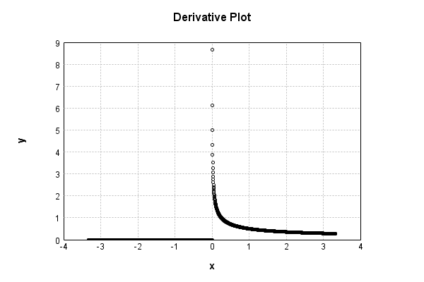

# NthPowerActivationLayer
## SqrtPowerTest
### Json Serialization
Code from [StandardLayerTests.java:68](../../../../../../../../src/main/java/com/simiacryptus/mindseye/test/StandardLayerTests.java#L68) executed in 0.00 seconds: 
```java
    JsonObject json = layer.getJson();
    NNLayer echo = NNLayer.fromJson(json);
    if ((echo == null)) throw new AssertionError("Failed to deserialize");
    if ((layer == echo)) throw new AssertionError("Serialization did not copy");
    if ((!layer.equals(echo))) throw new AssertionError("Serialization not equal");
    return new GsonBuilder().setPrettyPrinting().create().toJson(json);
```

Returns: 

```
    {
      "class": "com.simiacryptus.mindseye.layers.java.NthPowerActivationLayer",
      "id": "0173d757-f399-4cd9-9033-aa97350461da",
      "isFrozen": false,
      "name": "NthPowerActivationLayer/0173d757-f399-4cd9-9033-aa97350461da",
      "power": 0.5
    }
```


### Example Input/Output Pair
Code from [StandardLayerTests.java:152](../../../../../../../../src/main/java/com/simiacryptus/mindseye/test/StandardLayerTests.java#L152) executed in 0.00 seconds: 
```java
    SimpleEval eval = SimpleEval.run(layer, inputPrototype);
    return String.format("--------------------\nInput: \n[%s]\n--------------------\nOutput: \n%s\n--------------------\nDerivative: \n%s",
      Arrays.stream(inputPrototype).map(t -> t.prettyPrint()).reduce((a, b) -> a + ",\n" + b).get(),
      eval.getOutput().prettyPrint(),
      Arrays.stream(eval.getDerivative()).map(t -> t.prettyPrint()).reduce((a, b) -> a + ",\n" + b).get());
```

Returns: 

```
    --------------------
    Input: 
    [[
    	[ [ -0.308 ], [ 0.308 ], [ 0.004 ] ],
    	[ [ -1.164 ], [ 0.456 ], [ -1.86 ] ]
    ]]
    --------------------
    Output: 
    [
    	[ [ 0.0 ], [ 0.5549774770204643 ], [ 0.06324555320336758 ] ],
    	[ [ 0.0 ], [ 0.6752777206453653 ], [ 0.0 ] ]
    ]
    --------------------
    Derivative: 
    [
    	[ [ 0.0 ], [ 0.900937462695559 ], [ 7.905694150420949 ] ],
    	[ [ 0.0 ], [ 0.7404360971988655 ], [ 0.0 ] ]
    ]
```


### Batch Execution
Code from [StandardLayerTests.java:101](../../../../../../../../src/main/java/com/simiacryptus/mindseye/test/StandardLayerTests.java#L101) executed in 0.00 seconds: 
```java
    return getBatchingTester().test(layer, inputPrototype);
```

Returns: 

```
    ToleranceStatistics{absoluteTol=0.0000e+00 +- 0.0000e+00 [0.0000e+00 - 0.0000e+00] (120#), relativeTol=0.0000e+00 +- 0.0000e+00 [0.0000e+00 - 0.0000e+00] (52#)}
```


### Differential Validation
Code from [StandardLayerTests.java:109](../../../../../../../../src/main/java/com/simiacryptus/mindseye/test/StandardLayerTests.java#L109) executed in 0.00 seconds: 
```java
    return getDerivativeTester().test(layer, inputPrototype);
```
Logging: 
```
    Inputs: [
    	[ [ 1.324 ], [ -0.02 ], [ -0.444 ] ],
    	[ [ -1.656 ], [ 1.828 ], [ 1.004 ] ]
    ]
    Inputs Statistics: {meanExponent=-0.2411548020770072, negative=3, min=1.004, max=1.004, mean=0.33933333333333343, count=6.0, positive=3, stdDev=1.1797997946921146, zeros=0}
    Output: [
    	[ [ 1.150651989091402 ], [ 0.0 ], [ 0.0 ] ],
    	[ [ 0.0 ], [ 1.3520355024924458 ], [ 1.0019980039900278 ] ]
    ]
    Outputs Statistics: {meanExponent=0.06426631488508237, negative=0, min=1.0019980039900278, max=1.0019980039900278, mean=0.5841142492623126, count=6.0, positive=3, stdDev=0.5928551344767047, zeros=3}
    Feedback for input 0
    Inputs Values: [
    	[ [ 1.324 ], [ -0.02 ], [ -0.444 ] ],
    	[ [ -1.656 ], [ 1.828 ], [ 1.004 ] ]
    ]
    Value Statistics: {meanExponent=-0.2411548020770072, negative=3, min=1.004, max=1.004, mean=0.33933333333333343, count=6.0, positive=3, stdDev=1.1797997946921146, zeros=0}
    Implemented Feedback: [ [ 0.43453624965687393, 0.0, 0.0, 0.0, 0.0, 0.0 ], [ 0.0, 0.0, 0.0, 0.0, 0.0, 0.0 ], [ 0.0, 0.0, 0.0, 0.0, 0.0, 0.0 ], [ 0.0,
```
...[skipping 464 bytes](etc/134.txt)...
```
    .0, 0.0 ], [ 0.0, 0.0, 0.0, 0.3698077167268998, 0.0, 0.0 ], [ 0.0, 0.0, 0.0, 0.0, 0.0, 0.0 ], [ 0.0, 0.0, 0.0, 0.0, 0.0, 0.4989905652807991 ] ]
    Measured Statistics: {meanExponent=-0.3653046282990117, negative=0, min=0.4989905652807991, max=0.4989905652807991, mean=0.036203509082905545, count=36.0, positive=3, stdDev=0.12103477082416406, zeros=33}
    Feedback Error: [ [ -8.204679973256024E-6, 0.0, 0.0, 0.0, 0.0, 0.0 ], [ 0.0, 0.0, 0.0, 0.0, 0.0, 0.0 ], [ 0.0, 0.0, 0.0, 0.0, 0.0, 0.0 ], [ 0.0, 0.0, 0.0, -5.057477817205225E-6, 0.0, 0.0 ], [ 0.0, 0.0, 0.0, 0.0, 0.0, 0.0 ], [ 0.0, 0.0, 0.0, 0.0, 0.0, -1.2424754075424094E-5 ] ]
    Error Statistics: {meanExponent=-5.095905522028173, negative=3, min=-1.2424754075424094E-5, max=-1.2424754075424094E-5, mean=-7.135253296079261E-7, count=36.0, positive=0, stdDev=2.5217999904946832E-6, zeros=33}
    Finite-Difference Derivative Accuracy:
    absoluteTol: 7.1353e-07 +- 2.5218e-06 [0.0000e+00 - 1.2425e-05] (36#)
    relativeTol: 9.5762e-06 +- 2.2930e-06 [6.8379e-06 - 1.2450e-05] (3#)
    
```

Returns: 

```
    ToleranceStatistics{absoluteTol=7.1353e-07 +- 2.5218e-06 [0.0000e+00 - 1.2425e-05] (36#), relativeTol=9.5762e-06 +- 2.2930e-06 [6.8379e-06 - 1.2450e-05] (3#)}
```


### Performance
Code from [StandardLayerTests.java:119](../../../../../../../../src/main/java/com/simiacryptus/mindseye/test/StandardLayerTests.java#L119) executed in 0.14 seconds: 
```java
    getPerformanceTester().test(layer, permPrototype);
```
Logging: 
```
    100 batches
    Input Dimensions:
    	[100, 100, 1]
    Performance:
    	Evaluation performance: 0.011733s +- 0.008203s [0.007086s - 0.028128s]
    	Learning performance: 0.010501s +- 0.000203s [0.010295s - 0.010843s]
    
```

### Function Plots
Code from [ActivationLayerTestBase.java:110](../../../../../../../../src/test/java/com/simiacryptus/mindseye/layers/java/ActivationLayerTestBase.java#L110) executed in 0.00 seconds: 
```java
    return plot("Value Plot", plotData, x -> new double[]{x[0], x[1]});
```

Returns: 


Code from [ActivationLayerTestBase.java:114](../../../../../../../../src/test/java/com/simiacryptus/mindseye/layers/java/ActivationLayerTestBase.java#L114) executed in 0.00 seconds: 
```java
    return plot("Derivative Plot", plotData, x -> new double[]{x[0], x[2]});
```

Returns: 




