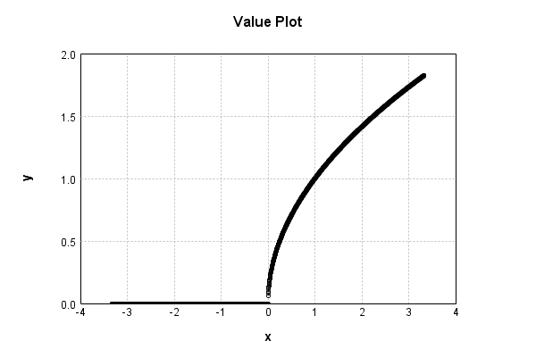

# NthPowerActivationLayer
## SqrtPowerTest
### Json Serialization
Code from [LayerTestBase.java:75](../../../../../../../../../MindsEye/src/test/java/com/simiacryptus/mindseye/layers/LayerTestBase.java#L75) executed in 0.00 seconds: 
```java
    JsonObject json = layer.getJson();
    NNLayer echo = NNLayer.fromJson(json);
    assert (echo != null) : "Failed to deserialize";
    assert (layer != echo) : "Serialization did not copy";
    Assert.assertEquals("Serialization not equal", layer, echo);
    return new GsonBuilder().setPrettyPrinting().create().toJson(json);
```

Returns: 

```
    {
      "class": "com.simiacryptus.mindseye.layers.java.NthPowerActivationLayer",
      "id": "b385277b-2d2d-42fe-8250-210c0000ed41",
      "isFrozen": false,
      "name": "NthPowerActivationLayer/b385277b-2d2d-42fe-8250-210c0000ed41",
      "power": 0.5
    }
```


### Example Input/Output Pair
Code from [LayerTestBase.java:112](../../../../../../../../../MindsEye/src/test/java/com/simiacryptus/mindseye/layers/LayerTestBase.java#L112) executed in 0.00 seconds: 
```java
    SimpleEval eval = SimpleEval.run(layer, inputPrototype);
    return String.format("--------------------\nInput: \n[%s]\n--------------------\nOutput: \n%s",
      Arrays.stream(inputPrototype).map(t->t.prettyPrint()).reduce((a,b)->a+",\n"+b).get(),
      eval.getOutput().prettyPrint());
```

Returns: 

```
    --------------------
    Input: 
    [[ 0.62, -1.12, -1.484 ]]
    --------------------
    Output: 
    [ 0.7874007874011811, 0.0, 0.0 ]
```


### Differential Validation
Code from [LayerTestBase.java:130](../../../../../../../../../MindsEye/src/test/java/com/simiacryptus/mindseye/layers/LayerTestBase.java#L130) executed in 0.00 seconds: 
```java
    getDerivativeTester().test(layer, inputPrototype);
```
Logging: 
```
    Finite-Difference Derivative Accuracy:
    absoluteTol: 2.8451e-08 +- 8.0470e-08 [0.0000e+00 - 2.5606e-07] (9#)
    relativeTol: 2.0162e-07 +- 0.0000e+00 [2.0162e-07 - 2.0162e-07] (1#)
    
```

### Performance
Code from [LayerTestBase.java:135](../../../../../../../../../MindsEye/src/test/java/com/simiacryptus/mindseye/layers/LayerTestBase.java#L135) executed in 0.03 seconds: 
```java
    getPerformanceTester().test(layer, inputPrototype);
```
Logging: 
```
    Evaluation performance: 0.0137 +- 0.0091 [0.0085 - 0.5899]
    Learning performance: 0.0010 +- 0.0026 [0.0000 - 0.1852]
    
```

### Function Plots
Code from [ActivationLayerTestBase.java:73](../../../../../../../../../MindsEye/src/test/java/com/simiacryptus/mindseye/layers/java/ActivationLayerTestBase.java#L73) executed in 0.00 seconds: 
```java
    return plot("Value Plot", plotData, x -> new double[]{x[0], x[1]});
```

Returns: 




Code from [ActivationLayerTestBase.java:77](../../../../../../../../../MindsEye/src/test/java/com/simiacryptus/mindseye/layers/java/ActivationLayerTestBase.java#L77) executed in 0.00 seconds: 
```java
    return plot("Derivative Plot", plotData, x -> new double[]{x[0], x[2]});
```

Returns: 


