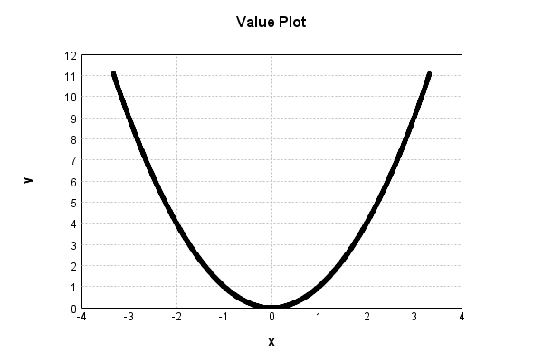

# NthPowerActivationLayer
## SquarePowerTest
### Json Serialization
Code from [StandardLayerTests.java:69](../../../../../../../../src/main/java/com/simiacryptus/mindseye/test/StandardLayerTests.java#L69) executed in 0.00 seconds: 
```java
    JsonObject json = layer.getJson();
    NNLayer echo = NNLayer.fromJson(json);
    if ((echo == null)) throw new AssertionError("Failed to deserialize");
    if ((layer == echo)) throw new AssertionError("Serialization did not copy");
    if ((!layer.equals(echo))) throw new AssertionError("Serialization not equal");
    return new GsonBuilder().setPrettyPrinting().create().toJson(json);
```

Returns: 

```
    {
      "class": "com.simiacryptus.mindseye.layers.java.NthPowerActivationLayer",
      "id": "604c0480-f6fa-4534-b1af-d0ab917b11aa",
      "isFrozen": false,
      "name": "NthPowerActivationLayer/604c0480-f6fa-4534-b1af-d0ab917b11aa",
      "power": 2.0
    }
```


### Example Input/Output Pair
Code from [StandardLayerTests.java:153](../../../../../../../../src/main/java/com/simiacryptus/mindseye/test/StandardLayerTests.java#L153) executed in 0.00 seconds: 
```java
    SimpleEval eval = SimpleEval.run(layer, inputPrototype);
    return String.format("--------------------\nInput: \n[%s]\n--------------------\nOutput: \n%s\n--------------------\nDerivative: \n%s",
      Arrays.stream(inputPrototype).map(t -> t.prettyPrint()).reduce((a, b) -> a + ",\n" + b).get(),
      eval.getOutput().prettyPrint(),
      Arrays.stream(eval.getDerivative()).map(t -> t.prettyPrint()).reduce((a, b) -> a + ",\n" + b).get());
```

Returns: 

```
    --------------------
    Input: 
    [[
    	[ [ 1.776 ], [ -1.356 ], [ -1.832 ] ],
    	[ [ -1.676 ], [ 0.308 ], [ -0.66 ] ]
    ]]
    --------------------
    Output: 
    [
    	[ [ 3.154176 ], [ 1.8387360000000001 ], [ 3.356224 ] ],
    	[ [ 2.808976 ], [ 0.094864 ], [ 0.43560000000000004 ] ]
    ]
    --------------------
    Derivative: 
    [
    	[ [ 3.552 ], [ -2.712 ], [ -3.664 ] ],
    	[ [ -3.352 ], [ 0.616 ], [ -1.32 ] ]
    ]
```


### Batch Execution
Code from [StandardLayerTests.java:102](../../../../../../../../src/main/java/com/simiacryptus/mindseye/test/StandardLayerTests.java#L102) executed in 0.00 seconds: 
```java
    return getBatchingTester().test(layer, inputPrototype);
```

Returns: 

```
    ToleranceStatistics{absoluteTol=0.0000e+00 +- 0.0000e+00 [0.0000e+00 - 0.0000e+00] (120#), relativeTol=0.0000e+00 +- 0.0000e+00 [0.0000e+00 - 0.0000e+00] (120#)}
```


### Differential Validation
Code from [StandardLayerTests.java:110](../../../../../../../../src/main/java/com/simiacryptus/mindseye/test/StandardLayerTests.java#L110) executed in 0.00 seconds: 
```java
    return getDerivativeTester().test(layer, inputPrototype);
```
Logging: 
```
    Inputs: [
    	[ [ 1.88 ], [ -0.392 ], [ -0.284 ] ],
    	[ [ -0.18 ], [ -1.408 ], [ -1.932 ] ]
    ]
    Inputs Statistics: {meanExponent=-0.16489257694665857, negative=5, min=-1.932, max=-1.932, mean=-0.38599999999999995, count=6.0, positive=1, stdDev=1.1987654760905766, zeros=0}
    Output: [
    	[ [ 3.5343999999999998 ], [ 0.15366400000000002 ], [ 0.08065599999999999 ] ],
    	[ [ 0.0324 ], [ 1.9824639999999998 ], [ 3.732624 ] ]
    ]
    Outputs Statistics: {meanExponent=-0.3297851538933171, negative=0, min=3.732624, max=3.732624, mean=1.5860346666666667, count=6.0, positive=6, stdDev=1.5964941167389943, zeros=0}
    Feedback for input 0
    Inputs Values: [
    	[ [ 1.88 ], [ -0.392 ], [ -0.284 ] ],
    	[ [ -0.18 ], [ -1.408 ], [ -1.932 ] ]
    ]
    Value Statistics: {meanExponent=-0.16489257694665857, negative=5, min=-1.932, max=-1.932, mean=-0.38599999999999995, count=6.0, positive=1, stdDev=1.1987654760905766, zeros=0}
    Implemented Feedback: [ [ 3.76, 0.0, 0.0, 0.0, 0.0, 0.0 ], [ 0.0, -0.36, 0.0, 0.0, 0.0, 0.0 ], [ 0.0, 0.0, -0.784, 0.0, 0.0, 0.0 ], 
```
...[skipping 518 bytes](etc/93.txt)...
```
     0.0, 0.0, 0.0, 0.0, -0.5679000000000101, 0.0 ], [ 0.0, 0.0, 0.0, 0.0, 0.0, -3.8639000000006973 ] ]
    Measured Statistics: {meanExponent=0.1360928134736643, negative=5, min=-3.8639000000006973, max=-3.8639000000006973, mean=-0.1286500000001043, count=36.0, positive=1, stdDev=1.0201862037280662, zeros=30}
    Feedback Error: [ [ 9.999999649146218E-5, 0.0, 0.0, 0.0, 0.0, 0.0 ], [ 0.0, 1.0000000000365272E-4, 0.0, 0.0, 0.0, 0.0 ], [ 0.0, 0.0, 9.999999988496988E-5, 0.0, 0.0, 0.0 ], [ 0.0, 0.0, 0.0, 1.0000000057264202E-4, 0.0, 0.0 ], [ 0.0, 0.0, 0.0, 0.0, 9.999999998988596E-5, 0.0 ], [ 0.0, 0.0, 0.0, 0.0, 0.0, 9.999999930254688E-5 ] ]
    Error Statistics: {meanExponent=-4.000000002717845, negative=0, min=9.999999930254688E-5, max=9.999999930254688E-5, mean=1.6666666562365544E-5, count=36.0, positive=6, stdDev=3.7267799391772104E-5, zeros=30}
    Finite-Difference Derivative Accuracy:
    absoluteTol: 1.6667e-05 +- 3.7268e-05 [0.0000e+00 - 1.0000e-04] (36#)
    relativeTol: 5.5786e-05 +- 4.6727e-05 [1.2940e-05 - 1.3891e-04] (6#)
    
```

Returns: 

```
    ToleranceStatistics{absoluteTol=1.6667e-05 +- 3.7268e-05 [0.0000e+00 - 1.0000e-04] (36#), relativeTol=5.5786e-05 +- 4.6727e-05 [1.2940e-05 - 1.3891e-04] (6#)}
```


### Performance
Code from [StandardLayerTests.java:120](../../../../../../../../src/main/java/com/simiacryptus/mindseye/test/StandardLayerTests.java#L120) executed in 0.00 seconds: 
```java
    getPerformanceTester().test(layer, permPrototype);
```
Logging: 
```
    Evaluation performance: 0.000171s +- 0.000013s [0.000147s - 0.000183s]
    Learning performance: 0.000043s +- 0.000002s [0.000041s - 0.000046s]
    
```

### Function Plots
Code from [ActivationLayerTestBase.java:103](../../../../../../../../src/test/java/com/simiacryptus/mindseye/layers/java/ActivationLayerTestBase.java#L103) executed in 0.00 seconds: 
```java
    return plot("Value Plot", plotData, x -> new double[]{x[0], x[1]});
```

Returns: 




Code from [ActivationLayerTestBase.java:107](../../../../../../../../src/test/java/com/simiacryptus/mindseye/layers/java/ActivationLayerTestBase.java#L107) executed in 0.00 seconds: 
```java
    return plot("Derivative Plot", plotData, x -> new double[]{x[0], x[2]});
```

Returns: 


