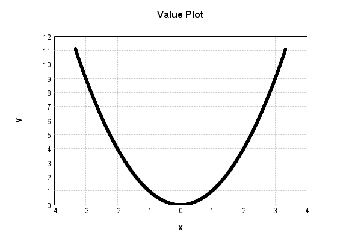
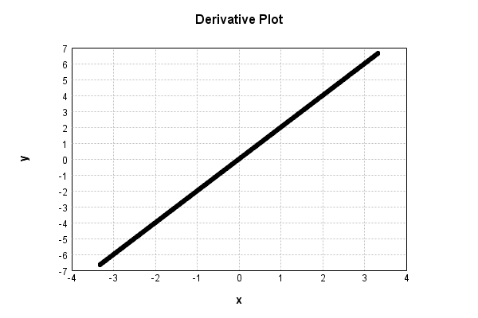

# NthPowerActivationLayer
## SquarePowerTest
### Json Serialization
Code from [LayerTestBase.java:83](../../../../../../../../../MindsEye/src/test/java/com/simiacryptus/mindseye/layers/LayerTestBase.java#L83) executed in 0.00 seconds: 
```java
    JsonObject json = layer.getJson();
    NNLayer echo = NNLayer.fromJson(json);
    assert (echo != null) : "Failed to deserialize";
    assert (layer != echo) : "Serialization did not copy";
    Assert.assertEquals("Serialization not equal", layer, echo);
    return new GsonBuilder().setPrettyPrinting().create().toJson(json);
```

Returns: 

```
    {
      "class": "com.simiacryptus.mindseye.layers.java.NthPowerActivationLayer",
      "id": "370a9587-74a1-4959-b406-fa4500002c60",
      "isFrozen": false,
      "name": "NthPowerActivationLayer/370a9587-74a1-4959-b406-fa4500002c60",
      "power": 2.0
    }
```


### Example Input/Output Pair
Code from [LayerTestBase.java:120](../../../../../../../../../MindsEye/src/test/java/com/simiacryptus/mindseye/layers/LayerTestBase.java#L120) executed in 0.00 seconds: 
```java
    SimpleEval eval = SimpleEval.run(layer, inputPrototype);
    return String.format("--------------------\nInput: \n[%s]\n--------------------\nOutput: \n%s",
      Arrays.stream(inputPrototype).map(t->t.prettyPrint()).reduce((a,b)->a+",\n"+b).get(),
      eval.getOutput().prettyPrint());
```

Returns: 

```
    --------------------
    Input: 
    [[
    	[ [ 0.604 ], [ 1.724 ], [ -1.456 ] ],
    	[ [ -0.116 ], [ -1.172 ], [ 1.576 ] ]
    ]]
    --------------------
    Output: 
    [
    	[ [ 0.364816 ], [ 2.9721759999999997 ], [ 2.119936 ] ],
    	[ [ 0.013456000000000001 ], [ 1.373584 ], [ 2.483776 ] ]
    ]
```


### Batch Execution
Code from [LayerTestBase.java:138](../../../../../../../../../MindsEye/src/test/java/com/simiacryptus/mindseye/layers/LayerTestBase.java#L138) executed in 0.00 seconds: 
```java
    BatchingTester batchingTester = getBatchingTester();
    return batchingTester==null?null:batchingTester.test(layer, inputPrototype);
```

Returns: 

```
    ToleranceStatistics{absoluteTol=0.0000e+00 +- 0.0000e+00 [0.0000e+00 - 0.0000e+00] (120#), relativeTol=0.0000e+00 +- 0.0000e+00 [0.0000e+00 - 0.0000e+00] (120#)}
```


### Differential Validation
Code from [LayerTestBase.java:144](../../../../../../../../../MindsEye/src/test/java/com/simiacryptus/mindseye/layers/LayerTestBase.java#L144) executed in 0.00 seconds: 
```java
    return getDerivativeTester().test(layer, inputPrototype);
```
Logging: 
```
    Inputs: [
    	[ [ 0.604 ], [ 1.724 ], [ -1.456 ] ],
    	[ [ -0.116 ], [ -1.172 ], [ 1.576 ] ]
    ]
    Inputs Statistics: {meanExponent=-0.08138710180843813, negative=3, min=1.576, max=1.576, mean=0.19333333333333333, count=6.0, positive=3, stdDev=1.231765489946127, zeros=0}
    Output: [
    	[ [ 0.364816 ], [ 2.9721759999999997 ], [ 2.119936 ] ],
    	[ [ 0.013456000000000001 ], [ 1.373584 ], [ 2.483776 ] ]
    ]
    Outputs Statistics: {meanExponent=-0.16277420361687625, negative=0, min=2.483776, max=2.483776, mean=1.5546239999999998, count=6.0, positive=6, stdDev=1.0813550243282735, zeros=0}
    Feedback for input 0
    Inputs Values: [
    	[ [ 0.604 ], [ 1.724 ], [ -1.456 ] ],
    	[ [ -0.116 ], [ -1.172 ], [ 1.576 ] ]
    ]
    Value Statistics: {meanExponent=-0.08138710180843813, negative=3, min=1.576, max=1.576, mean=0.19333333333333333, count=6.0, positive=3, stdDev=1.231765489946127, zeros=0}
    Implemented Feedback: [ [ 1.208, 0.0, 0.0, 0.0, 0.0, 0.0 ], [ 0.0, -0.232, 0.0, 0.0, 0.0, 0.0 ], [ 0.0, 0.0, 3.448, 0.0, 0.0, 0.0 ], [ 0.0, 0.0, 0.0, -2.344, 0.0, 0.0 ], [ 0.0, 0.0, 0.0, 0.0, -2.912, 0.0 ], [ 0.0, 0.0, 0.0, 0.0, 0.0, 3.152 ] ]
    Implemented Statistics: {meanExponent=0.21964289385554303, negative=3, min=3.152, max=3.152, mean=0.06444444444444444, count=36.0, positive=3, stdDev=1.016003402346787, zeros=30}
    Measured Feedback: [ [ 1.2080999999997122, 0.0, 0.0, 0.0, 0.0, 0.0 ], [ 0.0, -0.23190000000001057, 0.0, 0.0, 0.0, 0.0 ], [ 0.0, 0.0, 3.448100000000842, 0.0, 0.0, 0.0 ], [ 0.0, 0.0, 0.0, -2.3439000000013976, 0.0, 0.0 ], [ 0.0, 0.0, 0.0, 0.0, -2.9118999999999673, 0.0 ], [ 0.0, 0.0, 0.0, 0.0, 0.0, 3.1521000000012123 ] ]
    Measured Statistics: {meanExponent=0.21961650131927676, negative=3, min=3.1521000000012123, max=3.1521000000012123, mean=0.06446111111112199, count=36.0, positive=3, stdDev=1.0160086887967084, zeros=30}
    Feedback Error: [ [ 9.999999971221918E-5, 0.0, 0.0, 0.0, 0.0, 0.0 ], [ 0.0, 9.999999998944187E-5, 0.0, 0.0, 0.0, 0.0 ], [ 0.0, 0.0, 1.0000000084220417E-4, 0.0, 0.0, 0.0 ], [ 0.0, 0.0, 0.0, 9.99999986022182E-5, 0.0, 0.0 ], [ 0.0, 0.0, 0.0, 0.0, 1.0000000003262954E-4, 0.0 ], [ 0.0, 0.0, 0.0, 0.0, 0.0, 1.0000000121213048E-4 ] ]
    Error Statistics: {meanExponent=-3.999999999717098, negative=0, min=1.0000000121213048E-4, max=1.0000000121213048E-4, mean=1.6666666677523428E-5, count=36.0, positive=6, stdDev=3.726779964927295E-5, zeros=30}
    Finite-Difference Derivative Accuracy:
    absoluteTol: 1.6667e-05 +- 3.7268e-05 [0.0000e+00 - 1.0000e-04] (36#)
    relativeTol: 5.4303e-05 +- 7.2686e-05 [1.4501e-05 - 2.1556e-04] (6#)
    
```

Returns: 

```
    ToleranceStatistics{absoluteTol=1.6667e-05 +- 3.7268e-05 [0.0000e+00 - 1.0000e-04] (36#), relativeTol=5.4303e-05 +- 7.2686e-05 [1.4501e-05 - 2.1556e-04] (6#)}
```


### Performance
Code from [LayerTestBase.java:149](../../../../../../../../../MindsEye/src/test/java/com/simiacryptus/mindseye/layers/LayerTestBase.java#L149) executed in 0.00 seconds: 
```java
    getPerformanceTester().test(layer, inputPrototype);
```
Logging: 
```
    Evaluation performance: 0.1472 +- 0.0314 [0.1054 - 0.3619]
    Learning performance: 0.0019 +- 0.0016 [0.0000 - 0.0057]
    
```

### Function Plots
Code from [ActivationLayerTestBase.java:74](../../../../../../../../../MindsEye/src/test/java/com/simiacryptus/mindseye/layers/java/ActivationLayerTestBase.java#L74) executed in 0.00 seconds: 
```java
    return plot("Value Plot", plotData, x -> new double[]{x[0], x[1]});
```

Returns: 




Code from [ActivationLayerTestBase.java:78](../../../../../../../../../MindsEye/src/test/java/com/simiacryptus/mindseye/layers/java/ActivationLayerTestBase.java#L78) executed in 0.00 seconds: 
```java
    return plot("Derivative Plot", plotData, x -> new double[]{x[0], x[2]});
```

Returns: 




