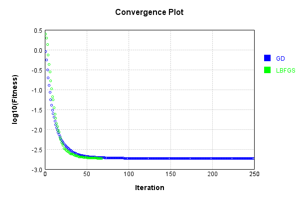
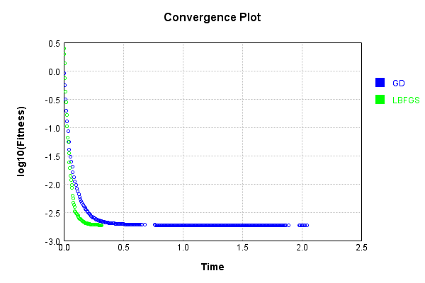

# NthPowerActivationLayer
## SquarePowerTest
### Json Serialization
Code from [JsonTest.java:36](../../../../../../../../src/main/java/com/simiacryptus/mindseye/test/unit/JsonTest.java#L36) executed in 0.00 seconds: 
```java
    JsonObject json = layer.getJson();
    NNLayer echo = NNLayer.fromJson(json);
    if ((echo == null)) throw new AssertionError("Failed to deserialize");
    if ((layer == echo)) throw new AssertionError("Serialization did not copy");
    if ((!layer.equals(echo))) throw new AssertionError("Serialization not equal");
    return new GsonBuilder().setPrettyPrinting().create().toJson(json);
```

Returns: 

```
    {
      "class": "com.simiacryptus.mindseye.layers.java.NthPowerActivationLayer",
      "id": "8ed0f9bc-1a25-4960-8f60-341ec148029c",
      "isFrozen": false,
      "name": "NthPowerActivationLayer/8ed0f9bc-1a25-4960-8f60-341ec148029c",
      "power": 2.0
    }
```


### Example Input/Output Pair
Code from [ReferenceIO.java:68](../../../../../../../../src/main/java/com/simiacryptus/mindseye/test/unit/ReferenceIO.java#L68) executed in 0.00 seconds: 
```java
    SimpleEval eval = SimpleEval.run(layer, inputPrototype);
    return String.format("--------------------\nInput: \n[%s]\n--------------------\nOutput: \n%s\n--------------------\nDerivative: \n%s",
      Arrays.stream(inputPrototype).map(t -> t.prettyPrint()).reduce((a, b) -> a + ",\n" + b).get(),
      eval.getOutput().prettyPrint(),
      Arrays.stream(eval.getDerivative()).map(t -> t.prettyPrint()).reduce((a, b) -> a + ",\n" + b).get());
```

Returns: 

```
    --------------------
    Input: 
    [[
    	[ [ 1.972 ], [ 0.072 ], [ -0.852 ] ],
    	[ [ 1.744 ], [ -0.692 ], [ -0.204 ] ]
    ]]
    --------------------
    Output: 
    [
    	[ [ 3.888784 ], [ 0.005183999999999999 ], [ 0.725904 ] ],
    	[ [ 3.041536 ], [ 0.47886399999999996 ], [ 0.04161599999999999 ] ]
    ]
    --------------------
    Derivative: 
    [
    	[ [ 3.944 ], [ 0.144 ], [ -1.704 ] ],
    	[ [ 3.488 ], [ -1.384 ], [ -0.408 ] ]
    ]
```


### Batch Execution
Code from [BatchingTester.java:66](../../../../../../../../src/main/java/com/simiacryptus/mindseye/test/unit/BatchingTester.java#L66) executed in 0.00 seconds: 
```java
    return test(reference, inputPrototype);
```

Returns: 

```
    ToleranceStatistics{absoluteTol=0.0000e+00 +- 0.0000e+00 [0.0000e+00 - 0.0000e+00] (120#), relativeTol=0.0000e+00 +- 0.0000e+00 [0.0000e+00 - 0.0000e+00] (120#)}
```


Code from [SingleDerivativeTester.java:77](../../../../../../../../src/main/java/com/simiacryptus/mindseye/test/unit/SingleDerivativeTester.java#L77) executed in 0.00 seconds: 
```java
    return test(component, inputPrototype);
```
Logging: 
```
    Inputs: [
    	[ [ -0.972 ], [ -0.08 ], [ 0.98 ] ],
    	[ [ 1.868 ], [ -0.6 ], [ -1.152 ] ]
    ]
    Inputs Statistics: {meanExponent=-0.1678395118373959, negative=4, min=-1.152, max=-1.152, mean=0.0073333333333333766, count=6.0, positive=2, stdDev=1.0868754400676384, zeros=0}
    Output: [
    	[ [ 0.944784 ], [ 0.0064 ], [ 0.9603999999999999 ] ],
    	[ [ 3.4894240000000005 ], [ 0.36 ], [ 1.3271039999999998 ] ]
    ]
    Outputs Statistics: {meanExponent=-0.3356790236747918, negative=0, min=1.3271039999999998, max=1.3271039999999998, mean=1.1813520000000002, count=6.0, positive=6, stdDev=1.118656598918542, zeros=0}
    Feedback for input 0
    Inputs Values: [
    	[ [ -0.972 ], [ -0.08 ], [ 0.98 ] ],
    	[ [ 1.868 ], [ -0.6 ], [ -1.152 ] ]
    ]
    Value Statistics: {meanExponent=-0.1678395118373959, negative=4, min=-1.152, max=-1.152, mean=0.0073333333333333766, count=6.0, positive=2, stdDev=1.0868754400676384, zeros=0}
    Implemented Feedback: [ [ -1.944, 0.0, 0.0, 0.0, 0.0, 0.0 ], [ 0.0, 3.736, 0.0, 0.0, 0.0, 0.0 ], [ 0.0, 0.0, -0.16, 0.0, 0.0, 0.0 ], [ 
```
...[skipping 514 bytes](etc/367.txt)...
```
    .0, 0.0, 0.0, 0.0, 1.9601000000002422, 0.0 ], [ 0.0, 0.0, 0.0, 0.0, 0.0, -2.3039000000002474 ] ]
    Measured Statistics: {meanExponent=0.1331379637098278, negative=4, min=-2.3039000000002474, max=-2.3039000000002474, mean=0.0024611111111167367, count=36.0, positive=2, stdDev=0.8874471440529628, zeros=30}
    Feedback Error: [ [ 1.000000001125656E-4, 0.0, 0.0, 0.0, 0.0, 0.0 ], [ 0.0, 1.0000000024179556E-4, 0.0, 0.0, 0.0, 0.0 ], [ 0.0, 0.0, 9.999999999552034E-5, 0.0, 0.0, 0.0 ], [ 0.0, 0.0, 0.0, 9.999999985743635E-5, 0.0, 0.0 ], [ 0.0, 0.0, 0.0, 0.0, 1.0000000024223965E-4, 0.0 ], [ 0.0, 0.0, 0.0, 0.0, 0.0, 9.999999975240925E-5 ] ]
    Error Statistics: {meanExponent=-3.9999999998538116, negative=0, min=9.999999975240925E-5, max=9.999999975240925E-5, mean=1.6666666672276855E-5, count=36.0, positive=6, stdDev=3.7267799637541255E-5, zeros=30}
    Finite-Difference Derivative Accuracy:
    absoluteTol: 1.6667e-05 +- 3.7268e-05 [0.0000e+00 - 1.0000e-04] (36#)
    relativeTol: 7.3430e-05 +- 1.0729e-04 [1.3383e-05 - 3.1260e-04] (6#)
    
```

Returns: 

```
    ToleranceStatistics{absoluteTol=1.6667e-05 +- 3.7268e-05 [0.0000e+00 - 1.0000e-04] (36#), relativeTol=7.3430e-05 +- 1.0729e-04 [1.3383e-05 - 3.1260e-04] (6#)}
```


### Performance
Now we execute larger-scale runs to benchmark performance:

Code from [PerformanceTester.java:66](../../../../../../../../src/main/java/com/simiacryptus/mindseye/test/unit/PerformanceTester.java#L66) executed in 0.10 seconds: 
```java
    test(component, inputPrototype);
```
Logging: 
```
    100 batches
    Input Dimensions:
    	[100, 100, 1]
    Performance:
    	Evaluation performance: 0.005887s +- 0.005018s [0.002738s - 0.015898s]
    	Learning performance: 0.012069s +- 0.000126s [0.011926s - 0.012280s]
    
```

### Input Learning
In this test, we use a network to learn this target input, given it's pre-evaluated output:

Code from [LearningTester.java:127](../../../../../../../../src/main/java/com/simiacryptus/mindseye/test/unit/LearningTester.java#L127) executed in 0.00 seconds: 
```java
    return Arrays.stream(input_target).map(x -> x.prettyPrint()).reduce((a, b) -> a + "\n" + b).orElse("");
```

Returns: 

```
    [
    	[ [ 0.276 ], [ 0.876 ], [ 1.2 ], [ 1.808 ], [ 0.74 ], [ 1.676 ], [ -1.376 ], [ 1.856 ], ... ],
    	[ [ -1.224 ], [ 1.528 ], [ 1.128 ], [ 0.788 ], [ 1.828 ], [ -0.692 ], [ 1.724 ], [ 0.288 ], ... ],
    	[ [ -1.732 ], [ -0.528 ], [ 0.512 ], [ 1.792 ], [ 0.136 ], [ 0.536 ], [ -1.808 ], [ -0.78 ], ... ],
    	[ [ 0.9 ], [ -1.732 ], [ 0.908 ], [ -1.792 ], [ -1.824 ], [ -1.968 ], [ -0.24 ], [ 0.344 ], ... ],
    	[ [ -0.788 ], [ 1.576 ], [ 0.816 ], [ -1.316 ], [ -1.556 ], [ -1.072 ], [ 0.544 ], [ 0.952 ], ... ],
    	[ [ 1.28 ], [ -1.152 ], [ 1.556 ], [ -1.86 ], [ -1.18 ], [ -1.396 ], [ -1.76 ], [ 1.736 ], ... ],
    	[ [ 1.148 ], [ 0.796 ], [ 0.304 ], [ -0.092 ], [ -0.176 ], [ -0.256 ], [ -1.964 ], [ -0.708 ], ... ],
    	[ [ 0.508 ], [ -0.54 ], [ 1.004 ], [ 1.38 ], [ -1.2 ], [ -0.896 ], [ -1.62 ], [ 1.38 ], ... ],
    	...
    ]
```


First, we use a conjugate gradient descent method, which converges the fastest for purely linear functions.

Code from [LearningTester.java:300](../../../../../../../../src/main/java/com/simiacryptus/mindseye/test/unit/LearningTester.java#L300) executed in 2.07 seconds: 
```java
    return new IterativeTrainer(trainable)
      .setLineSearchFactory(label -> new QuadraticSearch())
      .setOrientation(new GradientDescent())
      .setMonitor(monitor)
      .setTimeout(30, TimeUnit.SECONDS)
      .setMaxIterations(250)
      .setTerminateThreshold(0)
      .run();
```
Logging: 
```
    Constructing line search parameters: GD
    F(0.0) = LineSearchPoint{point=PointSample{avg=2.8806321452061185}, derivative=-0.007967402432461653}
    New Minimum: 2.8806321452061185 > 2.88063214520532
    F(1.0E-10) = LineSearchPoint{point=PointSample{avg=2.88063214520532}, derivative=-0.007967402432459083}, delta = -7.984723993104126E-13
    New Minimum: 2.88063214520532 > 2.8806321452005297
    F(7.000000000000001E-10) = LineSearchPoint{point=PointSample{avg=2.8806321452005297}, derivative=-0.007967402432443661}, delta = -5.588862705963038E-12
    New Minimum: 2.8806321452005297 > 2.8806321451670795
    F(4.900000000000001E-9) = LineSearchPoint{point=PointSample{avg=2.8806321451670795}, derivative=-0.007967402432335707}, delta = -3.9038994259499304E-11
    New Minimum: 2.8806321451670795 > 2.880632144932837
    F(3.430000000000001E-8) = LineSearchPoint{point=PointSample{avg=2.880632144932837}, derivative=-0.007967402431580029}, delta = -2.732813975114823E-10
    New Minimum: 2.880632144932837 > 2.8806321432931448
    F(2.4010000000000004E-
```
...[skipping 285919 bytes](etc/368.txt)...
```
    eSearchPoint{point=PointSample{avg=0.0018539914881911272}, derivative=-4.1044833123958733E-11}, delta = -1.578121675612637E-8
    F(2032.2294813636483) = LineSearchPoint{point=PointSample{avg=0.0018540592065535736}, derivative=1.1883105984023088E-10}, delta = 5.1937145690303735E-8
    F(156.32534472028064) = LineSearchPoint{point=PointSample{avg=0.0018539978112932808}, derivative=-5.3334446418240877E-11}, delta = -9.45811460249281E-9
    F(1094.2774130419646) = LineSearchPoint{point=PointSample{avg=0.0018539881381920676}, derivative=3.271838215576251E-11}, delta = -1.9131215815747574E-8
    0.0018539881381920676 <= 0.0018540072694078833
    New Minimum: 0.001853984114485883 > 0.0018539823056657537
    F(737.6355197179972) = LineSearchPoint{point=PointSample{avg=0.0018539823056657537}, derivative=-8.915143736671465E-15}, delta = -2.4963742129664387E-8
    Left bracket at 737.6355197179972
    Converged to left
    Iteration 250 complete. Error: 0.0018539823056657537 Total: 249839016714069.0000; Orientation: 0.0006; Line Search: 0.0149
    
```

Returns: 

```
    0.0018539823056657537
```


This training run resulted in the following regressed input:

Code from [LearningTester.java:144](../../../../../../../../src/main/java/com/simiacryptus/mindseye/test/unit/LearningTester.java#L144) executed in 0.00 seconds: 
```java
    return Arrays.stream(input_gd).map(x -> x.prettyPrint()).reduce((a, b) -> a + "\n" + b).orElse("");
```

Returns: 

```
    [
    	[ [ -0.27600020517536866 ], [ -0.876 ], [ -1.2 ], [ -1.8079999999999998 ], [ -0.7399999999999999 ], [ 1.676 ], [ -1.376 ], [ -1.856 ], ... ],
    	[ [ -1.224 ], [ 1.528 ], [ -1.128 ], [ 0.7879999999999999 ], [ -1.828 ], [ 0.6920000000000001 ], [ -1.724 ], [ -0.2879928190137255 ], ... ],
    	[ [ -1.732 ], [ -0.5279999999999997 ], [ -0.5119999999999997 ], [ 1.792 ], [ -0.14255660314405966 ], [ 0.5360000000000004 ], [ 1.8080000000000003 ], [ 0.7799999999999999 ], ... ],
    	[ [ -0.9 ], [ 1.732 ], [ 0.908 ], [ 1.792 ], [ -1.8240000000000003 ], [ -1.9679999999777569 ], [ 0.24005996183755135 ], [ 0.3440000213640338 ], ... ],
    	[ [ 0.7879999999999999 ], [ -1.576 ], [ -0.8159999999999998 ], [ 1.316 ], [ 1.556 ], [ -1.072 ], [ 0.5440000000000003 ], [ 0.952 ], ... ],
    	[ [ 1.28 ], [ 1.152 ], [ -1.556 ], [ -1.8599999999999999 ], [ 1.18 ], [ 1.396 ], [ -1.76 ], [ -1.736 ], ... ],
    	[ [ -1.148 ], [ -0.7959999999999999 ], [ -0.30399976752961455 ], [ 0.04578751319206673 ], [ 0.17746193403483887 ], [ 0.25601251656078844 ], [ -1.9639999999895896 ], [ -0.7080000000000001 ], ... ],
    	[ [ 0.5079999999999997 ], [ 0.5399999999999997 ], [ -1.004 ], [ 1.38 ], [ 1.2 ], [ -0.8960000000000001 ], [ -1.62 ], [ 1.38 ], ... ],
    	...
    ]
```


Next, we run the same optimization using L-BFGS, which is nearly ideal for purely second-order or quadratic functions.

Code from [LearningTester.java:324](../../../../../../../../src/main/java/com/simiacryptus/mindseye/test/unit/LearningTester.java#L324) executed in 0.33 seconds: 
```java
    return new IterativeTrainer(trainable)
      .setLineSearchFactory(label -> new ArmijoWolfeSearch())
      .setOrientation(new LBFGS())
      .setMonitor(monitor)
      .setTimeout(30, TimeUnit.SECONDS)
      .setMaxIterations(250)
      .setTerminateThreshold(0)
      .run();
```
Logging: 
```
    LBFGS Accumulation History: 1 points
    Constructing line search parameters: GD
    th(0)=2.8806321452061185;dx=-0.007967402432461653
    New Minimum: 2.8806321452061185 > 2.8635264487795777
    WOLFE (weak): th(2.154434690031884)=2.8635264487795777; dx=-0.007912166042972305 delta=0.017105696426540806
    New Minimum: 2.8635264487795777 > 2.8465394548262
    WOLFE (weak): th(4.308869380063768)=2.8465394548262; dx=-0.00785720868821805 delta=0.034092690379918356
    New Minimum: 2.8465394548262 > 2.7797665223326566
    WOLFE (weak): th(12.926608140191302)=2.7797665223326566; dx=-0.007640154083779282 delta=0.1008656228734619
    New Minimum: 2.7797665223326566 > 2.5016600343510236
    END: th(51.70643256076521)=2.5016600343510236; dx=-0.006717170755006521 delta=0.37897211085509497
    Iteration 1 complete. Error: 2.5016600343510236 Total: 249839035585337.9700; Orientation: 0.0005; Line Search: 0.0060
    LBFGS Accumulation History: 1 points
    th(0)=2.5016600343510236;dx=-0.00570034830181682
    New Minimum: 2.5016600343510236 > 1.953567374696739
    END
```
...[skipping 33496 bytes](etc/369.txt)...
```
    8641135411022; dx=-1.2169781706476214E-9 delta=1.7034655380317697E-6
    New Minimum: 0.0018758641135411022 > 0.001872718870932908
    END: th(4096.716779681833)=0.001872718870932908; dx=-1.0832175357633065E-9 delta=4.848708146225908E-6
    Iteration 67 complete. Error: 0.001872718870932908 Total: 249839349888289.6600; Orientation: 0.0005; Line Search: 0.0045
    LBFGS Accumulation History: 1 points
    th(0)=0.001872718870932908;dx=-9.464838455302524E-10
    New Minimum: 0.001872718870932908 > 0.0018670960524056412
    END: th(8826.108745382247)=0.0018670960524056412; dx=-3.11835641916006E-10 delta=5.622818527266848E-6
    Iteration 68 complete. Error: 0.0018670960524056412 Total: 249839353250464.6600; Orientation: 0.0005; Line Search: 0.0023
    LBFGS Accumulation History: 1 points
    th(0)=0.0018670960524056412;dx=-8.543748532006832E-9
    MAX ALPHA: th(0)=0.0018670960524056412;th'(0)=-8.543748532006832E-9;
    Iteration 69 failed, aborting. Error: 0.0018670960524056412 Total: 249839356393775.6600; Orientation: 0.0005; Line Search: 0.0021
    
```

Returns: 

```
    0.0018670960524056412
```


This training run resulted in the following regressed input:

Code from [LearningTester.java:154](../../../../../../../../src/main/java/com/simiacryptus/mindseye/test/unit/LearningTester.java#L154) executed in 0.00 seconds: 
```java
    return Arrays.stream(input_lbgfs).map(x -> x.prettyPrint()).reduce((a, b) -> a + "\n" + b).orElse("");
```

Returns: 

```
    [
    	[ [ -0.27602686664939735 ], [ -0.876 ], [ -1.2 ], [ -1.8079999964444684 ], [ -0.7399999999948728 ], [ 1.6760000000045836 ], [ -1.376 ], [ -1.855999999867326 ], ... ],
    	[ [ -1.224 ], [ 1.5279999999998966 ], [ -1.128 ], [ 0.78799999999985 ], [ -1.8279999963282194 ], [ 0.6919999999834734 ], [ -1.7240000000344264 ], [ -0.28654235807084094 ], ... ],
    	[ [ -1.7319999999474005 ], [ -0.5280000000007887 ], [ -0.5120000001056024 ], [ 1.7920000000436391 ], [ -0.16356189067687057 ], [ 0.5359999999998711 ], [ 1.808000009764706 ], [ -0.7799999999996662 ], ... ],
    	[ [ -0.9 ], [ 1.7320000000038833 ], [ 0.908 ], [ 1.791999994591837 ], [ -1.82400001349231 ], [ -1.9682301318215196 ], [ 0.24256345571337734 ], [ 0.3440237481266408 ], ... ],
    	[ [ 0.7880000000001012 ], [ -1.576 ], [ -0.8160000000000236 ], [ 1.316 ], [ 1.556 ], [ -1.072 ], [ 0.5439999999999846 ], [ 0.952 ], ... ],
    	[ [ 1.28 ], [ 1.152 ], [ -1.556 ], [ -1.8599999998666212 ], [ 1.18 ], [ 1.396 ], [ -1.76000000003538 ], [ -1.7359999999812594 ], ... ],
    	[ [ -1.148 ], [ -0.7959999999999334 ], [ -0.30392607799517046 ], [ 0.14310538341092716 ], [ 0.18837622589125444 ], [ -0.25766500160685507 ], [ -1.963988826050904 ], [ -0.7079999999934513 ], ... ],
    	[ [ 0.5080000000662381 ], [ -0.5399999999998112 ], [ -1.004 ], [ 1.38 ], [ 1.2 ], [ -0.896 ], [ -1.6199999999999282 ], [ 1.38 ], ... ],
    	...
    ]
```


Code from [LearningTester.java:96](../../../../../../../../src/main/java/com/simiacryptus/mindseye/test/unit/LearningTester.java#L96) executed in 0.00 seconds: 
```java
    return TestUtil.compare(runs);
```

Returns: 




Code from [LearningTester.java:99](../../../../../../../../src/main/java/com/simiacryptus/mindseye/test/unit/LearningTester.java#L99) executed in 0.00 seconds: 
```java
    return TestUtil.compareTime(runs);
```

Returns: 




### Function Plots
Code from [ActivationLayerTestBase.java:110](../../../../../../../../src/test/java/com/simiacryptus/mindseye/layers/java/ActivationLayerTestBase.java#L110) executed in 0.00 seconds: 
```java
    return plot("Value Plot", plotData, x -> new double[]{x[0], x[1]});
```

Returns: 


Code from [ActivationLayerTestBase.java:114](../../../../../../../../src/test/java/com/simiacryptus/mindseye/layers/java/ActivationLayerTestBase.java#L114) executed in 0.00 seconds: 
```java
    return plot("Derivative Plot", plotData, x -> new double[]{x[0], x[2]});
```

Returns: 


