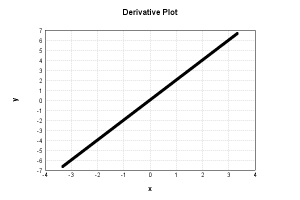

# NthPowerActivationLayer
## SquarePowerTest
### Json Serialization
Code from [StandardLayerTests.java:68](../../../../../../../../src/main/java/com/simiacryptus/mindseye/test/StandardLayerTests.java#L68) executed in 0.00 seconds: 
```java
    JsonObject json = layer.getJson();
    NNLayer echo = NNLayer.fromJson(json);
    if ((echo == null)) throw new AssertionError("Failed to deserialize");
    if ((layer == echo)) throw new AssertionError("Serialization did not copy");
    if ((!layer.equals(echo))) throw new AssertionError("Serialization not equal");
    return new GsonBuilder().setPrettyPrinting().create().toJson(json);
```

Returns: 

```
    {
      "class": "com.simiacryptus.mindseye.layers.java.NthPowerActivationLayer",
      "id": "287ad88f-da76-4db8-9510-d6b6af098314",
      "isFrozen": false,
      "name": "NthPowerActivationLayer/287ad88f-da76-4db8-9510-d6b6af098314",
      "power": 2.0
    }
```


### Example Input/Output Pair
Code from [StandardLayerTests.java:152](../../../../../../../../src/main/java/com/simiacryptus/mindseye/test/StandardLayerTests.java#L152) executed in 0.00 seconds: 
```java
    SimpleEval eval = SimpleEval.run(layer, inputPrototype);
    return String.format("--------------------\nInput: \n[%s]\n--------------------\nOutput: \n%s\n--------------------\nDerivative: \n%s",
      Arrays.stream(inputPrototype).map(t -> t.prettyPrint()).reduce((a, b) -> a + ",\n" + b).get(),
      eval.getOutput().prettyPrint(),
      Arrays.stream(eval.getDerivative()).map(t -> t.prettyPrint()).reduce((a, b) -> a + ",\n" + b).get());
```

Returns: 

```
    --------------------
    Input: 
    [[
    	[ [ -0.62 ], [ 0.232 ], [ -0.864 ] ],
    	[ [ -1.304 ], [ 1.9 ], [ -1.44 ] ]
    ]]
    --------------------
    Output: 
    [
    	[ [ 0.3844 ], [ 0.053824000000000004 ], [ 0.7464959999999999 ] ],
    	[ [ 1.7004160000000001 ], [ 3.61 ], [ 2.0736 ] ]
    ]
    --------------------
    Derivative: 
    [
    	[ [ -1.24 ], [ 0.464 ], [ -1.728 ] ],
    	[ [ -2.608 ], [ 3.8 ], [ -2.88 ] ]
    ]
```


### Batch Execution
Code from [StandardLayerTests.java:101](../../../../../../../../src/main/java/com/simiacryptus/mindseye/test/StandardLayerTests.java#L101) executed in 0.00 seconds: 
```java
    return getBatchingTester().test(layer, inputPrototype);
```

Returns: 

```
    ToleranceStatistics{absoluteTol=0.0000e+00 +- 0.0000e+00 [0.0000e+00 - 0.0000e+00] (120#), relativeTol=0.0000e+00 +- 0.0000e+00 [0.0000e+00 - 0.0000e+00] (118#)}
```


### Differential Validation
Code from [StandardLayerTests.java:109](../../../../../../../../src/main/java/com/simiacryptus/mindseye/test/StandardLayerTests.java#L109) executed in 0.00 seconds: 
```java
    return getDerivativeTester().test(layer, inputPrototype);
```
Logging: 
```
    Inputs: [
    	[ [ 0.316 ], [ 1.828 ], [ 1.696 ] ],
    	[ [ 1.536 ], [ -0.86 ], [ 1.316 ] ]
    ]
    Inputs Statistics: {meanExponent=0.038539113025651515, negative=1, min=1.316, max=1.316, mean=0.972, count=6.0, positive=5, stdDev=0.9556763747908251, zeros=0}
    Output: [
    	[ [ 0.099856 ], [ 3.341584 ], [ 2.876416 ] ],
    	[ [ 2.359296 ], [ 0.7395999999999999 ], [ 1.731856 ] ]
    ]
    Outputs Statistics: {meanExponent=0.077078226051303, negative=0, min=1.731856, max=1.731856, mean=1.8581013333333336, count=6.0, positive=6, stdDev=1.1436266469430578, zeros=0}
    Feedback for input 0
    Inputs Values: [
    	[ [ 0.316 ], [ 1.828 ], [ 1.696 ] ],
    	[ [ 1.536 ], [ -0.86 ], [ 1.316 ] ]
    ]
    Value Statistics: {meanExponent=0.038539113025651515, negative=1, min=1.316, max=1.316, mean=0.972, count=6.0, positive=5, stdDev=0.9556763747908251, zeros=0}
    Implemented Feedback: [ [ 0.632, 0.0, 0.0, 0.0, 0.0, 0.0 ], [ 0.0, 3.072, 0.0, 0.0, 0.0, 0.0 ], [ 0.0, 0.0, 3.656, 0.0, 0.0, 0.0 ], [ 0.0, 0.0, 0.0, -1.72, 0.0, 0.0 ], [ 0.0, 0.0, 0.0, 0.0, 3.392, 0.0 ], 
```
...[skipping 405 bytes](etc/135.txt)...
```
    2, 0.0, 0.0 ], [ 0.0, 0.0, 0.0, 0.0, 3.392099999999232, 0.0 ], [ 0.0, 0.0, 0.0, 0.0, 0.0, 2.632099999999582 ] ]
    Measured Statistics: {meanExponent=0.33958557217669777, negative=1, min=2.632099999999582, max=2.632099999999582, mean=0.3240166666666959, count=36.0, positive=5, stdDev=1.0648061906333408, zeros=30}
    Feedback Error: [ [ 9.999999994103614E-5, 0.0, 0.0, 0.0, 0.0, 0.0 ], [ 0.0, 9.999999891174838E-5, 0.0, 0.0, 0.0, 0.0 ], [ 0.0, 0.0, 1.0000000238230555E-4, 0.0, 0.0, 0.0 ], [ 0.0, 0.0, 0.0, 1.0000000100274242E-4, 0.0, 0.0 ], [ 0.0, 0.0, 0.0, 0.0, 9.99999992319367E-5, 0.0 ], [ 0.0, 0.0, 0.0, 0.0, 0.0, 9.9999999581879E-5 ] ]
    Error Statistics: {meanExponent=-3.999999999238792, negative=0, min=9.9999999581879E-5, max=9.9999999581879E-5, mean=1.6666666695879116E-5, count=36.0, positive=6, stdDev=3.726779969031753E-5, zeros=30}
    Finite-Difference Derivative Accuracy:
    absoluteTol: 1.6667e-05 +- 3.7268e-05 [0.0000e+00 - 1.0000e-04] (36#)
    relativeTol: 2.8644e-05 +- 2.3131e-05 [1.3676e-05 - 7.9108e-05] (6#)
    
```

Returns: 

```
    ToleranceStatistics{absoluteTol=1.6667e-05 +- 3.7268e-05 [0.0000e+00 - 1.0000e-04] (36#), relativeTol=2.8644e-05 +- 2.3131e-05 [1.3676e-05 - 7.9108e-05] (6#)}
```


### Performance
Code from [StandardLayerTests.java:119](../../../../../../../../src/main/java/com/simiacryptus/mindseye/test/StandardLayerTests.java#L119) executed in 0.10 seconds: 
```java
    getPerformanceTester().test(layer, permPrototype);
```
Logging: 
```
    100 batches
    Input Dimensions:
    	[100, 100, 1]
    Performance:
    	Evaluation performance: 0.006145s +- 0.005949s [0.003002s - 0.018041s]
    	Learning performance: 0.010497s +- 0.000729s [0.009687s - 0.011418s]
    
```

### Function Plots
Code from [ActivationLayerTestBase.java:110](../../../../../../../../src/test/java/com/simiacryptus/mindseye/layers/java/ActivationLayerTestBase.java#L110) executed in 0.00 seconds: 
```java
    return plot("Value Plot", plotData, x -> new double[]{x[0], x[1]});
```

Returns: 


Code from [ActivationLayerTestBase.java:114](../../../../../../../../src/test/java/com/simiacryptus/mindseye/layers/java/ActivationLayerTestBase.java#L114) executed in 0.00 seconds: 
```java
    return plot("Derivative Plot", plotData, x -> new double[]{x[0], x[2]});
```

Returns: 




