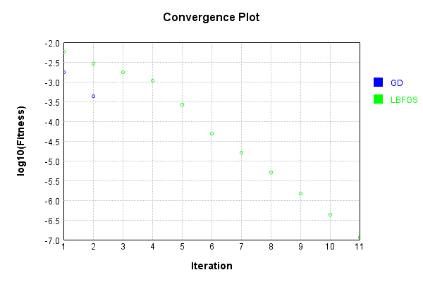
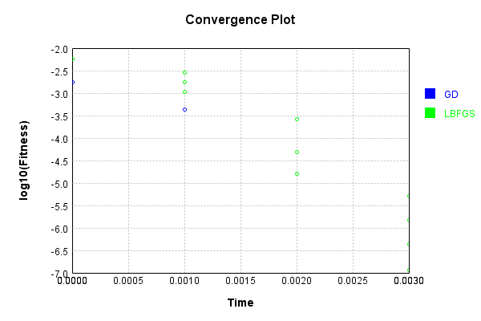

# ProductInputsLayer
## N1Test
### Json Serialization
Code from [JsonTest.java:36](../../../../../../../../src/main/java/com/simiacryptus/mindseye/test/unit/JsonTest.java#L36) executed in 0.00 seconds: 
```java
    JsonObject json = layer.getJson();
    NNLayer echo = NNLayer.fromJson(json);
    if ((echo == null)) throw new AssertionError("Failed to deserialize");
    if ((layer == echo)) throw new AssertionError("Serialization did not copy");
    if ((!layer.equals(echo))) throw new AssertionError("Serialization not equal");
    return new GsonBuilder().setPrettyPrinting().create().toJson(json);
```

Returns: 

```
    {
      "class": "com.simiacryptus.mindseye.layers.java.ProductInputsLayer",
      "id": "c03dd160-3daa-47eb-b72b-a440f0ec23c3",
      "isFrozen": false,
      "name": "ProductInputsLayer/c03dd160-3daa-47eb-b72b-a440f0ec23c3"
    }
```


### Example Input/Output Pair
Code from [ReferenceIO.java:68](../../../../../../../../src/main/java/com/simiacryptus/mindseye/test/unit/ReferenceIO.java#L68) executed in 0.00 seconds: 
```java
    SimpleEval eval = SimpleEval.run(layer, inputPrototype);
    return String.format("--------------------\nInput: \n[%s]\n--------------------\nOutput: \n%s\n--------------------\nDerivative: \n%s",
      Arrays.stream(inputPrototype).map(t -> t.prettyPrint()).reduce((a, b) -> a + ",\n" + b).get(),
      eval.getOutput().prettyPrint(),
      Arrays.stream(eval.getDerivative()).map(t -> t.prettyPrint()).reduce((a, b) -> a + ",\n" + b).get());
```

Returns: 

```
    --------------------
    Input: 
    [[ 1.66, 1.336, -0.532 ],
    [ 1.336 ]]
    --------------------
    Output: 
    [ 2.21776, 1.7848960000000003, -0.710752 ]
    --------------------
    Derivative: 
    [ 1.336, 1.336, 1.336 ],
    [ 2.464 ]
```


### Batch Execution
Code from [BatchingTester.java:66](../../../../../../../../src/main/java/com/simiacryptus/mindseye/test/unit/BatchingTester.java#L66) executed in 0.00 seconds: 
```java
    return test(reference, inputPrototype);
```

Returns: 

```
    ToleranceStatistics{absoluteTol=0.0000e+00 +- 0.0000e+00 [0.0000e+00 - 0.0000e+00] (70#), relativeTol=0.0000e+00 +- 0.0000e+00 [0.0000e+00 - 0.0000e+00] (70#)}
```


Code from [SingleDerivativeTester.java:77](../../../../../../../../src/main/java/com/simiacryptus/mindseye/test/unit/SingleDerivativeTester.java#L77) executed in 0.00 seconds: 
```java
    return test(component, inputPrototype);
```
Logging: 
```
    Inputs: [ -0.24, 1.26, 1.112 ],
    [ 1.74 ]
    Inputs Statistics: {meanExponent=-0.15777114197493078, negative=1, min=1.112, max=1.112, mean=0.7106666666666667, count=3.0, positive=2, stdDev=0.6749327538519836, zeros=0},
    {meanExponent=0.24054924828259971, negative=0, min=1.74, max=1.74, mean=1.74, count=1.0, positive=1, stdDev=0.0, zeros=0}
    Output: [ -0.41759999999999997, 2.1924, 1.9348800000000002 ]
    Outputs Statistics: {meanExponent=0.08277810630766892, negative=1, min=1.9348800000000002, max=1.9348800000000002, mean=1.23656, count=3.0, positive=2, stdDev=1.1743829917024515, zeros=0}
    Feedback for input 0
    Inputs Values: [ -0.24, 1.26, 1.112 ]
    Value Statistics: {meanExponent=-0.15777114197493078, negative=1, min=1.112, max=1.112, mean=0.7106666666666667, count=3.0, positive=2, stdDev=0.6749327538519836, zeros=0}
    Implemented Feedback: [ [ 1.74, 0.0, 0.0 ], [ 0.0, 1.74, 0.0 ], [ 0.0, 0.0, 1.74 ] ]
    Implemented Statistics: {meanExponent=0.24054924828259971, negative=0, min=1.74, max=1.74, mean=0.58, count=9.0, p
```
...[skipping 886 bytes](etc/370.txt)...
```
    stdDev=0.0, zeros=0}
    Implemented Feedback: [ [ -0.24, 1.26, 1.112 ] ]
    Implemented Statistics: {meanExponent=-0.15777114197493078, negative=1, min=1.112, max=1.112, mean=0.7106666666666667, count=3.0, positive=2, stdDev=0.6749327538519836, zeros=0}
    Measured Feedback: [ [ -0.24000000000024002, 1.2599999999984846, 1.11200000000089 ] ]
    Measured Statistics: {meanExponent=-0.15777114197484426, negative=1, min=1.11200000000089, max=1.11200000000089, mean=0.7106666666663782, count=3.0, positive=2, stdDev=0.6749327538518615, zeros=0}
    Feedback Error: [ [ -2.4003021792395884E-13, -1.5154544286133387E-12, 8.899547765395255E-13 ] ]
    Error Statistics: {meanExponent=-12.163274420351925, negative=2, min=8.899547765395255E-13, max=8.899547765395255E-13, mean=-2.88509956665924E-13, count=3.0, positive=1, stdDev=9.826023525515973E-13, zeros=0}
    Finite-Difference Derivative Accuracy:
    absoluteTol: 4.3304e-13 +- 5.2207e-13 [0.0000e+00 - 1.5155e-12] (12#)
    relativeTol: 3.7244e-13 +- 1.5036e-13 [1.3801e-13 - 6.0137e-13] (6#)
    
```

Returns: 

```
    ToleranceStatistics{absoluteTol=4.3304e-13 +- 5.2207e-13 [0.0000e+00 - 1.5155e-12] (12#), relativeTol=3.7244e-13 +- 1.5036e-13 [1.3801e-13 - 6.0137e-13] (6#)}
```


### Performance
Now we execute larger-scale runs to benchmark performance:

Code from [PerformanceTester.java:66](../../../../../../../../src/main/java/com/simiacryptus/mindseye/test/unit/PerformanceTester.java#L66) executed in 0.00 seconds: 
```java
    test(component, inputPrototype);
```
Logging: 
```
    100 batches
    Input Dimensions:
    	[3]
    	[1]
    Performance:
    	Evaluation performance: 0.000134s +- 0.000017s [0.000107s - 0.000156s]
    	Learning performance: 0.000070s +- 0.000012s [0.000053s - 0.000089s]
    
```

### Input Learning
In this test, we use a network to learn this target input, given it's pre-evaluated output:

Code from [LearningTester.java:127](../../../../../../../../src/main/java/com/simiacryptus/mindseye/test/unit/LearningTester.java#L127) executed in 0.00 seconds: 
```java
    return Arrays.stream(input_target).map(x -> x.prettyPrint()).reduce((a, b) -> a + "\n" + b).orElse("");
```

Returns: 

```
    [ 0.224, 0.008, 0.648 ]
    [ 0.252 ]
```


First, we use a conjugate gradient descent method, which converges the fastest for purely linear functions.

Code from [LearningTester.java:300](../../../../../../../../src/main/java/com/simiacryptus/mindseye/test/unit/LearningTester.java#L300) executed in 0.01 seconds: 
```java
    return new IterativeTrainer(trainable)
      .setLineSearchFactory(label -> new QuadraticSearch())
      .setOrientation(new GradientDescent())
      .setMonitor(monitor)
      .setTimeout(30, TimeUnit.SECONDS)
      .setMaxIterations(250)
      .setTerminateThreshold(0)
      .run();
```
Logging: 
```
    Constructing line search parameters: GD
    F(0.0) = LineSearchPoint{point=PointSample{avg=0.023782068906666672}, derivative=-0.003438144515455073}
    New Minimum: 0.023782068906666672 > 0.023782068905366188
    F(1.0E-10) = LineSearchPoint{point=PointSample{avg=0.023782068905366188}, derivative=-0.003438144515252511}, delta = -1.3004840260233408E-12
    New Minimum: 0.023782068905366188 > 0.023782068897563253
    F(7.000000000000001E-10) = LineSearchPoint{point=PointSample{avg=0.023782068897563253}, derivative=-0.0034381445140371308}, delta = -9.103419407185953E-12
    New Minimum: 0.023782068897563253 > 0.023782068842942764
    F(4.900000000000001E-9) = LineSearchPoint{point=PointSample{avg=0.023782068842942764}, derivative=-0.0034381445055294765}, delta = -6.372390809472606E-11
    New Minimum: 0.023782068842942764 > 0.02378206846059928
    F(3.430000000000001E-8) = LineSearchPoint{point=PointSample{avg=0.02378206846059928}, derivative=-0.0034381444459758875}, delta = -4.460673913575519E-10
    New Minimum: 0.02378206846059928 > 0.023
```
...[skipping 7587 bytes](etc/371.txt)...
```
    nt=PointSample{avg=181.1703041309148}, derivative=-193925.44612677567}, delta = 0.06358502100073338
    F(7.85131573825842E-8) = LineSearchPoint{point=PointSample{avg=181.11160963216196}, derivative=-193858.01527278585}, delta = 0.004890522247904983
    F(6.039473644814169E-9) = LineSearchPoint{point=PointSample{avg=181.10709530018656}, derivative=-193852.82901699826}, delta = 3.7619027250457293E-4
    F(4.6457489575493607E-10) = LineSearchPoint{point=PointSample{avg=181.10674804760518}, derivative=-193852.43007858223}, delta = 2.89376911268846E-5
    F(3.573653044268739E-11) = LineSearchPoint{point=PointSample{avg=181.10672133589023}, derivative=-193852.39939103747}, delta = 2.2259761749410245E-6
    Loops = 12
    F(7.147306088537478E-11) = LineSearchPoint{point=PointSample{avg=181.10672356186635}, derivative=-193852.40194833276}, delta = 4.45195229303863E-6
    181.10672356186635 > 181.10672133589023
    Iteration 3 failed, aborting. Error: 181.10671910991405 Total: 249839907045549.1000; Orientation: 0.0000; Line Search: 0.0013
    
```

Returns: 

```
    181.10671910991405
```


This training run resulted in the following regressed input:

Code from [LearningTester.java:144](../../../../../../../../src/main/java/com/simiacryptus/mindseye/test/unit/LearningTester.java#L144) executed in 0.00 seconds: 
```java
    return Arrays.stream(input_gd).map(x -> x.prettyPrint()).reduce((a, b) -> a + "\n" + b).orElse("");
```

Returns: 

```
    [ -4.717423642118758, -2.666971171274462, 0.11212104199981969 ]
    [ 0.252 ]
```


Next, we run the same optimization using L-BFGS, which is nearly ideal for purely second-order or quadratic functions.

Code from [LearningTester.java:324](../../../../../../../../src/main/java/com/simiacryptus/mindseye/test/unit/LearningTester.java#L324) executed in 0.00 seconds: 
```java
    return new IterativeTrainer(trainable)
      .setLineSearchFactory(label -> new ArmijoWolfeSearch())
      .setOrientation(new LBFGS())
      .setMonitor(monitor)
      .setTimeout(30, TimeUnit.SECONDS)
      .setMaxIterations(250)
      .setTerminateThreshold(0)
      .run();
```
Logging: 
```
    LBFGS Accumulation History: 1 points
    Constructing line search parameters: GD
    th(0)=0.023782068906666672;dx=-0.003438144515455073
    New Minimum: 0.023782068906666672 > 0.005739431436381229
    END: th(2.154434690031884)=0.005739431436381229; dx=-6.30982535601459E-4 delta=0.018042637470285443
    Iteration 1 complete. Error: 0.005739431436381229 Total: 249839910861125.1000; Orientation: 0.0001; Line Search: 0.0003
    LBFGS Accumulation History: 1 points
    th(0)=0.005739431436381229;dx=-1.2348392926515286E-4
    New Minimum: 0.005739431436381229 > 0.0028666686368822593
    END: th(4.641588833612779)=0.0028666686368822593; dx=-4.514303674203824E-5 delta=0.0028727627994989693
    Iteration 2 complete. Error: 0.0028666686368822593 Total: 249839911326495.1000; Orientation: 0.0001; Line Search: 0.0003
    LBFGS Accumulation History: 1 points
    th(0)=0.0028666686368822593;dx=-2.0915721457968805E-5
    New Minimum: 0.0028666686368822593 > 0.001750309278767248
    END: th(10.000000000000002)=0.001750309278767248; dx=-1.210249091365981E-5 delta=0.
```
...[skipping 2442 bytes](etc/372.txt)...
```
    oints
    th(0)=1.4973154491118959E-6;dx=-1.2884612998081324E-11
    New Minimum: 1.4973154491118959E-6 > 4.2819287547625875E-7
    END: th(2154.4346900318847)=4.2819287547625875E-7; dx=-3.783738968470063E-12 delta=1.0691225736356371E-6
    Iteration 10 complete. Error: 4.2819287547625875E-7 Total: 249839913637669.1000; Orientation: 0.0000; Line Search: 0.0002
    LBFGS Accumulation History: 1 points
    th(0)=4.2819287547625875E-7;dx=-1.1118371896664814E-12
    New Minimum: 4.2819287547625875E-7 > 1.1464239008969376E-7
    END: th(4641.588833612781)=1.1464239008969376E-7; dx=-3.02406626103582E-13 delta=3.13550485386565E-7
    Iteration 11 complete. Error: 1.1464239008969376E-7 Total: 249839913884176.1000; Orientation: 0.0000; Line Search: 0.0002
    LBFGS Accumulation History: 1 points
    th(0)=1.1464239008969376E-7;dx=-8.22674969198785E-14
    MAX ALPHA: th(0)=1.1464239008969376E-7;th'(0)=-8.22674969198785E-14;
    Iteration 12 failed, aborting. Error: 1.1464239008969376E-7 Total: 249839914154620.1000; Orientation: 0.0000; Line Search: 0.0002
    
```

Returns: 

```
    1.1464239008969376E-7
```


Training Converged

Code from [LearningTester.java:96](../../../../../../../../src/main/java/com/simiacryptus/mindseye/test/unit/LearningTester.java#L96) executed in 0.00 seconds: 
```java
    return TestUtil.compare(runs);
```

Returns: 




Code from [LearningTester.java:99](../../../../../../../../src/main/java/com/simiacryptus/mindseye/test/unit/LearningTester.java#L99) executed in 0.00 seconds: 
```java
    return TestUtil.compareTime(runs);
```

Returns: 




