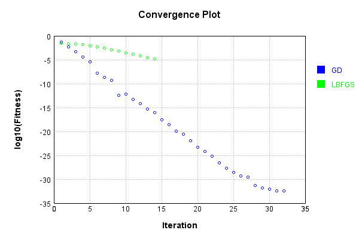
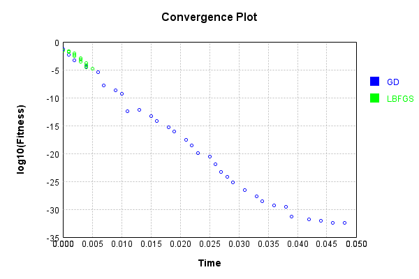

# ProductInputsLayer
## NNNTest
### Json Serialization
Code from [JsonTest.java:36](../../../../../../../../src/main/java/com/simiacryptus/mindseye/test/unit/JsonTest.java#L36) executed in 0.00 seconds: 
```java
    JsonObject json = layer.getJson();
    NNLayer echo = NNLayer.fromJson(json);
    if ((echo == null)) throw new AssertionError("Failed to deserialize");
    if ((layer == echo)) throw new AssertionError("Serialization did not copy");
    if ((!layer.equals(echo))) throw new AssertionError("Serialization not equal");
    return new GsonBuilder().setPrettyPrinting().create().toJson(json);
```

Returns: 

```
    {
      "class": "com.simiacryptus.mindseye.layers.java.ProductInputsLayer",
      "id": "b02c2d65-c270-4013-8560-86cafcddb4a4",
      "isFrozen": false,
      "name": "ProductInputsLayer/b02c2d65-c270-4013-8560-86cafcddb4a4"
    }
```


### Example Input/Output Pair
Code from [ReferenceIO.java:68](../../../../../../../../src/main/java/com/simiacryptus/mindseye/test/unit/ReferenceIO.java#L68) executed in 0.00 seconds: 
```java
    SimpleEval eval = SimpleEval.run(layer, inputPrototype);
    return String.format("--------------------\nInput: \n[%s]\n--------------------\nOutput: \n%s\n--------------------\nDerivative: \n%s",
      Arrays.stream(inputPrototype).map(t -> t.prettyPrint()).reduce((a, b) -> a + ",\n" + b).get(),
      eval.getOutput().prettyPrint(),
      Arrays.stream(eval.getDerivative()).map(t -> t.prettyPrint()).reduce((a, b) -> a + ",\n" + b).get());
```

Returns: 

```
    --------------------
    Input: 
    [[ -1.264, 1.512, -1.824 ],
    [ -0.88, 0.452, 1.4 ],
    [ 1.728, 1.996, -1.38 ]]
    --------------------
    Output: 
    [ 1.92208896, 1.364114304, 3.5239679999999995 ]
    --------------------
    Derivative: 
    [ -1.52064, 0.902192, -1.9319999999999997 ],
    [ -2.184192, 3.017952, 2.51712 ],
    [ 1.11232, 0.683424, -2.5536 ]
```


### Batch Execution
Code from [BatchingTester.java:66](../../../../../../../../src/main/java/com/simiacryptus/mindseye/test/unit/BatchingTester.java#L66) executed in 0.00 seconds: 
```java
    return test(reference, inputPrototype);
```

Returns: 

```
    ToleranceStatistics{absoluteTol=0.0000e+00 +- 0.0000e+00 [0.0000e+00 - 0.0000e+00] (120#), relativeTol=0.0000e+00 +- 0.0000e+00 [0.0000e+00 - 0.0000e+00] (120#)}
```


Code from [SingleDerivativeTester.java:77](../../../../../../../../src/main/java/com/simiacryptus/mindseye/test/unit/SingleDerivativeTester.java#L77) executed in 0.00 seconds: 
```java
    return test(component, inputPrototype);
```
Logging: 
```
    Inputs: [ -1.384, 1.34, 0.448 ],
    [ -0.392, -1.324, 1.328 ],
    [ -1.104, 0.3, 0.284 ]
    Inputs Statistics: {meanExponent=-0.02682703250543646, negative=1, min=0.448, max=0.448, mean=0.13466666666666674, count=3.0, positive=2, stdDev=1.133924551673915, zeros=0},
    {meanExponent=-0.05387595761462096, negative=2, min=1.328, max=1.328, mean=-0.12933333333333338, count=3.0, positive=1, stdDev=1.0984902771025735, zeros=0},
    {meanExponent=-0.34219711061337327, negative=1, min=0.284, max=0.284, mean=-0.17333333333333334, count=3.0, positive=2, stdDev=0.658113127728728, zeros=0}
    Output: [ -0.5989509120000001, -0.532248, 0.168964096 ]
    Outputs Statistics: {meanExponent=-0.4229001007334306, negative=2, min=0.168964096, max=0.168964096, mean=-0.3207449386666667, count=3.0, positive=1, stdDev=0.34734567181501763, zeros=0}
    Feedback for input 0
    Inputs Values: [ -1.384, 1.34, 0.448 ]
    Value Statistics: {meanExponent=-0.02682703250543646, negative=1, min=0.448, max=0.448, mean=0.13466666666666674, count=3.0, positive=2, stdDev=1.
```
...[skipping 2588 bytes](etc/373.txt)...
```
    ics: {meanExponent=-0.08070299012005742, negative=1, min=0.594944, max=0.594944, mean=-0.07074311111111115, count=9.0, positive=2, stdDev=0.6455744564677682, zeros=6}
    Measured Feedback: [ [ 0.5425280000004307, 0.0, 0.0 ], [ 0.0, -1.774159999999858, 0.0 ], [ 0.0, 0.0, 0.5949439999997086 ] ]
    Measured Statistics: {meanExponent=-0.08070299012002499, negative=1, min=0.5949439999997086, max=0.5949439999997086, mean=-0.07074311111107986, count=9.0, positive=2, stdDev=0.6455744564677386, zeros=6}
    Feedback Error: [ [ 4.306555112520982E-13, 0.0, 0.0 ], [ 0.0, 1.4210854715202004E-13, 0.0 ], [ 0.0, 0.0, -2.914335439641036E-13 ] ]
    Error Statistics: {meanExponent=-12.582903417861038, negative=1, min=-2.914335439641036E-13, max=-2.914335439641036E-13, mean=3.125894604889052E-14, count=9.0, positive=2, stdDev=1.7694896430583032E-13, zeros=6}
    Finite-Difference Derivative Accuracy:
    absoluteTol: 1.0070e-13 +- 1.5885e-13 [0.0000e+00 - 4.7184e-13] (27#)
    relativeTol: 3.6428e-13 +- 2.2328e-13 [4.0050e-14 - 7.4422e-13] (9#)
    
```

Returns: 

```
    ToleranceStatistics{absoluteTol=1.0070e-13 +- 1.5885e-13 [0.0000e+00 - 4.7184e-13] (27#), relativeTol=3.6428e-13 +- 2.2328e-13 [4.0050e-14 - 7.4422e-13] (9#)}
```


### Performance
Now we execute larger-scale runs to benchmark performance:

Code from [PerformanceTester.java:66](../../../../../../../../src/main/java/com/simiacryptus/mindseye/test/unit/PerformanceTester.java#L66) executed in 0.00 seconds: 
```java
    test(component, inputPrototype);
```
Logging: 
```
    100 batches
    Input Dimensions:
    	[3]
    	[3]
    	[3]
    Performance:
    	Evaluation performance: 0.000224s +- 0.000024s [0.000198s - 0.000269s]
    	Learning performance: 0.000048s +- 0.000003s [0.000045s - 0.000052s]
    
```

### Input Learning
In this test, we use a network to learn this target input, given it's pre-evaluated output:

Code from [LearningTester.java:127](../../../../../../../../src/main/java/com/simiacryptus/mindseye/test/unit/LearningTester.java#L127) executed in 0.00 seconds: 
```java
    return Arrays.stream(input_target).map(x -> x.prettyPrint()).reduce((a, b) -> a + "\n" + b).orElse("");
```

Returns: 

```
    [ -0.712, -0.772, -1.14 ]
    [ 0.704, 1.06, -0.296 ]
    [ 1.0, 0.624, -0.72 ]
```


First, we use a conjugate gradient descent method, which converges the fastest for purely linear functions.

Code from [LearningTester.java:300](../../../../../../../../src/main/java/com/simiacryptus/mindseye/test/unit/LearningTester.java#L300) executed in 0.05 seconds: 
```java
    return new IterativeTrainer(trainable)
      .setLineSearchFactory(label -> new QuadraticSearch())
      .setOrientation(new GradientDescent())
      .setMonitor(monitor)
      .setTimeout(30, TimeUnit.SECONDS)
      .setMaxIterations(250)
      .setTerminateThreshold(0)
      .run();
```
Logging: 
```
    Constructing line search parameters: GD
    F(0.0) = LineSearchPoint{point=PointSample{avg=0.3435125424257679}, derivative=-0.7012859519294513}
    New Minimum: 0.3435125424257679 > 0.34351254221212574
    F(1.0E-10) = LineSearchPoint{point=PointSample{avg=0.34351254221212574}, derivative=-0.7012859512288783}, delta = -2.1364215951891197E-10
    New Minimum: 0.34351254221212574 > 0.34351254093027167
    F(7.000000000000001E-10) = LineSearchPoint{point=PointSample{avg=0.34351254093027167}, derivative=-0.701285947025437}, delta = -1.4954962268554084E-9
    New Minimum: 0.34351254093027167 > 0.34351253195729387
    F(4.900000000000001E-9) = LineSearchPoint{point=PointSample{avg=0.34351253195729387}, derivative=-0.7012859176013506}, delta = -1.0468474032077069E-8
    New Minimum: 0.34351253195729387 > 0.34351246914645706
    F(3.430000000000001E-8) = LineSearchPoint{point=PointSample{avg=0.34351246914645706}, derivative=-0.7012857116327808}, delta = -7.327931084155637E-8
    New Minimum: 0.34351246914645706 > 0.34351202947084625
    F(2.40100000
```
...[skipping 73480 bytes](etc/374.txt)...
```
    3.487401231785014E31) = LineSearchPoint{point=PointSample{avg=4.108650548026103E-33}, derivative=-1.4796409219767935E-96}, delta = 0.0
    Left bracket at 3.487401231785014E31
    F(4.06863477041585E31) = LineSearchPoint{point=PointSample{avg=4.108650548026103E-33}, derivative=-1.4796409219767935E-96}, delta = 0.0
    Left bracket at 4.06863477041585E31
    F(4.359251539731268E31) = LineSearchPoint{point=PointSample{avg=4.108650548026103E-33}, derivative=-1.4796409219767935E-96}, delta = 0.0
    Left bracket at 4.359251539731268E31
    F(4.504559924388977E31) = LineSearchPoint{point=PointSample{avg=4.108650548026103E-33}, derivative=-1.4796409219767935E-96}, delta = 0.0
    Left bracket at 4.504559924388977E31
    F(4.57721411671783E31) = LineSearchPoint{point=PointSample{avg=4.108650548026103E-33}, derivative=1.4796409219767935E-96}, delta = 0.0
    Right bracket at 4.57721411671783E31
    Converged to left
    Iteration 33 failed, aborting. Error: 4.108650548026103E-33 Total: 249840089623508.9000; Orientation: 0.0000; Line Search: 0.0015
    
```

Returns: 

```
    4.108650548026103E-33
```


Training Converged

Next, we run the same optimization using L-BFGS, which is nearly ideal for purely second-order or quadratic functions.

Code from [LearningTester.java:324](../../../../../../../../src/main/java/com/simiacryptus/mindseye/test/unit/LearningTester.java#L324) executed in 0.01 seconds: 
```java
    return new IterativeTrainer(trainable)
      .setLineSearchFactory(label -> new ArmijoWolfeSearch())
      .setOrientation(new LBFGS())
      .setMonitor(monitor)
      .setTimeout(30, TimeUnit.SECONDS)
      .setMaxIterations(250)
      .setTerminateThreshold(0)
      .run();
```
Logging: 
```
    LBFGS Accumulation History: 1 points
    Constructing line search parameters: GD
    th(0)=0.3435125424257679;dx=-0.7012859519294513
    New Minimum: 0.3435125424257679 > 0.22787009499235764
    WOLF (strong): th(2.154434690031884)=0.22787009499235764; dx=0.37265828399944795 delta=0.11564244743341026
    New Minimum: 0.22787009499235764 > 0.09960598836817885
    WOLF (strong): th(1.077217345015942)=0.09960598836817885; dx=0.08630839703570262 delta=0.24390655405758904
    New Minimum: 0.09960598836817885 > 0.024894364532454583
    END: th(0.3590724483386473)=0.024894364532454583; dx=-6.279721631185651E-4 delta=0.3186181778933133
    Iteration 1 complete. Error: 0.024894364532454583 Total: 249840093954040.9000; Orientation: 0.0001; Line Search: 0.0007
    LBFGS Accumulation History: 1 points
    th(0)=0.024894364532454583;dx=-7.911485609204959E-5
    New Minimum: 0.024894364532454583 > 0.02293412623841261
    END: th(0.7735981389354633)=0.02293412623841261; dx=-6.77448537871435E-5 delta=0.001960238294041971
    Iteration 2 complete. Error: 0.0229341262
```
...[skipping 3845 bytes](etc/375.txt)...
```
    oints
    th(0)=6.257276176685273E-5;dx=-6.773326078593263E-13
    New Minimum: 6.257276176685273E-5 > 2.9166993011727623E-5
    END: th(3590.7244833864747)=2.9166993011727623E-5; dx=-2.1625342622468812E-13 delta=3.3405768755125106E-5
    Iteration 13 complete. Error: 2.9166993011727623E-5 Total: 249840098192239.9000; Orientation: 0.0000; Line Search: 0.0002
    LBFGS Accumulation History: 1 points
    th(0)=2.9166993011727623E-5;dx=-6.9047751467508E-14
    New Minimum: 2.9166993011727623E-5 > 1.3578474047268456E-5
    END: th(7735.981389354636)=1.3578474047268456E-5; dx=-2.1982663011735557E-14 delta=1.558851896445917E-5
    Iteration 14 complete. Error: 1.3578474047268456E-5 Total: 249840098498305.9000; Orientation: 0.0000; Line Search: 0.0002
    LBFGS Accumulation History: 1 points
    th(0)=1.3578474047268456E-5;dx=-6.998791420181917E-15
    MAX ALPHA: th(0)=1.3578474047268456E-5;th'(0)=-6.998791420181917E-15;
    Iteration 15 failed, aborting. Error: 1.3578474047268456E-5 Total: 249840098791833.9000; Orientation: 0.0000; Line Search: 0.0002
    
```

Returns: 

```
    1.3578474047268456E-5
```


This training run resulted in the following regressed input:

Code from [LearningTester.java:154](../../../../../../../../src/main/java/com/simiacryptus/mindseye/test/unit/LearningTester.java#L154) executed in 0.00 seconds: 
```java
    return Arrays.stream(input_lbgfs).map(x -> x.prettyPrint()).reduce((a, b) -> a + "\n" + b).orElse("");
```

Returns: 

```
    [ -0.7961321290909312, -0.7975298538297039, -0.6276140647624614 ]
    [ 1.06, 0.704, -0.296 ]
    [ -0.72, 1.0, 0.624 ]
```


Code from [LearningTester.java:96](../../../../../../../../src/main/java/com/simiacryptus/mindseye/test/unit/LearningTester.java#L96) executed in 0.00 seconds: 
```java
    return TestUtil.compare(runs);
```

Returns: 




Code from [LearningTester.java:99](../../../../../../../../src/main/java/com/simiacryptus/mindseye/test/unit/LearningTester.java#L99) executed in 0.00 seconds: 
```java
    return TestUtil.compareTime(runs);
```

Returns: 




