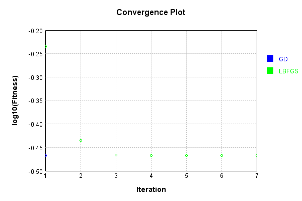
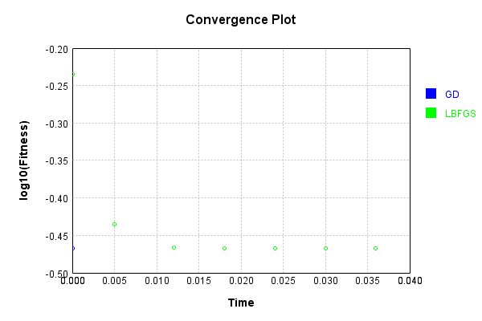
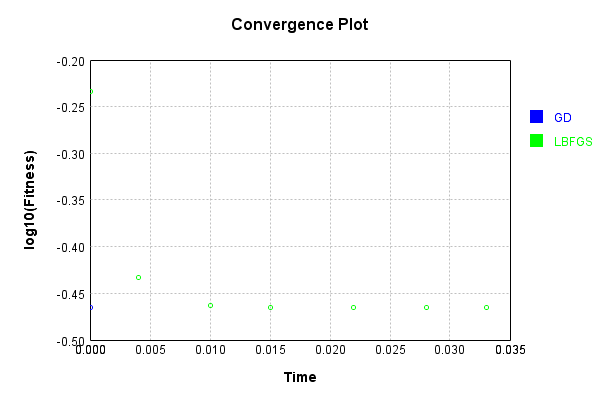
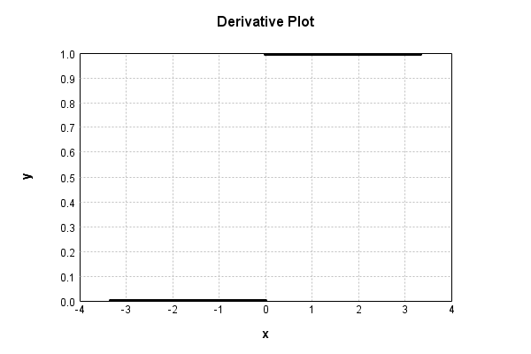

# ReLuActivationLayer
## ReLuActivationLayerTest
### Json Serialization
Code from [JsonTest.java:36](../../../../../../../src/main/java/com/simiacryptus/mindseye/test/unit/JsonTest.java#L36) executed in 0.00 seconds: 
```java
    JsonObject json = layer.getJson();
    NNLayer echo = NNLayer.fromJson(json);
    if ((echo == null)) throw new AssertionError("Failed to deserialize");
    if ((layer == echo)) throw new AssertionError("Serialization did not copy");
    if ((!layer.equals(echo))) throw new AssertionError("Serialization not equal");
    return new GsonBuilder().setPrettyPrinting().create().toJson(json);
```

Returns: 

```
    {
      "class": "com.simiacryptus.mindseye.layers.java.ReLuActivationLayer",
      "id": "973efeb9-304e-4dea-9ffe-183355c44c47",
      "isFrozen": true,
      "name": "ReLuActivationLayer/973efeb9-304e-4dea-9ffe-183355c44c47",
      "weights": [
        1.0
      ]
    }
```


### Example Input/Output Pair
Code from [ReferenceIO.java:68](../../../../../../../src/main/java/com/simiacryptus/mindseye/test/unit/ReferenceIO.java#L68) executed in 0.00 seconds: 
```java
    SimpleEval eval = SimpleEval.run(layer, inputPrototype);
    return String.format("--------------------\nInput: \n[%s]\n--------------------\nOutput: \n%s\n--------------------\nDerivative: \n%s",
      Arrays.stream(inputPrototype).map(t -> t.prettyPrint()).reduce((a, b) -> a + ",\n" + b).get(),
      eval.getOutput().prettyPrint(),
      Arrays.stream(eval.getDerivative()).map(t -> t.prettyPrint()).reduce((a, b) -> a + ",\n" + b).get());
```

Returns: 

```
    --------------------
    Input: 
    [[
    	[ [ 0.832 ], [ 0.276 ], [ -0.568 ] ],
    	[ [ 0.048 ], [ 1.252 ], [ -0.156 ] ]
    ]]
    --------------------
    Output: 
    [
    	[ [ 0.832 ], [ 0.276 ], [ 0.0 ] ],
    	[ [ 0.048 ], [ 1.252 ], [ 0.0 ] ]
    ]
    --------------------
    Derivative: 
    [
    	[ [ 1.0 ], [ 1.0 ], [ 0.0 ] ],
    	[ [ 1.0 ], [ 1.0 ], [ 0.0 ] ]
    ]
```


### Batch Execution
Code from [BatchingTester.java:66](../../../../../../../src/main/java/com/simiacryptus/mindseye/test/unit/BatchingTester.java#L66) executed in 0.00 seconds: 
```java
    return test(reference, inputPrototype);
```

Returns: 

```
    ToleranceStatistics{absoluteTol=0.0000e+00 +- 0.0000e+00 [0.0000e+00 - 0.0000e+00] (120#), relativeTol=0.0000e+00 +- 0.0000e+00 [0.0000e+00 - 0.0000e+00] (46#)}
```


Code from [SingleDerivativeTester.java:77](../../../../../../../src/main/java/com/simiacryptus/mindseye/test/unit/SingleDerivativeTester.java#L77) executed in 0.00 seconds: 
```java
    return test(component, inputPrototype);
```
Logging: 
```
    Inputs: [
    	[ [ 1.528 ], [ -1.316 ], [ -1.404 ] ],
    	[ [ -1.536 ], [ -1.648 ], [ 0.284 ] ]
    ]
    Inputs Statistics: {meanExponent=0.05123551906917034, negative=4, min=0.284, max=0.284, mean=-0.6819999999999999, count=6.0, positive=2, stdDev=1.183424972977445, zeros=0}
    Output: [
    	[ [ 1.528 ], [ 0.0 ], [ 0.0 ] ],
    	[ [ 0.0 ], [ 0.0 ], [ 0.284 ] ]
    ]
    Outputs Statistics: {meanExponent=-0.18127915285664561, negative=0, min=0.284, max=0.284, mean=0.302, count=6.0, positive=2, stdDev=0.5580047789520564, zeros=4}
    Feedback for input 0
    Inputs Values: [
    	[ [ 1.528 ], [ -1.316 ], [ -1.404 ] ],
    	[ [ -1.536 ], [ -1.648 ], [ 0.284 ] ]
    ]
    Value Statistics: {meanExponent=0.05123551906917034, negative=4, min=0.284, max=0.284, mean=-0.6819999999999999, count=6.0, positive=2, stdDev=1.183424972977445, zeros=0}
    Implemented Feedback: [ [ 1.0, 0.0, 0.0, 0.0, 0.0, 0.0 ], [ 0.0, 0.0, 0.0, 0.0, 0.0, 0.0 ], [ 0.0, 0.0, 0.0, 0.0, 0.0, 0.0 ], [ 0.0, 0.0, 0.0, 0.0, 0.0, 0.0 ], [ 0.0, 0.0, 0.0, 0.0, 0.0, 0.0 ], [ 0.0, 0.0, 0.0, 0.0, 0.0, 1.0
```
...[skipping 1157 bytes](etc/379.txt)...
```
    s: [ 1.0 ]
    Implemented Gradient: [ [ 1.528, 0.0, 0.0, 0.0, 0.0, 0.284 ] ]
    Implemented Statistics: {meanExponent=-0.18127915285664561, negative=0, min=0.284, max=0.284, mean=0.302, count=6.0, positive=2, stdDev=0.5580047789520564, zeros=4}
    Measured Gradient: [ [ 1.5279999999995297, 0.0, 0.0, 0.0, 0.0, 0.28399999999983994 ] ]
    Measured Statistics: {meanExponent=-0.1812791528568348, negative=0, min=0.28399999999983994, max=0.28399999999983994, mean=0.30199999999989496, count=6.0, positive=2, stdDev=0.558004778951885, zeros=4}
    Gradient Error: [ [ -4.702904732312163E-13, 0.0, 0.0, 0.0, 0.0, -1.6003864899971632E-13 ] ]
    Error Statistics: {meanExponent=-12.561704471111167, negative=2, min=-1.6003864899971632E-13, max=-1.6003864899971632E-13, mean=-1.0505485370515544E-13, count=6.0, positive=0, stdDev=1.7347735907202516E-13, zeros=4}
    Finite-Difference Derivative Accuracy:
    absoluteTol: 2.0252e-14 +- 7.7739e-14 [0.0000e+00 - 4.7029e-13] (42#)
    relativeTol: 1.3645e-13 +- 9.3093e-14 [5.5067e-14 - 2.8176e-13] (4#)
    
```

Returns: 

```
    ToleranceStatistics{absoluteTol=2.0252e-14 +- 7.7739e-14 [0.0000e+00 - 4.7029e-13] (42#), relativeTol=1.3645e-13 +- 9.3093e-14 [5.5067e-14 - 2.8176e-13] (4#)}
```


### Performance
Now we execute larger-scale runs to benchmark performance:

Code from [PerformanceTester.java:66](../../../../../../../src/main/java/com/simiacryptus/mindseye/test/unit/PerformanceTester.java#L66) executed in 0.34 seconds: 
```java
    test(component, inputPrototype);
```
Logging: 
```
    100 batches
    Input Dimensions:
    	[100, 100, 1]
    Performance:
    	Evaluation performance: 0.026558s +- 0.010042s [0.021343s - 0.046638s]
    	Learning performance: 0.019739s +- 0.000072s [0.019643s - 0.019826s]
    
```

### Input Learning
In this test, we use a network to learn this target input, given it's pre-evaluated output:

Code from [LearningTester.java:127](../../../../../../../src/main/java/com/simiacryptus/mindseye/test/unit/LearningTester.java#L127) executed in 0.00 seconds: 
```java
    return Arrays.stream(input_target).map(x -> x.prettyPrint()).reduce((a, b) -> a + "\n" + b).orElse("");
```

Returns: 

```
    [
    	[ [ -1.664 ], [ 0.764 ], [ 0.252 ], [ 1.644 ], [ 1.392 ], [ -1.708 ], [ -0.032 ], [ 1.124 ], ... ],
    	[ [ -1.948 ], [ -0.632 ], [ -1.416 ], [ 0.744 ], [ 0.036 ], [ 1.004 ], [ -1.636 ], [ 1.008 ], ... ],
    	[ [ 0.872 ], [ 1.584 ], [ 0.056 ], [ -0.512 ], [ -1.188 ], [ 1.412 ], [ -0.084 ], [ -1.22 ], ... ],
    	[ [ 0.028 ], [ -1.924 ], [ -0.472 ], [ 0.596 ], [ 1.748 ], [ -1.44 ], [ 0.276 ], [ 1.588 ], ... ],
    	[ [ 1.828 ], [ -1.912 ], [ 1.344 ], [ 0.308 ], [ 0.128 ], [ -0.688 ], [ 0.716 ], [ 1.016 ], ... ],
    	[ [ 0.28 ], [ 0.896 ], [ 1.408 ], [ -0.736 ], [ -0.016 ], [ -1.672 ], [ -1.344 ], [ -0.76 ], ... ],
    	[ [ -0.612 ], [ -0.048 ], [ -1.032 ], [ -0.696 ], [ 0.1 ], [ 1.864 ], [ -0.944 ], [ -0.172 ], ... ],
    	[ [ 1.008 ], [ 0.364 ], [ -0.728 ], [ -1.752 ], [ -0.128 ], [ -0.904 ], [ 0.432 ], [ -0.468 ], ... ],
    	...
    ]
```


First, we use a conjugate gradient descent method, which converges the fastest for purely linear functions.

Code from [LearningTester.java:300](../../../../../../../src/main/java/com/simiacryptus/mindseye/test/unit/LearningTester.java#L300) executed in 0.03 seconds: 
```java
    return new IterativeTrainer(trainable)
      .setLineSearchFactory(label -> new QuadraticSearch())
      .setOrientation(new GradientDescent())
      .setMonitor(monitor)
      .setTimeout(30, TimeUnit.SECONDS)
      .setMaxIterations(250)
      .setTerminateThreshold(0)
      .run();
```
Logging: 
```
    Constructing line search parameters: GD
    F(0.0) = LineSearchPoint{point=PointSample{avg=0.847777843199996}, derivative=-2.0286096896E-4}
    New Minimum: 0.847777843199996 > 0.847777843199976
    F(1.0E-10) = LineSearchPoint{point=PointSample{avg=0.847777843199976}, derivative=-2.0286096895999597E-4}, delta = -2.0095036745715333E-14
    New Minimum: 0.847777843199976 > 0.8477778431998592
    F(7.000000000000001E-10) = LineSearchPoint{point=PointSample{avg=0.8477778431998592}, derivative=-2.028609689599716E-4}, delta = -1.368904989362818E-13
    New Minimum: 0.8477778431998592 > 0.8477778431990053
    F(4.900000000000001E-9) = LineSearchPoint{point=PointSample{avg=0.8477778431990053}, derivative=-2.0286096895980122E-4}, delta = -9.907630271754897E-13
    New Minimum: 0.8477778431990053 > 0.8477778431930406
    F(3.430000000000001E-8) = LineSearchPoint{point=PointSample{avg=0.8477778431930406}, derivative=-2.0286096895860838E-4}, delta = -6.955436226974143E-12
    New Minimum: 0.8477778431930406 > 0.8477778431512903
    F(2.4010000000000004
```
...[skipping 1591 bytes](etc/380.txt)...
```
    8477377317512442 > 0.8474970963710253
    F(1.3841287201) = LineSearchPoint{point=PointSample{avg=0.8474970963710253}, derivative=-2.0280481182133504E-4}, delta = -2.807468289707238E-4
    Loops = 12
    New Minimum: 0.8474970963710253 > 0.34062542080000047
    F(5000.000000000112) = LineSearchPoint{point=PointSample{avg=0.34062542080000047}, derivative=1.4216349070172997E-18}, delta = -0.5071524223999956
    Right bracket at 5000.000000000112
    Converged to right
    Iteration 1 complete. Error: 0.34062542080000047 Total: 249843118919284.9000; Orientation: 0.0004; Line Search: 0.0259
    Zero gradient: 1.7855218093891686E-16
    F(0.0) = LineSearchPoint{point=PointSample{avg=0.34062542080000047}, derivative=-3.1880881318043707E-32}
    F(5000.000000000112) = LineSearchPoint{point=PointSample{avg=0.34062542080000047}, derivative=0.0}, delta = 0.0
    0.34062542080000047 <= 0.34062542080000047
    Converged to right
    Iteration 2 failed, aborting. Error: 0.34062542080000047 Total: 249843122570427.8800; Orientation: 0.0003; Line Search: 0.0024
    
```

Returns: 

```
    0.34062542080000047
```


This training run resulted in the following regressed input:

Code from [LearningTester.java:144](../../../../../../../src/main/java/com/simiacryptus/mindseye/test/unit/LearningTester.java#L144) executed in 0.01 seconds: 
```java
    return Arrays.stream(input_gd).map(x -> x.prettyPrint()).reduce((a, b) -> a + "\n" + b).orElse("");
```

Returns: 

```
    [
    	[ [ -1.672 ], [ 0.764 ], [ 0.252 ], [ 1.644 ], [ 1.392 ], [ -3.4638958368304884E-14 ], [ -2.9753977059954195E-14 ], [ -0.292 ], ... ],
    	[ [ -3.885780586188048E-14 ], [ -1.9317880628477724E-14 ], [ -4.196643033083092E-14 ], [ -0.144 ], [ -1.112 ], [ 1.004 ], [ -0.3 ], [ -0.932 ], ... ],
    	[ [ -1.888 ], [ -1.0 ], [ -1.356 ], [ -0.52 ], [ -0.768 ], [ -0.324 ], [ -1.78 ], [ -3.1308289294429414E-14 ], ... ],
    	[ [ -1.556 ], [ -9.020562075079397E-16 ], [ -0.432 ], [ -0.196 ], [ -1.168 ], [ -1.24 ], [ -0.436 ], [ 1.588 ], ... ],
    	[ [ 1.828 ], [ -3.5083047578154947E-14 ], [ 1.344 ], [ 0.308 ], [ -1.396 ], [ -0.86 ], [ 0.716 ], [ 1.016 ], ... ],
    	[ [ -0.824 ], [ 0.896 ], [ 1.408 ], [ -0.548 ], [ -1.432 ], [ -1.068 ], [ -1.724 ], [ -3.1530333899354446E-14 ], ... ],
    	[ [ -3.175237850427948E-14 ], [ -1.2559397966072083E-15 ], [ -3.574918139293004E-14 ], [ -1.02 ], [ -0.076 ], [ -1.58 ], [ -1.4 ], [ -3.5083047578154947E-14 ], ... ],
    	[ [ -1.956 ], [ 0.364 ], [ -4.418687638008123E-14 ], [ -1.904 ], [ -1.116 ], [ -7.66053886991358E-15 ], [ 0.432 ], [ -0.26 ], ... ],
    	...
    ]
```


Next, we run the same optimization using L-BFGS, which is nearly ideal for purely second-order or quadratic functions.

Code from [LearningTester.java:324](../../../../../../../src/main/java/com/simiacryptus/mindseye/test/unit/LearningTester.java#L324) executed in 0.06 seconds: 
```java
    return new IterativeTrainer(trainable)
      .setLineSearchFactory(label -> new ArmijoWolfeSearch())
      .setOrientation(new LBFGS())
      .setMonitor(monitor)
      .setTimeout(30, TimeUnit.SECONDS)
      .setMaxIterations(250)
      .setTerminateThreshold(0)
      .run();
```
Logging: 
```
    LBFGS Accumulation History: 1 points
    Constructing line search parameters: GD
    th(0)=0.847777843199996;dx=-2.0286096896E-4
    New Minimum: 0.847777843199996 > 0.8473408866509439
    WOLFE (weak): th(2.154434690031884)=0.8473408866509439; dx=-2.0277355881824383E-4 delta=4.3695654905218095E-4
    New Minimum: 0.8473408866509439 > 0.8469041184213145
    WOLFE (weak): th(4.308869380063768)=0.8469041184213145; dx=-2.0268614867648767E-4 delta=8.737247786815283E-4
    New Minimum: 0.8469041184213145 > 0.8451589286972676
    WOLFE (weak): th(12.926608140191302)=0.8451589286972676; dx=-2.0233650810946293E-4 delta=0.002618914502728442
    New Minimum: 0.8451589286972676 > 0.8373428621884548
    WOLFE (weak): th(51.70643256076521)=0.8373428621884548; dx=-2.0076312555785167E-4 delta=0.010434981011541278
    New Minimum: 0.8373428621884548 > 0.796687658126239
    WOLFE (weak): th(258.53216280382605)=0.796687658126239; dx=-1.923717519492583E-4 delta=0.051090185073757066
    New Minimum: 0.796687658126239 > 0.581913732156048
    END: th(1551.1929768229563)=0
```
...[skipping 2427 bytes](etc/381.txt)...
```
    2)=0.3406254491514864; dx=-1.1340594272660933E-10 delta=2.806797082754997E-6
    Iteration 6 complete. Error: 0.3406254491514864 Total: 249843176197091.8400; Orientation: 0.0005; Line Search: 0.0045
    LBFGS Accumulation History: 1 points
    th(0)=0.3406254491514864;dx=-1.1340594272660786E-11
    New Minimum: 0.3406254491514864 > 0.34062542861187534
    WOLF (strong): th(9694.956105143481)=0.34062542861187534; dx=3.327773820910662E-12 delta=2.0539611067516006E-8
    New Minimum: 0.34062542861187534 > 0.34062542082638136
    END: th(4847.478052571741)=0.34062542082638136; dx=-3.459379046920186E-13 delta=2.8325105039250786E-8
    Iteration 7 complete. Error: 0.34062542082638136 Total: 249843182535865.8000; Orientation: 0.0007; Line Search: 0.0047
    LBFGS Accumulation History: 1 points
    th(0)=0.34062542082638136;dx=-1.0552624582576294E-14
    MAX ALPHA: th(0)=0.34062542082638136;th'(0)=-1.0552624582576294E-14;
    Iteration 8 failed, aborting. Error: 0.34062542082638136 Total: 249843187147385.8000; Orientation: 0.0005; Line Search: 0.0032
    
```

Returns: 

```
    0.34062542082638136
```


This training run resulted in the following regressed input:

Code from [LearningTester.java:154](../../../../../../../src/main/java/com/simiacryptus/mindseye/test/unit/LearningTester.java#L154) executed in 0.01 seconds: 
```java
    return Arrays.stream(input_lbgfs).map(x -> x.prettyPrint()).reduce((a, b) -> a + "\n" + b).orElse("");
```

Returns: 

```
    [
    	[ [ -1.672 ], [ 0.7640068950733176 ], [ 0.252006404628772 ], [ 1.6439965668881806 ], [ 1.3919912585472165 ], [ 1.1193675511438344E-5 ], [ 9.549243799706415E-6 ], [ -0.292 ], ... ],
    	[ [ 1.2491911073331903E-5 ], [ 6.202681017936155E-6 ], [ 1.3443950485387201E-5 ], [ -0.144 ], [ -1.112 ], [ 1.0040065200274886 ], [ -0.3 ], [ -0.932 ], ... ],
    	[ [ -1.888 ], [ -1.0 ], [ -1.356 ], [ -0.52 ], [ -0.768 ], [ -0.324 ], [ -1.78 ], [ 1.006853802446386E-5 ], ... ],
    	[ [ -1.556 ], [ 2.884967915319161E-7 ], [ -0.432 ], [ -0.196 ], [ -1.168 ], [ -1.24 ], [ -0.436 ], [ 1.5880008654903748 ], ... ],
    	[ [ 1.8279972592804805 ], [ 1.1309074228051043E-5 ], [ 1.3439952975022982 ], [ 0.3080014136342785 ], [ -1.396 ], [ -0.86 ], [ 0.7159998557516042 ], [ 1.0160069527726758 ], ... ],
    	[ [ -0.824 ], [ 0.8959948647571108 ], [ 1.4080030580659901 ], [ -0.548 ], [ -1.432 ], [ -1.068 ], [ -1.724 ], [ 1.0183936741076614E-5 ], ... ],
    	[ [ 1.0270485778536152E-5 ], [ 4.0389550814467987E-7 ], [ 1.1511021982123443E-5 ], [ -1.02 ], [ -0.076 ], [ -1.58 ], [ -1.4 ], [ 1.1309074228051043E-5 ], ... ],
    	[ [ -1.956 ], [ 0.36399757662695115 ], [ 1.4194042143370208E-5 ], [ -1.904 ], [ -1.116 ], [ 2.4522227280212845E-6 ], [ 0.43200928959668733 ], [ -0.26 ], ... ],
    	...
    ]
```


Code from [LearningTester.java:96](../../../../../../../src/main/java/com/simiacryptus/mindseye/test/unit/LearningTester.java#L96) executed in 0.00 seconds: 
```java
    return TestUtil.compare(runs);
```

Returns: 




Code from [LearningTester.java:99](../../../../../../../src/main/java/com/simiacryptus/mindseye/test/unit/LearningTester.java#L99) executed in 0.00 seconds: 
```java
    return TestUtil.compareTime(runs);
```

Returns: 




### Model Learning
In this test, attempt to train a network to emulate a randomized network given an example input/output. The target state is:

Code from [LearningTester.java:176](../../../../../../../src/main/java/com/simiacryptus/mindseye/test/unit/LearningTester.java#L176) executed in 0.00 seconds: 
```java
    return network_target.state().stream().map(Arrays::toString).reduce((a, b) -> a + "\n" + b).orElse("");
```

Returns: 

```
    [1.0]
```


First, we use a conjugate gradient descent method, which converges the fastest for purely linear functions.

Code from [LearningTester.java:300](../../../../../../../src/main/java/com/simiacryptus/mindseye/test/unit/LearningTester.java#L300) executed in 0.00 seconds: 
```java
    return new IterativeTrainer(trainable)
      .setLineSearchFactory(label -> new QuadraticSearch())
      .setOrientation(new GradientDescent())
      .setMonitor(monitor)
      .setTimeout(30, TimeUnit.SECONDS)
      .setMaxIterations(250)
      .setTerminateThreshold(0)
      .run();
```

Returns: 

```
    0.0
```


This training run resulted in the following configuration:

Code from [LearningTester.java:189](../../../../../../../src/main/java/com/simiacryptus/mindseye/test/unit/LearningTester.java#L189) executed in 0.00 seconds: 
```java
    return network_gd.state().stream().map(Arrays::toString).reduce((a, b) -> a + "\n" + b).orElse("");
```

Returns: 

```
    [1.0]
    [0.888, 0.0, 1.864, 0.0, 1.828, 0.8, 0.0, 0.0, 1.8, 1.98, 0.0, 1.036, 0.516, 0.716, 1.508, 0.0, 0.0, 0.0, 0.284, 0.0, 0.0, 1.952, 1.136, 0.896, 0.94, 1.08, 1.86, 1.536, 0.0, 0.0, 1.456, 1.68, 0.316, 1.236, 0.0, 0.0, 1.532, 1.088, 0.4, 0.0, 1.86, 0.188, 0.0, 0.0, 0.0, 1.312, 0.0, 1.676, 1.732, 0.0, 0.62, 0.0, 1.0, 1.428, 0.0, 0.9, 1.756, 0.956, 0.764, 1.44, 0.992, 0.0, 1.46, 0.0, 0.256, 0.912, 0.0, 1.968, 1.028, 0.0, 0.0, 1.6, 0.0, 0.0, 1.216, 0.0, 0.0, 1.736, 0.0, 0.144, 1.48, 0.08, 0.364, 0.0, 1.476, 0.468, 1.576, 1.512, 0.432, 0.0, 0.0, 0.892, 0.96, 0.0, 0.0, 0.0, 0.0, 0.0, 0.44, 0.0, 0.016, 0.0, 0.0, 0.0, 0.0, 0.0, 0.0, 0.0, 0.048, 0.0, 0.92, 0.956, 1.072, 0.0, 0.0, 0.02, 0.0, 0.0, 0.452, 0.0, 0.0, 1.452, 1.972, 0.0, 0.0, 0.0, 0.0, 0.0, 0.812, 1.932, 1.448, 1.532, 0.492, 1.308, 0.972, 1.224, 1.524, 1.324, 0.564, 1.468, 0.136, 0.516, 1.252, 1.896, 1.416, 1.756, 1.42, 0.0, 0.0, 1.848, 0.296, 1.644, 0.0, 0.0, 1.168, 0.0, 1.324, 0.0, 0.0, 0.256, 1.636, 0.0, 0.0, 1.7, 0.0, 0.0, 0.0, 0.04, 0.0, 0.0, 1.208,
```
...[skipping 56692 bytes](etc/382.txt)...
```
    848, 0.384, 0.0, 0.0, 1.98, 0.0, 0.0, 0.0, 1.424, 1.92, 0.556, 0.052, 0.0, 0.0, 0.856, 0.0, 0.0, 0.0, 0.1, 0.804, 0.0, 0.0, 1.288, 0.0, 1.444, 0.34, 1.012, 1.06, 1.224, 1.42, 0.0, 0.632, 0.0, 0.0, 0.0, 1.94, 0.044, 0.0, 1.836, 0.0, 0.0, 0.576, 0.0, 0.0, 1.728, 1.888, 0.0, 0.0, 0.0, 1.736, 0.636, 0.0, 0.0, 1.948, 0.168, 0.0, 0.0, 0.0, 0.0, 1.208, 0.0, 0.0, 0.0, 0.0, 1.368, 0.624, 0.0, 0.704, 0.252, 0.688, 1.032, 0.364, 0.132, 0.8, 1.344, 0.0, 0.0, 0.0, 0.0, 0.584, 0.0, 0.124, 1.704, 0.0, 0.0, 0.0, 0.632, 0.0, 0.0, 0.0, 0.484, 0.592, 0.0, 1.436, 0.0, 0.644, 1.464, 0.0, 0.0, 0.292, 0.0, 0.0, 0.0, 0.384, 0.0, 0.0, 0.0, 1.736, 0.228, 1.912, 0.0, 0.0, 0.1, 0.444, 0.0, 1.208, 1.756, 0.0, 0.252, 0.0, 1.716, 0.0, 1.556, 1.168, 0.74, 0.62, 1.544, 0.0, 1.768, 0.0, 0.0, 1.624, 0.0, 0.0, 0.0, 0.0, 0.476, 0.0, 1.664, 0.0, 1.868, 0.0, 1.972, 1.696, 0.004, 0.552, 0.0, 0.696, 0.0, 0.0, 0.0, 0.768, 0.0, 0.0, 0.0, 0.0, 0.0, 0.0, 0.0, 0.848, 0.0, 0.928, 1.652, 0.0, 0.136, 0.0, 0.0, 1.092, 0.308, 0.0, 0.0, 0.924, 0.0, 0.0, 1.596]
```


Next, we run the same optimization using L-BFGS, which is nearly ideal for purely second-order or quadratic functions.

Code from [LearningTester.java:324](../../../../../../../src/main/java/com/simiacryptus/mindseye/test/unit/LearningTester.java#L324) executed in 0.00 seconds: 
```java
    return new IterativeTrainer(trainable)
      .setLineSearchFactory(label -> new ArmijoWolfeSearch())
      .setOrientation(new LBFGS())
      .setMonitor(monitor)
      .setTimeout(30, TimeUnit.SECONDS)
      .setMaxIterations(250)
      .setTerminateThreshold(0)
      .run();
```

Returns: 

```
    0.0
```


This training run resulted in the following configuration:

Code from [LearningTester.java:203](../../../../../../../src/main/java/com/simiacryptus/mindseye/test/unit/LearningTester.java#L203) executed in 0.00 seconds: 
```java
    return network_lbfgs.state().stream().map(Arrays::toString).reduce((a, b) -> a + "\n" + b).orElse("");
```

Returns: 

```
    [1.0]
    [0.888, 0.0, 1.864, 0.0, 1.828, 0.8, 0.0, 0.0, 1.8, 1.98, 0.0, 1.036, 0.516, 0.716, 1.508, 0.0, 0.0, 0.0, 0.284, 0.0, 0.0, 1.952, 1.136, 0.896, 0.94, 1.08, 1.86, 1.536, 0.0, 0.0, 1.456, 1.68, 0.316, 1.236, 0.0, 0.0, 1.532, 1.088, 0.4, 0.0, 1.86, 0.188, 0.0, 0.0, 0.0, 1.312, 0.0, 1.676, 1.732, 0.0, 0.62, 0.0, 1.0, 1.428, 0.0, 0.9, 1.756, 0.956, 0.764, 1.44, 0.992, 0.0, 1.46, 0.0, 0.256, 0.912, 0.0, 1.968, 1.028, 0.0, 0.0, 1.6, 0.0, 0.0, 1.216, 0.0, 0.0, 1.736, 0.0, 0.144, 1.48, 0.08, 0.364, 0.0, 1.476, 0.468, 1.576, 1.512, 0.432, 0.0, 0.0, 0.892, 0.96, 0.0, 0.0, 0.0, 0.0, 0.0, 0.44, 0.0, 0.016, 0.0, 0.0, 0.0, 0.0, 0.0, 0.0, 0.0, 0.048, 0.0, 0.92, 0.956, 1.072, 0.0, 0.0, 0.02, 0.0, 0.0, 0.452, 0.0, 0.0, 1.452, 1.972, 0.0, 0.0, 0.0, 0.0, 0.0, 0.812, 1.932, 1.448, 1.532, 0.492, 1.308, 0.972, 1.224, 1.524, 1.324, 0.564, 1.468, 0.136, 0.516, 1.252, 1.896, 1.416, 1.756, 1.42, 0.0, 0.0, 1.848, 0.296, 1.644, 0.0, 0.0, 1.168, 0.0, 1.324, 0.0, 0.0, 0.256, 1.636, 0.0, 0.0, 1.7, 0.0, 0.0, 0.0, 0.04, 0.0, 0.0, 1.208,
```
...[skipping 56692 bytes](etc/383.txt)...
```
    848, 0.384, 0.0, 0.0, 1.98, 0.0, 0.0, 0.0, 1.424, 1.92, 0.556, 0.052, 0.0, 0.0, 0.856, 0.0, 0.0, 0.0, 0.1, 0.804, 0.0, 0.0, 1.288, 0.0, 1.444, 0.34, 1.012, 1.06, 1.224, 1.42, 0.0, 0.632, 0.0, 0.0, 0.0, 1.94, 0.044, 0.0, 1.836, 0.0, 0.0, 0.576, 0.0, 0.0, 1.728, 1.888, 0.0, 0.0, 0.0, 1.736, 0.636, 0.0, 0.0, 1.948, 0.168, 0.0, 0.0, 0.0, 0.0, 1.208, 0.0, 0.0, 0.0, 0.0, 1.368, 0.624, 0.0, 0.704, 0.252, 0.688, 1.032, 0.364, 0.132, 0.8, 1.344, 0.0, 0.0, 0.0, 0.0, 0.584, 0.0, 0.124, 1.704, 0.0, 0.0, 0.0, 0.632, 0.0, 0.0, 0.0, 0.484, 0.592, 0.0, 1.436, 0.0, 0.644, 1.464, 0.0, 0.0, 0.292, 0.0, 0.0, 0.0, 0.384, 0.0, 0.0, 0.0, 1.736, 0.228, 1.912, 0.0, 0.0, 0.1, 0.444, 0.0, 1.208, 1.756, 0.0, 0.252, 0.0, 1.716, 0.0, 1.556, 1.168, 0.74, 0.62, 1.544, 0.0, 1.768, 0.0, 0.0, 1.624, 0.0, 0.0, 0.0, 0.0, 0.476, 0.0, 1.664, 0.0, 1.868, 0.0, 1.972, 1.696, 0.004, 0.552, 0.0, 0.696, 0.0, 0.0, 0.0, 0.768, 0.0, 0.0, 0.0, 0.0, 0.0, 0.0, 0.0, 0.848, 0.0, 0.928, 1.652, 0.0, 0.136, 0.0, 0.0, 1.092, 0.308, 0.0, 0.0, 0.924, 0.0, 0.0, 1.596]
```


Code from [LearningTester.java:96](../../../../../../../src/main/java/com/simiacryptus/mindseye/test/unit/LearningTester.java#L96) executed in 0.00 seconds: 
```java
    return TestUtil.compare(runs);
```

Code from [LearningTester.java:99](../../../../../../../src/main/java/com/simiacryptus/mindseye/test/unit/LearningTester.java#L99) executed in 0.00 seconds: 
```java
    return TestUtil.compareTime(runs);
```

### Composite Learning
In this test, attempt to train a network to emulate a randomized network given an example input/output. The target state is:

Code from [LearningTester.java:219](../../../../../../../src/main/java/com/simiacryptus/mindseye/test/unit/LearningTester.java#L219) executed in 0.00 seconds: 
```java
    return network_target.state().stream().map(Arrays::toString).reduce((a, b) -> a + "\n" + b).orElse("");
```

Returns: 

```
    [1.0]
```


We simultaneously regress this target input:

Code from [LearningTester.java:223](../../../../../../../src/main/java/com/simiacryptus/mindseye/test/unit/LearningTester.java#L223) executed in 0.00 seconds: 
```java
    return Arrays.stream(testInput).map(x -> x.prettyPrint()).reduce((a, b) -> a + "\n" + b).orElse("");
```

Returns: 

```
    [
    	[ [ -1.04 ], [ -0.956 ], [ -0.064 ], [ -0.448 ], [ 0.92 ], [ -0.9 ], [ -0.884 ], [ -1.088 ], ... ],
    	[ [ -1.128 ], [ 1.368 ], [ -0.572 ], [ -0.5 ], [ 0.856 ], [ 0.288 ], [ -0.184 ], [ -1.364 ], ... ],
    	[ [ -1.124 ], [ 0.792 ], [ 0.052 ], [ -1.724 ], [ 1.836 ], [ -1.304 ], [ 1.872 ], [ -1.684 ], ... ],
    	[ [ 1.472 ], [ -0.928 ], [ 0.168 ], [ 1.208 ], [ -0.588 ], [ -0.812 ], [ -1.788 ], [ -1.64 ], ... ],
    	[ [ 1.876 ], [ 1.548 ], [ -0.288 ], [ -0.228 ], [ 0.996 ], [ -1.552 ], [ 0.512 ], [ 1.276 ], ... ],
    	[ [ 1.724 ], [ -1.232 ], [ 0.312 ], [ 0.24 ], [ 0.184 ], [ 0.824 ], [ -1.276 ], [ -1.696 ], ... ],
    	[ [ 0.124 ], [ 1.476 ], [ 1.036 ], [ -1.044 ], [ 1.664 ], [ -1.816 ], [ 1.764 ], [ 0.388 ], ... ],
    	[ [ 0.096 ], [ -1.028 ], [ 1.596 ], [ 0.38 ], [ -0.428 ], [ 1.992 ], [ -1.34 ], [ -1.892 ], ... ],
    	...
    ]
```


Which produces the following output:

Code from [LearningTester.java:230](../../../../../../../src/main/java/com/simiacryptus/mindseye/test/unit/LearningTester.java#L230) executed in 0.00 seconds: 
```java
    return Stream.of(targetOutput).map(x -> x.prettyPrint()).reduce((a, b) -> a + "\n" + b).orElse("");
```

Returns: 

```
    [
    	[ [ 0.0 ], [ 0.0 ], [ 0.0 ], [ 0.0 ], [ 0.92 ], [ 0.0 ], [ 0.0 ], [ 0.0 ], ... ],
    	[ [ 0.0 ], [ 1.368 ], [ 0.0 ], [ 0.0 ], [ 0.856 ], [ 0.288 ], [ 0.0 ], [ 0.0 ], ... ],
    	[ [ 0.0 ], [ 0.792 ], [ 0.052 ], [ 0.0 ], [ 1.836 ], [ 0.0 ], [ 1.872 ], [ 0.0 ], ... ],
    	[ [ 1.472 ], [ 0.0 ], [ 0.168 ], [ 1.208 ], [ 0.0 ], [ 0.0 ], [ 0.0 ], [ 0.0 ], ... ],
    	[ [ 1.876 ], [ 1.548 ], [ 0.0 ], [ 0.0 ], [ 0.996 ], [ 0.0 ], [ 0.512 ], [ 1.276 ], ... ],
    	[ [ 1.724 ], [ 0.0 ], [ 0.312 ], [ 0.24 ], [ 0.184 ], [ 0.824 ], [ 0.0 ], [ 0.0 ], ... ],
    	[ [ 0.124 ], [ 1.476 ], [ 1.036 ], [ 0.0 ], [ 1.664 ], [ 0.0 ], [ 1.764 ], [ 0.388 ], ... ],
    	[ [ 0.096 ], [ 0.0 ], [ 1.596 ], [ 0.38 ], [ 0.0 ], [ 1.992 ], [ 0.0 ], [ 0.0 ], ... ],
    	...
    ]
```


First, we use a conjugate gradient descent method, which converges the fastest for purely linear functions.

Code from [LearningTester.java:300](../../../../../../../src/main/java/com/simiacryptus/mindseye/test/unit/LearningTester.java#L300) executed in 0.05 seconds: 
```java
    return new IterativeTrainer(trainable)
      .setLineSearchFactory(label -> new QuadraticSearch())
      .setOrientation(new GradientDescent())
      .setMonitor(monitor)
      .setTimeout(30, TimeUnit.SECONDS)
      .setMaxIterations(250)
      .setTerminateThreshold(0)
      .run();
```
Logging: 
```
    Constructing line search parameters: GD
    F(0.0) = LineSearchPoint{point=PointSample{avg=0.8485246911999952}, derivative=-2.0240992000000003E-4}
    New Minimum: 0.8485246911999952 > 0.8485246911999739
    F(1.0E-10) = LineSearchPoint{point=PointSample{avg=0.8485246911999739}, derivative=-2.0240991999999596E-4}, delta = -2.1316282072803006E-14
    New Minimum: 0.8485246911999739 > 0.8485246911998545
    F(7.000000000000001E-10) = LineSearchPoint{point=PointSample{avg=0.8485246911998545}, derivative=-2.0240991999997168E-4}, delta = -1.4066525722000733E-13
    New Minimum: 0.8485246911998545 > 0.8485246911990072
    F(4.900000000000001E-9) = LineSearchPoint{point=PointSample{avg=0.8485246911990072}, derivative=-2.0240991999980165E-4}, delta = -9.879874696139268E-13
    New Minimum: 0.8485246911990072 > 0.8485246911930497
    F(3.430000000000001E-8) = LineSearchPoint{point=PointSample{avg=0.8485246911930497}, derivative=-2.024099199986115E-4}, delta = -6.945444219752517E-12
    New Minimum: 0.8485246911930497 > 0.8485246911513983
    F(2.4010
```
...[skipping 3253 bytes](etc/384.txt)...
```
    a = 0.0
    Right bracket at 6093.938128273119
    F(5691.127248153811) = LineSearchPoint{point=PointSample{avg=0.34249989120000024}, derivative=1.0092484864198373E-30}, delta = 0.0
    Right bracket at 5691.127248153811
    F(5447.52178111267) = LineSearchPoint{point=PointSample{avg=0.34249989120000024}, derivative=6.534850376491125E-31}, delta = 0.0
    Right bracket at 5447.52178111267
    F(5294.226730480254) = LineSearchPoint{point=PointSample{avg=0.34249989120000024}, derivative=4.296948638690128E-31}, delta = 0.0
    Right bracket at 5294.226730480254
    F(5195.31182724835) = LineSearchPoint{point=PointSample{avg=0.34249989120000024}, derivative=2.851678973632866E-31}, delta = 0.0
    Right bracket at 5195.31182724835
    F(5130.48584947266) = LineSearchPoint{point=PointSample{avg=0.34249989120000024}, derivative=1.9057704096580743E-31}, delta = 0.0
    Right bracket at 5130.48584947266
    Converged to right
    Iteration 2 failed, aborting. Error: 0.34249989120000024 Total: 249843377058124.6600; Orientation: 0.0004; Line Search: 0.0266
    
```

Returns: 

```
    0.34249989120000024
```


This training run resulted in the following configuration:

Code from [LearningTester.java:245](../../../../../../../src/main/java/com/simiacryptus/mindseye/test/unit/LearningTester.java#L245) executed in 0.00 seconds: 
```java
    return network_gd.state().stream().map(Arrays::toString).reduce((a, b) -> a + "\n" + b).orElse("");
```

Returns: 

```
    [1.0]
    [0.0, 0.0, 0.0, 1.472, 1.876, 1.724, 0.124, 0.096, 0.492, 0.0, 1.28, 1.124, 0.0, 0.36, 0.0, 0.592, 0.0, 0.352, 1.844, 1.92, 0.0, 0.816, 0.212, 1.244, 0.0, 0.108, 1.9, 1.812, 0.0, 0.812, 0.0, 0.836, 1.956, 0.688, 0.568, 0.632, 0.02, 0.0, 0.62, 0.748, 1.48, 1.368, 0.0, 1.624, 0.0, 0.0, 0.972, 0.0, 1.692, 0.0, 0.456, 0.76, 0.94, 0.0, 0.0, 0.0, 0.372, 0.0, 0.816, 1.408, 1.724, 1.36, 1.88, 0.0, 0.0, 0.0, 0.608, 1.732, 0.0, 0.0, 1.44, 0.0, 0.0, 0.548, 0.0, 1.572, 0.088, 0.0, 0.0, 0.428, 0.0, 0.0, 1.232, 0.0, 1.596, 0.0, 1.98, 0.0, 0.0, 1.012, 0.764, 0.0, 1.356, 0.0, 0.0, 0.252, 0.0, 0.0, 0.0, 1.244, 0.0, 1.368, 0.792, 0.0, 1.548, 0.0, 1.476, 0.0, 1.852, 1.504, 0.104, 0.0, 0.536, 0.468, 0.0, 0.64, 1.96, 1.768, 0.512, 1.78, 1.232, 0.54, 1.26, 0.0, 1.824, 0.0, 0.0, 0.0, 0.596, 0.0, 0.136, 0.292, 1.036, 0.0, 1.188, 0.0, 0.0, 0.0, 0.0, 0.0, 0.356, 0.0, 0.0, 0.0, 0.724, 1.396, 0.064, 1.168, 1.292, 0.0, 0.0, 0.0, 1.496, 0.992, 0.852, 0.0, 1.412, 0.0, 1.188, 0.276, 0.0, 1.844, 1.692, 0.216, 0.0, 1.532, 0.0, 1.468, 0.
```
...[skipping 56692 bytes](etc/385.txt)...
```
    2, 0.256, 0.0, 0.0, 0.54, 1.432, 0.0, 1.008, 1.396, 0.0, 0.0, 0.0, 0.0, 0.0, 0.412, 0.0, 0.0, 0.0, 1.3, 1.9, 0.536, 0.6, 0.18, 0.0, 0.0, 0.056, 0.0, 0.0, 0.0, 0.0, 1.976, 0.0, 0.0, 1.96, 0.0, 0.024, 0.672, 0.0, 1.904, 0.0, 0.096, 0.956, 0.32, 1.148, 1.96, 0.0, 0.0, 1.64, 0.0, 0.04, 1.364, 0.0, 0.0, 0.0, 1.196, 0.0, 0.0, 1.904, 0.0, 1.116, 0.04, 0.0, 1.56, 1.6, 0.912, 1.728, 0.656, 0.0, 0.0, 1.964, 0.0, 0.0, 0.0, 0.0, 1.82, 0.168, 0.0, 0.0, 1.928, 0.0, 0.0, 0.44, 0.0, 1.544, 0.94, 0.86, 1.84, 0.736, 0.0, 0.0, 1.8, 0.0, 0.0, 0.0, 0.0, 0.9, 0.0, 0.06, 0.62, 0.388, 0.0, 0.0, 0.0, 0.0, 0.0, 0.288, 0.0, 0.0, 0.0, 0.0, 0.0, 1.412, 0.0, 0.0, 0.0, 0.0, 0.0, 0.356, 0.124, 1.448, 0.0, 1.412, 0.0, 0.204, 1.256, 0.0, 1.892, 1.316, 0.0, 0.0, 1.136, 1.124, 0.0, 0.124, 0.568, 0.42, 1.888, 1.956, 1.832, 0.0, 0.0, 1.84, 0.0, 1.46, 1.9, 0.808, 0.0, 0.0, 0.0, 0.0, 0.0, 1.94, 0.952, 1.724, 1.388, 0.0, 1.224, 1.46, 0.784, 1.004, 0.0, 0.068, 0.0, 0.0, 0.0, 1.484, 0.0, 0.0, 0.0, 0.0, 1.956, 0.0, 0.0, 0.0, 0.812, 1.48, 0.0, 0.0, 0.0]
```


And regressed input:

Code from [LearningTester.java:249](../../../../../../../src/main/java/com/simiacryptus/mindseye/test/unit/LearningTester.java#L249) executed in 0.01 seconds: 
```java
    return Arrays.stream(input_gd).map(x -> x.prettyPrint()).reduce((a, b) -> a + "\n" + b).orElse("");
```

Returns: 

```
    [
    	[ [ -0.508 ], [ -1.0836155906529543E-14 ], [ -7.391185485977737E-15 ], [ -0.288 ], [ 0.920000000000004 ], [ -1.9521016155145156E-15 ], [ -1.882564786167803E-15 ], [ -1.876 ], ... ],
    	[ [ -1.0250887592861363E-14 ], [ -1.46 ], [ -0.132 ], [ -0.78 ], [ -0.552 ], [ 0.28799999999998643 ], [ -1.192 ], [ -0.628 ], ... ],
    	[ [ -0.532 ], [ 0.7919999999999912 ], [ 0.05199999999998968 ], [ -0.18 ], [ 1.8359999999999996 ], [ -0.644 ], [ 1.8720000000000068 ], [ -0.364 ], ... ],
    	[ [ -0.664 ], [ -1.176 ], [ -0.492 ], [ 1.2079999999999962 ], [ -1.184 ], [ -1.7221954734869488E-14 ], [ -3.660824328315538E-15 ], [ -0.28 ], ... ],
    	[ [ 1.8760000000000132 ], [ -0.332 ], [ -1.5164823533362393E-14 ], [ -1.2441297717282855E-14 ], [ 0.9959999999999918 ], [ -1.184 ], [ 0.5119999999999876 ], [ 1.275999999999997 ], ... ],
    	[ [ 1.7239999999999978 ], [ -1.22 ], [ 0.3119999999999975 ], [ 0.23999999999999566 ], [ -0.98 ], [ -1.944 ], [ -7.217343412611007E-15 ], [ -1.908 ], ... ],
    	[ [ 0.12399999999999589 ], [ -1.896 ], [ 1.0360000000000038 ], [ -1.5124260382910262E-14 ], [ 1.664000000000004 ], [ -0.084 ], [ -1.124 ], [ 0.3880000000000027 ], ... ],
    	[ [ 0.09599999999999512 ], [ -1.784 ], [ 1.596000000000005 ], [ -1.292 ], [ -1.652 ], [ 1.9920000000000107 ], [ -9.167272002208444E-15 ], [ -1.824 ], ... ],
    	...
    ]
```


Which produces the following output:

Code from [LearningTester.java:256](../../../../../../../src/main/java/com/simiacryptus/mindseye/test/unit/LearningTester.java#L256) executed in 0.00 seconds: 
```java
    return Stream.of(regressedOutput).map(x -> x.prettyPrint()).reduce((a, b) -> a + "\n" + b).orElse("");
```

Returns: 

```
    [ 0.34249989120000024 ]
```


Next, we run the same optimization using L-BFGS, which is nearly ideal for purely second-order or quadratic functions.

Code from [LearningTester.java:324](../../../../../../../src/main/java/com/simiacryptus/mindseye/test/unit/LearningTester.java#L324) executed in 0.05 seconds: 
```java
    return new IterativeTrainer(trainable)
      .setLineSearchFactory(label -> new ArmijoWolfeSearch())
      .setOrientation(new LBFGS())
      .setMonitor(monitor)
      .setTimeout(30, TimeUnit.SECONDS)
      .setMaxIterations(250)
      .setTerminateThreshold(0)
      .run();
```
Logging: 
```
    LBFGS Accumulation History: 1 points
    Constructing line search parameters: GD
    th(0)=0.8485246911999952;dx=-2.0240992000000003E-4
    New Minimum: 0.8485246911999952 > 0.8480887061971072
    WOLFE (weak): th(2.154434690031884)=0.8480887061971072; dx=-2.023227042093491E-4 delta=4.3598500288799524E-4
    New Minimum: 0.8480887061971072 > 0.8476529090949345
    WOLFE (weak): th(4.308869380063768)=0.8476529090949345; dx=-2.022354884186982E-4 delta=8.7178210506067E-4
    New Minimum: 0.8476529090949345 > 0.845911599693523
    WOLFE (weak): th(12.926608140191302)=0.845911599693523; dx=-2.0188662525609454E-4 delta=0.002613091506472154
    New Minimum: 0.845911599693523 > 0.8381129117306573
    WOLFE (weak): th(51.70643256076521)=0.8381129117306573; dx=-2.0031674102437803E-4 delta=0.010411779469337912
    New Minimum: 0.8381129117306573 > 0.7975481020287044
    WOLFE (weak): th(258.53216280382605)=0.7975481020287044; dx=-1.9194402512189013E-4 delta=0.050976589171290776
    New Minimum: 0.7975481020287044 > 0.5832517127499733
    END: th(1551.1929768229
```
...[skipping 2420 bytes](etc/386.txt)...
```
    002)=0.34249991948844916; dx=-1.1315379154746988E-10 delta=2.8005563416644286E-6
    Iteration 6 complete. Error: 0.34249991948844916 Total: 249843432036440.5600; Orientation: 0.0005; Line Search: 0.0046
    LBFGS Accumulation History: 1 points
    th(0)=0.34249991948844916;dx=-1.1315379154746856E-11
    New Minimum: 0.34249991948844916 > 0.3424998992691282
    WOLF (strong): th(9694.956105143481)=0.3424998992691282; dx=3.4373606565372966E-12 delta=2.0219320939762753E-8
    New Minimum: 0.3424998992691282 > 0.3424998912263216
    END: th(4847.478052571741)=0.3424998912263216; dx=-3.4516873291421616E-13 delta=2.8262127582667773E-8
    Iteration 7 complete. Error: 0.3424998912263216 Total: 249843437822926.5600; Orientation: 0.0005; Line Search: 0.0044
    LBFGS Accumulation History: 1 points
    th(0)=0.3424998912263216;dx=-1.0529161467083944E-14
    MAX ALPHA: th(0)=0.3424998912263216;th'(0)=-1.0529161467083944E-14;
    Iteration 8 failed, aborting. Error: 0.3424998912263216 Total: 249843442224133.5600; Orientation: 0.0005; Line Search: 0.0030
    
```

Returns: 

```
    0.3424998912263216
```


This training run resulted in the following configuration:

Code from [LearningTester.java:266](../../../../../../../src/main/java/com/simiacryptus/mindseye/test/unit/LearningTester.java#L266) executed in 0.00 seconds: 
```java
    return network_lbfgs.state().stream().map(Arrays::toString).reduce((a, b) -> a + "\n" + b).orElse("");
```

Returns: 

```
    [1.0]
    [0.0, 0.0, 0.0, 1.472, 1.876, 1.724, 0.124, 0.096, 0.492, 0.0, 1.28, 1.124, 0.0, 0.36, 0.0, 0.592, 0.0, 0.352, 1.844, 1.92, 0.0, 0.816, 0.212, 1.244, 0.0, 0.108, 1.9, 1.812, 0.0, 0.812, 0.0, 0.836, 1.956, 0.688, 0.568, 0.632, 0.02, 0.0, 0.62, 0.748, 1.48, 1.368, 0.0, 1.624, 0.0, 0.0, 0.972, 0.0, 1.692, 0.0, 0.456, 0.76, 0.94, 0.0, 0.0, 0.0, 0.372, 0.0, 0.816, 1.408, 1.724, 1.36, 1.88, 0.0, 0.0, 0.0, 0.608, 1.732, 0.0, 0.0, 1.44, 0.0, 0.0, 0.548, 0.0, 1.572, 0.088, 0.0, 0.0, 0.428, 0.0, 0.0, 1.232, 0.0, 1.596, 0.0, 1.98, 0.0, 0.0, 1.012, 0.764, 0.0, 1.356, 0.0, 0.0, 0.252, 0.0, 0.0, 0.0, 1.244, 0.0, 1.368, 0.792, 0.0, 1.548, 0.0, 1.476, 0.0, 1.852, 1.504, 0.104, 0.0, 0.536, 0.468, 0.0, 0.64, 1.96, 1.768, 0.512, 1.78, 1.232, 0.54, 1.26, 0.0, 1.824, 0.0, 0.0, 0.0, 0.596, 0.0, 0.136, 0.292, 1.036, 0.0, 1.188, 0.0, 0.0, 0.0, 0.0, 0.0, 0.356, 0.0, 0.0, 0.0, 0.724, 1.396, 0.064, 1.168, 1.292, 0.0, 0.0, 0.0, 1.496, 0.992, 0.852, 0.0, 1.412, 0.0, 1.188, 0.276, 0.0, 1.844, 1.692, 0.216, 0.0, 1.532, 0.0, 1.468, 0.
```
...[skipping 56692 bytes](etc/387.txt)...
```
    2, 0.256, 0.0, 0.0, 0.54, 1.432, 0.0, 1.008, 1.396, 0.0, 0.0, 0.0, 0.0, 0.0, 0.412, 0.0, 0.0, 0.0, 1.3, 1.9, 0.536, 0.6, 0.18, 0.0, 0.0, 0.056, 0.0, 0.0, 0.0, 0.0, 1.976, 0.0, 0.0, 1.96, 0.0, 0.024, 0.672, 0.0, 1.904, 0.0, 0.096, 0.956, 0.32, 1.148, 1.96, 0.0, 0.0, 1.64, 0.0, 0.04, 1.364, 0.0, 0.0, 0.0, 1.196, 0.0, 0.0, 1.904, 0.0, 1.116, 0.04, 0.0, 1.56, 1.6, 0.912, 1.728, 0.656, 0.0, 0.0, 1.964, 0.0, 0.0, 0.0, 0.0, 1.82, 0.168, 0.0, 0.0, 1.928, 0.0, 0.0, 0.44, 0.0, 1.544, 0.94, 0.86, 1.84, 0.736, 0.0, 0.0, 1.8, 0.0, 0.0, 0.0, 0.0, 0.9, 0.0, 0.06, 0.62, 0.388, 0.0, 0.0, 0.0, 0.0, 0.0, 0.288, 0.0, 0.0, 0.0, 0.0, 0.0, 1.412, 0.0, 0.0, 0.0, 0.0, 0.0, 0.356, 0.124, 1.448, 0.0, 1.412, 0.0, 0.204, 1.256, 0.0, 1.892, 1.316, 0.0, 0.0, 1.136, 1.124, 0.0, 0.124, 0.568, 0.42, 1.888, 1.956, 1.832, 0.0, 0.0, 1.84, 0.0, 1.46, 1.9, 0.808, 0.0, 0.0, 0.0, 0.0, 0.0, 1.94, 0.952, 1.724, 1.388, 0.0, 1.224, 1.46, 0.784, 1.004, 0.0, 0.068, 0.0, 0.0, 0.0, 1.484, 0.0, 0.0, 0.0, 0.0, 1.956, 0.0, 0.0, 0.0, 0.812, 1.48, 0.0, 0.0, 0.0]
```


And regressed input:

Code from [LearningTester.java:270](../../../../../../../src/main/java/com/simiacryptus/mindseye/test/unit/LearningTester.java#L270) executed in 0.01 seconds: 
```java
    return Arrays.stream(input_lbgfs).map(x -> x.prettyPrint()).reduce((a, b) -> a + "\n" + b).orElse("");
```

Returns: 

```
    [
    	[ [ -0.508 ], [ 8.97225021664254E-6 ], [ 6.116131980476617E-6 ], [ -0.288 ], [ 0.9199966534372183 ], [ 1.6155820325787195E-6 ], [ 1.557882674272336E-6 ], [ -1.876 ], ... ],
    	[ [ 8.48180567103831E-6 ], [ -1.46 ], [ -0.132 ], [ -0.78 ], [ -0.552 ], [ 0.28801122252519057 ], [ -1.192 ], [ -0.628 ], ... ],
    	[ [ -0.532 ], [ 0.7920073566681841 ], [ 0.052008539505029344 ], [ -0.18 ], [ 1.8360003461961498 ], [ -0.644 ], [ 1.87199454741064 ], [ -0.364 ], ... ],
    	[ [ -0.664 ], [ -1.176 ], [ -0.492 ], [ 1.2080030869156693 ], [ -1.184 ], [ 1.4251741501676639E-5 ], [ 3.02921631108512E-6 ], [ -0.28 ], ... ],
    	[ [ 1.875988892873526 ], [ -0.332 ], [ 1.2549610431638334E-5 ], [ 1.0299335457689368E-5 ], [ 0.9960068373739593 ], [ -1.184 ], [ 0.5120102704857785 ], [ 1.276002654170482 ], ... ],
    	[ [ 1.7240019040788241 ], [ -1.22 ], [ 0.3120020483272199 ], [ 0.240003577360215 ], [ -0.98 ], [ -1.944 ], [ 5.971883584710621E-6 ], [ -1.908 ], ... ],
    	[ [ 0.12400340426214007 ], [ -1.896 ], [ 1.0359969130843307 ], [ 1.2520760752485118E-5 ], [ 1.6639967111365765 ], [ -0.084 ], [ -1.124 ], [ 0.38799777857470524 ], ... ],
    	[ [ 0.09600403895508144 ], [ -1.784 ], [ 1.5959959610449186 ], [ -1.292 ], [ -1.652 ], [ 1.9919911431485 ], [ 7.587465617289388E-6 ], [ -1.824 ], ... ],
    	...
    ]
```


Which produces the following output:

Code from [LearningTester.java:277](../../../../../../../src/main/java/com/simiacryptus/mindseye/test/unit/LearningTester.java#L277) executed in 0.00 seconds: 
```java
    return Stream.of(regressedOutput).map(x -> x.prettyPrint()).reduce((a, b) -> a + "\n" + b).orElse("");
```

Returns: 

```
    [ 0.3424998912263216 ]
```


Code from [LearningTester.java:96](../../../../../../../src/main/java/com/simiacryptus/mindseye/test/unit/LearningTester.java#L96) executed in 0.00 seconds: 
```java
    return TestUtil.compare(runs);
```

Returns: 


Code from [LearningTester.java:99](../../../../../../../src/main/java/com/simiacryptus/mindseye/test/unit/LearningTester.java#L99) executed in 0.00 seconds: 
```java
    return TestUtil.compareTime(runs);
```

Returns: 




### Function Plots
Code from [ActivationLayerTestBase.java:110](../../../../../../../src/test/java/com/simiacryptus/mindseye/layers/java/ActivationLayerTestBase.java#L110) executed in 0.00 seconds: 
```java
    return plot("Value Plot", plotData, x -> new double[]{x[0], x[1]});
```

Returns: 


Code from [ActivationLayerTestBase.java:114](../../../../../../../src/test/java/com/simiacryptus/mindseye/layers/java/ActivationLayerTestBase.java#L114) executed in 0.00 seconds: 
```java
    return plot("Derivative Plot", plotData, x -> new double[]{x[0], x[2]});
```

Returns: 




