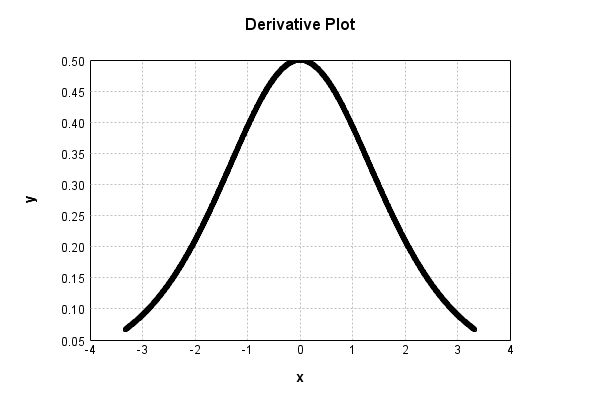

# SigmoidActivationLayer
## SigmoidActivationLayerTest
### Json Serialization
Code from [StandardLayerTests.java:69](../../../../../../../src/main/java/com/simiacryptus/mindseye/test/StandardLayerTests.java#L69) executed in 0.00 seconds: 
```java
    JsonObject json = layer.getJson();
    NNLayer echo = NNLayer.fromJson(json);
    if ((echo == null)) throw new AssertionError("Failed to deserialize");
    if ((layer == echo)) throw new AssertionError("Serialization did not copy");
    if ((!layer.equals(echo))) throw new AssertionError("Serialization not equal");
    return new GsonBuilder().setPrettyPrinting().create().toJson(json);
```

Returns: 

```
    {
      "class": "com.simiacryptus.mindseye.layers.java.SigmoidActivationLayer",
      "id": "381270e6-9c93-4f87-88dc-137d3fe3abfc",
      "isFrozen": true,
      "name": "SigmoidActivationLayer/381270e6-9c93-4f87-88dc-137d3fe3abfc",
      "balanced": true
    }
```


### Example Input/Output Pair
Code from [StandardLayerTests.java:153](../../../../../../../src/main/java/com/simiacryptus/mindseye/test/StandardLayerTests.java#L153) executed in 0.00 seconds: 
```java
    SimpleEval eval = SimpleEval.run(layer, inputPrototype);
    return String.format("--------------------\nInput: \n[%s]\n--------------------\nOutput: \n%s\n--------------------\nDerivative: \n%s",
      Arrays.stream(inputPrototype).map(t -> t.prettyPrint()).reduce((a, b) -> a + ",\n" + b).get(),
      eval.getOutput().prettyPrint(),
      Arrays.stream(eval.getDerivative()).map(t -> t.prettyPrint()).reduce((a, b) -> a + ",\n" + b).get());
```

Returns: 

```
    --------------------
    Input: 
    [[
    	[ [ -1.836 ], [ -0.28 ], [ 0.496 ] ],
    	[ [ 0.3 ], [ 0.664 ], [ -0.676 ] ]
    ]]
    --------------------
    Output: 
    [
    	[ [ -0.724949894621242 ], [ -0.1390924478784581 ], [ 0.243037713855222 ] ],
    	[ [ 0.14888503362331806 ], [ 0.3203167194475147 ], [ -0.325690709881322 ] ]
    ]
    --------------------
    Derivative: 
    [
    	[ [ 0.237223825144325 ], [ 0.4903266454715893 ], [ 0.4704663348220136 ] ],
    	[ [ 0.4889166233814917 ], [ 0.4486985996211911 ], [ 0.44696278074850027 ] ]
    ]
```


### Batch Execution
Code from [StandardLayerTests.java:102](../../../../../../../src/main/java/com/simiacryptus/mindseye/test/StandardLayerTests.java#L102) executed in 0.00 seconds: 
```java
    return getBatchingTester().test(layer, inputPrototype);
```

Returns: 

```
    ToleranceStatistics{absoluteTol=0.0000e+00 +- 0.0000e+00 [0.0000e+00 - 0.0000e+00] (120#), relativeTol=0.0000e+00 +- 0.0000e+00 [0.0000e+00 - 0.0000e+00] (120#)}
```


### Differential Validation
Code from [StandardLayerTests.java:110](../../../../../../../src/main/java/com/simiacryptus/mindseye/test/StandardLayerTests.java#L110) executed in 0.00 seconds: 
```java
    return getDerivativeTester().test(layer, inputPrototype);
```
Logging: 
```
    Inputs: [
    	[ [ -0.536 ], [ 1.628 ], [ -0.548 ] ],
    	[ [ 1.156 ], [ 1.048 ], [ 0.732 ] ]
    ]
    Inputs Statistics: {meanExponent=-0.06209500891317807, negative=2, min=0.732, max=0.732, mean=0.58, count=6.0, positive=4, stdDev=0.8356681957172555, zeros=0}
    Output: [
    	[ [ -0.26176285233260477 ], [ 0.6717909491774952 ], [ -0.26734290272754757 ] ],
    	[ [ 0.5212102688042373 ], [ 0.4807813187675778 ], [ 0.3504880105676904 ] ]
    ]
    Outputs Statistics: {meanExponent=-0.39735924397104533, negative=2, min=0.3504880105676904, max=0.3504880105676904, mean=0.24919413204280805, count=6.0, positive=4, stdDev=0.37513585795994303, zeros=0}
    Feedback for input 0
    Inputs Values: [
    	[ [ -0.536 ], [ 1.628 ], [ -0.548 ] ],
    	[ [ 1.156 ], [ 1.048 ], [ 0.732 ] ]
    ]
    Value Statistics: {meanExponent=-0.06209500891317807, negative=2, min=0.732, max=0.732, mean=0.58, count=6.0, positive=4, stdDev=0.8356681957172555, zeros=0}
    Implemented Feedback: [ [ 0.46574010456934956, 0.0, 0.0, 0.0, 0.0, 0.0 ], [ 0.0, 0.36416992784650737, 0.0, 0.0, 0.0, 0.0 ],
```
...[skipping 631 bytes](etc/100.txt)...
```
    .0, 0.0, 0.0, 0.0, 0.46427009175897815, 0.0 ], [ 0.0, 0.0, 0.0, 0.0, 0.0, 0.4385713911569944 ] ]
    Measured Statistics: {meanExponent=-0.40644302869825816, negative=0, min=0.4385713911569944, max=0.4385713911569944, mean=0.06643063293833758, count=36.0, positive=6, stdDev=0.1510695317551957, zeros=30}
    Feedback Error: [ [ 6.0953664297036525E-6, 0.0, 0.0, 0.0, 0.0, 0.0 ], [ 0.0, -9.49051261378564E-6, 0.0, 0.0, 0.0, 0.0 ], [ 0.0, 0.0, -9.215158404296542E-6, 0.0, 0.0, 0.0 ], [ 0.0, 0.0, 0.0, -9.241310742702513E-6, 0.0, 0.0 ], [ 0.0, 0.0, 0.0, 0.0, 6.205578373608134E-6, 0.0 ], [ 0.0, 0.0, 0.0, 0.0, 0.0, -7.686067156897902E-6 ] ]
    Error Statistics: {meanExponent=-5.104831281994836, negative=4, min=-7.686067156897902E-6, max=-7.686067156897902E-6, mean=-6.48114003176967E-7, count=36.0, positive=2, stdDev=3.2489624759959893E-6, zeros=30}
    Finite-Difference Derivative Accuracy:
    absoluteTol: 1.3315e-06 +- 3.0336e-06 [0.0000e+00 - 9.4905e-06] (36#)
    relativeTol: 1.0639e-05 +- 3.6847e-06 [6.5437e-06 - 1.6795e-05] (6#)
    
```

Returns: 

```
    ToleranceStatistics{absoluteTol=1.3315e-06 +- 3.0336e-06 [0.0000e+00 - 9.4905e-06] (36#), relativeTol=1.0639e-05 +- 3.6847e-06 [6.5437e-06 - 1.6795e-05] (6#)}
```


### Performance
Code from [StandardLayerTests.java:120](../../../../../../../src/main/java/com/simiacryptus/mindseye/test/StandardLayerTests.java#L120) executed in 0.00 seconds: 
```java
    getPerformanceTester().test(layer, permPrototype);
```
Logging: 
```
    Evaluation performance: 0.000160s +- 0.000013s [0.000148s - 0.000184s]
    Learning performance: 0.000041s +- 0.000004s [0.000035s - 0.000046s]
    
```

### Function Plots
Code from [ActivationLayerTestBase.java:103](../../../../../../../src/test/java/com/simiacryptus/mindseye/layers/java/ActivationLayerTestBase.java#L103) executed in 0.00 seconds: 
```java
    return plot("Value Plot", plotData, x -> new double[]{x[0], x[1]});
```

Returns: 


Code from [ActivationLayerTestBase.java:107](../../../../../../../src/test/java/com/simiacryptus/mindseye/layers/java/ActivationLayerTestBase.java#L107) executed in 0.00 seconds: 
```java
    return plot("Derivative Plot", plotData, x -> new double[]{x[0], x[2]});
```

Returns: 




