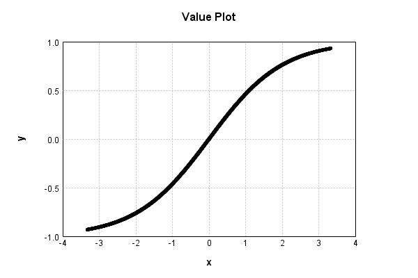
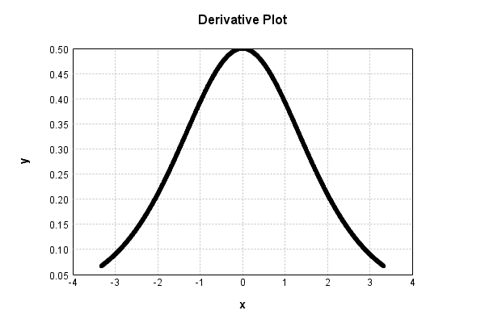

# SigmoidActivationLayer
## SigmoidActivationLayerTest
### Json Serialization
Code from [LayerTestBase.java:83](../../../../../../../src/test/java/com/simiacryptus/mindseye/layers/LayerTestBase.java#L83) executed in 0.00 seconds: 
```java
    JsonObject json = layer.getJson();
    NNLayer echo = NNLayer.fromJson(json);
    assert (echo != null) : "Failed to deserialize";
    assert (layer != echo) : "Serialization did not copy";
    Assert.assertEquals("Serialization not equal", layer, echo);
    return new GsonBuilder().setPrettyPrinting().create().toJson(json);
```

Returns: 

```
    {
      "class": "com.simiacryptus.mindseye.layers.java.SigmoidActivationLayer",
      "id": "a864e734-2f23-44db-97c1-504000002c8d",
      "isFrozen": true,
      "name": "SigmoidActivationLayer/a864e734-2f23-44db-97c1-504000002c8d",
      "balanced": true
    }
```


### Example Input/Output Pair
Code from [LayerTestBase.java:120](../../../../../../../src/test/java/com/simiacryptus/mindseye/layers/LayerTestBase.java#L120) executed in 0.00 seconds: 
```java
    SimpleEval eval = SimpleEval.run(layer, inputPrototype);
    return String.format("--------------------\nInput: \n[%s]\n--------------------\nOutput: \n%s",
      Arrays.stream(inputPrototype).map(t->t.prettyPrint()).reduce((a,b)->a+",\n"+b).get(),
      eval.getOutput().prettyPrint());
```

Returns: 

```
    --------------------
    Input: 
    [[
    	[ [ -1.808 ], [ 0.612 ], [ -1.628 ] ],
    	[ [ 0.688 ], [ -0.78 ], [ 0.256 ] ]
    ]]
    --------------------
    Output: 
    [
    	[ [ -0.7182399648128485 ], [ 0.29679378803513035 ], [ -0.671790949177495 ] ],
    	[ [ 0.3310437384241187 ], [ -0.3713602278765077 ], [ 0.1273055004507362 ] ]
    ]
```


### Batch Execution
Code from [LayerTestBase.java:138](../../../../../../../src/test/java/com/simiacryptus/mindseye/layers/LayerTestBase.java#L138) executed in 0.00 seconds: 
```java
    BatchingTester batchingTester = getBatchingTester();
    return batchingTester==null?null:batchingTester.test(layer, inputPrototype);
```

Returns: 

```
    ToleranceStatistics{absoluteTol=0.0000e+00 +- 0.0000e+00 [0.0000e+00 - 0.0000e+00] (120#), relativeTol=0.0000e+00 +- 0.0000e+00 [0.0000e+00 - 0.0000e+00] (120#)}
```


### Differential Validation
Code from [LayerTestBase.java:144](../../../../../../../src/test/java/com/simiacryptus/mindseye/layers/LayerTestBase.java#L144) executed in 0.00 seconds: 
```java
    return getDerivativeTester().test(layer, inputPrototype);
```
Logging: 
```
    Inputs: [
    	[ [ -1.808 ], [ 0.612 ], [ -1.628 ] ],
    	[ [ 0.688 ], [ -0.78 ], [ 0.256 ] ]
    ]
    Inputs Statistics: {meanExponent=-0.10107879082067843, negative=3, min=0.256, max=0.256, mean=-0.44333333333333336, count=6.0, positive=3, stdDev=1.021584172852253, zeros=0}
    Output: [
    	[ [ -0.7182399648128485 ], [ 0.29679378803513035 ], [ -0.671790949177495 ] ],
    	[ [ 0.3310437384241187 ], [ -0.3713602278765077 ], [ 0.1273055004507362 ] ]
    ]
    Outputs Statistics: {meanExponent=-0.4415855903504993, negative=3, min=0.1273055004507362, max=0.1273055004507362, mean=-0.16770801915947767, count=6.0, positive=3, stdDev=0.43783700676704446, zeros=0}
    Feedback for input 0
    Inputs Values: [
    	[ [ -1.808 ], [ 0.612 ], [ -1.628 ] ],
    	[ [ 0.688 ], [ -0.78 ], [ 0.256 ] ]
    ]
    Value Statistics: {meanExponent=-0.10107879082067843, negative=3, min=0.256, max=0.256, mean=-0.44333333333333336, count=6.0, positive=3, stdDev=1.021584172852253, zeros=0}
    Implemented Feedback: [ [ 0.24206567647281907, 0.0, 0.0, 0.0, 0.0, 0.0 ], [ 0.0, 0.44520502162509185, 0.0, 0.0, 0.0, 0.0 ], [ 0.0, 0.0, 0.45595672369187906, 0.0, 0.0, 0.0 ], [ 0.0, 0.0, 0.0, 0.43104579057575415, 0.0, 0.0 ], [ 0.0, 0.0, 0.0, 0.0, 0.2743484603016001, 0.0 ], [ 0.0, 0.0, 0.0, 0.0, 0.0, 0.4918966547774939 ] ]
    Implemented Statistics: {meanExponent=-0.423980550582741, negative=0, min=0.4918966547774939, max=0.4918966547774939, mean=0.06501439798457327, count=36.0, positive=6, stdDev=0.1505141481980114, zeros=30}
    Measured Feedback: [ [ 0.24207436964518436, 0.0, 0.0, 0.0, 0.0, 0.0 ], [ 0.0, 0.4451976522612533, 0.0, 0.0, 0.0, 0.0 ], [ 0.0, 0.0, 0.4559499571543668, 0.0, 0.0, 0.0 ], [ 0.0, 0.0, 0.0, 0.431053794027747, 0.0, 0.0 ], [ 0.0, 0.0, 0.0, 0.0, 0.27435767562256075, 0.0 ], [ 0.0, 0.0, 0.0, 0.0, 0.0, 0.4918935233311217 ] ]
    Measured Statistics: {meanExponent=-0.4239769090920833, negative=0, min=0.4918935233311217, max=0.4918935233311217, mean=0.06501463811228428, count=36.0, positive=6, stdDev=0.15051407697007965, zeros=30}
    Feedback Error: [ [ 8.693172365292767E-6, 0.0, 0.0, 0.0, 0.0, 0.0 ], [ 0.0, -7.369363838549692E-6, 0.0, 0.0, 0.0, 0.0 ], [ 0.0, 0.0, -6.766537512248316E-6, 0.0, 0.0, 0.0 ], [ 0.0, 0.0, 0.0, 8.003451992866228E-6, 0.0, 0.0 ], [ 0.0, 0.0, 0.0, 0.0, 9.215320960653806E-6, 0.0 ], [ 0.0, 0.0, 0.0, 0.0, 0.0, -3.1314463722065256E-6 ] ]
    Error Statistics: {meanExponent=-5.166582071303258, negative=3, min=-3.1314463722065256E-6, max=-3.1314463722065256E-6, mean=2.401277109946741E-7, count=36.0, positive=3, stdDev=3.0385135813288294E-6, zeros=30}
    Finite-Difference Derivative Accuracy:
    absoluteTol: 1.1994e-06 +- 2.8021e-06 [0.0000e+00 - 9.2153e-06] (36#)
    relativeTol: 1.0486e-05 +- 5.2386e-06 [3.1830e-06 - 1.7956e-05] (6#)
    
```

Returns: 

```
    ToleranceStatistics{absoluteTol=1.1994e-06 +- 2.8021e-06 [0.0000e+00 - 9.2153e-06] (36#), relativeTol=1.0486e-05 +- 5.2386e-06 [3.1830e-06 - 1.7956e-05] (6#)}
```


### Performance
Code from [LayerTestBase.java:149](../../../../../../../src/test/java/com/simiacryptus/mindseye/layers/LayerTestBase.java#L149) executed in 0.00 seconds: 
```java
    getPerformanceTester().test(layer, inputPrototype);
```
Logging: 
```
    Evaluation performance: 0.1579 +- 0.1767 [0.0940 - 1.8837]
    Learning performance: 0.0053 +- 0.0436 [0.0000 - 0.4389]
    
```

### Function Plots
Code from [ActivationLayerTestBase.java:74](../../../../../../../src/test/java/com/simiacryptus/mindseye/layers/java/ActivationLayerTestBase.java#L74) executed in 0.00 seconds: 
```java
    return plot("Value Plot", plotData, x -> new double[]{x[0], x[1]});
```

Returns: 




Code from [ActivationLayerTestBase.java:78](../../../../../../../src/test/java/com/simiacryptus/mindseye/layers/java/ActivationLayerTestBase.java#L78) executed in 0.00 seconds: 
```java
    return plot("Derivative Plot", plotData, x -> new double[]{x[0], x[2]});
```

Returns: 




