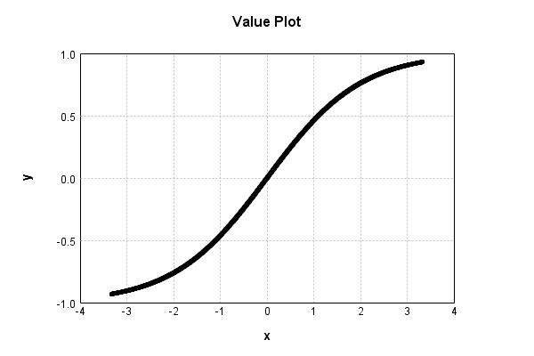

# SigmoidActivationLayer
## SigmoidActivationLayerTest
### Batch Execution
Code from [BatchingTester.java:66](../../../../../../../src/main/java/com/simiacryptus/mindseye/test/unit/BatchingTester.java#L66) executed in 0.00 seconds: 
```java
    return test(reference, inputPrototype);
```

Returns: 

```
    ToleranceStatistics{absoluteTol=0.0000e+00 +- 0.0000e+00 [0.0000e+00 - 0.0000e+00] (120#), relativeTol=0.0000e+00 +- 0.0000e+00 [0.0000e+00 - 0.0000e+00] (120#)}
```


Code from [SingleDerivativeTester.java:77](../../../../../../../src/main/java/com/simiacryptus/mindseye/test/unit/SingleDerivativeTester.java#L77) executed in 0.00 seconds: 
```java
    return test(component, inputPrototype);
```
Logging: 
```
    Inputs: [
    	[ [ 1.832 ], [ -0.512 ], [ 1.852 ] ],
    	[ [ 0.244 ], [ 1.088 ], [ 1.892 ] ]
    ]
    Inputs Statistics: {meanExponent=-0.00987062226329293, negative=1, min=1.892, max=1.892, mean=1.066, count=6.0, positive=5, stdDev=0.9177036558715455, zeros=0}
    Output: [
    	[ [ 0.723999622788764 ], [ -0.2505504079981744 ], [ 0.7287235098643203 ] ],
    	[ [ 0.12139829936450575 ], [ 0.4960098430228166 ], [ 0.7379668022916079 ] ]
    ]
    Outputs Statistics: {meanExponent=-0.3718440069711226, negative=1, min=0.7379668022916079, max=0.7379668022916079, mean=0.4262579448889734, count=6.0, positive=5, stdDev=0.3726419670939936, zeros=0}
    Feedback for input 0
    Inputs Values: [
    	[ [ 1.832 ], [ -0.512 ], [ 1.852 ] ],
    	[ [ 0.244 ], [ 1.088 ], [ 1.892 ] ]
    ]
    Value Statistics: {meanExponent=-0.00987062226329293, negative=1, min=1.892, max=1.892, mean=1.066, count=6.0, positive=5, stdDev=0.9177036558715455, zeros=0}
    Implemented Feedback: [ [ 0.23791227310086385, 0.0, 0.0, 0.0, 0.0, 0.0 ], [ 0.0, 0.492631226455703, 0.0, 0.0, 0.0, 0.0 ], [ 0.0, 
```
...[skipping 630 bytes](etc/326.txt)...
```
    , 0.0, 0.0, 0.23447247961216888, 0.0 ], [ 0.0, 0.0, 0.0, 0.0, 0.0, 0.22769409763423454 ] ]
    Measured Statistics: {meanExponent=-0.49275018534021536, negative=0, min=0.22769409763423454, max=0.22769409763423454, mean=0.056619287747139424, count=36.0, positive=6, stdDev=0.13461994637716607, zeros=30}
    Feedback Error: [ [ -8.612307293570653E-6, 0.0, 0.0, 0.0, 0.0, 0.0 ], [ 0.0, -2.9906204123131275E-6, 0.0, 0.0, 0.0, 0.0 ], [ 0.0, 0.0, 5.87023193865388E-6, 0.0, 0.0, 0.0 ], [ 0.0, 0.0, 0.0, -9.349548398429608E-6, 0.0, 0.0 ], [ 0.0, 0.0, 0.0, 0.0, -8.543473344002628E-6, 0.0 ], [ 0.0, 0.0, 0.0, 0.0, 0.0, -8.401723514822601E-6 ] ]
    Error Statistics: {meanExponent=-5.165611739987956, negative=5, min=-8.401723514822601E-6, max=-8.401723514822601E-6, mean=-8.896511395690205E-7, count=36.0, positive=1, stdDev=2.9817778581461262E-6, zeros=30}
    Finite-Difference Derivative Accuracy:
    absoluteTol: 1.2158e-06 +- 2.8643e-06 [0.0000e+00 - 9.3495e-06] (36#)
    relativeTol: 1.2744e-05 +- 6.1587e-06 [3.0354e-06 - 1.8449e-05] (6#)
    
```

Returns: 

```
    ToleranceStatistics{absoluteTol=1.2158e-06 +- 2.8643e-06 [0.0000e+00 - 9.3495e-06] (36#), relativeTol=1.2744e-05 +- 6.1587e-06 [3.0354e-06 - 1.8449e-05] (6#)}
```


### Json Serialization
Code from [JsonTest.java:36](../../../../../../../src/main/java/com/simiacryptus/mindseye/test/unit/JsonTest.java#L36) executed in 0.00 seconds: 
```java
    JsonObject json = layer.getJson();
    NNLayer echo = NNLayer.fromJson(json);
    if ((echo == null)) throw new AssertionError("Failed to deserialize");
    if ((layer == echo)) throw new AssertionError("Serialization did not copy");
    if ((!layer.equals(echo))) throw new AssertionError("Serialization not equal");
    return new GsonBuilder().setPrettyPrinting().create().toJson(json);
```

Returns: 

```
    {
      "class": "com.simiacryptus.mindseye.layers.java.SigmoidActivationLayer",
      "id": "979cb71c-4a4f-430c-910c-d7a460de2eda",
      "isFrozen": true,
      "name": "SigmoidActivationLayer/979cb71c-4a4f-430c-910c-d7a460de2eda",
      "balanced": true
    }
```


### Example Input/Output Pair
Code from [ReferenceIO.java:68](../../../../../../../src/main/java/com/simiacryptus/mindseye/test/unit/ReferenceIO.java#L68) executed in 0.00 seconds: 
```java
    SimpleEval eval = SimpleEval.run(layer, inputPrototype);
    return String.format("--------------------\nInput: \n[%s]\n--------------------\nOutput: \n%s\n--------------------\nDerivative: \n%s",
      Arrays.stream(inputPrototype).map(t -> t.prettyPrint()).reduce((a, b) -> a + ",\n" + b).get(),
      eval.getOutput().prettyPrint(),
      Arrays.stream(eval.getDerivative()).map(t -> t.prettyPrint()).reduce((a, b) -> a + ",\n" + b).get());
```

Returns: 

```
    --------------------
    Input: 
    [[
    	[ [ 0.244 ], [ -0.184 ], [ -1.62 ] ],
    	[ [ 1.26 ], [ 0.564 ], [ -1.172 ] ]
    ]]
    --------------------
    Output: 
    [
    	[ [ 0.12139829936450575 ], [ -0.09174131310838762 ], [ -0.6695902596187708 ] ],
    	[ [ 0.5580522155596246 ], [ 0.27475511396339947 ], [ -0.5270126696983195 ] ]
    ]
    --------------------
    Derivative: 
    [
    	[ [ 0.492631226455703 ], [ 0.4957917657345744 ], [ 0.27582444211183355 ] ],
    	[ [ 0.34428886235449724 ], [ 0.4622548136754797 ], [ 0.3611288229887251 ] ]
    ]
```


### Input Learning
In this test, we use a network to learn this target input, given it's pre-evaluated output:

Code from [LearningTester.java:127](../../../../../../../src/main/java/com/simiacryptus/mindseye/test/unit/LearningTester.java#L127) executed in 0.00 seconds: 
```java
    return Arrays.stream(input_target).map(x -> x.prettyPrint()).reduce((a, b) -> a + "\n" + b).orElse("");
```

Returns: 

```
    [
    	[ [ 1.64 ], [ -0.268 ], [ -1.44 ], [ 0.84 ], [ 0.856 ], [ 0.244 ], [ 0.336 ], [ 1.152 ], ... ],
    	[ [ -0.552 ], [ -1.192 ], [ 0.624 ], [ 0.256 ], [ 0.176 ], [ 0.388 ], [ -0.08 ], [ -0.168 ], ... ],
    	[ [ -1.348 ], [ -1.152 ], [ -1.456 ], [ 1.684 ], [ 0.84 ], [ -1.02 ], [ -1.232 ], [ 0.072 ], ... ],
    	[ [ -1.952 ], [ -0.428 ], [ 0.28 ], [ -1.1 ], [ -0.56 ], [ -0.72 ], [ 1.136 ], [ -0.884 ], ... ],
    	[ [ 1.652 ], [ -0.712 ], [ 0.696 ], [ 1.716 ], [ 0.592 ], [ -1.968 ], [ -0.416 ], [ 0.716 ], ... ],
    	[ [ -1.644 ], [ 0.04 ], [ -0.248 ], [ 1.656 ], [ -1.884 ], [ -0.84 ], [ 1.18 ], [ 0.084 ], ... ],
    	[ [ 1.068 ], [ 1.028 ], [ -0.64 ], [ 0.832 ], [ -0.724 ], [ 1.528 ], [ 1.128 ], [ -0.456 ], ... ],
    	[ [ -0.188 ], [ 0.604 ], [ 0.796 ], [ 0.104 ], [ 1.608 ], [ -1.432 ], [ -0.2 ], [ 1.276 ], ... ],
    	...
    ]
```


First, we use a conjugate gradient descent method, which converges the fastest for purely linear functions.

Code from [LearningTester.java:225](../../../../../../../src/main/java/com/simiacryptus/mindseye/test/unit/LearningTester.java#L225) executed in 3.94 seconds: 
```java
    return new IterativeTrainer(trainable)
      .setLineSearchFactory(label -> new QuadraticSearch())
      .setOrientation(new GradientDescent())
      .setMonitor(monitor)
      .setTimeout(30, TimeUnit.SECONDS)
      .setMaxIterations(250)
      .setTerminateThreshold(0)
      .run();
```
Logging: 
```
    Constructing line search parameters: GD
    F(0.0) = LineSearchPoint{point=PointSample{avg=0.4760433731581458}, derivative=-2.4225056289999625E-5}
    New Minimum: 0.4760433731581458 > 0.47604337315814366
    F(1.0E-10) = LineSearchPoint{point=PointSample{avg=0.47604337315814366}, derivative=-2.4225056289999615E-5}, delta = -2.1649348980190553E-15
    New Minimum: 0.47604337315814366 > 0.4760433731581293
    F(7.000000000000001E-10) = LineSearchPoint{point=PointSample{avg=0.4760433731581293}, derivative=-2.4225056289999543E-5}, delta = -1.6542323066914832E-14
    New Minimum: 0.4760433731581293 > 0.47604337315802914
    F(4.900000000000001E-9) = LineSearchPoint{point=PointSample{avg=0.47604337315802914}, derivative=-2.4225056289999062E-5}, delta = -1.1668443988810395E-13
    New Minimum: 0.47604337315802914 > 0.476043373157317
    F(3.430000000000001E-8) = LineSearchPoint{point=PointSample{avg=0.476043373157317}, derivative=-2.4225056289995695E-5}, delta = -8.288369990339106E-13
    New Minimum: 0.476043373157317 > 0.47604337315233225
    F(
```
...[skipping 318469 bytes](etc/327.txt)...
```
    t=PointSample{avg=0.01910214834561641}, derivative=-2.6438823453029736E-12}, delta = -3.1761921971983076E-5
    Left bracket at 40006.380059488445
    Converged to left
    Iteration 249 complete. Error: 0.01910214834561641 Total: 239713838284975.2000; Orientation: 0.0003; Line Search: 0.0154
    F(0.0) = LineSearchPoint{point=PointSample{avg=0.01910214834561641}, derivative=-1.4910574371612123E-9}
    New Minimum: 0.01910214834561641 > 0.0190732406576496
    F(40006.380059488445) = LineSearchPoint{point=PointSample{avg=0.0190732406576496}, derivative=6.199104943361667E-11}, delta = -2.8907687966810147E-5
    0.0190732406576496 <= 0.01910214834561641
    New Minimum: 0.0190732406576496 > 0.01907319275060115
    F(38409.496571732394) = LineSearchPoint{point=PointSample{avg=0.01907319275060115}, derivative=-1.9599507935841416E-12}, delta = -2.8955595015259933E-5
    Left bracket at 38409.496571732394
    Converged to left
    Iteration 250 complete. Error: 0.01907319275060115 Total: 239713845345600.1600; Orientation: 0.0004; Line Search: 0.0056
    
```

Returns: 

```
    0.01907319275060115
```


This training run resulted in the following regressed input:

Code from [LearningTester.java:144](../../../../../../../src/main/java/com/simiacryptus/mindseye/test/unit/LearningTester.java#L144) executed in 0.00 seconds: 
```java
    return Arrays.stream(input_gd).map(x -> x.prettyPrint()).reduce((a, b) -> a + "\n" + b).orElse("");
```

Returns: 

```
    [
    	[ [ 1.6400000000000015 ], [ -0.26800000114395867 ], [ -1.4399999999999997 ], [ 0.8399999999999999 ], [ 0.856 ], [ 0.24400002561098832 ], [ 0.33600000000002145 ], [ 1.1520000000000001 ], ... ],
    	[ [ -0.5519999999999999 ], [ -7.174842612279441 ], [ 0.6240000000000007 ], [ 0.2560000053905352 ], [ 0.17596955393393224 ], [ 0.38800000000000034 ], [ -0.07145241268138267 ], [ -0.16807195155466767 ], ... ],
    	[ [ -7.21630993625606 ], [ -1.152 ], [ -1.456 ], [ 1.6840000000000002 ], [ 0.8399999999999999 ], [ -1.02 ], [ -1.232 ], [ 0.08630395144374647 ], ... ],
    	[ [ -8.549824376301546 ], [ -0.4279999999999998 ], [ 0.2799999998936195 ], [ -1.1 ], [ -0.5600000000000002 ], [ -0.7199999999999995 ], [ 1.1359999999999997 ], [ -0.884 ], ... ],
    	[ [ 1.6520000000000004 ], [ -0.7119999999999999 ], [ 0.6959999999999997 ], [ 9.296529775821604 ], [ 0.5919999999999999 ], [ -10.195151777433438 ], [ -0.41600000000000004 ], [ 0.7159999999999996 ], ... ],
    	[ [ -9.409810933661204 ], [ 0.06686446670227462 ], [ -0.24799999586588953 ], [ 1.655999999999999 ], [ -1.8840000000000003 ], [ -0.8399999999999999 ], [ 1.18 ], [ 0.07538651298341871 ], ... ],
    	[ [ 1.068 ], [ 1.0279999999999998 ], [ -0.6400000000000001 ], [ 0.8319999999999997 ], [ -0.7239999999999999 ], [ 8.81233920080296 ], [ 1.128 ], [ -0.456 ], ... ],
    	[ [ -0.18798863599677884 ], [ 0.6040000000000002 ], [ 0.7960000000000003 ], [ 0.10068711900522362 ], [ 8.684927085887095 ], [ -1.4319999999999997 ], [ -0.20000461199088165 ], [ 1.2760000000000002 ], ... ],
    	...
    ]
```


Next, we run the same optimization using L-BFGS, which is nearly ideal for purely second-order or quadratic functions.

Code from [LearningTester.java:249](../../../../../../../src/main/java/com/simiacryptus/mindseye/test/unit/LearningTester.java#L249) executed in 4.82 seconds: 
```java
    return new IterativeTrainer(trainable)
      .setLineSearchFactory(label -> new ArmijoWolfeSearch())
      .setOrientation(new LBFGS())
      .setMonitor(monitor)
      .setTimeout(30, TimeUnit.SECONDS)
      .setMaxIterations(250)
      .setTerminateThreshold(0)
      .run();
```
Logging: 
```
    LBFGS Accumulation History: 1 points
    Constructing line search parameters: GD
    th(0)=0.4760433731581458;dx=-2.4225056289999625E-5
    New Minimum: 0.4760433731581458 > 0.4759911821225118
    WOLFE (weak): th(2.154434690031884)=0.4759911821225118; dx=-2.42248092967171E-5 delta=5.219103563403049E-5
    New Minimum: 0.4759911821225118 > 0.475938991619374
    WOLFE (weak): th(4.308869380063768)=0.475938991619374; dx=-2.422456195998063E-5 delta=1.0438153877184719E-4
    New Minimum: 0.475938991619374 > 0.47573023494664785
    WOLFE (weak): th(12.926608140191302)=0.47573023494664785; dx=-2.422356917809354E-5 delta=3.131382114979764E-4
    New Minimum: 0.47573023494664785 > 0.47479093677129597
    WOLFE (weak): th(51.70643256076521)=0.47479093677129597; dx=-2.4219033617440953E-5 delta=0.0012524363868498534
    New Minimum: 0.47479093677129597 > 0.469784459099353
    WOLFE (weak): th(258.53216280382605)=0.469784459099353; dx=-2.419295934418361E-5 delta=0.006258914058792808
    New Minimum: 0.469784459099353 > 0.4386499151659146
    WOLFE (weak): th(155
```
...[skipping 326192 bytes](etc/328.txt)...
```
    7 > 6.139851638541981E-7
    WOLFE (weak): th(4.308869380063768)=6.139851638541981E-7; dx=-1.2674567919280784E-11 delta=5.4614300486750095E-11
    New Minimum: 6.139851638541981E-7 > 6.138759427104612E-7
    WOLFE (weak): th(12.926608140191302)=6.138759427104612E-7; dx=-1.2673414138782329E-11 delta=1.6383544422368727E-10
    New Minimum: 6.138759427104612E-7 > 6.133845706076015E-7
    WOLFE (weak): th(51.70643256076521)=6.133845706076015E-7; dx=-1.2668222155976447E-11 delta=6.552075470834247E-10
    New Minimum: 6.133845706076015E-7 > 6.107673198104902E-7
    WOLFE (weak): th(258.53216280382605)=6.107673198104902E-7; dx=-1.2640532394534893E-11 delta=3.2724583441946686E-9
    New Minimum: 6.107673198104902E-7 > 5.94539239210867E-7
    WOLFE (weak): th(1551.1929768229563)=5.94539239210867E-7; dx=-1.2467502425216489E-11 delta=1.9500538943817925E-8
    MAX ALPHA: th(0)=6.140397781546849E-7;th'(0)=-1.2675144810422043E-11;
    Iteration 250 complete. Error: 5.94539239210867E-7 Total: 239718680253054.3400; Orientation: 0.0005; Line Search: 0.0126
    
```

Returns: 

```
    5.94539239210867E-7
```


Training Converged

Code from [LearningTester.java:95](../../../../../../../src/main/java/com/simiacryptus/mindseye/test/unit/LearningTester.java#L95) executed in 0.00 seconds: 
```java
    return TestUtil.compare(runs);
```

Returns: 




Code from [LearningTester.java:98](../../../../../../../src/main/java/com/simiacryptus/mindseye/test/unit/LearningTester.java#L98) executed in 0.00 seconds: 
```java
    return TestUtil.compareTime(runs);
```

Returns: 


### Performance
Now we execute larger-scale runs to benchmark performance:

Code from [PerformanceTester.java:66](../../../../../../../src/main/java/com/simiacryptus/mindseye/test/unit/PerformanceTester.java#L66) executed in 0.20 seconds: 
```java
    test(component, inputPrototype);
```
Logging: 
```
    100 batches
    Input Dimensions:
    	[100, 100, 1]
    Performance:
    	Evaluation performance: 0.007961s +- 0.001196s [0.006460s - 0.009552s]
    	Learning performance: 0.013008s +- 0.002245s [0.010479s - 0.017208s]
    
```

### Function Plots
Code from [ActivationLayerTestBase.java:110](../../../../../../../src/test/java/com/simiacryptus/mindseye/layers/java/ActivationLayerTestBase.java#L110) executed in 0.00 seconds: 
```java
    return plot("Value Plot", plotData, x -> new double[]{x[0], x[1]});
```

Returns: 


Code from [ActivationLayerTestBase.java:114](../../../../../../../src/test/java/com/simiacryptus/mindseye/layers/java/ActivationLayerTestBase.java#L114) executed in 0.00 seconds: 
```java
    return plot("Derivative Plot", plotData, x -> new double[]{x[0], x[2]});
```

Returns: 


