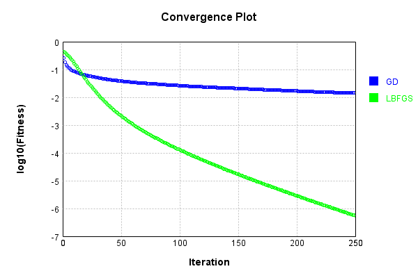
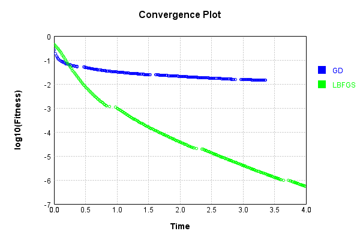

# SigmoidActivationLayer
## SigmoidActivationLayerTest
### Json Serialization
Code from [JsonTest.java:36](../../../../../../../src/main/java/com/simiacryptus/mindseye/test/unit/JsonTest.java#L36) executed in 0.00 seconds: 
```java
    JsonObject json = layer.getJson();
    NNLayer echo = NNLayer.fromJson(json);
    if ((echo == null)) throw new AssertionError("Failed to deserialize");
    if ((layer == echo)) throw new AssertionError("Serialization did not copy");
    if ((!layer.equals(echo))) throw new AssertionError("Serialization not equal");
    return new GsonBuilder().setPrettyPrinting().create().toJson(json);
```

Returns: 

```
    {
      "class": "com.simiacryptus.mindseye.layers.java.SigmoidActivationLayer",
      "id": "85d94af9-ebc5-4da0-bf21-c81cab68b541",
      "isFrozen": true,
      "name": "SigmoidActivationLayer/85d94af9-ebc5-4da0-bf21-c81cab68b541",
      "balanced": true
    }
```


### Example Input/Output Pair
Code from [ReferenceIO.java:68](../../../../../../../src/main/java/com/simiacryptus/mindseye/test/unit/ReferenceIO.java#L68) executed in 0.00 seconds: 
```java
    SimpleEval eval = SimpleEval.run(layer, inputPrototype);
    return String.format("--------------------\nInput: \n[%s]\n--------------------\nOutput: \n%s\n--------------------\nDerivative: \n%s",
      Arrays.stream(inputPrototype).map(t -> t.prettyPrint()).reduce((a, b) -> a + ",\n" + b).get(),
      eval.getOutput().prettyPrint(),
      Arrays.stream(eval.getDerivative()).map(t -> t.prettyPrint()).reduce((a, b) -> a + ",\n" + b).get());
```

Returns: 

```
    --------------------
    Input: 
    [[
    	[ [ 0.392 ], [ 1.492 ], [ 0.26 ] ],
    	[ [ 1.512 ], [ -1.448 ], [ -0.704 ] ]
    ]]
    --------------------
    Output: 
    [
    	[ [ 0.19352813145089298 ], [ 0.632756543770354 ], [ 0.12927258360605842 ] ],
    	[ [ 0.6387148352459118 ], [ -0.6193808823818594 ], [ -0.338148052502535 ] ]
    ]
    --------------------
    Derivative: 
    [
    	[ [ 0.48127343116856286 ], [ 0.299809578157898 ], [ 0.4916442995639072 ] ],
    	[ [ 0.2960216796183939 ], [ 0.30818366126993463 ], [ 0.44282794729437136 ] ]
    ]
```


### Batch Execution
Code from [BatchingTester.java:66](../../../../../../../src/main/java/com/simiacryptus/mindseye/test/unit/BatchingTester.java#L66) executed in 0.00 seconds: 
```java
    return test(reference, inputPrototype);
```

Returns: 

```
    ToleranceStatistics{absoluteTol=0.0000e+00 +- 0.0000e+00 [0.0000e+00 - 0.0000e+00] (120#), relativeTol=0.0000e+00 +- 0.0000e+00 [0.0000e+00 - 0.0000e+00] (120#)}
```


Code from [SingleDerivativeTester.java:77](../../../../../../../src/main/java/com/simiacryptus/mindseye/test/unit/SingleDerivativeTester.java#L77) executed in 0.00 seconds: 
```java
    return test(component, inputPrototype);
```
Logging: 
```
    Inputs: [
    	[ [ -1.984 ], [ -0.544 ], [ 1.9 ] ],
    	[ [ -1.468 ], [ 0.928 ], [ 0.968 ] ]
    ]
    Inputs Statistics: {meanExponent=0.07200725959607936, negative=3, min=0.968, max=0.968, mean=-0.03333333333333336, count=6.0, positive=3, stdDev=1.4017107008540988, zeros=0}
    Output: [
    	[ [ -0.7582138378921368 ], [ -0.2654848561891099 ], [ 0.7397830512740042 ] ],
    	[ [ -0.6255064110706863 ], [ 0.43333870550299136 ], [ 0.4494413518683644 ] ]
    ]
    Outputs Statistics: {meanExponent=-0.29022198137827593, negative=3, min=0.4494413518683644, max=0.4494413518683644, mean=-0.004440332751095492, count=6.0, positive=3, stdDev=0.57352264256469, zeros=0}
    Feedback for input 0
    Inputs Values: [
    	[ [ -1.984 ], [ -0.544 ], [ 1.9 ] ],
    	[ [ -1.468 ], [ 0.928 ], [ 0.968 ] ]
    ]
    Value Statistics: {meanExponent=0.07200725959607936, negative=3, min=0.968, max=0.968, mean=-0.03333333333333336, count=6.0, positive=3, stdDev=1.4017107008540988, zeros=0}
    Implemented Feedback: [ [ 0.21255588801443825, 0.0, 0.0, 0.0, 0.0, 0.0 ], [ 0.0, 0.3043708648547
```
...[skipping 657 bytes](etc/388.txt)...
```
    , 0.0, 0.0, 0.0, 0.22635214576016693, 0.0 ], [ 0.0, 0.0, 0.0, 0.0, 0.0, 0.3989922691016723 ] ]
    Measured Statistics: {meanExponent=-0.4929130317243293, negative=0, min=0.3989922691016723, max=0.3989922691016723, mean=0.055920938716684056, count=36.0, positive=6, stdDev=0.13087390946871746, zeros=30}
    Feedback Error: [ [ 8.058270222432995E-6, 0.0, 0.0, 0.0, 0.0, 0.0 ], [ 0.0, 9.519340378350005E-6, 0.0, 0.0, 0.0, 0.0 ], [ 0.0, 0.0, 6.169015693391344E-6, 0.0, 0.0, 0.0 ], [ 0.0, 0.0, 0.0, -8.799280300064716E-6, 0.0, 0.0 ], [ 0.0, 0.0, 0.0, 0.0, -8.372763695058127E-6, 0.0 ], [ 0.0, 0.0, 0.0, 0.0, 0.0, -8.966513696195832E-6 ] ]
    Error Statistics: {meanExponent=-5.0841659732469076, negative=3, min=-8.966513696195832E-6, max=-8.966513696195832E-6, mean=-6.644253880956476E-8, count=36.0, positive=3, stdDev=3.4212581441616096E-6, zeros=30}
    Finite-Difference Derivative Accuracy:
    absoluteTol: 1.3857e-06 +- 3.1288e-06 [0.0000e+00 - 9.5193e-06] (36#)
    relativeTol: 1.3632e-05 +- 4.4442e-06 [6.6367e-06 - 1.8955e-05] (6#)
    
```

Returns: 

```
    ToleranceStatistics{absoluteTol=1.3857e-06 +- 3.1288e-06 [0.0000e+00 - 9.5193e-06] (36#), relativeTol=1.3632e-05 +- 4.4442e-06 [6.6367e-06 - 1.8955e-05] (6#)}
```


### Performance
Now we execute larger-scale runs to benchmark performance:

Code from [PerformanceTester.java:66](../../../../../../../src/main/java/com/simiacryptus/mindseye/test/unit/PerformanceTester.java#L66) executed in 0.13 seconds: 
```java
    test(component, inputPrototype);
```
Logging: 
```
    100 batches
    Input Dimensions:
    	[100, 100, 1]
    Performance:
    	Evaluation performance: 0.007167s +- 0.000391s [0.006639s - 0.007657s]
    	Learning performance: 0.012348s +- 0.000299s [0.012115s - 0.012938s]
    
```

### Input Learning
In this test, we use a network to learn this target input, given it's pre-evaluated output:

Code from [LearningTester.java:127](../../../../../../../src/main/java/com/simiacryptus/mindseye/test/unit/LearningTester.java#L127) executed in 0.00 seconds: 
```java
    return Arrays.stream(input_target).map(x -> x.prettyPrint()).reduce((a, b) -> a + "\n" + b).orElse("");
```

Returns: 

```
    [
    	[ [ 1.536 ], [ -1.884 ], [ 1.812 ], [ -0.852 ], [ -0.308 ], [ 1.7 ], [ -1.12 ], [ -1.82 ], ... ],
    	[ [ 1.796 ], [ 1.54 ], [ -1.852 ], [ 0.732 ], [ 0.58 ], [ 0.116 ], [ -1.02 ], [ 1.492 ], ... ],
    	[ [ -1.884 ], [ 0.156 ], [ -0.352 ], [ -1.584 ], [ -1.296 ], [ -1.384 ], [ -0.856 ], [ 0.324 ], ... ],
    	[ [ 0.4 ], [ -1.268 ], [ -0.424 ], [ 1.576 ], [ -1.808 ], [ -0.88 ], [ 1.936 ], [ -0.38 ], ... ],
    	[ [ 1.244 ], [ -1.004 ], [ -1.12 ], [ -0.768 ], [ -1.48 ], [ 1.784 ], [ -0.768 ], [ 0.476 ], ... ],
    	[ [ -1.64 ], [ 0.228 ], [ -1.9 ], [ 0.544 ], [ 1.976 ], [ -0.252 ], [ 0.18 ], [ -1.264 ], ... ],
    	[ [ 0.348 ], [ 0.8 ], [ 0.536 ], [ 0.44 ], [ 0.028 ], [ 0.332 ], [ -0.46 ], [ 1.896 ], ... ],
    	[ [ -0.748 ], [ -0.44 ], [ 1.348 ], [ 0.352 ], [ -1.232 ], [ -1.308 ], [ -1.904 ], [ -1.596 ], ... ],
    	...
    ]
```


First, we use a conjugate gradient descent method, which converges the fastest for purely linear functions.

Code from [LearningTester.java:300](../../../../../../../src/main/java/com/simiacryptus/mindseye/test/unit/LearningTester.java#L300) executed in 3.41 seconds: 
```java
    return new IterativeTrainer(trainable)
      .setLineSearchFactory(label -> new QuadraticSearch())
      .setOrientation(new GradientDescent())
      .setMonitor(monitor)
      .setTimeout(30, TimeUnit.SECONDS)
      .setMaxIterations(250)
      .setTerminateThreshold(0)
      .run();
```
Logging: 
```
    Constructing line search parameters: GD
    F(0.0) = LineSearchPoint{point=PointSample{avg=0.47913936347247466}, derivative=-2.4453174086271638E-5}
    New Minimum: 0.47913936347247466 > 0.4791393634724721
    F(1.0E-10) = LineSearchPoint{point=PointSample{avg=0.4791393634724721}, derivative=-2.4453174086271624E-5}, delta = -2.55351295663786E-15
    New Minimum: 0.4791393634724721 > 0.4791393634724577
    F(7.000000000000001E-10) = LineSearchPoint{point=PointSample{avg=0.4791393634724577}, derivative=-2.4453174086271553E-5}, delta = -1.6930901125533637E-14
    New Minimum: 0.4791393634724577 > 0.4791393634723557
    F(4.900000000000001E-9) = LineSearchPoint{point=PointSample{avg=0.4791393634723557}, derivative=-2.4453174086271048E-5}, delta = -1.1896039708858552E-13
    New Minimum: 0.4791393634723557 > 0.4791393634716367
    F(3.430000000000001E-8) = LineSearchPoint{point=PointSample{avg=0.4791393634716367}, derivative=-2.445317408626752E-5}, delta = -8.379408278358369E-13
    New Minimum: 0.4791393634716367 > 0.4791393634666056
    F(2.401
```
...[skipping 320587 bytes](etc/389.txt)...
```
    ointSample{avg=0.01435725113407149}, derivative=-3.201796515423461E-13}, delta = -3.0819208484030025E-5
    Left bracket at 43053.591631890566
    Converged to left
    Iteration 249 complete. Error: 0.01435725113407149 Total: 249847366480007.6600; Orientation: 0.0003; Line Search: 0.0153
    F(0.0) = LineSearchPoint{point=PointSample{avg=0.01435725113407149}, derivative=-1.7407894696422738E-9}
    New Minimum: 0.01435725113407149 > 0.01432340847412148
    F(43053.591631890566) = LineSearchPoint{point=PointSample{avg=0.01432340847412148}, derivative=1.8177098398112028E-10}, delta = -3.384265995001051E-5
    0.01432340847412148 <= 0.01435725113407149
    New Minimum: 0.01432340847412148 > 0.014323046025683064
    F(38983.03369437508) = LineSearchPoint{point=PointSample{avg=0.014323046025683064}, derivative=-3.548454676334045E-12}, delta = -3.4205108388425665E-5
    Left bracket at 38983.03369437508
    Converged to left
    Iteration 250 complete. Error: 0.014323046025683064 Total: 249847373433195.6200; Orientation: 0.0003; Line Search: 0.0056
    
```

Returns: 

```
    0.014323046025683064
```


This training run resulted in the following regressed input:

Code from [LearningTester.java:144](../../../../../../../src/main/java/com/simiacryptus/mindseye/test/unit/LearningTester.java#L144) executed in 0.00 seconds: 
```java
    return Arrays.stream(input_gd).map(x -> x.prettyPrint()).reduce((a, b) -> a + "\n" + b).orElse("");
```

Returns: 

```
    [
    	[ [ 1.5359999999999994 ], [ -1.8840000000000003 ], [ 1.812 ], [ -0.8519999999999996 ], [ -0.3080000000027586 ], [ 8.005303663752638 ], [ -1.12 ], [ -1.8200000000000003 ], ... ],
    	[ [ 1.7960000000000007 ], [ 6.584786826848083 ], [ -1.8520000000000003 ], [ 0.7320000000000003 ], [ 0.5800000000000003 ], [ 0.1144407333346678 ], [ -1.02 ], [ 1.4919999999999993 ], ... ],
    	[ [ -7.171777101832964 ], [ 0.15575968297825643 ], [ -0.3520000000000026 ], [ -1.5840000000000003 ], [ -1.296 ], [ -1.3840000000000001 ], [ -0.856 ], [ 0.3239999999998183 ], ... ],
    	[ [ 0.4000000000000007 ], [ -1.2680000000000002 ], [ -0.42400000000000004 ], [ 6.4912472687128036 ], [ -1.808 ], [ -0.88 ], [ 1.936 ], [ -0.38000000000000106 ], ... ],
    	[ [ 1.2439999999999996 ], [ -1.004 ], [ -1.12 ], [ -0.7679999999999999 ], [ -1.4800000000000004 ], [ 5.706220654899169 ], [ -0.7679999999999999 ], [ 0.47599999999999987 ], ... ],
    	[ [ -5.096630998739475 ], [ 0.22800016824467356 ], [ -1.9 ], [ 0.5440000000000008 ], [ 1.9760000000000013 ], [ -0.2519999806471965 ], [ 0.17997477534316747 ], [ -1.2640000000000002 ], ... ],
    	[ [ 0.3479999999999895 ], [ 0.8000000000000002 ], [ 0.5360000000000005 ], [ 0.43999999999999995 ], [ 0.007693838241206084 ], [ 0.33199999999991525 ], [ -0.4599999999999998 ], [ 1.8960000000000006 ], ... ],
    	[ [ -0.7480000000000001 ], [ -0.44000000000000017 ], [ 7.46621459670206 ], [ 0.35200000000000176 ], [ -1.2319999999999998 ], [ -1.308 ], [ -1.9040000000000001 ], [ -8.62192446907584 ], ... ],
    	...
    ]
```


Next, we run the same optimization using L-BFGS, which is nearly ideal for purely second-order or quadratic functions.

Code from [LearningTester.java:324](../../../../../../../src/main/java/com/simiacryptus/mindseye/test/unit/LearningTester.java#L324) executed in 4.01 seconds: 
```java
    return new IterativeTrainer(trainable)
      .setLineSearchFactory(label -> new ArmijoWolfeSearch())
      .setOrientation(new LBFGS())
      .setMonitor(monitor)
      .setTimeout(30, TimeUnit.SECONDS)
      .setMaxIterations(250)
      .setTerminateThreshold(0)
      .run();
```
Logging: 
```
    LBFGS Accumulation History: 1 points
    Constructing line search parameters: GD
    th(0)=0.47913936347247466;dx=-2.4453174086271638E-5
    New Minimum: 0.47913936347247466 > 0.4790866809844588
    WOLFE (weak): th(2.154434690031884)=0.4790866809844588; dx=-2.4452915477501636E-5 delta=5.268248801587605E-5
    New Minimum: 0.4790866809844588 > 0.479033999053965
    WOLFE (weak): th(4.308869380063768)=0.479033999053965; dx=-2.4452656524794963E-5 delta=1.0536441850966805E-4
    New Minimum: 0.479033999053965 > 0.47882327692208676
    WOLFE (weak): th(12.926608140191302)=0.47882327692208676; dx=-2.4451617274221016E-5 delta=3.160865503878951E-4
    New Minimum: 0.47882327692208676 > 0.4778751391375402
    WOLFE (weak): th(51.70643256076521)=0.4778751391375402; dx=-2.444687251092919E-5 delta=0.0012642243349344495
    New Minimum: 0.4778751391375402 > 0.4728216540818057
    WOLFE (weak): th(258.53216280382605)=0.4728216540818057; dx=-2.4419680131917434E-5 delta=0.006317709390668946
    New Minimum: 0.4728216540818057 > 0.44139857713464636
    WOLFE (weak):
```
...[skipping 326311 bytes](etc/390.txt)...
```
    7 > 5.662278033294242E-7
    WOLFE (weak): th(4.308869380063768)=5.662278033294242E-7; dx=-1.1684364504748748E-11 delta=5.034754758233427E-11
    New Minimum: 5.662278033294242E-7 > 5.661271151171165E-7
    WOLFE (weak): th(12.926608140191302)=5.661271151171165E-7; dx=-1.1683299591298445E-11 delta=1.5103575989004584E-10
    New Minimum: 5.661271151171165E-7 > 5.656741317285337E-7
    WOLFE (weak): th(51.70643256076521)=5.656741317285337E-7; dx=-1.1678507507708507E-11 delta=6.040191484728181E-10
    New Minimum: 5.656741317285337E-7 > 5.632613588329035E-7
    WOLFE (weak): th(258.53216280382605)=5.632613588329035E-7; dx=-1.1652950472975077E-11 delta=3.01679204410304E-9
    New Minimum: 5.632613588329035E-7 > 5.483012726102333E-7
    WOLFE (weak): th(1551.1929768229563)=5.483012726102333E-7; dx=-1.1493247408690063E-11 delta=1.7976878266773196E-8
    MAX ALPHA: th(0)=5.662781508770065E-7;th'(0)=-1.1684896962290138E-11;
    Iteration 250 complete. Error: 5.483012726102333E-7 Total: 249851388250358.6200; Orientation: 0.0006; Line Search: 0.0129
    
```

Returns: 

```
    5.483012726102333E-7
```


Training Converged

Code from [LearningTester.java:96](../../../../../../../src/main/java/com/simiacryptus/mindseye/test/unit/LearningTester.java#L96) executed in 0.00 seconds: 
```java
    return TestUtil.compare(runs);
```

Returns: 




Code from [LearningTester.java:99](../../../../../../../src/main/java/com/simiacryptus/mindseye/test/unit/LearningTester.java#L99) executed in 0.00 seconds: 
```java
    return TestUtil.compareTime(runs);
```

Returns: 




### Function Plots
Code from [ActivationLayerTestBase.java:110](../../../../../../../src/test/java/com/simiacryptus/mindseye/layers/java/ActivationLayerTestBase.java#L110) executed in 0.00 seconds: 
```java
    return plot("Value Plot", plotData, x -> new double[]{x[0], x[1]});
```

Returns: 


Code from [ActivationLayerTestBase.java:114](../../../../../../../src/test/java/com/simiacryptus/mindseye/layers/java/ActivationLayerTestBase.java#L114) executed in 0.00 seconds: 
```java
    return plot("Derivative Plot", plotData, x -> new double[]{x[0], x[2]});
```

Returns: 


