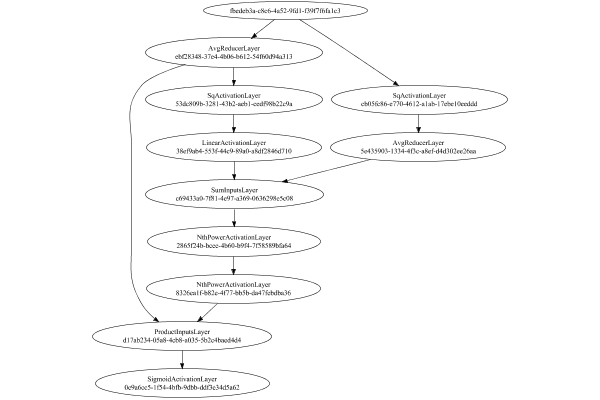

# SignReducerLayer
## Normal
### Json Serialization
Code from [StandardLayerTests.java:68](../../../../../../../../src/main/java/com/simiacryptus/mindseye/test/StandardLayerTests.java#L68) executed in 0.00 seconds: 
```java
    JsonObject json = layer.getJson();
    NNLayer echo = NNLayer.fromJson(json);
    if ((echo == null)) throw new AssertionError("Failed to deserialize");
    if ((layer == echo)) throw new AssertionError("Serialization did not copy");
    if ((!layer.equals(echo))) throw new AssertionError("Serialization not equal");
    return new GsonBuilder().setPrettyPrinting().create().toJson(json);
```

Returns: 

```
    {
      "class": "com.simiacryptus.mindseye.layers.java.SignReducerLayer",
      "id": "52ee5bc4-7f74-4f32-9c09-86bb0fe7d5eb",
      "isFrozen": false,
      "name": "SignReducerLayer/52ee5bc4-7f74-4f32-9c09-86bb0fe7d5eb",
      "inputs": [
        "fbedeb3a-c8c6-4a52-9fd1-f39f7f6fa1c3"
      ],
      "nodes": {
        "91f28aa0-ef4d-4bef-89f8-c905db06c346": "ebf28348-37e4-4b06-b612-54f60d94a313",
        "ed2e0e32-7e10-4943-ad33-bd5ff28257ba": "cb05fc86-e770-4612-a1ab-17ebe10eeddd",
        "40dc983f-0773-4875-aa30-a9317ae188f2": "5e435903-1334-4f3c-a8ef-d4d302ee26aa",
        "a53e7470-ff36-4282-bb8f-4921437e0a47": "53dc809b-3281-43b2-aeb1-cedf98b22c9a",
        "da3b1fec-2498-4fd7-8d60-643833db4a74": "38ef9ab4-553f-44c9-89a0-a8df2846d710",
        "46264eeb-a9f3-440a-843c-e880cae8587d": "c69433a0-7f81-4e97-a369-0636298e5c08",
        "4f463b65-76d0-4726-9757-6eafc8234fb4": "2865f24b-bcee-4b60-b9f4-7f58589bfa64",
        "491f994f-1430-4b13-9446-184920a491f0": "8326ea1f-b82e-4f77-bb5b-da47febdba36",
        "86bb05b2-b3ec-4992-94b2-dd1e1631484e": "d17ab234-05a8-4cb8-a035-5
```
...[skipping 3148 bytes](etc/142.txt)...
```
    943-ad33-bd5ff28257ba": [
          "fbedeb3a-c8c6-4a52-9fd1-f39f7f6fa1c3"
        ],
        "40dc983f-0773-4875-aa30-a9317ae188f2": [
          "ed2e0e32-7e10-4943-ad33-bd5ff28257ba"
        ],
        "a53e7470-ff36-4282-bb8f-4921437e0a47": [
          "91f28aa0-ef4d-4bef-89f8-c905db06c346"
        ],
        "da3b1fec-2498-4fd7-8d60-643833db4a74": [
          "a53e7470-ff36-4282-bb8f-4921437e0a47"
        ],
        "46264eeb-a9f3-440a-843c-e880cae8587d": [
          "40dc983f-0773-4875-aa30-a9317ae188f2",
          "da3b1fec-2498-4fd7-8d60-643833db4a74"
        ],
        "4f463b65-76d0-4726-9757-6eafc8234fb4": [
          "46264eeb-a9f3-440a-843c-e880cae8587d"
        ],
        "491f994f-1430-4b13-9446-184920a491f0": [
          "4f463b65-76d0-4726-9757-6eafc8234fb4"
        ],
        "86bb05b2-b3ec-4992-94b2-dd1e1631484e": [
          "91f28aa0-ef4d-4bef-89f8-c905db06c346",
          "491f994f-1430-4b13-9446-184920a491f0"
        ],
        "803ddf1a-68ea-4a3c-8757-178e7279fc41": [
          "86bb05b2-b3ec-4992-94b2-dd1e1631484e"
        ]
      },
      "labels": {},
      "head": "803ddf1a-68ea-4a3c-8757-178e7279fc41"
    }
```


### Network Diagram
Code from [StandardLayerTests.java:79](../../../../../../../../src/main/java/com/simiacryptus/mindseye/test/StandardLayerTests.java#L79) executed in 0.40 seconds: 
```java
    return Graphviz.fromGraph(TestUtil.toGraph((DAGNetwork) layer))
      .height(400).width(600).render(Format.PNG).toImage();
```

Returns: 




### Example Input/Output Pair
Code from [StandardLayerTests.java:152](../../../../../../../../src/main/java/com/simiacryptus/mindseye/test/StandardLayerTests.java#L152) executed in 0.00 seconds: 
```java
    SimpleEval eval = SimpleEval.run(layer, inputPrototype);
    return String.format("--------------------\nInput: \n[%s]\n--------------------\nOutput: \n%s\n--------------------\nDerivative: \n%s",
      Arrays.stream(inputPrototype).map(t -> t.prettyPrint()).reduce((a, b) -> a + ",\n" + b).get(),
      eval.getOutput().prettyPrint(),
      Arrays.stream(eval.getDerivative()).map(t -> t.prettyPrint()).reduce((a, b) -> a + ",\n" + b).get());
```

Returns: 

```
    --------------------
    Input: 
    [[ -1.792, -1.8, -1.82 ]]
    --------------------
    Output: 
    [ 2.0611536181902037E-9 ]
    --------------------
    Derivative: 
    [ 9.166884942490069E-6, 3.0945249291783935E-6, -1.2086375104100903E-5 ]
```


### Batch Execution
Code from [StandardLayerTests.java:101](../../../../../../../../src/main/java/com/simiacryptus/mindseye/test/StandardLayerTests.java#L101) executed in 0.01 seconds: 
```java
    return getBatchingTester().test(layer, inputPrototype);
```

Returns: 

```
    ToleranceStatistics{absoluteTol=0.0000e+00 +- 0.0000e+00 [0.0000e+00 - 0.0000e+00] (40#), relativeTol=0.0000e+00 +- 0.0000e+00 [0.0000e+00 - 0.0000e+00] (40#)}
```


### Differential Validation
Code from [StandardLayerTests.java:109](../../../../../../../../src/main/java/com/simiacryptus/mindseye/test/StandardLayerTests.java#L109) executed in 0.01 seconds: 
```java
    return getDerivativeTester().test(layer, inputPrototype);
```
Logging: 
```
    Inputs: [ -0.172, 1.172, 1.496 ]
    Inputs Statistics: {meanExponent=-0.17353744929397888, negative=1, min=1.496, max=1.496, mean=0.832, count=3.0, positive=2, stdDev=0.7221523384992947, zeros=0}
    Output: [ 0.7598963761659032 ]
    Outputs Statistics: {meanExponent=-0.1192456265713848, negative=0, min=0.7598963761659032, max=0.7598963761659032, mean=0.7598963761659032, count=1.0, positive=1, stdDev=0.0, zeros=0}
    Feedback for input 0
    Inputs Values: [ -0.172, 1.172, 1.496 ]
    Value Statistics: {meanExponent=-0.17353744929397888, negative=1, min=1.496, max=1.496, mean=0.832, count=3.0, positive=2, stdDev=0.7221523384992947, zeros=0}
    Implemented Feedback: [ [ 0.2191146650688438 ], [ 0.038535366086138695 ], [ -0.00499714349004915 ] ]
    Implemented Statistics: {meanExponent=-1.458249081802972, negative=1, min=-0.00499714349004915, max=-0.00499714349004915, mean=0.08421762922164445, count=3.0, positive=2, stdDev=0.09702809750366355, zeros=0}
    Measured Feedback: [ [ 0.21912173712945737 ], [ 0.03853033501033387 ], [ -0.00
```
...[skipping 610 bytes](etc/143.txt)...
```
    ted Gradient: [ [ -0.1395104069854956 ], [ -0.20153939618605482 ] ]
    Implemented Statistics: {meanExponent=-0.7755167206324117, negative=2, min=-0.20153939618605482, max=-0.20153939618605482, mean=-0.1705249015857752, count=2.0, positive=0, stdDev=0.031014494600279576, zeros=0}
    Measured Gradient: [ [ -0.13949929183576515 ], [ -0.20151620061192865 ] ]
    Measured Statistics: {meanExponent=-0.7755590153464694, negative=2, min=-0.20151620061192865, max=-0.20151620061192865, mean=-0.1705077462238469, count=2.0, positive=0, stdDev=0.03100845438808171, zeros=0}
    Gradient Error: [ [ 1.1115149730456242E-5 ], [ 2.3195574126166907E-5 ] ]
    Error Statistics: {meanExponent=-4.7943397780836285, negative=0, min=2.3195574126166907E-5, max=2.3195574126166907E-5, mean=1.7155361928311574E-5, count=2.0, positive=2, stdDev=6.04021219785533E-6, zeros=0}
    Finite-Difference Derivative Accuracy:
    absoluteTol: 9.7581e-06 +- 7.3000e-06 [2.3767e-06 - 2.3196e-05] (5#)
    relativeTol: 8.3312e-05 +- 7.9047e-05 [1.6138e-05 - 2.3775e-04] (5#)
    
```

Returns: 

```
    ToleranceStatistics{absoluteTol=9.7581e-06 +- 7.3000e-06 [2.3767e-06 - 2.3196e-05] (5#), relativeTol=8.3312e-05 +- 7.9047e-05 [1.6138e-05 - 2.3775e-04] (5#)}
```


### Performance
Adding performance wrappers

Code from [TestUtil.java:269](../../../../../../../../src/main/java/com/simiacryptus/mindseye/test/TestUtil.java#L269) executed in 0.00 seconds: 
```java
    network.visitNodes(node -> {
      if (!(node.getLayer() instanceof MonitoringWrapperLayer)) {
        node.setLayer(new MonitoringWrapperLayer(node.getLayer()).shouldRecordSignalMetrics(false));
      }
      else {
        ((MonitoringWrapperLayer) node.getLayer()).shouldRecordSignalMetrics(false);
      }
    });
```

Code from [StandardLayerTests.java:119](../../../../../../../../src/main/java/com/simiacryptus/mindseye/test/StandardLayerTests.java#L119) executed in 0.02 seconds: 
```java
    getPerformanceTester().test(layer, permPrototype);
```
Logging: 
```
    100 batches
    Input Dimensions:
    	[3]
    Performance:
    	Evaluation performance: 0.001269s +- 0.000073s [0.001168s - 0.001353s]
    	Learning performance: 0.000530s +- 0.000017s [0.000510s - 0.000558s]
    
```

Per-layer Performance Metrics:

Code from [TestUtil.java:234](../../../../../../../../src/main/java/com/simiacryptus/mindseye/test/TestUtil.java#L234) executed in 0.00 seconds: 
```java
    Map<NNLayer, MonitoringWrapperLayer> metrics = new HashMap<>();
    network.visitNodes(node -> {
      if ((node.getLayer() instanceof MonitoringWrapperLayer)) {
        MonitoringWrapperLayer layer = node.getLayer();
        metrics.put(layer.getInner(), layer);
      }
    });
    System.out.println("Forward Performance: \n\t" + metrics.entrySet().stream().map(e -> {
      PercentileStatistics performance = e.getValue().getForwardPerformance();
      return String.format("%s -> %.6fs +- %.6fs (%s)", e.getKey(), performance.getMean(), performance.getStdDev(), performance.getCount());
    }).reduce((a, b) -> a + "\n\t" + b));
    System.out.println("Backward Performance: \n\t" + metrics.entrySet().stream().map(e -> {
      PercentileStatistics performance = e.getValue().getBackwardPerformance();
      return String.format("%s -> %.6fs +- %.6fs (%s)", e.getKey(), performance.getMean(), performance.getStdDev(), performance.getCount());
    }).reduce((a, b) -> a + "\n\t" + b));
```
Logging: 
```
    Forward Performance: 
    	Optional[AvgReducerLayer/5e435903-1334-4f3c-a8ef-d4d302ee26aa -> 0.000095s +- 0.000031s (11.0)
    	SqActivationLayer/cb05fc86-e770-4612-a1ab-17ebe10eeddd -> 0.000123s +- 0.000038s (11.0)
    	SqActivationLayer/53dc809b-3281-43b2-aeb1-cedf98b22c9a -> 0.000125s +- 0.000040s (11.0)
    	NthPowerActivationLayer/2865f24b-bcee-4b60-b9f4-7f58589bfa64 -> 0.000121s +- 0.000039s (11.0)
    	LinearActivationLayer/38ef9ab4-553f-44c9-89a0-a8df2846d710 -> 0.000037s +- 0.000017s (11.0)
    	NthPowerActivationLayer/8326ea1f-b82e-4f77-bb5b-da47febdba36 -> 0.000123s +- 0.000040s (11.0)
    	SigmoidActivationLayer/0e9a6cc5-1f54-4bfb-9dbb-ddf3e34d5a62 -> 0.000128s +- 0.000041s (11.0)
    	AvgReducerLayer/ebf28348-37e4-4b06-b612-54f60d94a313 -> 0.000095s +- 0.000026s (11.0)
    	SumInputsLayer/c69433a0-7f81-4e97-a369-0636298e5c08 -> 0.000100s +- 0.000036s (11.0)
    	ProductInputsLayer/d17ab234-05a8-4cb8-a035-5b2c4baed4d4 -> 0.000095s +- 0.000029s (11.0)]
    Backward Performance: 
    	Optional[AvgReducerLayer/5e435903-1334-4f3c-a8ef-d4d302ee26aa -> 0.000007s +- 0.000000s (1.0)
    	SqActivationLayer/cb05fc86-e770-4612-a1ab-17ebe10eeddd -> 0.000001s +- 0.000000s (1.0)
    	SqActivationLayer/53dc809b-3281-43b2-aeb1-cedf98b22c9a -> 0.000002s +- 0.000000s (1.0)
    	NthPowerActivationLayer/2865f24b-bcee-4b60-b9f4-7f58589bfa64 -> 0.000001s +- 0.000000s (6.0)
    	LinearActivationLayer/38ef9ab4-553f-44c9-89a0-a8df2846d710 -> 0.000010s +- 0.000021s (6.0)
    	NthPowerActivationLayer/8326ea1f-b82e-4f77-bb5b-da47febdba36 -> 0.000003s +- 0.000004s (6.0)
    	SigmoidActivationLayer/0e9a6cc5-1f54-4bfb-9dbb-ddf3e34d5a62 -> 0.000019s +- 0.000039s (6.0)
    	AvgReducerLayer/ebf28348-37e4-4b06-b612-54f60d94a313 -> 0.000005s +- 0.000000s (1.0)
    	SumInputsLayer/c69433a0-7f81-4e97-a369-0636298e5c08 -> 0.000001s +- 0.000002s (6.0)
    	ProductInputsLayer/d17ab234-05a8-4cb8-a035-5b2c4baed4d4 -> 0.000006s +- 0.000011s (6.0)]
    
```

Removing performance wrappers

Code from [TestUtil.java:252](../../../../../../../../src/main/java/com/simiacryptus/mindseye/test/TestUtil.java#L252) executed in 0.00 seconds: 
```java
    network.visitNodes(node -> {
      if (node.getLayer() instanceof MonitoringWrapperLayer) {
        node.setLayer(node.<MonitoringWrapperLayer>getLayer().getInner());
      }
    });
```

