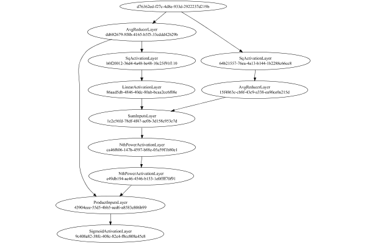

# SignReducerLayer
## Normal
### Json Serialization
Code from [StandardLayerTests.java:69](../../../../../../../../src/main/java/com/simiacryptus/mindseye/test/StandardLayerTests.java#L69) executed in 0.00 seconds: 
```java
    JsonObject json = layer.getJson();
    NNLayer echo = NNLayer.fromJson(json);
    if ((echo == null)) throw new AssertionError("Failed to deserialize");
    if ((layer == echo)) throw new AssertionError("Serialization did not copy");
    if ((!layer.equals(echo))) throw new AssertionError("Serialization not equal");
    return new GsonBuilder().setPrettyPrinting().create().toJson(json);
```

Returns: 

```
    {
      "class": "com.simiacryptus.mindseye.layers.java.SignReducerLayer",
      "id": "72cc8d9c-311a-4ccb-b040-85faf4bbbe2b",
      "isFrozen": false,
      "name": "SignReducerLayer/72cc8d9c-311a-4ccb-b040-85faf4bbbe2b",
      "inputs": [
        "d76362ed-f27c-4d8e-933d-2922237d219b"
      ],
      "nodes": {
        "ef01be83-3451-489c-af94-2c5da1bb191f": "dd682679-8f4b-4165-b5f5-33cddd42b29b",
        "63141645-b8cb-43ef-bd20-7c6d892a12dd": "64b21557-76ea-4a13-b144-1b2288c66cc8",
        "5f45ff87-c8ee-44b2-8bd6-525ea516e370": "15f4863c-cb8f-43c9-a338-ea90ce0a215d",
        "1565deee-44a2-48d8-b3c2-082b200199e7": "b0f20012-36d4-4a48-be48-10c25f91f110",
        "8b99811d-062b-4d8e-811d-141b133481fe": "86aad5db-4846-40dc-80ab-bcaa2cc6f08e",
        "9e366821-27e0-458f-a1b4-45f1ec63a793": "1e2e56fd-78df-4f47-ae0b-3d158c953e7d",
        "b495c9a1-e877-4e39-bb4c-d3fa85d62bcd": "ca46f606-147b-4597-b88e-05a59f1b80e1",
        "39e0f9d6-412e-4ba4-baff-871a06226d6e": "e49db194-ae46-4546-b153-1e0ffff70f91",
        "bccc7ac1-1150-4f97-be97-638fe5b6513e": "43904eee-55d5-4bb5-aed6-a
```
...[skipping 3148 bytes](etc/101.txt)...
```
    3ef-bd20-7c6d892a12dd": [
          "d76362ed-f27c-4d8e-933d-2922237d219b"
        ],
        "5f45ff87-c8ee-44b2-8bd6-525ea516e370": [
          "63141645-b8cb-43ef-bd20-7c6d892a12dd"
        ],
        "1565deee-44a2-48d8-b3c2-082b200199e7": [
          "ef01be83-3451-489c-af94-2c5da1bb191f"
        ],
        "8b99811d-062b-4d8e-811d-141b133481fe": [
          "1565deee-44a2-48d8-b3c2-082b200199e7"
        ],
        "9e366821-27e0-458f-a1b4-45f1ec63a793": [
          "5f45ff87-c8ee-44b2-8bd6-525ea516e370",
          "8b99811d-062b-4d8e-811d-141b133481fe"
        ],
        "b495c9a1-e877-4e39-bb4c-d3fa85d62bcd": [
          "9e366821-27e0-458f-a1b4-45f1ec63a793"
        ],
        "39e0f9d6-412e-4ba4-baff-871a06226d6e": [
          "b495c9a1-e877-4e39-bb4c-d3fa85d62bcd"
        ],
        "bccc7ac1-1150-4f97-be97-638fe5b6513e": [
          "ef01be83-3451-489c-af94-2c5da1bb191f",
          "39e0f9d6-412e-4ba4-baff-871a06226d6e"
        ],
        "ac1e48c8-5eae-465b-a00f-87fa1406a0ca": [
          "bccc7ac1-1150-4f97-be97-638fe5b6513e"
        ]
      },
      "labels": {},
      "head": "ac1e48c8-5eae-465b-a00f-87fa1406a0ca"
    }
```


### Network Diagram
Code from [StandardLayerTests.java:80](../../../../../../../../src/main/java/com/simiacryptus/mindseye/test/StandardLayerTests.java#L80) executed in 0.26 seconds: 
```java
    return Graphviz.fromGraph(TestUtil.toGraph((DAGNetwork) layer))
      .height(400).width(600).render(Format.PNG).toImage();
```

Returns: 




### Example Input/Output Pair
Code from [StandardLayerTests.java:153](../../../../../../../../src/main/java/com/simiacryptus/mindseye/test/StandardLayerTests.java#L153) executed in 0.00 seconds: 
```java
    SimpleEval eval = SimpleEval.run(layer, inputPrototype);
    return String.format("--------------------\nInput: \n[%s]\n--------------------\nOutput: \n%s\n--------------------\nDerivative: \n%s",
      Arrays.stream(inputPrototype).map(t -> t.prettyPrint()).reduce((a, b) -> a + ",\n" + b).get(),
      eval.getOutput().prettyPrint(),
      Arrays.stream(eval.getDerivative()).map(t -> t.prettyPrint()).reduce((a, b) -> a + ",\n" + b).get());
```

Returns: 

```
    --------------------
    Input: 
    [[ 1.824, 0.92, -1.552 ]]
    --------------------
    Output: 
    [ 0.5691665864812587 ]
    --------------------
    Derivative: 
    [ 0.04133516373051016, 0.05144014175862858, 0.07907233831339487 ]
```


### Batch Execution
Code from [StandardLayerTests.java:102](../../../../../../../../src/main/java/com/simiacryptus/mindseye/test/StandardLayerTests.java#L102) executed in 0.00 seconds: 
```java
    return getBatchingTester().test(layer, inputPrototype);
```

Returns: 

```
    ToleranceStatistics{absoluteTol=0.0000e+00 +- 0.0000e+00 [0.0000e+00 - 0.0000e+00] (40#), relativeTol=0.0000e+00 +- 0.0000e+00 [0.0000e+00 - 0.0000e+00] (40#)}
```


### Differential Validation
Code from [StandardLayerTests.java:110](../../../../../../../../src/main/java/com/simiacryptus/mindseye/test/StandardLayerTests.java#L110) executed in 0.01 seconds: 
```java
    return getDerivativeTester().test(layer, inputPrototype);
```
Logging: 
```
    Inputs: [ -0.716, -1.164, -1.344 ]
    Inputs Statistics: {meanExponent=0.016421757113177216, negative=3, min=-1.344, max=-1.344, mean=-1.0746666666666667, count=3.0, positive=0, stdDev=0.26404713383956463, zeros=0}
    Output: [ 0.01679097120670017 ]
    Outputs Statistics: {meanExponent=-1.7749241831048301, negative=0, min=0.01679097120670017, max=0.01679097120670017, mean=0.01679097120670017, count=1.0, positive=1, stdDev=0.0, zeros=0}
    Feedback for input 0
    Inputs Values: [ -0.716, -1.164, -1.344 ]
    Value Statistics: {meanExponent=0.016421757113177216, negative=3, min=-1.344, max=-1.344, mean=-1.0746666666666667, count=3.0, positive=0, stdDev=0.26404713383956463, zeros=0}
    Implemented Feedback: [ [ 0.1360591548758243 ], [ -0.007856434139811352 ], [ -0.06567966186930785 ] ]
    Implemented Statistics: {meanExponent=-1.3845386161634545, negative=2, min=-0.06567966186930785, max=-0.06567966186930785, mean=0.02084101962223503, count=3.0, positive=1, stdDev=0.08482254195181095, zeros=0}
    Measured Feedback: [ [ 0.136090836
```
...[skipping 632 bytes](etc/102.txt)...
```
    0.0 ]
    Implemented Gradient: [ [ 0.5565044499152467 ], [ 0.4818602310791371 ] ]
    Implemented Statistics: {meanExponent=-0.2858051370276411, negative=0, min=0.4818602310791371, max=0.4818602310791371, mean=0.5191823404971919, count=2.0, positive=2, stdDev=0.037322109418054805, zeros=0}
    Measured Gradient: [ [ 0.5567191895836445 ], [ 0.4820212628331433 ] ]
    Measured Statistics: {meanExponent=-0.28564880626783246, negative=0, min=0.4820212628331433, max=0.4820212628331433, mean=0.5193702262083939, count=2.0, positive=2, stdDev=0.037348963375250746, zeros=0}
    Gradient Error: [ [ 2.147396683978009E-4 ], [ 1.6103175400616898E-4 ] ]
    Error Statistics: {meanExponent=-3.730588099221704, negative=0, min=1.6103175400616898E-4, max=1.6103175400616898E-4, mean=1.8788571120198494E-4, count=2.0, positive=2, stdDev=2.6853957195815894E-5, zeros=0}
    Finite-Difference Derivative Accuracy:
    absoluteTol: 8.5340e-05 +- 8.5812e-05 [9.3068e-06 - 2.1474e-04] (5#)
    relativeTol: 2.3606e-04 +- 2.0290e-04 [7.0855e-05 - 6.3305e-04] (5#)
    
```

Returns: 

```
    ToleranceStatistics{absoluteTol=8.5340e-05 +- 8.5812e-05 [9.3068e-06 - 2.1474e-04] (5#), relativeTol=2.3606e-04 +- 2.0290e-04 [7.0855e-05 - 6.3305e-04] (5#)}
```


### Performance
Adding performance wrappers

Code from [TestUtil.java:260](../../../../../../../../src/main/java/com/simiacryptus/mindseye/test/TestUtil.java#L260) executed in 0.00 seconds: 
```java
    network.visitNodes(node -> {
      if (!(node.getLayer() instanceof MonitoringWrapperLayer)) {
        node.setLayer(new MonitoringWrapperLayer(node.getLayer()).shouldRecordSignalMetrics(false));
      }
      else {
        ((MonitoringWrapperLayer) node.getLayer()).shouldRecordSignalMetrics(false);
      }
    });
```

Code from [StandardLayerTests.java:120](../../../../../../../../src/main/java/com/simiacryptus/mindseye/test/StandardLayerTests.java#L120) executed in 0.02 seconds: 
```java
    getPerformanceTester().test(layer, permPrototype);
```
Logging: 
```
    Evaluation performance: 0.001529s +- 0.000181s [0.001267s - 0.001825s]
    Learning performance: 0.000576s +- 0.000033s [0.000537s - 0.000626s]
    
```

Per-layer Performance Metrics:

Code from [TestUtil.java:225](../../../../../../../../src/main/java/com/simiacryptus/mindseye/test/TestUtil.java#L225) executed in 0.00 seconds: 
```java
    Map<NNLayer, MonitoringWrapperLayer> metrics = new HashMap<>();
    network.visitNodes(node -> {
      if ((node.getLayer() instanceof MonitoringWrapperLayer)) {
        MonitoringWrapperLayer layer = node.getLayer();
        metrics.put(layer.getInner(), layer);
      }
    });
    System.out.println("Forward Performance: \n\t" + metrics.entrySet().stream().map(e -> {
      PercentileStatistics performance = e.getValue().getForwardPerformance();
      return String.format("%s -> %.6fs +- %.6fs (%s)", e.getKey(), performance.getMean(), performance.getStdDev(), performance.getCount());
    }).reduce((a, b) -> a + "\n\t" + b));
    System.out.println("Backward Performance: \n\t" + metrics.entrySet().stream().map(e -> {
      PercentileStatistics performance = e.getValue().getBackwardPerformance();
      return String.format("%s -> %.6fs +- %.6fs (%s)", e.getKey(), performance.getMean(), performance.getStdDev(), performance.getCount());
    }).reduce((a, b) -> a + "\n\t" + b));
```
Logging: 
```
    Forward Performance: 
    	Optional[AvgReducerLayer/15f4863c-cb8f-43c9-a338-ea90ce0a215d -> 0.000101s +- 0.000036s (11.0)
    	LinearActivationLayer/86aad5db-4846-40dc-80ab-bcaa2cc6f08e -> 0.000040s +- 0.000013s (11.0)
    	NthPowerActivationLayer/e49db194-ae46-4546-b153-1e0ffff70f91 -> 0.000125s +- 0.000041s (11.0)
    	SqActivationLayer/64b21557-76ea-4a13-b144-1b2288c66cc8 -> 0.000161s +- 0.000081s (11.0)
    	SqActivationLayer/b0f20012-36d4-4a48-be48-10c25f91f110 -> 0.000121s +- 0.000040s (11.0)
    	ProductInputsLayer/43904eee-55d5-4bb5-aed6-a8583e806b99 -> 0.000113s +- 0.000035s (11.0)
    	SigmoidActivationLayer/9c408a82-38fc-408c-82e4-f0ce808a45e8 -> 0.000120s +- 0.000039s (11.0)
    	SumInputsLayer/1e2e56fd-78df-4f47-ae0b-3d158c953e7d -> 0.000135s +- 0.000054s (11.0)
    	NthPowerActivationLayer/ca46f606-147b-4597-b88e-05a59f1b80e1 -> 0.000132s +- 0.000043s (11.0)
    	AvgReducerLayer/dd682679-8f4b-4165-b5f5-33cddd42b29b -> 0.000099s +- 0.000028s (11.0)]
    Backward Performance: 
    	Optional[AvgReducerLayer/15f4863c-cb8f-43c9-a338-ea90ce0a215d -> 0.000006s +- 0.000000s (1.0)
    	LinearActivationLayer/86aad5db-4846-40dc-80ab-bcaa2cc6f08e -> 0.000002s +- 0.000004s (6.0)
    	NthPowerActivationLayer/e49db194-ae46-4546-b153-1e0ffff70f91 -> 0.000002s +- 0.000001s (6.0)
    	SqActivationLayer/64b21557-76ea-4a13-b144-1b2288c66cc8 -> 0.000002s +- 0.000000s (1.0)
    	SqActivationLayer/b0f20012-36d4-4a48-be48-10c25f91f110 -> 0.000002s +- 0.000000s (1.0)
    	ProductInputsLayer/43904eee-55d5-4bb5-aed6-a8583e806b99 -> 0.000006s +- 0.000011s (6.0)
    	SigmoidActivationLayer/9c408a82-38fc-408c-82e4-f0ce808a45e8 -> 0.000002s +- 0.000002s (6.0)
    	SumInputsLayer/1e2e56fd-78df-4f47-ae0b-3d158c953e7d -> 0.000002s +- 0.000003s (6.0)
    	NthPowerActivationLayer/ca46f606-147b-4597-b88e-05a59f1b80e1 -> 0.000001s +- 0.000000s (6.0)
    	AvgReducerLayer/dd682679-8f4b-4165-b5f5-33cddd42b29b -> 0.000003s +- 0.000000s (1.0)]
    
```

Removing performance wrappers

Code from [TestUtil.java:243](../../../../../../../../src/main/java/com/simiacryptus/mindseye/test/TestUtil.java#L243) executed in 0.00 seconds: 
```java
    network.visitNodes(node -> {
      if (node.getLayer() instanceof MonitoringWrapperLayer) {
        node.setLayer(node.<MonitoringWrapperLayer>getLayer().getInner());
      }
    });
```

