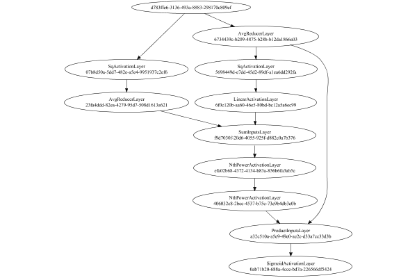

# SignReducerLayer
## Normal
### Network Diagram
This is a network with the following layout:

Code from [StandardLayerTests.java:72](../../../../../../../../src/main/java/com/simiacryptus/mindseye/test/unit/StandardLayerTests.java#L72) executed in 0.28 seconds: 
```java
    return Graphviz.fromGraph(TestUtil.toGraph((DAGNetwork) layer))
      .height(400).width(600).render(Format.PNG).toImage();
```

Returns: 




### Json Serialization
Code from [JsonTest.java:36](../../../../../../../../src/main/java/com/simiacryptus/mindseye/test/unit/JsonTest.java#L36) executed in 0.00 seconds: 
```java
    JsonObject json = layer.getJson();
    NNLayer echo = NNLayer.fromJson(json);
    if ((echo == null)) throw new AssertionError("Failed to deserialize");
    if ((layer == echo)) throw new AssertionError("Serialization did not copy");
    if ((!layer.equals(echo))) throw new AssertionError("Serialization not equal");
    return new GsonBuilder().setPrettyPrinting().create().toJson(json);
```

Returns: 

```
    {
      "class": "com.simiacryptus.mindseye.layers.java.SignReducerLayer",
      "id": "a9c7f698-bd3e-4bbc-ad46-c07081c01ec9",
      "isFrozen": false,
      "name": "SignReducerLayer/a9c7f698-bd3e-4bbc-ad46-c07081c01ec9",
      "inputs": [
        "d783ffe6-3136-493a-8883-298170c809ef"
      ],
      "nodes": {
        "7b21383b-da8e-4e55-9d91-95e7911fce12": "6734439c-b209-4875-b28b-b12da1866a03",
        "42aeb826-d8bc-4367-bc57-5b9b94423505": "07b8d50a-5dd7-482e-a5e4-9951937c2ef6",
        "9201c01d-0d91-400b-a205-70a1fabbdfed": "23fa4ddd-82ea-4279-95d7-508d1613a621",
        "8803c656-0c42-4569-a812-fa5b0e019bab": "5698449d-e7dd-45d2-89df-a1ea6dd292fa",
        "821abfec-1642-4779-8337-8d4f29b051d2": "6f0c120b-aa60-46e5-80bd-bc12a5a6ec99",
        "cac2413c-8be5-43dd-bd02-7fe93a845d17": "f9d7030f-20d6-4055-925f-d882c0a7b376",
        "2dbc43c4-6194-4efa-b848-8a259cc05d91": "efa02b68-4372-4134-b83a-856b6fa3ab5c",
        "0dae9749-657e-4fe8-9253-aef300f9e07c": "406032c8-2bcc-4537-b75c-73e9b4db3e0b",
        "5518b057-b6d2-457f-87bb-3ea9ff7d9806": "a32c510a-a5e9-49e0-ae2c-d
```
...[skipping 3148 bytes](etc/391.txt)...
```
    367-bc57-5b9b94423505": [
          "d783ffe6-3136-493a-8883-298170c809ef"
        ],
        "9201c01d-0d91-400b-a205-70a1fabbdfed": [
          "42aeb826-d8bc-4367-bc57-5b9b94423505"
        ],
        "8803c656-0c42-4569-a812-fa5b0e019bab": [
          "7b21383b-da8e-4e55-9d91-95e7911fce12"
        ],
        "821abfec-1642-4779-8337-8d4f29b051d2": [
          "8803c656-0c42-4569-a812-fa5b0e019bab"
        ],
        "cac2413c-8be5-43dd-bd02-7fe93a845d17": [
          "9201c01d-0d91-400b-a205-70a1fabbdfed",
          "821abfec-1642-4779-8337-8d4f29b051d2"
        ],
        "2dbc43c4-6194-4efa-b848-8a259cc05d91": [
          "cac2413c-8be5-43dd-bd02-7fe93a845d17"
        ],
        "0dae9749-657e-4fe8-9253-aef300f9e07c": [
          "2dbc43c4-6194-4efa-b848-8a259cc05d91"
        ],
        "5518b057-b6d2-457f-87bb-3ea9ff7d9806": [
          "7b21383b-da8e-4e55-9d91-95e7911fce12",
          "0dae9749-657e-4fe8-9253-aef300f9e07c"
        ],
        "332189c8-0486-4dd8-a540-d9069a9b6d84": [
          "5518b057-b6d2-457f-87bb-3ea9ff7d9806"
        ]
      },
      "labels": {},
      "head": "332189c8-0486-4dd8-a540-d9069a9b6d84"
    }
```


### Example Input/Output Pair
Code from [ReferenceIO.java:68](../../../../../../../../src/main/java/com/simiacryptus/mindseye/test/unit/ReferenceIO.java#L68) executed in 0.00 seconds: 
```java
    SimpleEval eval = SimpleEval.run(layer, inputPrototype);
    return String.format("--------------------\nInput: \n[%s]\n--------------------\nOutput: \n%s\n--------------------\nDerivative: \n%s",
      Arrays.stream(inputPrototype).map(t -> t.prettyPrint()).reduce((a, b) -> a + ",\n" + b).get(),
      eval.getOutput().prettyPrint(),
      Arrays.stream(eval.getDerivative()).map(t -> t.prettyPrint()).reduce((a, b) -> a + ",\n" + b).get());
```

Returns: 

```
    --------------------
    Input: 
    [[ -1.236, 1.62, -0.384 ]]
    --------------------
    Output: 
    [ 0.5 ]
    --------------------
    Derivative: 
    [ 0.06960938205632516, 0.06960938205632516, 0.06960938205632516 ]
```


### Batch Execution
Code from [BatchingTester.java:66](../../../../../../../../src/main/java/com/simiacryptus/mindseye/test/unit/BatchingTester.java#L66) executed in 0.00 seconds: 
```java
    return test(reference, inputPrototype);
```

Returns: 

```
    ToleranceStatistics{absoluteTol=0.0000e+00 +- 0.0000e+00 [0.0000e+00 - 0.0000e+00] (40#), relativeTol=0.0000e+00 +- 0.0000e+00 [0.0000e+00 - 0.0000e+00] (40#)}
```


Code from [SingleDerivativeTester.java:77](../../../../../../../../src/main/java/com/simiacryptus/mindseye/test/unit/SingleDerivativeTester.java#L77) executed in 0.01 seconds: 
```java
    return test(component, inputPrototype);
```
Logging: 
```
    Inputs: [ 1.792, 0.672, -0.436 ]
    Inputs Statistics: {meanExponent=-0.09326874411716075, negative=1, min=-0.436, max=-0.436, mean=0.676, count=3.0, positive=2, stdDev=0.909581588790509, zeros=0}
    Output: [ 0.6776949624585066 ]
    Outputs Statistics: {meanExponent=-0.1689657426093536, negative=0, min=0.6776949624585066, max=0.6776949624585066, mean=0.6776949624585066, count=1.0, positive=1, stdDev=0.0, zeros=0}
    Feedback for input 0
    Inputs Values: [ 1.792, 0.672, -0.436 ]
    Value Statistics: {meanExponent=-0.09326874411716075, negative=1, min=-0.436, max=-0.436, mean=0.676, count=3.0, positive=2, stdDev=0.909581588790509, zeros=0}
    Implemented Feedback: [ [ 0.007055335245331543 ], [ 0.08030739342036736 ], [ 0.15277460811495636 ] ]
    Implemented Statistics: {meanExponent=-1.3542252122832348, negative=0, min=0.15277460811495636, max=0.15277460811495636, mean=0.08004577892688508, count=3.0, positive=3, stdDev=0.059489931658057035, zeros=0}
    Measured Feedback: [ [ 0.0070544748553835745 ], [ 0.08030470150854896 ], [ 0
```
...[skipping 602 bytes](etc/392.txt)...
```
    ented Gradient: [ [ -0.04483182929008282 ], [ -0.09810543505585155 ] ]
    Implemented Statistics: {meanExponent=-1.178360236032337, negative=2, min=-0.09810543505585155, max=-0.09810543505585155, mean=-0.07146863217296719, count=2.0, positive=0, stdDev=0.02663680288288435, zeros=0}
    Measured Gradient: [ [ -0.044830135675910654 ], [ -0.09809732533061499 ] ]
    Measured Statistics: {meanExponent=-1.1783863902323117, negative=2, min=-0.09809732533061499, max=-0.09809732533061499, mean=-0.07146373050326282, count=2.0, positive=0, stdDev=0.02663359482735218, zeros=0}
    Gradient Error: [ [ 1.6936141721685116E-6 ], [ 8.109725236557508E-6 ] ]
    Error Statistics: {meanExponent=-5.431089690275625, negative=0, min=8.109725236557508E-6, max=8.109725236557508E-6, mean=4.90166970436301E-6, count=2.0, positive=2, stdDev=3.2080555321944986E-6, zeros=0}
    Finite-Difference Derivative Accuracy:
    absoluteTol: 3.5501e-06 +- 2.5660e-06 [8.6039e-07 - 8.1097e-06] (5#)
    relativeTol: 3.0469e-05 +- 1.8053e-05 [1.4384e-05 - 6.0978e-05] (5#)
    
```

Returns: 

```
    ToleranceStatistics{absoluteTol=3.5501e-06 +- 2.5660e-06 [8.6039e-07 - 8.1097e-06] (5#), relativeTol=3.0469e-05 +- 1.8053e-05 [1.4384e-05 - 6.0978e-05] (5#)}
```


### Performance
Adding performance wrappers

Code from [TestUtil.java:302](../../../../../../../../src/main/java/com/simiacryptus/mindseye/test/TestUtil.java#L302) executed in 0.00 seconds: 
```java
    network.visitNodes(node -> {
      if (!(node.getLayer() instanceof MonitoringWrapperLayer)) {
        node.setLayer(new MonitoringWrapperLayer(node.getLayer()).shouldRecordSignalMetrics(false));
      }
      else {
        ((MonitoringWrapperLayer) node.getLayer()).shouldRecordSignalMetrics(false);
      }
    });
```

Now we execute larger-scale runs to benchmark performance:

Code from [PerformanceTester.java:66](../../../../../../../../src/main/java/com/simiacryptus/mindseye/test/unit/PerformanceTester.java#L66) executed in 0.01 seconds: 
```java
    test(component, inputPrototype);
```
Logging: 
```
    100 batches
    Input Dimensions:
    	[3]
    Performance:
    	Evaluation performance: 0.001216s +- 0.000188s [0.001037s - 0.001530s]
    	Learning performance: 0.000513s +- 0.000057s [0.000455s - 0.000613s]
    
```

Per-layer Performance Metrics:

Code from [TestUtil.java:267](../../../../../../../../src/main/java/com/simiacryptus/mindseye/test/TestUtil.java#L267) executed in 0.00 seconds: 
```java
    Map<NNLayer, MonitoringWrapperLayer> metrics = new HashMap<>();
    network.visitNodes(node -> {
      if ((node.getLayer() instanceof MonitoringWrapperLayer)) {
        MonitoringWrapperLayer layer = node.getLayer();
        metrics.put(layer.getInner(), layer);
      }
    });
    System.out.println("Forward Performance: \n\t" + metrics.entrySet().stream().map(e -> {
      PercentileStatistics performance = e.getValue().getForwardPerformance();
      return String.format("%s -> %.6fs +- %.6fs (%s)", e.getKey(), performance.getMean(), performance.getStdDev(), performance.getCount());
    }).reduce((a, b) -> a + "\n\t" + b));
    System.out.println("Backward Performance: \n\t" + metrics.entrySet().stream().map(e -> {
      PercentileStatistics performance = e.getValue().getBackwardPerformance();
      return String.format("%s -> %.6fs +- %.6fs (%s)", e.getKey(), performance.getMean(), performance.getStdDev(), performance.getCount());
    }).reduce((a, b) -> a + "\n\t" + b));
```
Logging: 
```
    Forward Performance: 
    	Optional[SqActivationLayer/a7669a2c-ad63-4fb2-9b78-3f30739a4c69 -> 0.000102s +- 0.000039s (11.0)
    	SqActivationLayer/cf554490-7c01-48e8-bd26-c69f498fa13f -> 0.000106s +- 0.000040s (11.0)
    	AvgReducerLayer/15b7da2b-9b04-46a2-ab28-b684da34ee07 -> 0.000077s +- 0.000027s (11.0)
    	LinearActivationLayer/1a0901b0-0b1b-446a-a0e2-0d970ad5bf7e -> 0.000035s +- 0.000015s (11.0)
    	ProductInputsLayer/50a3282b-a929-46e7-8d2e-37d4868e9784 -> 0.000082s +- 0.000029s (11.0)
    	NthPowerActivationLayer/dfae92fd-dd29-476e-97aa-fd8fe267a75e -> 0.000115s +- 0.000040s (11.0)
    	SigmoidActivationLayer/a1a6d1e8-ac61-4086-8424-37444f3b788e -> 0.000106s +- 0.000037s (11.0)
    	NthPowerActivationLayer/72e0588c-eeb3-4076-8cd9-1176c9ae6105 -> 0.000114s +- 0.000036s (11.0)
    	AvgReducerLayer/a2b49c78-c20e-4409-bab2-9d383c44de2b -> 0.000082s +- 0.000031s (11.0)
    	SumInputsLayer/edb7f4da-08bc-4c35-a5ca-c1c2f998b41b -> 0.000126s +- 0.000052s (11.0)]
    Backward Performance: 
    	Optional[SqActivationLayer/a7669a2c-ad63-4fb2-9b78-3f30739a4c69 -> 0.000001s +- 0.000000s (1.0)
    	SqActivationLayer/cf554490-7c01-48e8-bd26-c69f498fa13f -> 0.000002s +- 0.000000s (1.0)
    	AvgReducerLayer/15b7da2b-9b04-46a2-ab28-b684da34ee07 -> 0.000006s +- 0.000000s (1.0)
    	LinearActivationLayer/1a0901b0-0b1b-446a-a0e2-0d970ad5bf7e -> 0.000001s +- 0.000002s (6.0)
    	ProductInputsLayer/50a3282b-a929-46e7-8d2e-37d4868e9784 -> 0.000009s +- 0.000019s (6.0)
    	NthPowerActivationLayer/dfae92fd-dd29-476e-97aa-fd8fe267a75e -> 0.000003s +- 0.000005s (6.0)
    	SigmoidActivationLayer/a1a6d1e8-ac61-4086-8424-37444f3b788e -> 0.000004s +- 0.000007s (6.0)
    	NthPowerActivationLayer/72e0588c-eeb3-4076-8cd9-1176c9ae6105 -> 0.000003s +- 0.000005s (6.0)
    	AvgReducerLayer/a2b49c78-c20e-4409-bab2-9d383c44de2b -> 0.000003s +- 0.000000s (1.0)
    	SumInputsLayer/edb7f4da-08bc-4c35-a5ca-c1c2f998b41b -> 0.000005s +- 0.000011s (6.0)]
    
```

Removing performance wrappers

Code from [TestUtil.java:285](../../../../../../../../src/main/java/com/simiacryptus/mindseye/test/TestUtil.java#L285) executed in 0.00 seconds: 
```java
    network.visitNodes(node -> {
      if (node.getLayer() instanceof MonitoringWrapperLayer) {
        node.setLayer(node.<MonitoringWrapperLayer>getLayer().getInner());
      }
    });
```

### Input Learning
In this test, we use a network to learn this target input, given it's pre-evaluated output:

Code from [LearningTester.java:127](../../../../../../../../src/main/java/com/simiacryptus/mindseye/test/unit/LearningTester.java#L127) executed in 0.00 seconds: 
```java
    return Arrays.stream(input_target).map(x -> x.prettyPrint()).reduce((a, b) -> a + "\n" + b).orElse("");
```

Returns: 

```
    [ 1.752, 0.644, 0.08 ]
```


First, we use a conjugate gradient descent method, which converges the fastest for purely linear functions.

Code from [LearningTester.java:300](../../../../../../../../src/main/java/com/simiacryptus/mindseye/test/unit/LearningTester.java#L300) executed in 0.00 seconds: 
```java
    return new IterativeTrainer(trainable)
      .setLineSearchFactory(label -> new QuadraticSearch())
      .setOrientation(new GradientDescent())
      .setMonitor(monitor)
      .setTimeout(30, TimeUnit.SECONDS)
      .setMaxIterations(250)
      .setTerminateThreshold(0)
      .run();
```

Returns: 

```
    0.0
```


This training run resulted in the following regressed input:

Code from [LearningTester.java:144](../../../../../../../../src/main/java/com/simiacryptus/mindseye/test/unit/LearningTester.java#L144) executed in 0.00 seconds: 
```java
    return Arrays.stream(input_gd).map(x -> x.prettyPrint()).reduce((a, b) -> a + "\n" + b).orElse("");
```

Returns: 

```
    [ 1.752, 0.644, 0.08 ]
```


Next, we run the same optimization using L-BFGS, which is nearly ideal for purely second-order or quadratic functions.

Code from [LearningTester.java:324](../../../../../../../../src/main/java/com/simiacryptus/mindseye/test/unit/LearningTester.java#L324) executed in 0.00 seconds: 
```java
    return new IterativeTrainer(trainable)
      .setLineSearchFactory(label -> new ArmijoWolfeSearch())
      .setOrientation(new LBFGS())
      .setMonitor(monitor)
      .setTimeout(30, TimeUnit.SECONDS)
      .setMaxIterations(250)
      .setTerminateThreshold(0)
      .run();
```

Returns: 

```
    0.0
```


This training run resulted in the following regressed input:

Code from [LearningTester.java:154](../../../../../../../../src/main/java/com/simiacryptus/mindseye/test/unit/LearningTester.java#L154) executed in 0.00 seconds: 
```java
    return Arrays.stream(input_lbgfs).map(x -> x.prettyPrint()).reduce((a, b) -> a + "\n" + b).orElse("");
```

Returns: 

```
    [ 1.752, 0.644, 0.08 ]
```


Code from [LearningTester.java:96](../../../../../../../../src/main/java/com/simiacryptus/mindseye/test/unit/LearningTester.java#L96) executed in 0.00 seconds: 
```java
    return TestUtil.compare(runs);
```

Code from [LearningTester.java:99](../../../../../../../../src/main/java/com/simiacryptus/mindseye/test/unit/LearningTester.java#L99) executed in 0.00 seconds: 
```java
    return TestUtil.compareTime(runs);
```

### Model Learning
In this test, attempt to train a network to emulate a randomized network given an example input/output. The target state is:

Code from [LearningTester.java:176](../../../../../../../../src/main/java/com/simiacryptus/mindseye/test/unit/LearningTester.java#L176) executed in 0.00 seconds: 
```java
    return network_target.state().stream().map(Arrays::toString).reduce((a, b) -> a + "\n" + b).orElse("");
```

Returns: 

```
    [0.0, -1.0]
```


First, we use a conjugate gradient descent method, which converges the fastest for purely linear functions.

Code from [LearningTester.java:300](../../../../../../../../src/main/java/com/simiacryptus/mindseye/test/unit/LearningTester.java#L300) executed in 0.00 seconds: 
```java
    return new IterativeTrainer(trainable)
      .setLineSearchFactory(label -> new QuadraticSearch())
      .setOrientation(new GradientDescent())
      .setMonitor(monitor)
      .setTimeout(30, TimeUnit.SECONDS)
      .setMaxIterations(250)
      .setTerminateThreshold(0)
      .run();
```

Returns: 

```
    0.0
```


This training run resulted in the following configuration:

Code from [LearningTester.java:189](../../../../../../../../src/main/java/com/simiacryptus/mindseye/test/unit/LearningTester.java#L189) executed in 0.00 seconds: 
```java
    return network_gd.state().stream().map(Arrays::toString).reduce((a, b) -> a + "\n" + b).orElse("");
```

Returns: 

```
    [0.0, -1.0]
    [0.8850185733268822]
```


Next, we run the same optimization using L-BFGS, which is nearly ideal for purely second-order or quadratic functions.

Code from [LearningTester.java:324](../../../../../../../../src/main/java/com/simiacryptus/mindseye/test/unit/LearningTester.java#L324) executed in 0.00 seconds: 
```java
    return new IterativeTrainer(trainable)
      .setLineSearchFactory(label -> new ArmijoWolfeSearch())
      .setOrientation(new LBFGS())
      .setMonitor(monitor)
      .setTimeout(30, TimeUnit.SECONDS)
      .setMaxIterations(250)
      .setTerminateThreshold(0)
      .run();
```

Returns: 

```
    0.0
```


This training run resulted in the following configuration:

Code from [LearningTester.java:203](../../../../../../../../src/main/java/com/simiacryptus/mindseye/test/unit/LearningTester.java#L203) executed in 0.00 seconds: 
```java
    return network_lbfgs.state().stream().map(Arrays::toString).reduce((a, b) -> a + "\n" + b).orElse("");
```

Returns: 

```
    [0.0, -1.0]
    [0.8850185733268822]
```


Code from [LearningTester.java:96](../../../../../../../../src/main/java/com/simiacryptus/mindseye/test/unit/LearningTester.java#L96) executed in 0.00 seconds: 
```java
    return TestUtil.compare(runs);
```

Code from [LearningTester.java:99](../../../../../../../../src/main/java/com/simiacryptus/mindseye/test/unit/LearningTester.java#L99) executed in 0.00 seconds: 
```java
    return TestUtil.compareTime(runs);
```

### Composite Learning
In this test, attempt to train a network to emulate a randomized network given an example input/output. The target state is:

Code from [LearningTester.java:219](../../../../../../../../src/main/java/com/simiacryptus/mindseye/test/unit/LearningTester.java#L219) executed in 0.00 seconds: 
```java
    return network_target.state().stream().map(Arrays::toString).reduce((a, b) -> a + "\n" + b).orElse("");
```

Returns: 

```
    [0.0, -1.0]
```


We simultaneously regress this target input:

Code from [LearningTester.java:223](../../../../../../../../src/main/java/com/simiacryptus/mindseye/test/unit/LearningTester.java#L223) executed in 0.00 seconds: 
```java
    return Arrays.stream(testInput).map(x -> x.prettyPrint()).reduce((a, b) -> a + "\n" + b).orElse("");
```

Returns: 

```
    [ 0.08, 0.644, 1.752 ]
```


Which produces the following output:

Code from [LearningTester.java:230](../../../../../../../../src/main/java/com/simiacryptus/mindseye/test/unit/LearningTester.java#L230) executed in 0.00 seconds: 
```java
    return Stream.of(targetOutput).map(x -> x.prettyPrint()).reduce((a, b) -> a + "\n" + b).orElse("");
```

Returns: 

```
    [ 0.8850185733268822 ]
```


First, we use a conjugate gradient descent method, which converges the fastest for purely linear functions.

Code from [LearningTester.java:300](../../../../../../../../src/main/java/com/simiacryptus/mindseye/test/unit/LearningTester.java#L300) executed in 0.00 seconds: 
```java
    return new IterativeTrainer(trainable)
      .setLineSearchFactory(label -> new QuadraticSearch())
      .setOrientation(new GradientDescent())
      .setMonitor(monitor)
      .setTimeout(30, TimeUnit.SECONDS)
      .setMaxIterations(250)
      .setTerminateThreshold(0)
      .run();
```

Returns: 

```
    0.0
```


This training run resulted in the following configuration:

Code from [LearningTester.java:245](../../../../../../../../src/main/java/com/simiacryptus/mindseye/test/unit/LearningTester.java#L245) executed in 0.00 seconds: 
```java
    return network_gd.state().stream().map(Arrays::toString).reduce((a, b) -> a + "\n" + b).orElse("");
```

Returns: 

```
    [0.8850185733268822]
    [0.0, -1.0]
```


And regressed input:

Code from [LearningTester.java:249](../../../../../../../../src/main/java/com/simiacryptus/mindseye/test/unit/LearningTester.java#L249) executed in 0.00 seconds: 
```java
    return Arrays.stream(input_gd).map(x -> x.prettyPrint()).reduce((a, b) -> a + "\n" + b).orElse("");
```

Returns: 

```
    [ 0.08, 0.644, 1.752 ]
```


Which produces the following output:

Code from [LearningTester.java:256](../../../../../../../../src/main/java/com/simiacryptus/mindseye/test/unit/LearningTester.java#L256) executed in 0.00 seconds: 
```java
    return Stream.of(regressedOutput).map(x -> x.prettyPrint()).reduce((a, b) -> a + "\n" + b).orElse("");
```

Returns: 

```
    [ 0.0 ]
```


Next, we run the same optimization using L-BFGS, which is nearly ideal for purely second-order or quadratic functions.

Code from [LearningTester.java:324](../../../../../../../../src/main/java/com/simiacryptus/mindseye/test/unit/LearningTester.java#L324) executed in 0.00 seconds: 
```java
    return new IterativeTrainer(trainable)
      .setLineSearchFactory(label -> new ArmijoWolfeSearch())
      .setOrientation(new LBFGS())
      .setMonitor(monitor)
      .setTimeout(30, TimeUnit.SECONDS)
      .setMaxIterations(250)
      .setTerminateThreshold(0)
      .run();
```

Returns: 

```
    0.0
```


This training run resulted in the following configuration:

Code from [LearningTester.java:266](../../../../../../../../src/main/java/com/simiacryptus/mindseye/test/unit/LearningTester.java#L266) executed in 0.00 seconds: 
```java
    return network_lbfgs.state().stream().map(Arrays::toString).reduce((a, b) -> a + "\n" + b).orElse("");
```

Returns: 

```
    [0.8850185733268822]
    [0.0, -1.0]
```


And regressed input:

Code from [LearningTester.java:270](../../../../../../../../src/main/java/com/simiacryptus/mindseye/test/unit/LearningTester.java#L270) executed in 0.00 seconds: 
```java
    return Arrays.stream(input_lbgfs).map(x -> x.prettyPrint()).reduce((a, b) -> a + "\n" + b).orElse("");
```

Returns: 

```
    [ 0.08, 0.644, 1.752 ]
```


Which produces the following output:

Code from [LearningTester.java:277](../../../../../../../../src/main/java/com/simiacryptus/mindseye/test/unit/LearningTester.java#L277) executed in 0.00 seconds: 
```java
    return Stream.of(regressedOutput).map(x -> x.prettyPrint()).reduce((a, b) -> a + "\n" + b).orElse("");
```

Returns: 

```
    [ 0.0 ]
```


Code from [LearningTester.java:96](../../../../../../../../src/main/java/com/simiacryptus/mindseye/test/unit/LearningTester.java#L96) executed in 0.00 seconds: 
```java
    return TestUtil.compare(runs);
```

Code from [LearningTester.java:99](../../../../../../../../src/main/java/com/simiacryptus/mindseye/test/unit/LearningTester.java#L99) executed in 0.00 seconds: 
```java
    return TestUtil.compareTime(runs);
```

