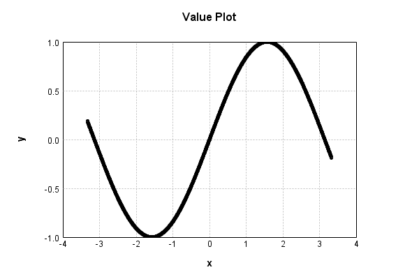

# SinewaveActivationLayer
## SinewaveActivationLayerTest
### Batch Execution
Code from [BatchingTester.java:66](../../../../../../../src/main/java/com/simiacryptus/mindseye/test/unit/BatchingTester.java#L66) executed in 0.00 seconds: 
```java
    return test(reference, inputPrototype);
```

Returns: 

```
    ToleranceStatistics{absoluteTol=0.0000e+00 +- 0.0000e+00 [0.0000e+00 - 0.0000e+00] (120#), relativeTol=0.0000e+00 +- 0.0000e+00 [0.0000e+00 - 0.0000e+00] (120#)}
```


Code from [SingleDerivativeTester.java:77](../../../../../../../src/main/java/com/simiacryptus/mindseye/test/unit/SingleDerivativeTester.java#L77) executed in 0.00 seconds: 
```java
    return test(component, inputPrototype);
```
Logging: 
```
    Inputs: [
    	[ [ 0.004 ], [ 1.264 ], [ 0.956 ] ],
    	[ [ 1.824 ], [ -1.664 ], [ -1.86 ] ]
    ]
    Inputs Statistics: {meanExponent=-0.2606739903807587, negative=2, min=-1.86, max=-1.86, mean=0.08733333333333337, count=6.0, positive=4, stdDev=1.4154714958470749, zeros=0}
    Output: [
    	[ [ 0.003999989333341867 ], [ 0.9533059892494075 ], [ 0.8168909409504417 ] ],
    	[ [ 0.9681148494086297 ], [ -0.9956596810177395 ], [ -0.9584712830789142 ] ]
    ]
    Outputs Statistics: {meanExponent=-0.42348797624712137, negative=2, min=-0.9584712830789142, max=-0.9584712830789142, mean=0.13136346747419447, count=6.0, positive=4, stdDev=0.8485117085693902, zeros=0}
    Feedback for input 0
    Inputs Values: [
    	[ [ 0.004 ], [ 1.264 ], [ 0.956 ] ],
    	[ [ 1.824 ], [ -1.664 ], [ -1.86 ] ]
    ]
    Value Statistics: {meanExponent=-0.2606739903807587, negative=2, min=-1.86, max=-1.86, mean=0.08733333333333337, count=6.0, positive=4, stdDev=1.4154714958470749, zeros=0}
    Implemented Feedback: [ [ 0.9999920000106667, 0.0, 0.0, 0.0, 0.0, 0.0 ], [ 0.0, -0.2505067630913
```
...[skipping 673 bytes](etc/331.txt)...
```
    0, 0.0, 0.0, 0.5767513099452781, 0.0 ], [ 0.0, 0.0, 0.0, 0.0, 0.0, -0.28514113520561324 ] ]
    Measured Statistics: {meanExponent=-0.48942214265515105, negative=3, min=-0.28514113520561324, max=-0.28514113520561324, mean=0.034721840084721116, count=36.0, positive=3, stdDev=0.20636662663637492, zeros=30}
    Feedback Error: [ [ -2.0166612124672412E-7, 0.0, 0.0, 0.0, 0.0, 0.0 ], [ 0.0, -4.8405324860001375E-5, 0.0, 0.0, 0.0, 0.0 ], [ 0.0, 0.0, -4.766580282716815E-5, 0.0, 0.0, 0.0 ], [ 0.0, 0.0, 0.0, 4.978313873613138E-5, 0.0, 0.0 ], [ 0.0, 0.0, 0.0, 0.0, -4.084550857508251E-5, 0.0 ], [ 0.0, 0.0, 0.0, 0.0, 0.0, 4.79240394076208E-5 ] ]
    Error Statistics: {meanExponent=-4.723914500702513, negative=4, min=4.79240394076208E-5, max=4.79240394076208E-5, mean=-1.0947534511040714E-6, count=36.0, positive=2, stdDev=1.7492402688368166E-5, zeros=30}
    Finite-Difference Derivative Accuracy:
    absoluteTol: 6.5229e-06 +- 1.6268e-05 [0.0000e+00 - 4.9783e-05] (36#)
    relativeTol: 9.3765e-05 +- 8.4355e-05 [1.0083e-07 - 2.6753e-04] (6#)
    
```

Returns: 

```
    ToleranceStatistics{absoluteTol=6.5229e-06 +- 1.6268e-05 [0.0000e+00 - 4.9783e-05] (36#), relativeTol=9.3765e-05 +- 8.4355e-05 [1.0083e-07 - 2.6753e-04] (6#)}
```


### Json Serialization
Code from [JsonTest.java:36](../../../../../../../src/main/java/com/simiacryptus/mindseye/test/unit/JsonTest.java#L36) executed in 0.00 seconds: 
```java
    JsonObject json = layer.getJson();
    NNLayer echo = NNLayer.fromJson(json);
    if ((echo == null)) throw new AssertionError("Failed to deserialize");
    if ((layer == echo)) throw new AssertionError("Serialization did not copy");
    if ((!layer.equals(echo))) throw new AssertionError("Serialization not equal");
    return new GsonBuilder().setPrettyPrinting().create().toJson(json);
```

Returns: 

```
    {
      "class": "com.simiacryptus.mindseye.layers.java.SinewaveActivationLayer",
      "id": "91913536-4d4e-464d-b92c-92989c2a850e",
      "isFrozen": true,
      "name": "SinewaveActivationLayer/91913536-4d4e-464d-b92c-92989c2a850e",
      "balanced": true
    }
```


### Example Input/Output Pair
Code from [ReferenceIO.java:68](../../../../../../../src/main/java/com/simiacryptus/mindseye/test/unit/ReferenceIO.java#L68) executed in 0.00 seconds: 
```java
    SimpleEval eval = SimpleEval.run(layer, inputPrototype);
    return String.format("--------------------\nInput: \n[%s]\n--------------------\nOutput: \n%s\n--------------------\nDerivative: \n%s",
      Arrays.stream(inputPrototype).map(t -> t.prettyPrint()).reduce((a, b) -> a + ",\n" + b).get(),
      eval.getOutput().prettyPrint(),
      Arrays.stream(eval.getDerivative()).map(t -> t.prettyPrint()).reduce((a, b) -> a + ",\n" + b).get());
```

Returns: 

```
    --------------------
    Input: 
    [[
    	[ [ 1.136 ], [ -1.164 ], [ -1.192 ] ],
    	[ [ -0.948 ], [ 0.42 ], [ 1.516 ] ]
    ]]
    --------------------
    Output: 
    [
    	[ [ 0.9069558534961107 ], [ -0.9183931282146828 ], [ -0.9291104297608258 ] ],
    	[ [ -0.8122505125555559 ], [ 0.40776045305957015 ], [ 0.9984990569069438 ] ]
    ]
    --------------------
    Derivative: 
    [
    	[ [ 0.4212256874991615 ], [ 0.39566913203843584 ], [ 0.36980239224436295 ] ],
    	[ [ 0.5833087560231174 ], [ 0.9130889403123083 ], [ 0.05476890866124396 ] ]
    ]
```


### Input Learning
In this test, we use a network to learn this target input, given it's pre-evaluated output:

Code from [LearningTester.java:127](../../../../../../../src/main/java/com/simiacryptus/mindseye/test/unit/LearningTester.java#L127) executed in 0.00 seconds: 
```java
    return Arrays.stream(input_target).map(x -> x.prettyPrint()).reduce((a, b) -> a + "\n" + b).orElse("");
```

Returns: 

```
    [
    	[ [ 0.46 ], [ 0.952 ], [ -1.72 ], [ 0.24 ], [ -0.656 ], [ -0.116 ], [ 1.308 ], [ 1.112 ], ... ],
    	[ [ 1.368 ], [ 0.812 ], [ 0.288 ], [ 1.708 ], [ -0.752 ], [ 0.556 ], [ -0.74 ], [ 1.3 ], ... ],
    	[ [ -1.496 ], [ 1.576 ], [ 1.236 ], [ 1.428 ], [ -0.312 ], [ 1.968 ], [ -0.584 ], [ 0.368 ], ... ],
    	[ [ -1.924 ], [ -1.244 ], [ -0.304 ], [ -1.032 ], [ 1.36 ], [ 1.028 ], [ 0.604 ], [ 0.26 ], ... ],
    	[ [ 1.864 ], [ 0.632 ], [ -0.164 ], [ 0.436 ], [ -0.132 ], [ 1.276 ], [ -1.196 ], [ 1.176 ], ... ],
    	[ [ -0.388 ], [ -1.572 ], [ 1.516 ], [ -0.268 ], [ -0.264 ], [ 0.964 ], [ -1.656 ], [ -1.776 ], ... ],
    	[ [ 1.224 ], [ 1.304 ], [ -1.552 ], [ 1.352 ], [ -1.148 ], [ 1.84 ], [ 0.192 ], [ -1.672 ], ... ],
    	[ [ 0.26 ], [ -1.828 ], [ 0.304 ], [ 0.832 ], [ 0.94 ], [ 1.856 ], [ 0.54 ], [ -1.872 ], ... ],
    	...
    ]
```


First, we use a conjugate gradient descent method, which converges the fastest for purely linear functions.

Code from [LearningTester.java:225](../../../../../../../src/main/java/com/simiacryptus/mindseye/test/unit/LearningTester.java#L225) executed in 4.47 seconds: 
```java
    return new IterativeTrainer(trainable)
      .setLineSearchFactory(label -> new QuadraticSearch())
      .setOrientation(new GradientDescent())
      .setMonitor(monitor)
      .setTimeout(30, TimeUnit.SECONDS)
      .setMaxIterations(250)
      .setTerminateThreshold(0)
      .run();
```
Logging: 
```
    Constructing line search parameters: GD
    F(0.0) = LineSearchPoint{point=PointSample{avg=1.1738057294759983}, derivative=-1.3627620905954703E-4}
    New Minimum: 1.1738057294759983 > 1.1738057294759858
    F(1.0E-10) = LineSearchPoint{point=PointSample{avg=1.1738057294759858}, derivative=-1.3627620905954724E-4}, delta = -1.2434497875801753E-14
    New Minimum: 1.1738057294759858 > 1.1738057294759057
    F(7.000000000000001E-10) = LineSearchPoint{point=PointSample{avg=1.1738057294759057}, derivative=-1.362762090595484E-4}, delta = -9.259260025373806E-14
    New Minimum: 1.1738057294759057 > 1.1738057294753328
    F(4.900000000000001E-9) = LineSearchPoint{point=PointSample{avg=1.1738057294753328}, derivative=-1.3627620905955673E-4}, delta = -6.654676809603188E-13
    New Minimum: 1.1738057294753328 > 1.1738057294713278
    F(3.430000000000001E-8) = LineSearchPoint{point=PointSample{avg=1.1738057294713278}, derivative=-1.3627620905961487E-4}, delta = -4.6704862199931085E-12
    New Minimum: 1.1738057294713278 > 1.1738057294432833
    F(2.4010
```
...[skipping 306642 bytes](etc/332.txt)...
```
    162546184657104E-18}, delta = -4.985925897898012E-10
    Left bracket at 10061.013799614764
    Converged to left
    Iteration 249 complete. Error: 4.8164851869818925E-8 Total: 239724113055998.9000; Orientation: 0.0003; Line Search: 0.0169
    Low gradient: 3.1542656975055606E-7
    F(0.0) = LineSearchPoint{point=PointSample{avg=4.8164851869818925E-8}, derivative=-9.94939209046024E-14}
    New Minimum: 4.8164851869818925E-8 > 4.7673623401481444E-8
    F(10061.013799614764) = LineSearchPoint{point=PointSample{avg=4.7673623401481444E-8}, derivative=1.844860447367334E-15}, delta = -4.912284683374809E-10
    4.7673623401481444E-8 <= 4.8164851869818925E-8
    New Minimum: 4.7673623401481444E-8 > 4.767345445369473E-8
    F(9877.85424143082) = LineSearchPoint{point=PointSample{avg=4.767345445369473E-8}, derivative=-4.4760802128639994E-20}, delta = -4.913974161241971E-10
    Left bracket at 9877.85424143082
    Converged to left
    Iteration 250 complete. Error: 4.767345445369473E-8 Total: 239724122871224.8800; Orientation: 0.0005; Line Search: 0.0078
    
```

Returns: 

```
    4.767345445369473E-8
```


Training Converged

Next, we run the same optimization using L-BFGS, which is nearly ideal for purely second-order or quadratic functions.

Code from [LearningTester.java:249](../../../../../../../src/main/java/com/simiacryptus/mindseye/test/unit/LearningTester.java#L249) executed in 0.10 seconds: 
```java
    return new IterativeTrainer(trainable)
      .setLineSearchFactory(label -> new ArmijoWolfeSearch())
      .setOrientation(new LBFGS())
      .setMonitor(monitor)
      .setTimeout(30, TimeUnit.SECONDS)
      .setMaxIterations(250)
      .setTerminateThreshold(0)
      .run();
```
Logging: 
```
    LBFGS Accumulation History: 1 points
    Constructing line search parameters: GD
    th(0)=1.1738057294759983;dx=-1.3627620905954703E-4
    New Minimum: 1.1738057294759983 > 1.1735121267107183
    WOLFE (weak): th(2.154434690031884)=1.1735121267107183; dx=-1.3628044636026016E-4 delta=2.9360276528000995E-4
    New Minimum: 1.1735121267107183 > 1.1732185148678402
    WOLFE (weak): th(4.308869380063768)=1.1732185148678402; dx=-1.3628463595353275E-4 delta=5.872146081580265E-4
    New Minimum: 1.1732185148678402 > 1.172043978775369
    WOLFE (weak): th(12.926608140191302)=1.172043978775369; dx=-1.3630091750250193E-4 delta=0.0017617507006293387
    New Minimum: 1.172043978775369 > 1.1667569654086627
    WOLFE (weak): th(51.70643256076521)=1.1667569654086627; dx=-1.3636476264318145E-4 delta=0.007048764067335567
    New Minimum: 1.1667569654086627 > 1.1385372109335108
    WOLFE (weak): th(258.53216280382605)=1.1385372109335108; dx=-1.3644782202842172E-4 delta=0.03526851854248747
    New Minimum: 1.1385372109335108 > 0.9660270858164984
    WOLFE (weak): th(15
```
...[skipping 3977 bytes](etc/333.txt)...
```
    2
    LBFGS Accumulation History: 1 points
    th(0)=0.439168725197026;dx=-8.492793908868703E-5
    New Minimum: 0.439168725197026 > 0.20838718123489966
    END: th(3341.943960201201)=0.20838718123489966; dx=-4.8355488850424225E-5 delta=0.23078154396212633
    Iteration 5 complete. Error: 0.20838718123489966 Total: 239724213768216.7800; Orientation: 0.0005; Line Search: 0.0038
    LBFGS Accumulation History: 1 points
    th(0)=0.20838718123489966;dx=-3.818469279100124E-5
    New Minimum: 0.20838718123489966 > 0.054771058339278145
    END: th(7200.000000000001)=0.054771058339278145; dx=-4.651450553512702E-6 delta=0.15361612289562152
    Iteration 6 complete. Error: 0.054771058339278145 Total: 239724219831701.7800; Orientation: 0.0005; Line Search: 0.0042
    LBFGS Accumulation History: 1 points
    th(0)=0.054771058339278145;dx=-7.778170894856096E-6
    MAX ALPHA: th(0)=0.054771058339278145;th'(0)=-7.778170894856096E-6;
    Iteration 7 failed, aborting. Error: 0.054771058339278145 Total: 239724228067007.7800; Orientation: 0.0008; Line Search: 0.0058
    
```

Returns: 

```
    0.054771058339278145
```


This training run resulted in the following regressed input:

Code from [LearningTester.java:154](../../../../../../../src/main/java/com/simiacryptus/mindseye/test/unit/LearningTester.java#L154) executed in 0.00 seconds: 
```java
    return Arrays.stream(input_lbgfs).map(x -> x.prettyPrint()).reduce((a, b) -> a + "\n" + b).orElse("");
```

Returns: 

```
    [
    	[ [ 0.4850033123701275 ], [ 1.9082969560650997 ], [ -1.1183944482372585 ], [ 2.9140307856149374 ], [ -0.6576256748537314 ], [ -0.10949731950539154 ], [ 1.536363073245597 ], [ 1.7499632217173564 ], ... ],
    	[ [ 1.1225818793077829 ], [ 2.0331828136297942 ], [ 0.2660482750089855 ], [ 1.1822514727132136 ], [ -2.141739552478845 ], [ -3.809922482673762 ], [ -0.7294600969134679 ], [ 1.6569378326170785 ], ... ],
    	[ [ -1.1644457413735652 ], [ 1.1435247583058723 ], [ 1.032279511243487 ], [ 1.0908318357703115 ], [ -0.30299085105433093 ], [ 1.033024172929074 ], [ -0.6318222683172118 ], [ 0.37110653106263775 ], ... ],
    	[ [ -1.0756525826258079 ], [ -1.0294444139165684 ], [ -0.2747636461272789 ], [ -0.9362830667004625 ], [ 1.181031153370597 ], [ 0.9447301549889564 ], [ 0.6169655693754725 ], [ -2.717104138585655 ], ... ],
    	[ [ 1.0427519889639947 ], [ 0.6355612725979777 ], [ -1.1741541547487835 ], [ 0.43670691725135985 ], [ 3.427511406720936 ], [ -4.192904798141264 ], [ 4.173184313120642 ], [ 1.8883168741075704 ], ... ],
    	[ [ -0.5110803579648973 ], [ -1.4928085190819629 ], [ 1.1152990319688332 ], [ -0.23664605711545564 ], [ -2.8801042313505127 ], [ 0.895252428888273 ], [ -1.093141664771483 ], [ -1.8218318129210438 ], ... ],
    	[ [ 1.028921930143395 ], [ 1.080608634052477 ], [ -1.1971617648068278 ], [ 1.281462475613177 ], [ -0.9955898018321386 ], [ -4.553596822462811 ], [ 0.18938987158780088 ], [ -1.1838290754726237 ], ... ],
    	[ [ 0.30759517168035533 ], [ -1.0500764751948273 ], [ 1.247702069945914 ], [ 1.0870034088216796 ], [ -0.8824210378611472 ], [ 1.257452330855304 ], [ 0.5426741387327513 ], [ -1.8066167604684895 ], ... ],
    	...
    ]
```


Code from [LearningTester.java:95](../../../../../../../src/main/java/com/simiacryptus/mindseye/test/unit/LearningTester.java#L95) executed in 0.00 seconds: 
```java
    return TestUtil.compare(runs);
```

Returns: 




Code from [LearningTester.java:98](../../../../../../../src/main/java/com/simiacryptus/mindseye/test/unit/LearningTester.java#L98) executed in 0.00 seconds: 
```java
    return TestUtil.compareTime(runs);
```

Returns: 


### Performance
Now we execute larger-scale runs to benchmark performance:

Code from [PerformanceTester.java:66](../../../../../../../src/main/java/com/simiacryptus/mindseye/test/unit/PerformanceTester.java#L66) executed in 0.27 seconds: 
```java
    test(component, inputPrototype);
```
Logging: 
```
    100 batches
    Input Dimensions:
    	[100, 100, 1]
    Performance:
    	Evaluation performance: 0.012497s +- 0.000876s [0.011495s - 0.013817s]
    	Learning performance: 0.014523s +- 0.003149s [0.011483s - 0.019820s]
    
```

### Function Plots
Code from [ActivationLayerTestBase.java:110](../../../../../../../src/test/java/com/simiacryptus/mindseye/layers/java/ActivationLayerTestBase.java#L110) executed in 0.00 seconds: 
```java
    return plot("Value Plot", plotData, x -> new double[]{x[0], x[1]});
```

Returns: 


Code from [ActivationLayerTestBase.java:114](../../../../../../../src/test/java/com/simiacryptus/mindseye/layers/java/ActivationLayerTestBase.java#L114) executed in 0.00 seconds: 
```java
    return plot("Derivative Plot", plotData, x -> new double[]{x[0], x[2]});
```

Returns: 


