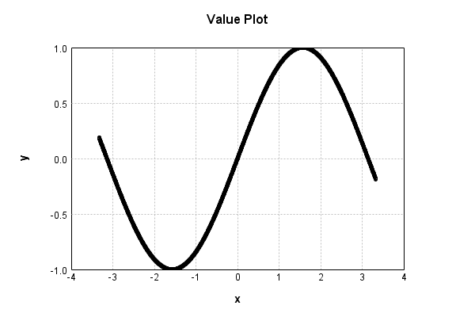
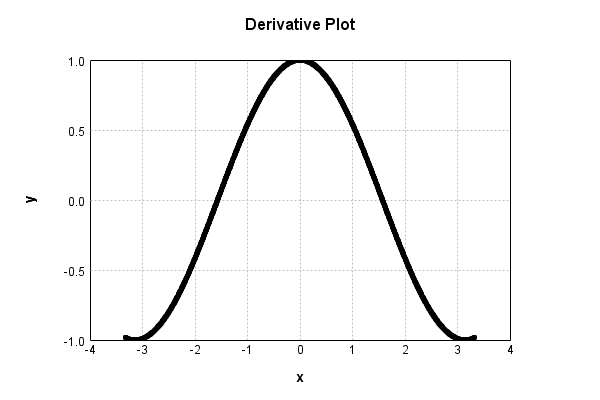

# SinewaveActivationLayer
## SinewaveActivationLayerTest
### Json Serialization
Code from [StandardLayerTests.java:68](../../../../../../../src/main/java/com/simiacryptus/mindseye/test/StandardLayerTests.java#L68) executed in 0.00 seconds: 
```java
    JsonObject json = layer.getJson();
    NNLayer echo = NNLayer.fromJson(json);
    if ((echo == null)) throw new AssertionError("Failed to deserialize");
    if ((layer == echo)) throw new AssertionError("Serialization did not copy");
    if ((!layer.equals(echo))) throw new AssertionError("Serialization not equal");
    return new GsonBuilder().setPrettyPrinting().create().toJson(json);
```

Returns: 

```
    {
      "class": "com.simiacryptus.mindseye.layers.java.SinewaveActivationLayer",
      "id": "474b0539-9599-4a2b-a038-0614c44730b4",
      "isFrozen": true,
      "name": "SinewaveActivationLayer/474b0539-9599-4a2b-a038-0614c44730b4",
      "balanced": true
    }
```


### Example Input/Output Pair
Code from [StandardLayerTests.java:152](../../../../../../../src/main/java/com/simiacryptus/mindseye/test/StandardLayerTests.java#L152) executed in 0.00 seconds: 
```java
    SimpleEval eval = SimpleEval.run(layer, inputPrototype);
    return String.format("--------------------\nInput: \n[%s]\n--------------------\nOutput: \n%s\n--------------------\nDerivative: \n%s",
      Arrays.stream(inputPrototype).map(t -> t.prettyPrint()).reduce((a, b) -> a + ",\n" + b).get(),
      eval.getOutput().prettyPrint(),
      Arrays.stream(eval.getDerivative()).map(t -> t.prettyPrint()).reduce((a, b) -> a + ",\n" + b).get());
```

Returns: 

```
    --------------------
    Input: 
    [[
    	[ [ -0.68 ], [ -0.58 ], [ -0.876 ] ],
    	[ [ 1.052 ], [ 0.392 ], [ 0.792 ] ]
    ]]
    --------------------
    Output: 
    [
    	[ [ -0.6287930240184686 ], [ -0.5480239367918736 ], [ -0.7681841152156385 ] ],
    	[ [ 0.8684166321804996 ], [ 0.38203747163308743 ], [ 0.7117595414043808 ] ]
    ]
    --------------------
    Derivative: 
    [
    	[ [ 0.7775727187509279 ], [ 0.8364626499151869 ], [ 0.6402289942906106 ] ],
    	[ [ 0.49583520745533893 ], [ 0.9241468337164814 ], [ 0.7024232023643763 ] ]
    ]
```


### Batch Execution
Code from [StandardLayerTests.java:101](../../../../../../../src/main/java/com/simiacryptus/mindseye/test/StandardLayerTests.java#L101) executed in 0.00 seconds: 
```java
    return getBatchingTester().test(layer, inputPrototype);
```

Returns: 

```
    ToleranceStatistics{absoluteTol=0.0000e+00 +- 0.0000e+00 [0.0000e+00 - 0.0000e+00] (120#), relativeTol=0.0000e+00 +- 0.0000e+00 [0.0000e+00 - 0.0000e+00] (120#)}
```


### Differential Validation
Code from [StandardLayerTests.java:109](../../../../../../../src/main/java/com/simiacryptus/mindseye/test/StandardLayerTests.java#L109) executed in 0.00 seconds: 
```java
    return getDerivativeTester().test(layer, inputPrototype);
```
Logging: 
```
    Inputs: [
    	[ [ -1.408 ], [ -0.904 ], [ 1.64 ] ],
    	[ [ 1.684 ], [ 0.616 ], [ -1.032 ] ]
    ]
    Inputs Statistics: {meanExponent=0.05820290499140054, negative=3, min=-1.032, max=-1.032, mean=0.09933333333333332, count=6.0, positive=3, stdDev=1.2721643849055915, zeros=0}
    Output: [
    	[ [ -0.9867779184046691 ], [ -0.7858070762631435 ], [ 0.9976063813191737 ] ],
    	[ [ 0.9935993040166264 ], [ 0.5777750071169316 ], [ -0.8583269115947114 ] ]
    ]
    Outputs Statistics: {meanExponent=-0.06981377733505982, negative=3, min=-0.8583269115947114, max=-0.8583269115947114, mean=-0.010321868968298712, count=6.0, positive=3, stdDev=0.8797339835133909, zeros=0}
    Feedback for input 0
    Inputs Values: [
    	[ [ -1.408 ], [ -0.904 ], [ 1.64 ] ],
    	[ [ 1.684 ], [ 0.616 ], [ -1.032 ] ]
    ]
    Value Statistics: {meanExponent=0.05820290499140054, negative=3, min=-1.032, max=-1.032, mean=0.09933333333333332, count=6.0, positive=3, stdDev=1.2721643849055915, zeros=0}
    Implemented Feedback: [ [ 0.1620781902322094, 0.0, 0.0, 0.0, 0.0, 0.0 ], [ 0.0, -0.112962
```
...[skipping 662 bytes](etc/144.txt)...
```
    , [ 0.0, 0.0, 0.0, 0.0, -0.06919832885809996, 0.0 ], [ 0.0, 0.0, 0.0, 0.0, 0.0, 0.513146133986897 ] ]
    Measured Statistics: {meanExponent=-0.580592754278675, negative=2, min=0.513146133986897, max=0.513146133986897, mean=0.05354838297419759, count=36.0, positive=4, stdDev=0.1865342993594681, zeros=30}
    Feedback Error: [ [ 4.9338625482370224E-5, 0.0, 0.0, 0.0, 0.0, 0.0 ], [ 0.0, -4.9679776448124935E-5, 0.0, 0.0, 0.0, 0.0 ], [ 0.0, 0.0, 3.9289322784630265E-5, 0.0, 0.0, 0.0 ], [ 0.0, 0.0, 0.0, -2.8890111550050612E-5, 0.0, 0.0 ], [ 0.0, 0.0, 0.0, 0.0, -4.9880204038010856E-5, 0.0 ], [ 0.0, 0.0, 0.0, 0.0, 0.0, 4.291548960055902E-5 ] ]
    Error Statistics: {meanExponent=-4.37084454433731, negative=3, min=4.291548960055902E-5, max=4.291548960055902E-5, mean=8.59262730936974E-8, count=36.0, positive=3, stdDev=1.795842249438431E-5, zeros=30}
    Finite-Difference Derivative Accuracy:
    absoluteTol: 7.2220e-06 +- 1.6442e-05 [0.0000e+00 - 4.9880e-05] (36#)
    relativeTol: 1.3731e-04 +- 1.2345e-04 [1.7698e-05 - 3.6054e-04] (6#)
    
```

Returns: 

```
    ToleranceStatistics{absoluteTol=7.2220e-06 +- 1.6442e-05 [0.0000e+00 - 4.9880e-05] (36#), relativeTol=1.3731e-04 +- 1.2345e-04 [1.7698e-05 - 3.6054e-04] (6#)}
```


### Performance
Code from [StandardLayerTests.java:119](../../../../../../../src/main/java/com/simiacryptus/mindseye/test/StandardLayerTests.java#L119) executed in 0.16 seconds: 
```java
    getPerformanceTester().test(layer, permPrototype);
```
Logging: 
```
    100 batches
    Input Dimensions:
    	[100, 100, 1]
    Performance:
    	Evaluation performance: 0.010745s +- 0.000200s [0.010598s - 0.011130s]
    	Learning performance: 0.009861s +- 0.000169s [0.009638s - 0.010135s]
    
```

### Function Plots
Code from [ActivationLayerTestBase.java:110](../../../../../../../src/test/java/com/simiacryptus/mindseye/layers/java/ActivationLayerTestBase.java#L110) executed in 0.00 seconds: 
```java
    return plot("Value Plot", plotData, x -> new double[]{x[0], x[1]});
```

Returns: 




Code from [ActivationLayerTestBase.java:114](../../../../../../../src/test/java/com/simiacryptus/mindseye/layers/java/ActivationLayerTestBase.java#L114) executed in 0.00 seconds: 
```java
    return plot("Derivative Plot", plotData, x -> new double[]{x[0], x[2]});
```

Returns: 




