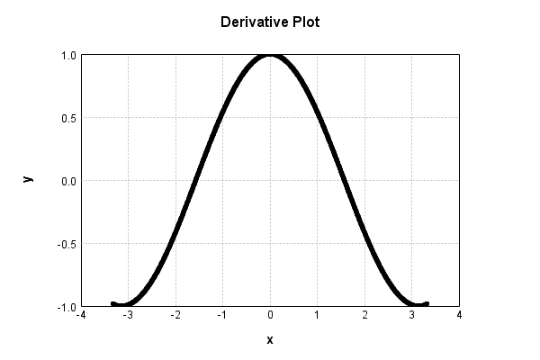

# SinewaveActivationLayer
## SinewaveActivationLayerTest
### Json Serialization
Code from [StandardLayerTests.java:69](../../../../../../../src/main/java/com/simiacryptus/mindseye/test/StandardLayerTests.java#L69) executed in 0.00 seconds: 
```java
    JsonObject json = layer.getJson();
    NNLayer echo = NNLayer.fromJson(json);
    if ((echo == null)) throw new AssertionError("Failed to deserialize");
    if ((layer == echo)) throw new AssertionError("Serialization did not copy");
    if ((!layer.equals(echo))) throw new AssertionError("Serialization not equal");
    return new GsonBuilder().setPrettyPrinting().create().toJson(json);
```

Returns: 

```
    {
      "class": "com.simiacryptus.mindseye.layers.java.SinewaveActivationLayer",
      "id": "e46e0291-d205-475e-a793-ae8637f6f889",
      "isFrozen": true,
      "name": "SinewaveActivationLayer/e46e0291-d205-475e-a793-ae8637f6f889",
      "balanced": true
    }
```


### Example Input/Output Pair
Code from [StandardLayerTests.java:153](../../../../../../../src/main/java/com/simiacryptus/mindseye/test/StandardLayerTests.java#L153) executed in 0.00 seconds: 
```java
    SimpleEval eval = SimpleEval.run(layer, inputPrototype);
    return String.format("--------------------\nInput: \n[%s]\n--------------------\nOutput: \n%s\n--------------------\nDerivative: \n%s",
      Arrays.stream(inputPrototype).map(t -> t.prettyPrint()).reduce((a, b) -> a + ",\n" + b).get(),
      eval.getOutput().prettyPrint(),
      Arrays.stream(eval.getDerivative()).map(t -> t.prettyPrint()).reduce((a, b) -> a + ",\n" + b).get());
```

Returns: 

```
    --------------------
    Input: 
    [[
    	[ [ -0.448 ], [ -0.064 ], [ -0.396 ] ],
    	[ [ 0.596 ], [ 1.168 ], [ -1.66 ] ]
    ]]
    --------------------
    Output: 
    [
    	[ [ -0.4331637711763425 ], [ -0.06395631828030929 ], [ -0.385730992814697 ] ],
    	[ [ 0.5613366226052051 ], [ 0.9199684533871396 ], [ -0.9960239899165367 ] ]
    ]
    --------------------
    Derivative: 
    [
    	[ [ 0.9013152319473411 ], [ 0.99795269895523 ], [ 0.9226112947402 ] ],
    	[ [ 0.8275875761042946 ], [ 0.39199240397292684 ], [ -0.08908541693645897 ] ]
    ]
```


### Batch Execution
Code from [StandardLayerTests.java:102](../../../../../../../src/main/java/com/simiacryptus/mindseye/test/StandardLayerTests.java#L102) executed in 0.00 seconds: 
```java
    return getBatchingTester().test(layer, inputPrototype);
```

Returns: 

```
    ToleranceStatistics{absoluteTol=0.0000e+00 +- 0.0000e+00 [0.0000e+00 - 0.0000e+00] (120#), relativeTol=0.0000e+00 +- 0.0000e+00 [0.0000e+00 - 0.0000e+00] (120#)}
```


### Differential Validation
Code from [StandardLayerTests.java:110](../../../../../../../src/main/java/com/simiacryptus/mindseye/test/StandardLayerTests.java#L110) executed in 0.00 seconds: 
```java
    return getDerivativeTester().test(layer, inputPrototype);
```
Logging: 
```
    Inputs: [
    	[ [ 0.588 ], [ -0.588 ], [ -1.232 ] ],
    	[ [ -1.832 ], [ -1.848 ], [ 1.084 ] ]
    ]
    Inputs Statistics: {meanExponent=0.0323370130664952, negative=4, min=1.084, max=1.084, mean=-0.6380000000000001, count=6.0, positive=2, stdDev=1.1338306751892013, zeros=0}
    Output: [
    	[ [ 0.5546980299408292 ], [ -0.5546980299408292 ], [ -0.9431553919633208 ] ],
    	[ [ -0.9660798371704511 ], [ -0.9618244605517302 ], [ 0.8838360596610964 ] ]
    ]
    Outputs Statistics: {meanExponent=-0.10380382484266798, negative=4, min=0.8838360596610964, max=0.8838360596610964, mean=-0.33120393833740097, count=6.0, positive=2, stdDev=0.7622694552747183, zeros=0}
    Feedback for input 0
    Inputs Values: [
    	[ [ 0.588 ], [ -0.588 ], [ -1.232 ] ],
    	[ [ -1.832 ], [ -1.848 ], [ 1.084 ] ]
    ]
    Value Statistics: {meanExponent=0.0323370130664952, negative=4, min=1.084, max=1.084, mean=-0.6380000000000001, count=6.0, positive=2, stdDev=1.1338306751892013, zeros=0}
    Implemented Feedback: [ [ 0.8320517385233703, 0.0, 0.0, 0.0, 0.0, 0.0 ], [ 0.0, -0.2582435831
```
...[skipping 665 bytes](etc/103.txt)...
```
    0, 0.0, 0.0, 0.0, 0.3323992395176667, 0.0 ], [ 0.0, 0.0, 0.0, 0.0, 0.0, 0.4677525791496606 ] ]
    Measured Statistics: {meanExponent=-0.3531547483165785, negative=2, min=0.4677525791496606, max=0.4677525791496606, mean=0.053678915539448174, count=36.0, positive=4, stdDev=0.22058651438790633, zeros=30}
    Feedback Error: [ [ -2.773628811603146E-5, 0.0, 0.0, 0.0, 0.0, 0.0 ], [ 0.0, 4.830442232117704E-5, 0.0, 0.0, 0.0, 0.0 ], [ 0.0, 0.0, 2.7733513968897228E-5, 0.0, 0.0, 0.0 ], [ 0.0, 0.0, 0.0, 4.809167859604058E-5, 0.0, 0.0 ], [ 0.0, 0.0, 0.0, 0.0, 4.7157215607440683E-5, 0.0 ], [ 0.0, 0.0, 0.0, 0.0, 0.0, -4.419258219606759E-5 ] ]
    Error Statistics: {meanExponent=-4.404832066400579, negative=2, min=-4.419258219606759E-5, max=-4.419258219606759E-5, mean=2.7599433383737913E-6, count=36.0, positive=4, stdDev=1.6739126824243283E-5, zeros=30}
    Finite-Difference Derivative Accuracy:
    absoluteTol: 6.7560e-06 +- 1.5562e-05 [0.0000e+00 - 4.8304e-05] (36#)
    relativeTol: 5.5486e-05 +- 3.1138e-05 [1.6665e-05 - 9.3534e-05] (6#)
    
```

Returns: 

```
    ToleranceStatistics{absoluteTol=6.7560e-06 +- 1.5562e-05 [0.0000e+00 - 4.8304e-05] (36#), relativeTol=5.5486e-05 +- 3.1138e-05 [1.6665e-05 - 9.3534e-05] (6#)}
```


### Performance
Code from [StandardLayerTests.java:120](../../../../../../../src/main/java/com/simiacryptus/mindseye/test/StandardLayerTests.java#L120) executed in 0.00 seconds: 
```java
    getPerformanceTester().test(layer, permPrototype);
```
Logging: 
```
    Evaluation performance: 0.000178s +- 0.000023s [0.000151s - 0.000218s]
    Learning performance: 0.000041s +- 0.000002s [0.000039s - 0.000044s]
    
```

### Function Plots
Code from [ActivationLayerTestBase.java:103](../../../../../../../src/test/java/com/simiacryptus/mindseye/layers/java/ActivationLayerTestBase.java#L103) executed in 0.00 seconds: 
```java
    return plot("Value Plot", plotData, x -> new double[]{x[0], x[1]});
```

Returns: 


Code from [ActivationLayerTestBase.java:107](../../../../../../../src/test/java/com/simiacryptus/mindseye/layers/java/ActivationLayerTestBase.java#L107) executed in 0.00 seconds: 
```java
    return plot("Derivative Plot", plotData, x -> new double[]{x[0], x[2]});
```

Returns: 




