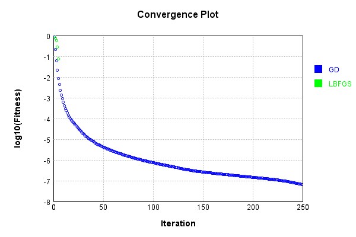
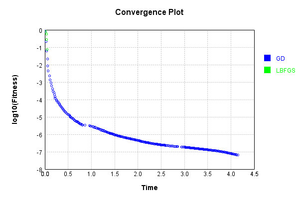

# SinewaveActivationLayer
## SinewaveActivationLayerTest
### Json Serialization
Code from [JsonTest.java:36](../../../../../../../src/main/java/com/simiacryptus/mindseye/test/unit/JsonTest.java#L36) executed in 0.00 seconds: 
```java
    JsonObject json = layer.getJson();
    NNLayer echo = NNLayer.fromJson(json);
    if ((echo == null)) throw new AssertionError("Failed to deserialize");
    if ((layer == echo)) throw new AssertionError("Serialization did not copy");
    if ((!layer.equals(echo))) throw new AssertionError("Serialization not equal");
    return new GsonBuilder().setPrettyPrinting().create().toJson(json);
```

Returns: 

```
    {
      "class": "com.simiacryptus.mindseye.layers.java.SinewaveActivationLayer",
      "id": "3ae1420c-7465-4fdf-857d-5dae5bc5125b",
      "isFrozen": true,
      "name": "SinewaveActivationLayer/3ae1420c-7465-4fdf-857d-5dae5bc5125b",
      "balanced": true
    }
```


### Example Input/Output Pair
Code from [ReferenceIO.java:68](../../../../../../../src/main/java/com/simiacryptus/mindseye/test/unit/ReferenceIO.java#L68) executed in 0.00 seconds: 
```java
    SimpleEval eval = SimpleEval.run(layer, inputPrototype);
    return String.format("--------------------\nInput: \n[%s]\n--------------------\nOutput: \n%s\n--------------------\nDerivative: \n%s",
      Arrays.stream(inputPrototype).map(t -> t.prettyPrint()).reduce((a, b) -> a + ",\n" + b).get(),
      eval.getOutput().prettyPrint(),
      Arrays.stream(eval.getDerivative()).map(t -> t.prettyPrint()).reduce((a, b) -> a + ",\n" + b).get());
```

Returns: 

```
    --------------------
    Input: 
    [[
    	[ [ 0.212 ], [ -0.668 ], [ -0.576 ] ],
    	[ [ -0.164 ], [ 0.824 ], [ -1.224 ] ]
    ]]
    --------------------
    Output: 
    [
    	[ [ 0.21041554345184618 ], [ -0.6194171027783333 ], [ -0.5446737109288251 ] ],
    	[ [ -0.16326583067337902 ], [ 0.733868858120187 ], [ -0.9404664228539465 ] ]
    ]
    --------------------
    Derivative: 
    [
    	[ [ 0.9776120391412251 ], [ 0.785062069384132 ], [ 0.8386480481244935 ] ],
    	[ [ 0.9865821144408262 ], [ 0.6792911740052073 ], [ 0.3398866097455176 ] ]
    ]
```


### Batch Execution
Code from [BatchingTester.java:66](../../../../../../../src/main/java/com/simiacryptus/mindseye/test/unit/BatchingTester.java#L66) executed in 0.00 seconds: 
```java
    return test(reference, inputPrototype);
```

Returns: 

```
    ToleranceStatistics{absoluteTol=0.0000e+00 +- 0.0000e+00 [0.0000e+00 - 0.0000e+00] (120#), relativeTol=0.0000e+00 +- 0.0000e+00 [0.0000e+00 - 0.0000e+00] (120#)}
```


Code from [SingleDerivativeTester.java:77](../../../../../../../src/main/java/com/simiacryptus/mindseye/test/unit/SingleDerivativeTester.java#L77) executed in 0.00 seconds: 
```java
    return test(component, inputPrototype);
```
Logging: 
```
    Inputs: [
    	[ [ 0.856 ], [ 0.86 ], [ 0.236 ] ],
    	[ [ 0.616 ], [ -1.408 ], [ -1.492 ] ]
    ]
    Inputs Statistics: {meanExponent=-0.10802726516700062, negative=2, min=-1.492, max=-1.492, mean=-0.055333333333333345, count=6.0, positive=4, stdDev=1.0081042715028155, zeros=0}
    Output: [
    	[ [ 0.7552267572495287 ], [ 0.757842562895277 ], [ 0.23381538327018064 ] ],
    	[ [ 0.5777750071169316 ], [ -0.9867779184046691 ], [ -0.9968971753576021 ] ]
    ]
    Outputs Statistics: {meanExponent=-0.18647366967268109, negative=2, min=-0.9968971753576021, max=-0.9968971753576021, mean=0.056830769461607776, count=6.0, positive=4, stdDev=0.7617242083638823, zeros=0}
    Feedback for input 0
    Inputs Values: [
    	[ [ 0.856 ], [ 0.86 ], [ 0.236 ] ],
    	[ [ 0.616 ], [ -1.408 ], [ -1.492 ] ]
    ]
    Value Statistics: {meanExponent=-0.10802726516700062, negative=2, min=-1.492, max=-1.492, mean=-0.055333333333333345, count=6.0, positive=4, stdDev=1.0081042715028155, zeros=0}
    Implemented Feedback: [ [ 0.6554636108391995, 0.0, 0.0, 0.0, 0.0, 0.0 ], [ 0.0, 0.81619
```
...[skipping 671 bytes](etc/393.txt)...
```
    , 0.0, 0.0, 0.9722693197392052, 0.0 ], [ 0.0, 0.0, 0.0, 0.0, 0.0, 0.07876465759060203 ] ]
    Measured Statistics: {meanExponent=-0.39386814988299285, negative=0, min=0.07876465759060203, max=0.07876465759060203, mean=0.09269872554227195, count=36.0, positive=6, stdDev=0.2466319814204363, zeros=30}
    Feedback Error: [ [ -3.776242992492573E-5, 0.0, 0.0, 0.0, 0.0, 0.0 ], [ 0.0, -2.8890111550050612E-5, 0.0, 0.0, 0.0, 0.0 ], [ 0.0, 0.0, -3.789321549296787E-5, 0.0, 0.0, 0.0 ], [ 0.0, 0.0, 0.0, 4.9338625482370224E-5, 0.0, 0.0 ], [ 0.0, 0.0, 0.0, 0.0, -1.1692389602413478E-5, 0.0 ], [ 0.0, 0.0, 0.0, 0.0, 0.0, 4.9844727747397344E-5 ] ]
    Error Statistics: {meanExponent=-4.487486639433687, negative=4, min=4.9844727747397344E-5, max=4.9844727747397344E-5, mean=-4.737442594608368E-7, count=36.0, positive=2, stdDev=1.5584861469174342E-5, zeros=30}
    Finite-Difference Derivative Accuracy:
    absoluteTol: 5.9839e-06 +- 1.4398e-05 [0.0000e+00 - 4.9845e-05] (36#)
    relativeTol: 9.1710e-05 +- 1.1173e-04 [6.0129e-06 - 3.1652e-04] (6#)
    
```

Returns: 

```
    ToleranceStatistics{absoluteTol=5.9839e-06 +- 1.4398e-05 [0.0000e+00 - 4.9845e-05] (36#), relativeTol=9.1710e-05 +- 1.1173e-04 [6.0129e-06 - 3.1652e-04] (6#)}
```


### Performance
Now we execute larger-scale runs to benchmark performance:

Code from [PerformanceTester.java:66](../../../../../../../src/main/java/com/simiacryptus/mindseye/test/unit/PerformanceTester.java#L66) executed in 0.17 seconds: 
```java
    test(component, inputPrototype);
```
Logging: 
```
    100 batches
    Input Dimensions:
    	[100, 100, 1]
    Performance:
    	Evaluation performance: 0.010349s +- 0.000342s [0.009888s - 0.010908s]
    	Learning performance: 0.012199s +- 0.000184s [0.011985s - 0.012479s]
    
```

### Input Learning
In this test, we use a network to learn this target input, given it's pre-evaluated output:

Code from [LearningTester.java:127](../../../../../../../src/main/java/com/simiacryptus/mindseye/test/unit/LearningTester.java#L127) executed in 0.00 seconds: 
```java
    return Arrays.stream(input_target).map(x -> x.prettyPrint()).reduce((a, b) -> a + "\n" + b).orElse("");
```

Returns: 

```
    [
    	[ [ 0.44 ], [ -0.456 ], [ -1.664 ], [ 0.1 ], [ 0.16 ], [ 1.4 ], [ -1.924 ], [ -0.388 ], ... ],
    	[ [ 1.596 ], [ 0.12 ], [ 1.236 ], [ 1.364 ], [ -1.356 ], [ 1.196 ], [ -0.2 ], [ 1.164 ], ... ],
    	[ [ -0.328 ], [ -1.172 ], [ 1.964 ], [ 0.604 ], [ 0.076 ], [ 0.096 ], [ -1.852 ], [ 0.844 ], ... ],
    	[ [ -0.7 ], [ 1.124 ], [ -0.908 ], [ -1.412 ], [ 1.0 ], [ -0.364 ], [ 1.128 ], [ 0.02 ], ... ],
    	[ [ -1.4 ], [ -0.172 ], [ 0.74 ], [ 0.212 ], [ -0.276 ], [ -1.228 ], [ 1.54 ], [ -0.428 ], ... ],
    	[ [ 0.44 ], [ 1.604 ], [ -1.232 ], [ 0.992 ], [ -0.456 ], [ -0.352 ], [ -0.552 ], [ -1.224 ], ... ],
    	[ [ 0.844 ], [ -0.236 ], [ -0.004 ], [ 1.216 ], [ 0.608 ], [ 1.016 ], [ -1.436 ], [ 0.42 ], ... ],
    	[ [ -0.032 ], [ -1.652 ], [ 1.336 ], [ 1.448 ], [ -1.9 ], [ 1.38 ], [ 0.74 ], [ 1.596 ], ... ],
    	...
    ]
```


First, we use a conjugate gradient descent method, which converges the fastest for purely linear functions.

Code from [LearningTester.java:300](../../../../../../../src/main/java/com/simiacryptus/mindseye/test/unit/LearningTester.java#L300) executed in 4.22 seconds: 
```java
    return new IterativeTrainer(trainable)
      .setLineSearchFactory(label -> new QuadraticSearch())
      .setOrientation(new GradientDescent())
      .setMonitor(monitor)
      .setTimeout(30, TimeUnit.SECONDS)
      .setMaxIterations(250)
      .setTerminateThreshold(0)
      .run();
```
Logging: 
```
    Constructing line search parameters: GD
    F(0.0) = LineSearchPoint{point=PointSample{avg=1.1651381941387056}, derivative=-1.4250836620459444E-4}
    New Minimum: 1.1651381941387056 > 1.1651381941386891
    F(1.0E-10) = LineSearchPoint{point=PointSample{avg=1.1651381941386891}, derivative=-1.4250836620459457E-4}, delta = -1.6431300764452317E-14
    New Minimum: 1.1651381941386891 > 1.1651381941385985
    F(7.000000000000001E-10) = LineSearchPoint{point=PointSample{avg=1.1651381941385985}, derivative=-1.425083662045955E-4}, delta = -1.0702549957386509E-13
    New Minimum: 1.1651381941385985 > 1.165138194137997
    F(4.900000000000001E-9) = LineSearchPoint{point=PointSample{avg=1.165138194137997}, derivative=-1.42508366204602E-4}, delta = -7.085443343157749E-13
    New Minimum: 1.165138194137997 > 1.1651381941338101
    F(3.430000000000001E-8) = LineSearchPoint{point=PointSample{avg=1.1651381941338101}, derivative=-1.4250836620464737E-4}, delta = -4.895417404782165E-12
    New Minimum: 1.1651381941338101 > 1.1651381941044832
    F(2.401000000
```
...[skipping 321990 bytes](etc/394.txt)...
```
    8) = LineSearchPoint{point=PointSample{avg=6.575941979659351E-8}, derivative=-2.110321348651817E-13}, delta = -7.258249571343126E-10
    F(20037.85534387755) = LineSearchPoint{point=PointSample{avg=6.651981046018818E-8}, derivative=2.9970172892129424E-13}, delta = 3.4565706460362154E-11
    F(1541.3734879905808) = LineSearchPoint{point=PointSample{avg=6.60641634414324E-8}, derivative=-2.502884924772527E-13}, delta = -4.210813122954264E-10
    F(10789.614415934066) = LineSearchPoint{point=PointSample{avg=6.502037785577458E-8}, derivative=2.4598070733834292E-14}, delta = -1.4648668979532433E-9
    6.502037785577458E-8 <= 6.648524475372782E-8
    New Minimum: 6.501032222222538E-8 > 6.501020325509519E-8
    F(9961.986937552532) = LineSearchPoint{point=PointSample{avg=6.501020325509519E-8}, derivative=-1.0389043418944525E-17}, delta = -1.475041498632634E-9
    Left bracket at 9961.986937552532
    Converged to left
    Iteration 250 complete. Error: 6.501020325509519E-8 Total: 249856463323635.5600; Orientation: 0.0003; Line Search: 0.0213
    
```

Returns: 

```
    6.501020325509519E-8
```


Training Converged

Next, we run the same optimization using L-BFGS, which is nearly ideal for purely second-order or quadratic functions.

Code from [LearningTester.java:324](../../../../../../../src/main/java/com/simiacryptus/mindseye/test/unit/LearningTester.java#L324) executed in 0.07 seconds: 
```java
    return new IterativeTrainer(trainable)
      .setLineSearchFactory(label -> new ArmijoWolfeSearch())
      .setOrientation(new LBFGS())
      .setMonitor(monitor)
      .setTimeout(30, TimeUnit.SECONDS)
      .setMaxIterations(250)
      .setTerminateThreshold(0)
      .run();
```
Logging: 
```
    LBFGS Accumulation History: 1 points
    Constructing line search parameters: GD
    th(0)=1.1651381941387056;dx=-1.4250836620459444E-4
    New Minimum: 1.1651381941387056 > 1.1648311656066455
    WOLFE (weak): th(2.154434690031884)=1.1648311656066455; dx=-1.425116666161573E-4 delta=3.0702853206010516E-4
    New Minimum: 1.1648311656066455 > 1.1645241300181808
    WOLFE (weak): th(4.308869380063768)=1.1645241300181808; dx=-1.4251491680452712E-4 delta=6.140641205247821E-4
    New Minimum: 1.1645241300181808 > 1.16329591926346
    WOLFE (weak): th(12.926608140191302)=1.16329591926346; dx=-1.4252741559763447E-4 delta=0.0018422748752455753
    New Minimum: 1.16329591926346 > 1.157767780457084
    WOLFE (weak): th(51.70643256076521)=1.157767780457084; dx=-1.4257374226694092E-4 delta=0.007370413681621502
    New Minimum: 1.157767780457084 > 1.1282745172237323
    WOLFE (weak): th(258.53216280382605)=1.1282745172237323; dx=-1.4254990003524935E-4 delta=0.036863676914973276
    New Minimum: 1.1282745172237323 > 0.9485219490831137
    WOLFE (weak): th(1551.192
```
...[skipping 2689 bytes](etc/395.txt)...
```
    rch: 0.0139
    LBFGS Accumulation History: 1 points
    th(0)=0.5712068102287187;dx=-1.0211580752582753E-4
    New Minimum: 0.5712068102287187 > 0.2853013491045857
    END: th(3341.943960201201)=0.2853013491045857; dx=-6.212363661894564E-5 delta=0.28590546112413295
    Iteration 4 complete. Error: 0.2853013491045857 Total: 249856526984957.4700; Orientation: 0.0005; Line Search: 0.0039
    LBFGS Accumulation History: 1 points
    th(0)=0.2853013491045857;dx=-5.239565177030578E-5
    New Minimum: 0.2853013491045857 > 0.07395135301474362
    END: th(7200.000000000001)=0.07395135301474362; dx=-6.573464304675418E-6 delta=0.2113499960898421
    Iteration 5 complete. Error: 0.07395135301474362 Total: 249856532831289.4700; Orientation: 0.0005; Line Search: 0.0039
    LBFGS Accumulation History: 1 points
    th(0)=0.07395135301474362;dx=-1.109967860781707E-5
    MAX ALPHA: th(0)=0.07395135301474362;th'(0)=-1.109967860781707E-5;
    Iteration 6 failed, aborting. Error: 0.07395135301474362 Total: 249856538653113.4700; Orientation: 0.0005; Line Search: 0.0039
    
```

Returns: 

```
    0.07395135301474362
```


This training run resulted in the following regressed input:

Code from [LearningTester.java:154](../../../../../../../src/main/java/com/simiacryptus/mindseye/test/unit/LearningTester.java#L154) executed in 0.01 seconds: 
```java
    return Arrays.stream(input_lbgfs).map(x -> x.prettyPrint()).reduce((a, b) -> a + "\n" + b).orElse("");
```

Returns: 

```
    [
    	[ [ 0.5259745358221426 ], [ -0.4854364188968676 ], [ 4.619725705152243 ], [ 0.045429943894343905 ], [ 0.17482910023562676 ], [ 1.074475826264659 ], [ -1.0215987916771325 ], [ -1.3596379849009383 ], ... ],
    	[ [ 1.086463420377827 ], [ 0.14784094459991834 ], [ -4.293765778759723 ], [ 1.0818745814576944 ], [ -1.0731792279570185 ], [ 1.0178383633587538 ], [ 3.475501341512269 ], [ -4.518788631653373 ], ... ],
    	[ [ -0.522417397274368 ], [ -1.3530004076411344 ], [ 1.024158010137743 ], [ 0.812449240879558 ], [ 0.13403495139100208 ], [ -0.6633782874465627 ], [ -1.0583120639478625 ], [ 0.8190993424983978 ], ... ],
    	[ [ -1.4515682157422125 ], [ 0.988099198504411 ], [ -1.0171670206564487 ], [ -1.070930416752423 ], [ -4.368716321539543 ], [ -0.4115027916790072 ], [ 0.9871689453028342 ], [ 0.01750079472617223 ], ... ],
    	[ [ -1.079019826568418 ], [ -0.32522367435834315 ], [ 0.9915925971975036 ], [ 0.26557915303362867 ], [ -0.24101963343774668 ], [ -1.4643840295975097 ], [ 1.118206173747371 ], [ -0.43146986845973606 ], ... ],
    	[ [ 0.5251423909747525 ], [ 1.0905788574762707 ], [ -1.0960176860157693 ], [ -4.290083597558709 ], [ -0.45192386881136876 ], [ -0.5357112056491246 ], [ 3.950878471398924 ], [ -1.1749943675918528 ], ... ],
    	[ [ 0.8129670607175061 ], [ -0.8291275926422951 ], [ 0.11119710341890565 ], [ 1.1091114457510407 ], [ 0.6183347832865871 ], [ 0.9278290178924559 ], [ -1.3578311331830026 ], [ 1.7126129092391964 ], ... ],
    	[ [ 2.833596544776829 ], [ -1.0807713349107058 ], [ 1.0563663821831604 ], [ 1.2599532008554184 ], [ -1.028794473188696 ], [ 1.0661241974605136 ], [ 0.7634633255454151 ], [ 1.2441670456646048 ], ... ],
    	...
    ]
```


Code from [LearningTester.java:96](../../../../../../../src/main/java/com/simiacryptus/mindseye/test/unit/LearningTester.java#L96) executed in 0.00 seconds: 
```java
    return TestUtil.compare(runs);
```

Returns: 




Code from [LearningTester.java:99](../../../../../../../src/main/java/com/simiacryptus/mindseye/test/unit/LearningTester.java#L99) executed in 0.00 seconds: 
```java
    return TestUtil.compareTime(runs);
```

Returns: 




### Function Plots
Code from [ActivationLayerTestBase.java:110](../../../../../../../src/test/java/com/simiacryptus/mindseye/layers/java/ActivationLayerTestBase.java#L110) executed in 0.00 seconds: 
```java
    return plot("Value Plot", plotData, x -> new double[]{x[0], x[1]});
```

Returns: 


Code from [ActivationLayerTestBase.java:114](../../../../../../../src/test/java/com/simiacryptus/mindseye/layers/java/ActivationLayerTestBase.java#L114) executed in 0.00 seconds: 
```java
    return plot("Derivative Plot", plotData, x -> new double[]{x[0], x[2]});
```

Returns: 


