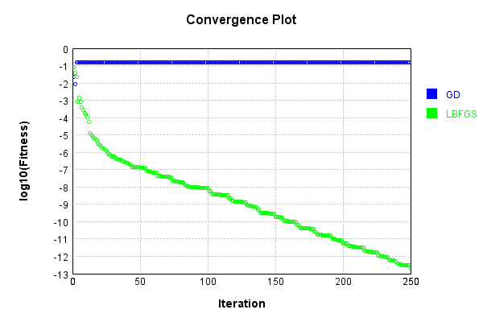
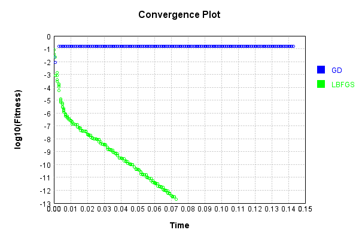

# SoftmaxActivationLayer
## SoftmaxActivationLayerTest
### Json Serialization
Code from [JsonTest.java:36](../../../../../../../src/main/java/com/simiacryptus/mindseye/test/unit/JsonTest.java#L36) executed in 0.00 seconds: 
```java
    JsonObject json = layer.getJson();
    NNLayer echo = NNLayer.fromJson(json);
    if ((echo == null)) throw new AssertionError("Failed to deserialize");
    if ((layer == echo)) throw new AssertionError("Serialization did not copy");
    if ((!layer.equals(echo))) throw new AssertionError("Serialization not equal");
    return new GsonBuilder().setPrettyPrinting().create().toJson(json);
```

Returns: 

```
    {
      "class": "com.simiacryptus.mindseye.layers.java.SoftmaxActivationLayer",
      "id": "4d00095a-23e3-4799-a612-bf0d6e9801a9",
      "isFrozen": false,
      "name": "SoftmaxActivationLayer/4d00095a-23e3-4799-a612-bf0d6e9801a9"
    }
```


### Example Input/Output Pair
Code from [ReferenceIO.java:68](../../../../../../../src/main/java/com/simiacryptus/mindseye/test/unit/ReferenceIO.java#L68) executed in 0.00 seconds: 
```java
    SimpleEval eval = SimpleEval.run(layer, inputPrototype);
    return String.format("--------------------\nInput: \n[%s]\n--------------------\nOutput: \n%s\n--------------------\nDerivative: \n%s",
      Arrays.stream(inputPrototype).map(t -> t.prettyPrint()).reduce((a, b) -> a + ",\n" + b).get(),
      eval.getOutput().prettyPrint(),
      Arrays.stream(eval.getDerivative()).map(t -> t.prettyPrint()).reduce((a, b) -> a + ",\n" + b).get());
```

Returns: 

```
    --------------------
    Input: 
    [[ 0.22, -1.692, -0.868, -1.98 ]]
    --------------------
    Output: 
    [ 0.6267716956603652, 0.09262715531198118, 0.21115286557636975, 0.06944828345128397 ]
    --------------------
    Derivative: 
    [ 0.0, 0.0, 0.0, 0.0 ]
```


### Batch Execution
Code from [BatchingTester.java:66](../../../../../../../src/main/java/com/simiacryptus/mindseye/test/unit/BatchingTester.java#L66) executed in 0.00 seconds: 
```java
    return test(reference, inputPrototype);
```

Returns: 

```
    ToleranceStatistics{absoluteTol=0.0000e+00 +- 0.0000e+00 [0.0000e+00 - 0.0000e+00] (80#), relativeTol=0.0000e+00 +- 0.0000e+00 [0.0000e+00 - 0.0000e+00] (40#)}
```


Code from [SingleDerivativeTester.java:77](../../../../../../../src/main/java/com/simiacryptus/mindseye/test/unit/SingleDerivativeTester.java#L77) executed in 0.00 seconds: 
```java
    return test(component, inputPrototype);
```
Logging: 
```
    Inputs: [ 0.764, 0.284, 0.452, -0.732 ]
    Inputs Statistics: {meanExponent=-0.2859846963768746, negative=1, min=-0.732, max=-0.732, mean=0.192, count=4.0, positive=3, stdDev=0.560585408301001, zeros=0}
    Output: [ 0.38838128064554295, 0.24032388615186176, 0.2842879233421937, 0.08700690986040137 ]
    Outputs Statistics: {meanExponent=-0.6591581542053341, negative=0, min=0.08700690986040137, max=0.08700690986040137, mean=0.24999999999999994, count=4.0, positive=4, stdDev=0.10838059689432204, zeros=0}
    Feedback for input 0
    Inputs Values: [ 0.764, 0.284, 0.452, -0.732 ]
    Value Statistics: {meanExponent=-0.2859846963768746, negative=1, min=-0.732, max=-0.732, mean=0.192, count=4.0, positive=3, stdDev=0.560585408301001, zeros=0}
    Implemented Feedback: [ [ 0.23754126148967095, -0.09333729867337373, -0.11041210773970314, -0.033791855076594005 ], [ -0.09333729867337373, 0.18256831589672873, -0.06832117852363856, -0.020909838699716396 ], [ -0.11041210773970314, -0.06832117852363856, 0.2034682999839767, -0.0247350137206349
```
...[skipping 690 bytes](etc/396.txt)...
```
    4741505 ] ]
    Measured Statistics: {meanExponent=-1.1858712204244035, negative=12, min=0.07943998824741505, max=0.07943998824741505, mean=3.469446951953614E-13, count=16.0, positive=4, stdDev=0.10982850916652317, zeros=0}
    Feedback Error: [ [ 2.651238118017707E-6, -1.0417524788086663E-6, -1.2323267477298838E-6, -3.771562547688623E-7 ], [ -2.4237317320652263E-6, 4.7408341882215765E-6, -1.774126829501288E-6, -5.429752103630614E-7 ], [ -2.381681248192491E-6, -1.4737448879587056E-6, 4.388982056513502E-6, -5.335549489692004E-7 ], [ -1.3956089380678938E-6, -8.635800030770691E-7, -1.0215600020034576E-6, 3.2807504697085488E-6 ] ]
    Error Statistics: {meanExponent=-5.832892702867703, negative=12, min=3.2807504697085488E-6, max=3.2807504697085488E-6, mean=3.4693472053537455E-13, count=16.0, positive=4, stdDev=2.2839124516020806E-6, zeros=0}
    Finite-Difference Derivative Accuracy:
    absoluteTol: 1.8827e-06 +- 1.2929e-06 [3.7716e-07 - 4.7408e-06] (16#)
    relativeTol: 1.2500e-05 +- 5.4192e-06 [5.5805e-06 - 2.0650e-05] (16#)
    
```

Returns: 

```
    ToleranceStatistics{absoluteTol=1.8827e-06 +- 1.2929e-06 [3.7716e-07 - 4.7408e-06] (16#), relativeTol=1.2500e-05 +- 5.4192e-06 [5.5805e-06 - 2.0650e-05] (16#)}
```


### Performance
Now we execute larger-scale runs to benchmark performance:

Code from [PerformanceTester.java:66](../../../../../../../src/main/java/com/simiacryptus/mindseye/test/unit/PerformanceTester.java#L66) executed in 0.01 seconds: 
```java
    test(component, inputPrototype);
```
Logging: 
```
    100 batches
    Input Dimensions:
    	[4]
    Performance:
    	Evaluation performance: 0.000522s +- 0.000071s [0.000454s - 0.000655s]
    	Learning performance: 0.000030s +- 0.000008s [0.000025s - 0.000046s]
    
```

### Input Learning
In this test, we use a network to learn this target input, given it's pre-evaluated output:

Code from [LearningTester.java:127](../../../../../../../src/main/java/com/simiacryptus/mindseye/test/unit/LearningTester.java#L127) executed in 0.00 seconds: 
```java
    return Arrays.stream(input_target).map(x -> x.prettyPrint()).reduce((a, b) -> a + "\n" + b).orElse("");
```

Returns: 

```
    [ -0.944, -1.996, 1.484, 0.788 ]
```


First, we use a conjugate gradient descent method, which converges the fastest for purely linear functions.

Code from [LearningTester.java:300](../../../../../../../src/main/java/com/simiacryptus/mindseye/test/unit/LearningTester.java#L300) executed in 0.15 seconds: 
```java
    return new IterativeTrainer(trainable)
      .setLineSearchFactory(label -> new QuadraticSearch())
      .setOrientation(new GradientDescent())
      .setMonitor(monitor)
      .setTimeout(30, TimeUnit.SECONDS)
      .setMaxIterations(250)
      .setTerminateThreshold(0)
      .run();
```
Logging: 
```
    Constructing line search parameters: GD
    F(0.0) = LineSearchPoint{point=PointSample{avg=0.11954167440871208}, derivative=-0.01741160784612521}
    New Minimum: 0.11954167440871208 > 0.11954167440697087
    F(1.0E-10) = LineSearchPoint{point=PointSample{avg=0.11954167440697087}, derivative=-0.017411607846057837}, delta = -1.7412044028830564E-12
    New Minimum: 0.11954167440697087 > 0.11954167439652394
    F(7.000000000000001E-10) = LineSearchPoint{point=PointSample{avg=0.11954167439652394}, derivative=-0.017411607845653636}, delta = -1.2188139386637431E-11
    New Minimum: 0.11954167439652394 > 0.11954167432339519
    F(4.900000000000001E-9) = LineSearchPoint{point=PointSample{avg=0.11954167432339519}, derivative=-0.01741160784282425}, delta = -8.531689243973517E-11
    New Minimum: 0.11954167432339519 > 0.11954167381149391
    F(3.430000000000001E-8) = LineSearchPoint{point=PointSample{avg=0.11954167381149391}, derivative=-0.017411607823018517}, delta = -5.972181638114193E-10
    New Minimum: 0.11954167381149391 > 0.11954167022818502
```
...[skipping 432356 bytes](etc/397.txt)...
```
    224607633916) = LineSearchPoint{point=PointSample{avg=0.15285816743506664}, derivative=-2.531580152547376E-16}, delta = -1.3211653993039363E-14
    F(277.1457225343741) = LineSearchPoint{point=PointSample{avg=0.1528581674351203}, derivative=7.046183360042875E-16}, delta = 4.043987367197133E-14
    F(21.31890173341339) = LineSearchPoint{point=PointSample{avg=0.15285816743507197}, derivative=-3.2683304827791834E-16}, delta = -7.882583474838611E-15
    F(149.23231213389374) = LineSearchPoint{point=PointSample{avg=0.15285816743506309}, derivative=1.8889239272996228E-16}, delta = -1.6764367671839864E-14
    0.15285816743506309 <= 0.15285816743507985
    New Minimum: 0.1528581674350604 > 0.1528581674350587
    F(102.38204996139383) = LineSearchPoint{point=PointSample{avg=0.1528581674350587}, derivative=-7.312737800803327E-23}, delta = -2.1149748619109232E-14
    Left bracket at 102.38204996139383
    Converged to left
    Iteration 250 complete. Error: 0.1528581674350587 Total: 249856978637803.0300; Orientation: 0.0000; Line Search: 0.0005
    
```

Returns: 

```
    0.1528581674350587
```


This training run resulted in the following regressed input:

Code from [LearningTester.java:144](../../../../../../../src/main/java/com/simiacryptus/mindseye/test/unit/LearningTester.java#L144) executed in 0.00 seconds: 
```java
    return Arrays.stream(input_gd).map(x -> x.prettyPrint()).reduce((a, b) -> a + "\n" + b).orElse("");
```

Returns: 

```
    [ -6.598077088075495, 8.701827903730422, -12.068909157510994, 9.297158392033266 ]
```


Next, we run the same optimization using L-BFGS, which is nearly ideal for purely second-order or quadratic functions.

Code from [LearningTester.java:324](../../../../../../../src/main/java/com/simiacryptus/mindseye/test/unit/LearningTester.java#L324) executed in 0.07 seconds: 
```java
    return new IterativeTrainer(trainable)
      .setLineSearchFactory(label -> new ArmijoWolfeSearch())
      .setOrientation(new LBFGS())
      .setMonitor(monitor)
      .setTimeout(30, TimeUnit.SECONDS)
      .setMaxIterations(250)
      .setTerminateThreshold(0)
      .run();
```
Logging: 
```
    LBFGS Accumulation History: 1 points
    Constructing line search parameters: GD
    th(0)=0.11954167440871208;dx=-0.01741160784612521
    New Minimum: 0.11954167440871208 > 0.08429194762137908
    END: th(2.154434690031884)=0.08429194762137908; dx=-0.015003617870199139 delta=0.035249726787333
    Iteration 1 complete. Error: 0.08429194762137908 Total: 249856983097430.0300; Orientation: 0.0001; Line Search: 0.0002
    LBFGS Accumulation History: 1 points
    th(0)=0.08429194762137908;dx=-0.012928965083342908
    New Minimum: 0.08429194762137908 > 0.03893254813165832
    END: th(4.641588833612779)=0.03893254813165832; dx=-0.006338016082903654 delta=0.04535939948972076
    Iteration 2 complete. Error: 0.03893254813165832 Total: 249856983289791.0300; Orientation: 0.0000; Line Search: 0.0001
    LBFGS Accumulation History: 1 points
    th(0)=0.03893254813165832;dx=-0.003129831331033602
    New Minimum: 0.03893254813165832 > 0.022984369321585207
    END: th(10.000000000000002)=0.022984369321585207; dx=-3.3903115965695286E-4 delta=0.015948178810073113
    Ite
```
...[skipping 149430 bytes](etc/398.txt)...
```
    mplete. Error: 3.0059649957615243E-13 Total: 249857055310668.9400; Orientation: 0.0000; Line Search: 0.0002
    LBFGS Accumulation History: 1 points
    th(0)=3.012311893484144E-13;dx=-1.7270029734023343E-16
    New Minimum: 3.012311893484144E-13 > 2.967494622777026E-13
    WOLFE (weak): th(26.101608301244603)=2.967494622777026E-13; dx=-1.707059023532839E-16 delta=4.4817270707117956E-15
    New Minimum: 2.967494622777026E-13 > 2.923197921231564E-13
    WOLFE (weak): th(52.203216602489206)=2.923197921231564E-13; dx=-1.6871150837701415E-16 delta=8.911397225257986E-15
    New Minimum: 2.923197921231564E-13 > 2.751216800320906E-13
    WOLFE (weak): th(156.60964980746763)=2.751216800320906E-13; dx=-1.6073394240238591E-16 delta=2.610950931632379E-14
    New Minimum: 2.751216800320906E-13 > 2.0803739273696903E-13
    END: th(626.4385992298705)=2.0803739273696903E-13; dx=-1.2483509303645373E-16 delta=9.319379661144536E-14
    Iteration 250 complete. Error: 2.0803739273696903E-13 Total: 249857055697384.9400; Orientation: 0.0000; Line Search: 0.0003
    
```

Returns: 

```
    2.0803739273696903E-13
```


Training Converged

Code from [LearningTester.java:96](../../../../../../../src/main/java/com/simiacryptus/mindseye/test/unit/LearningTester.java#L96) executed in 0.00 seconds: 
```java
    return TestUtil.compare(runs);
```

Returns: 




Code from [LearningTester.java:99](../../../../../../../src/main/java/com/simiacryptus/mindseye/test/unit/LearningTester.java#L99) executed in 0.00 seconds: 
```java
    return TestUtil.compareTime(runs);
```

Returns: 




