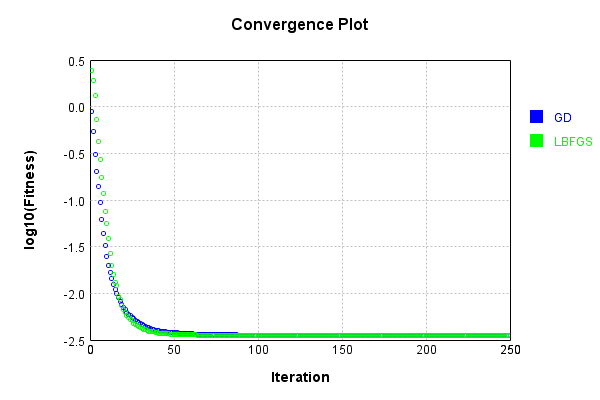
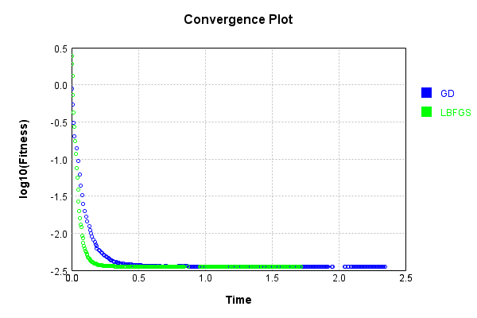

# SqActivationLayer
## SqActivationLayerTest
### Json Serialization
Code from [JsonTest.java:36](../../../../../../../src/main/java/com/simiacryptus/mindseye/test/unit/JsonTest.java#L36) executed in 0.00 seconds: 
```java
    JsonObject json = layer.getJson();
    NNLayer echo = NNLayer.fromJson(json);
    if ((echo == null)) throw new AssertionError("Failed to deserialize");
    if ((layer == echo)) throw new AssertionError("Serialization did not copy");
    if ((!layer.equals(echo))) throw new AssertionError("Serialization not equal");
    return new GsonBuilder().setPrettyPrinting().create().toJson(json);
```

Returns: 

```
    {
      "class": "com.simiacryptus.mindseye.layers.java.SqActivationLayer",
      "id": "4d448c45-947c-44e5-b4a3-fe202c803870",
      "isFrozen": true,
      "name": "SqActivationLayer/4d448c45-947c-44e5-b4a3-fe202c803870"
    }
```


### Example Input/Output Pair
Code from [ReferenceIO.java:68](../../../../../../../src/main/java/com/simiacryptus/mindseye/test/unit/ReferenceIO.java#L68) executed in 0.00 seconds: 
```java
    SimpleEval eval = SimpleEval.run(layer, inputPrototype);
    return String.format("--------------------\nInput: \n[%s]\n--------------------\nOutput: \n%s\n--------------------\nDerivative: \n%s",
      Arrays.stream(inputPrototype).map(t -> t.prettyPrint()).reduce((a, b) -> a + ",\n" + b).get(),
      eval.getOutput().prettyPrint(),
      Arrays.stream(eval.getDerivative()).map(t -> t.prettyPrint()).reduce((a, b) -> a + ",\n" + b).get());
```

Returns: 

```
    --------------------
    Input: 
    [[
    	[ [ 0.588 ], [ 0.816 ], [ 0.132 ] ],
    	[ [ 0.548 ], [ -0.62 ], [ -1.376 ] ]
    ]]
    --------------------
    Output: 
    [
    	[ [ 0.34574399999999994 ], [ 0.6658559999999999 ], [ 0.017424000000000002 ] ],
    	[ [ 0.30030400000000007 ], [ 0.3844 ], [ 1.8933759999999997 ] ]
    ]
    --------------------
    Derivative: 
    [
    	[ [ 1.176 ], [ 1.632 ], [ 0.264 ] ],
    	[ [ 1.096 ], [ -1.24 ], [ -2.752 ] ]
    ]
```


### Batch Execution
Code from [BatchingTester.java:66](../../../../../../../src/main/java/com/simiacryptus/mindseye/test/unit/BatchingTester.java#L66) executed in 0.00 seconds: 
```java
    return test(reference, inputPrototype);
```

Returns: 

```
    ToleranceStatistics{absoluteTol=0.0000e+00 +- 0.0000e+00 [0.0000e+00 - 0.0000e+00] (120#), relativeTol=0.0000e+00 +- 0.0000e+00 [0.0000e+00 - 0.0000e+00] (120#)}
```


Code from [SingleDerivativeTester.java:77](../../../../../../../src/main/java/com/simiacryptus/mindseye/test/unit/SingleDerivativeTester.java#L77) executed in 0.00 seconds: 
```java
    return test(component, inputPrototype);
```
Logging: 
```
    Inputs: [
    	[ [ 0.984 ], [ -1.632 ], [ -0.892 ] ],
    	[ [ 1.464 ], [ 1.772 ], [ 0.572 ] ]
    ]
    Inputs Statistics: {meanExponent=0.05458015504862266, negative=2, min=0.572, max=0.572, mean=0.37800000000000006, count=6.0, positive=4, stdDev=1.2369656422067672, zeros=0}
    Output: [
    	[ [ 0.968256 ], [ 2.6634239999999996 ], [ 0.795664 ] ],
    	[ [ 2.143296 ], [ 3.139984 ], [ 0.3271839999999999 ] ]
    ]
    Outputs Statistics: {meanExponent=0.10916031009724532, negative=0, min=0.3271839999999999, max=0.3271839999999999, mean=1.6729679999999998, count=6.0, positive=6, stdDev=1.0353552808731892, zeros=0}
    Feedback for input 0
    Inputs Values: [
    	[ [ 0.984 ], [ -1.632 ], [ -0.892 ] ],
    	[ [ 1.464 ], [ 1.772 ], [ 0.572 ] ]
    ]
    Value Statistics: {meanExponent=0.05458015504862266, negative=2, min=0.572, max=0.572, mean=0.37800000000000006, count=6.0, positive=4, stdDev=1.2369656422067672, zeros=0}
    Implemented Feedback: [ [ 1.968, 0.0, 0.0, 0.0, 0.0, 0.0 ], [ 0.0, 2.928, 0.0, 0.0, 0.0, 0.0 ], [ 0.0, 0.0, -3.264, 0.0, 0.0, 0.0 ], [ 0.0, 0.
```
...[skipping 484 bytes](etc/400.txt)...
```
     0.0, 0.0, 0.0, 0.0, -1.7838999999997274, 0.0 ], [ 0.0, 0.0, 0.0, 0.0, 0.0, 1.1441000000000923 ] ]
    Measured Statistics: {meanExponent=0.35561839478751384, negative=2, min=1.1441000000000923, max=1.1441000000000923, mean=0.12601666666670372, count=36.0, positive=4, stdDev=1.0485499517848014, zeros=30}
    Feedback Error: [ [ 9.999999936205484E-5, 0.0, 0.0, 0.0, 0.0, 0.0 ], [ 0.0, 9.999999921195268E-5, 0.0, 0.0, 0.0, 0.0 ], [ 0.0, 0.0, 1.0000000323318048E-4, 0.0, 0.0, 0.0 ], [ 0.0, 0.0, 0.0, 9.99999991617706E-5, 0.0, 0.0 ], [ 0.0, 0.0, 0.0, 0.0, 1.0000000027265976E-4, 0.0 ], [ 0.0, 0.0, 0.0, 0.0, 0.0, 1.0000000009235954E-4 ] ]
    Error Statistics: {meanExponent=-3.9999999990344346, negative=0, min=1.0000000009235954E-4, max=1.0000000009235954E-4, mean=1.6666666703721608E-5, count=36.0, positive=6, stdDev=3.726779970785387E-5, zeros=30}
    Finite-Difference Derivative Accuracy:
    absoluteTol: 1.6667e-05 +- 3.7268e-05 [0.0000e+00 - 1.0000e-04] (36#)
    relativeTol: 2.3940e-05 +- 1.0227e-05 [1.4108e-05 - 4.3704e-05] (6#)
    
```

Returns: 

```
    ToleranceStatistics{absoluteTol=1.6667e-05 +- 3.7268e-05 [0.0000e+00 - 1.0000e-04] (36#), relativeTol=2.3940e-05 +- 1.0227e-05 [1.4108e-05 - 4.3704e-05] (6#)}
```


### Performance
Now we execute larger-scale runs to benchmark performance:

Code from [PerformanceTester.java:66](../../../../../../../src/main/java/com/simiacryptus/mindseye/test/unit/PerformanceTester.java#L66) executed in 0.10 seconds: 
```java
    test(component, inputPrototype);
```
Logging: 
```
    100 batches
    Input Dimensions:
    	[100, 100, 1]
    Performance:
    	Evaluation performance: 0.003739s +- 0.000341s [0.003431s - 0.004356s]
    	Learning performance: 0.012413s +- 0.000407s [0.011999s - 0.013148s]
    
```

### Input Learning
In this test, we use a network to learn this target input, given it's pre-evaluated output:

Code from [LearningTester.java:127](../../../../../../../src/main/java/com/simiacryptus/mindseye/test/unit/LearningTester.java#L127) executed in 0.00 seconds: 
```java
    return Arrays.stream(input_target).map(x -> x.prettyPrint()).reduce((a, b) -> a + "\n" + b).orElse("");
```

Returns: 

```
    [
    	[ [ -1.964 ], [ 1.312 ], [ 1.644 ], [ 1.048 ], [ 0.552 ], [ 0.316 ], [ -1.912 ], [ -0.972 ], ... ],
    	[ [ 0.732 ], [ 0.004 ], [ -0.928 ], [ -0.692 ], [ -1.46 ], [ 0.908 ], [ 0.436 ], [ 1.748 ], ... ],
    	[ [ 0.74 ], [ -0.832 ], [ 0.332 ], [ -1.128 ], [ 1.44 ], [ -1.832 ], [ -1.668 ], [ 1.92 ], ... ],
    	[ [ 0.232 ], [ -0.24 ], [ -0.452 ], [ 1.288 ], [ -0.072 ], [ 0.12 ], [ 1.244 ], [ -0.224 ], ... ],
    	[ [ -0.304 ], [ -0.208 ], [ 0.372 ], [ -1.42 ], [ 1.944 ], [ 1.392 ], [ 0.928 ], [ 1.96 ], ... ],
    	[ [ 0.94 ], [ 1.12 ], [ 0.372 ], [ -1.104 ], [ -1.948 ], [ 1.672 ], [ 1.132 ], [ -1.184 ], ... ],
    	[ [ -1.376 ], [ 0.836 ], [ -0.712 ], [ -0.124 ], [ -0.856 ], [ -1.816 ], [ -1.204 ], [ -1.168 ], ... ],
    	[ [ 1.448 ], [ 0.456 ], [ 0.992 ], [ -1.124 ], [ -1.632 ], [ -1.86 ], [ 1.812 ], [ 0.948 ], ... ],
    	...
    ]
```


First, we use a conjugate gradient descent method, which converges the fastest for purely linear functions.

Code from [LearningTester.java:300](../../../../../../../src/main/java/com/simiacryptus/mindseye/test/unit/LearningTester.java#L300) executed in 2.38 seconds: 
```java
    return new IterativeTrainer(trainable)
      .setLineSearchFactory(label -> new QuadraticSearch())
      .setOrientation(new GradientDescent())
      .setMonitor(monitor)
      .setTimeout(30, TimeUnit.SECONDS)
      .setMaxIterations(250)
      .setTerminateThreshold(0)
      .run();
```
Logging: 
```
    Constructing line search parameters: GD
    F(0.0) = LineSearchPoint{point=PointSample{avg=2.804963055276495}, derivative=-0.007688740131448413}
    New Minimum: 2.804963055276495 > 2.8049630552757274
    F(1.0E-10) = LineSearchPoint{point=PointSample{avg=2.8049630552757274}, derivative=-0.007688740131445961}, delta = -7.673861546209082E-13
    New Minimum: 2.8049630552757274 > 2.804963055271114
    F(7.000000000000001E-10) = LineSearchPoint{point=PointSample{avg=2.804963055271114}, derivative=-0.00768874013143125}, delta = -5.381028955753209E-12
    New Minimum: 2.804963055271114 > 2.804963055238823
    F(4.900000000000001E-9) = LineSearchPoint{point=PointSample{avg=2.804963055238823}, derivative=-0.007688740131328275}, delta = -3.767164358237096E-11
    New Minimum: 2.804963055238823 > 2.8049630550127715
    F(3.430000000000001E-8) = LineSearchPoint{point=PointSample{avg=2.8049630550127715}, derivative=-0.007688740130607446}, delta = -2.637232654478794E-10
    New Minimum: 2.8049630550127715 > 2.8049630534304253
    F(2.4010000000000004E-7
```
...[skipping 286387 bytes](etc/401.txt)...
```
    ) = LineSearchPoint{point=PointSample{avg=0.003529473357153492}, derivative=-6.041946023389541E-11}, delta = -2.7530046296016936E-8
    F(2202.6750336699383) = LineSearchPoint{point=PointSample{avg=0.0035296659733200153}, derivative=2.644804732462204E-10}, delta = 1.650861202271564E-7
    F(169.4365410515337) = LineSearchPoint{point=PointSample{avg=0.003529483946451483}, derivative=-8.540707510289415E-11}, delta = -1.6940748305029063E-8
    F(1186.0557873607358) = LineSearchPoint{point=PointSample{avg=0.003529486034359484}, derivative=8.952003020338218E-11}, delta = -1.4852840304023507E-8
    0.003529486034359484 <= 0.003529500887199788
    New Minimum: 0.0035294633194283046 > 0.0035294627488869808
    F(665.7866532305949) = LineSearchPoint{point=PointSample{avg=0.0035294627488869808}, derivative=-5.414784682078139E-15}, delta = -3.813831280733565E-8
    Left bracket at 665.7866532305949
    Converged to left
    Iteration 250 complete. Error: 0.0035294627488869808 Total: 249859832934904.2000; Orientation: 0.0003; Line Search: 0.0100
    
```

Returns: 

```
    0.0035294627488869808
```


This training run resulted in the following regressed input:

Code from [LearningTester.java:144](../../../../../../../src/main/java/com/simiacryptus/mindseye/test/unit/LearningTester.java#L144) executed in 0.00 seconds: 
```java
    return Arrays.stream(input_gd).map(x -> x.prettyPrint()).reduce((a, b) -> a + "\n" + b).orElse("");
```

Returns: 

```
    [
    	[ [ -1.964000000008336 ], [ -1.312 ], [ 1.644 ], [ -1.048 ], [ -0.5520000000000003 ], [ -0.3160003429598795 ], [ -1.9120000000000001 ], [ 0.972 ], ... ],
    	[ [ 0.7319999999999999 ], [ 0.08855668919292668 ], [ -0.9279999999999999 ], [ 0.6920000000000002 ], [ 1.46 ], [ 0.9080000000000001 ], [ 0.4360000000023485 ], [ -1.7480000000000002 ], ... ],
    	[ [ -0.7399999999999999 ], [ -0.8319999999999999 ], [ -0.33200008516335155 ], [ 1.128 ], [ -1.44 ], [ -1.832 ], [ 1.6680000000000001 ], [ 1.9200000000000002 ], ... ],
    	[ [ -0.23211362959194812 ], [ -0.23984872421159056 ], [ -0.4520000000003367 ], [ 1.288 ], [ 0.06214172078526727 ], [ -0.12852135830227285 ], [ -1.244 ], [ -0.22414032731246492 ], ... ],
    	[ [ -0.3040008874331616 ], [ 0.20840277203633603 ], [ -0.3719996940089758 ], [ 1.42 ], [ 1.9440000000000004 ], [ -1.392 ], [ 0.9279999999999999 ], [ -1.9599999999989786 ], ... ],
    	[ [ -0.94 ], [ 1.12 ], [ 0.37200000162050695 ], [ 1.104 ], [ 1.9480000000000004 ], [ 1.672 ], [ -1.132 ], [ 1.184 ], ... ],
    	[ [ 1.376 ], [ -0.8359999999999999 ], [ -0.7119999999999999 ], [ 0.13368741715783683 ], [ -0.8560000000000001 ], [ -1.8160000000000003 ], [ -1.204 ], [ -1.168 ], ... ],
    	[ [ -1.448 ], [ -0.456000000000138 ], [ -0.992 ], [ 1.124 ], [ 1.632 ], [ 1.8600000000000003 ], [ -1.812 ], [ -0.948 ], ... ],
    	...
    ]
```


Next, we run the same optimization using L-BFGS, which is nearly ideal for purely second-order or quadratic functions.

Code from [LearningTester.java:324](../../../../../../../src/main/java/com/simiacryptus/mindseye/test/unit/LearningTester.java#L324) executed in 1.73 seconds: 
```java
    return new IterativeTrainer(trainable)
      .setLineSearchFactory(label -> new ArmijoWolfeSearch())
      .setOrientation(new LBFGS())
      .setMonitor(monitor)
      .setTimeout(30, TimeUnit.SECONDS)
      .setMaxIterations(250)
      .setTerminateThreshold(0)
      .run();
```
Logging: 
```
    LBFGS Accumulation History: 1 points
    Constructing line search parameters: GD
    th(0)=2.804963055276495;dx=-0.007688740131448413
    New Minimum: 2.804963055276495 > 2.7884549734219934
    WOLFE (weak): th(2.154434690031884)=2.7884549734219934; dx=-0.007636049410322765 delta=0.016508081854501366
    New Minimum: 2.7884549734219934 > 2.7720601270534733
    WOLFE (weak): th(4.308869380063768)=2.7720601270534733; dx=-0.007583621497206711 delta=0.032902928223021544
    New Minimum: 2.7720601270534733 > 2.707601811409475
    WOLFE (weak): th(12.926608140191302)=2.707601811409475; dx=-0.007376523434244929 delta=0.09736124386701972
    New Minimum: 2.707601811409475 > 2.4388942570147094
    END: th(51.70643256076521)=2.4388942570147094; dx=-0.006495231387018529 delta=0.3660687982617854
    Iteration 1 complete. Error: 2.4388942570147094 Total: 249859851282098.1600; Orientation: 0.0005; Line Search: 0.0067
    LBFGS Accumulation History: 1 points
    th(0)=2.4388942570147094;dx=-0.005522800100665026
    New Minimum: 2.4388942570147094 > 1.90708197869702
```
...[skipping 155714 bytes](etc/402.txt)...
```
    73E-10
    New Minimum: 0.003526997983235122 > 0.0035269970969012275
    END: th(258.53216280382605)=0.0035269970969012275; dx=-3.801128218910103E-12 delta=1.1392208188083786E-9
    Iteration 249 complete. Error: 0.0035269970969012275 Total: 249861561052694.4400; Orientation: 0.0005; Line Search: 0.0082
    LBFGS Accumulation History: 1 points
    th(0)=0.0035269970969012275;dx=-3.58455932799748E-12
    New Minimum: 0.0035269970969012275 > 0.0035269951258934946
    WOLFE (weak): th(556.9906600335335)=0.0035269951258934946; dx=-3.4927831160091334E-12 delta=1.9710077328941034E-9
    New Minimum: 0.0035269951258934946 > 0.003526993206009746
    WOLFE (weak): th(1113.981320067067)=0.003526993206009746; dx=-3.4009871682386996E-12 delta=3.890891481402037E-9
    New Minimum: 0.003526993206009746 > 0.0035269860379358265
    END: th(3341.9439602012008)=0.0035269860379358265; dx=-3.03360404837763E-12 delta=1.1058965400986137E-8
    Iteration 250 complete. Error: 0.0035269860379358265 Total: 249861568038939.4400; Orientation: 0.0006; Line Search: 0.0056
    
```

Returns: 

```
    0.0035269860379358265
```


This training run resulted in the following regressed input:

Code from [LearningTester.java:154](../../../../../../../src/main/java/com/simiacryptus/mindseye/test/unit/LearningTester.java#L154) executed in 0.00 seconds: 
```java
    return Arrays.stream(input_lbgfs).map(x -> x.prettyPrint()).reduce((a, b) -> a + "\n" + b).orElse("");
```

Returns: 

```
    [
    	[ [ -1.964 ], [ -1.312 ], [ 1.644 ], [ -1.048 ], [ -0.552 ], [ -0.3160000000000411 ], [ -1.912 ], [ 0.972 ], ... ],
    	[ [ 0.732 ], [ 0.06202826435594568 ], [ -0.928 ], [ 0.692 ], [ 1.46 ], [ 0.908 ], [ 0.436 ], [ -1.748 ], ... ],
    	[ [ -0.74 ], [ -0.832 ], [ -0.33200000000000157 ], [ 1.128 ], [ -1.44 ], [ -1.832 ], [ 1.668 ], [ 1.92 ], ... ],
    	[ [ -0.2320000491221868 ], [ -0.2399999634692808 ], [ -0.452 ], [ 1.288 ], [ 0.06645058715283894 ], [ -0.12112772100301356 ], [ -1.244 ], [ -0.22400010553405103 ], ... ],
    	[ [ -0.304000000000449 ], [ 0.20800088511603915 ], [ 0.37200000000000005 ], [ 1.42 ], [ 1.944 ], [ -1.392 ], [ 0.928 ], [ -1.96 ], ... ],
    	[ [ -0.94 ], [ 1.12 ], [ 0.37200000000000005 ], [ 1.104 ], [ 1.948 ], [ 1.672 ], [ -1.132 ], [ 1.184 ], ... ],
    	[ [ 1.376 ], [ -0.836 ], [ 0.712 ], [ 0.12511373977163778 ], [ -0.856 ], [ -1.816 ], [ -1.204 ], [ -1.168 ], ... ],
    	[ [ -1.448 ], [ -0.456 ], [ -0.992 ], [ 1.124 ], [ 1.632 ], [ 1.86 ], [ -1.812 ], [ -0.948 ], ... ],
    	...
    ]
```


Code from [LearningTester.java:96](../../../../../../../src/main/java/com/simiacryptus/mindseye/test/unit/LearningTester.java#L96) executed in 0.00 seconds: 
```java
    return TestUtil.compare(runs);
```

Returns: 




Code from [LearningTester.java:99](../../../../../../../src/main/java/com/simiacryptus/mindseye/test/unit/LearningTester.java#L99) executed in 0.00 seconds: 
```java
    return TestUtil.compareTime(runs);
```

Returns: 




### Function Plots
Code from [ActivationLayerTestBase.java:110](../../../../../../../src/test/java/com/simiacryptus/mindseye/layers/java/ActivationLayerTestBase.java#L110) executed in 0.00 seconds: 
```java
    return plot("Value Plot", plotData, x -> new double[]{x[0], x[1]});
```

Returns: 


Code from [ActivationLayerTestBase.java:114](../../../../../../../src/test/java/com/simiacryptus/mindseye/layers/java/ActivationLayerTestBase.java#L114) executed in 0.00 seconds: 
```java
    return plot("Derivative Plot", plotData, x -> new double[]{x[0], x[2]});
```

Returns: 


