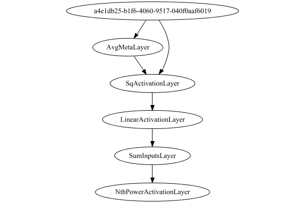

### Json Serialization
Code from [LayerTestBase.java:74](../../../../../../../../MindsEye/src/test/java/com/simiacryptus/mindseye/layers/LayerTestBase.java#L74) executed in 0.00 seconds: 
```java
  
```

Returns: 

```
    {
      "class": "com.simiacryptus.mindseye.layers.java.StdDevMetaLayer",
      "id": "bdd6bbba-380b-47fe-a761-c2410002dce8",
      "isFrozen": false,
      "name": "StdDevMetaLayer/bdd6bbba-380b-47fe-a761-c2410002dce8",
      "inputs": [
        "a4e1db25-b1f6-4060-9517-040f0aaf6019"
      ],
      "nodes": {
        "d431d8cd-b62d-4080-aee0-ec3c7a87e8a6": "bdd6bbba-380b-47fe-a761-c2410002dcec",
        "385a1b11-b601-447d-86a8-7e92566a885b": "bdd6bbba-380b-47fe-a761-c2410002dceb",
        "25f1f384-70d8-4369-89b4-d4ba62b93923": "bdd6bbba-380b-47fe-a761-c2410002dcef",
        "9207dba0-338b-4243-9869-7165e6c9da0b": "bdd6bbba-380b-47fe-a761-c2410002dcee",
        "51c46703-71b0-42ab-b946-87adee5f8ef4": "bdd6bbba-380b-47fe-a761-c2410002dced",
        "edb67603-5c0c-47ef-aace-1d774c9de84f": "bdd6bbba-380b-47fe-a761-c2410002dcea",
        "7d7e4491-b6d7-45e4-a9dd-e36e54f93358": "bdd6bbba-380b-47fe-a761-c2410002dce9"
      },
      "layers": {
        "bdd6bbba-380b-47fe-a761-c2410002dcec": {
          "class": "com.simiacryptus.mindseye.layers.java.SqActivationLayer",
          "id": "bdd6bbba-380b-47fe-a761-c2410002dcec",
          "isFrozen": true,
          "name": "SqActivationLayer/bdd6bbba-380b-47fe-a761-c2410002dcec"
        },
        "bdd6bbba-380b-47fe-a761-c2410002dceb": {
          "class": "com.simiacryptus.mindseye.layers.java.AvgMetaLayer",
          "id": "bdd6bbba-380b-47fe-a761-c2410002dceb",
          "isFrozen": false,
          "name": "AvgMetaLayer/bdd6bbba-380b-47fe-a761-c2410002dceb"
        },
        "bdd6bbba-380b-47fe-a761-c2410002dcef": {
          "class": "com.simiacryptus.mindseye.layers.java.AvgMetaLayer",
          "id": "bdd6bbba-380b-47fe-a761-c2410002dcef",
          "isFrozen": false,
          "name": "AvgMetaLayer/bdd6bbba-380b-47fe-a761-c2410002dcef"
        },
        "bdd6bbba-380b-47fe-a761-c2410002dcee": {
          "class": "com.simiacryptus.mindseye.layers.java.SqActivationLayer",
          "id": "bdd6bbba-380b-47fe-a761-c2410002dcee",
          "isFrozen": true,
          "name": "SqActivationLayer/bdd6bbba-380b-47fe-a761-c2410002dcee"
        },
        "bdd6bbba-380b-47fe-a761-c2410002dced": {
          "class": "com.simiacryptus.mindseye.layers.java.LinearActivationLayer",
          "id": "bdd6bbba-380b-47fe-a761-c2410002dced",
          "isFrozen": false,
          "name": "LinearActivationLayer/bdd6bbba-380b-47fe-a761-c2410002dced",
          "weights": {
            "dimensions": [
              2
            ],
            "data": [
              -1.0,
              0.0
            ]
          }
        },
        "bdd6bbba-380b-47fe-a761-c2410002dcea": {
          "class": "com.simiacryptus.mindseye.layers.java.SumInputsLayer",
          "id": "bdd6bbba-380b-47fe-a761-c2410002dcea",
          "isFrozen": false,
          "name": "SumInputsLayer/bdd6bbba-380b-47fe-a761-c2410002dcea"
        },
        "bdd6bbba-380b-47fe-a761-c2410002dce9": {
          "class": "com.simiacryptus.mindseye.layers.java.NthPowerActivationLayer",
          "id": "bdd6bbba-380b-47fe-a761-c2410002dce9",
          "isFrozen": false,
          "name": "NthPowerActivationLayer/bdd6bbba-380b-47fe-a761-c2410002dce9",
          "power": 0.5
        }
      },
      "links": {
        "d431d8cd-b62d-4080-aee0-ec3c7a87e8a6": [
          "a4e1db25-b1f6-4060-9517-040f0aaf6019"
        ],
        "385a1b11-b601-447d-86a8-7e92566a885b": [
          "d431d8cd-b62d-4080-aee0-ec3c7a87e8a6"
        ],
        "25f1f384-70d8-4369-89b4-d4ba62b93923": [
          "a4e1db25-b1f6-4060-9517-040f0aaf6019"
        ],
        "9207dba0-338b-4243-9869-7165e6c9da0b": [
          "25f1f384-70d8-4369-89b4-d4ba62b93923"
        ],
        "51c46703-71b0-42ab-b946-87adee5f8ef4": [
          "9207dba0-338b-4243-9869-7165e6c9da0b"
        ],
        "edb67603-5c0c-47ef-aace-1d774c9de84f": [
          "385a1b11-b601-447d-86a8-7e92566a885b",
          "51c46703-71b0-42ab-b946-87adee5f8ef4"
        ],
        "7d7e4491-b6d7-45e4-a9dd-e36e54f93358": [
          "edb67603-5c0c-47ef-aace-1d774c9de84f"
        ]
      },
      "labels": {},
      "head": "7d7e4491-b6d7-45e4-a9dd-e36e54f93358"
    }
```


### Network Diagram
Code from [LayerTestBase.java:85](../../../../../../../../MindsEye/src/test/java/com/simiacryptus/mindseye/layers/LayerTestBase.java#L85) executed in 0.36 seconds: 
```java
    log.h3("Network Diagram");
    log.code(()->{
      return Graphviz.fromGraph(toGraph((DAGNetwork) layer))
        .height(400).width(600).render(Format.PNG).toImage();
    });
```

Returns: 




### Differential Validation
Code from [LayerTestBase.java:98](../../../../../../../../MindsEye/src/test/java/com/simiacryptus/mindseye/layers/LayerTestBase.java#L98) executed in 0.00 seconds: 
```java
  
```
Logging: 
```
    Finite-Difference Derivative Accuracy:
    absoluteTol: 0.0000e+00 +- 0.0000e+00 [0.0000e+00 - 0.0000e+00] (9#)
    relativeTol: 0.0000e+00 +- 0.0000e+00 [Infinity - -Infinity] (0#)
    
```

### Performance
Code from [LayerTestBase.java:103](../../../../../../../../MindsEye/src/test/java/com/simiacryptus/mindseye/layers/LayerTestBase.java#L103) executed in 0.23 seconds: 
```java
  
```
Logging: 
```
    Forward performance: 2.7293 +- 1.0320 [1.5075 - 6.7426]
    Backward performance: 20.3369 +- 146.2808 [2.1801 - 1474.5124]
    
```

### Reference Implementation
