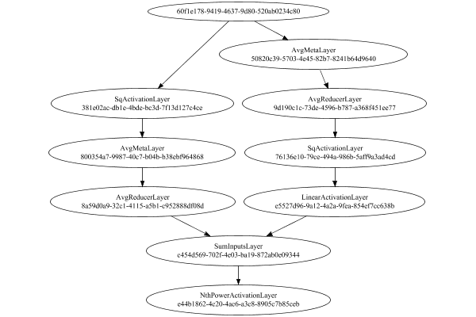

# StdDevMetaLayer
## StdDevMetaLayerTest
### Json Serialization
Code from [StandardLayerTests.java:69](../../../../../../../src/main/java/com/simiacryptus/mindseye/test/StandardLayerTests.java#L69) executed in 0.00 seconds: 
```java
    JsonObject json = layer.getJson();
    NNLayer echo = NNLayer.fromJson(json);
    if ((echo == null)) throw new AssertionError("Failed to deserialize");
    if ((layer == echo)) throw new AssertionError("Serialization did not copy");
    if ((!layer.equals(echo))) throw new AssertionError("Serialization not equal");
    return new GsonBuilder().setPrettyPrinting().create().toJson(json);
```

Returns: 

```
    {
      "class": "com.simiacryptus.mindseye.layers.java.StdDevMetaLayer",
      "id": "2bcdceca-8a5f-488d-8c78-ecc503b5f9cc",
      "isFrozen": false,
      "name": "StdDevMetaLayer/2bcdceca-8a5f-488d-8c78-ecc503b5f9cc",
      "inputs": [
        "60f1e178-9419-4637-9d80-520ab0234c80"
      ],
      "nodes": {
        "03063e5c-0c16-4f36-af7a-4ba98edc623e": "50820c39-5703-4e45-82b7-8241b64d9640",
        "8e0f81f8-7012-45c6-a75e-b698537b46e9": "9d190c1c-73de-4596-b787-a368f451ee77",
        "9dd77a9f-4f72-4801-b11e-f39cb0462d02": "76136e10-79ce-494a-986b-5aff9a3ad4cd",
        "aca28014-d997-4bb2-8e85-2546a33be14c": "e5527d96-9a12-4a2a-9fea-854ef7cc638b",
        "50e05c32-05e7-4066-b3d2-b7159d99408f": "381e02ac-db1e-4bde-bc3d-7f13d127c4ce",
        "96684a5b-9b72-4afa-922a-f944e751f23c": "800354a7-9987-40c7-b04b-b38ebf964868",
        "4ea2f6d1-85d9-4c3c-962b-a245fb95cd54": "8a59d0a9-32c1-4115-a5b1-c952888df08d",
        "4604a2e7-6ebd-4dba-a444-28682fc7705b": "c454d569-702f-4e03-ba19-872ab0e09344",
        "ae209a90-7129-451d-bfc9-6848a81c3438": "e44b1862-4c20-4ac6-a3c8-890
```
...[skipping 2605 bytes](etc/107.txt)...
```
    5
        }
      },
      "links": {
        "03063e5c-0c16-4f36-af7a-4ba98edc623e": [
          "60f1e178-9419-4637-9d80-520ab0234c80"
        ],
        "8e0f81f8-7012-45c6-a75e-b698537b46e9": [
          "03063e5c-0c16-4f36-af7a-4ba98edc623e"
        ],
        "9dd77a9f-4f72-4801-b11e-f39cb0462d02": [
          "8e0f81f8-7012-45c6-a75e-b698537b46e9"
        ],
        "aca28014-d997-4bb2-8e85-2546a33be14c": [
          "9dd77a9f-4f72-4801-b11e-f39cb0462d02"
        ],
        "50e05c32-05e7-4066-b3d2-b7159d99408f": [
          "60f1e178-9419-4637-9d80-520ab0234c80"
        ],
        "96684a5b-9b72-4afa-922a-f944e751f23c": [
          "50e05c32-05e7-4066-b3d2-b7159d99408f"
        ],
        "4ea2f6d1-85d9-4c3c-962b-a245fb95cd54": [
          "96684a5b-9b72-4afa-922a-f944e751f23c"
        ],
        "4604a2e7-6ebd-4dba-a444-28682fc7705b": [
          "4ea2f6d1-85d9-4c3c-962b-a245fb95cd54",
          "aca28014-d997-4bb2-8e85-2546a33be14c"
        ],
        "ae209a90-7129-451d-bfc9-6848a81c3438": [
          "4604a2e7-6ebd-4dba-a444-28682fc7705b"
        ]
      },
      "labels": {},
      "head": "ae209a90-7129-451d-bfc9-6848a81c3438"
    }
```


### Network Diagram
Code from [StandardLayerTests.java:80](../../../../../../../src/main/java/com/simiacryptus/mindseye/test/StandardLayerTests.java#L80) executed in 0.20 seconds: 
```java
    return Graphviz.fromGraph(TestUtil.toGraph((DAGNetwork) layer))
      .height(400).width(600).render(Format.PNG).toImage();
```

Returns: 




### Example Input/Output Pair
Code from [StandardLayerTests.java:153](../../../../../../../src/main/java/com/simiacryptus/mindseye/test/StandardLayerTests.java#L153) executed in 0.00 seconds: 
```java
    SimpleEval eval = SimpleEval.run(layer, inputPrototype);
    return String.format("--------------------\nInput: \n[%s]\n--------------------\nOutput: \n%s\n--------------------\nDerivative: \n%s",
      Arrays.stream(inputPrototype).map(t -> t.prettyPrint()).reduce((a, b) -> a + ",\n" + b).get(),
      eval.getOutput().prettyPrint(),
      Arrays.stream(eval.getDerivative()).map(t -> t.prettyPrint()).reduce((a, b) -> a + ",\n" + b).get());
```

Returns: 

```
    --------------------
    Input: 
    [[ 0.756, 1.62, -0.128 ]]
    --------------------
    Output: 
    [ 0.7136335816712165 ]
    --------------------
    Derivative: 
    [ 0.003113954106557182, 0.40668240631637304, -0.4097963604229303 ]
```


### Performance
Adding performance wrappers

Code from [TestUtil.java:260](../../../../../../../src/main/java/com/simiacryptus/mindseye/test/TestUtil.java#L260) executed in 0.00 seconds: 
```java
    network.visitNodes(node -> {
      if (!(node.getLayer() instanceof MonitoringWrapperLayer)) {
        node.setLayer(new MonitoringWrapperLayer(node.getLayer()).shouldRecordSignalMetrics(false));
      }
      else {
        ((MonitoringWrapperLayer) node.getLayer()).shouldRecordSignalMetrics(false);
      }
    });
```

Code from [StandardLayerTests.java:120](../../../../../../../src/main/java/com/simiacryptus/mindseye/test/StandardLayerTests.java#L120) executed in 0.00 seconds: 
```java
    getPerformanceTester().test(layer, permPrototype);
```
Logging: 
```
    Evaluation performance: 0.000298s +- 0.000033s [0.000269s - 0.000363s]
    Learning performance: 0.000011s +- 0.000005s [0.000006s - 0.000018s]
    
```

Per-layer Performance Metrics:

Code from [TestUtil.java:225](../../../../../../../src/main/java/com/simiacryptus/mindseye/test/TestUtil.java#L225) executed in 0.00 seconds: 
```java
    Map<NNLayer, MonitoringWrapperLayer> metrics = new HashMap<>();
    network.visitNodes(node -> {
      if ((node.getLayer() instanceof MonitoringWrapperLayer)) {
        MonitoringWrapperLayer layer = node.getLayer();
        metrics.put(layer.getInner(), layer);
      }
    });
    System.out.println("Forward Performance: \n\t" + metrics.entrySet().stream().map(e -> {
      PercentileStatistics performance = e.getValue().getForwardPerformance();
      return String.format("%s -> %.6fs +- %.6fs (%s)", e.getKey(), performance.getMean(), performance.getStdDev(), performance.getCount());
    }).reduce((a, b) -> a + "\n\t" + b));
    System.out.println("Backward Performance: \n\t" + metrics.entrySet().stream().map(e -> {
      PercentileStatistics performance = e.getValue().getBackwardPerformance();
      return String.format("%s -> %.6fs +- %.6fs (%s)", e.getKey(), performance.getMean(), performance.getStdDev(), performance.getCount());
    }).reduce((a, b) -> a + "\n\t" + b));
```
Logging: 
```
    Forward Performance: 
    	Optional[NthPowerActivationLayer/e44b1862-4c20-4ac6-a3c8-8905c7b85ceb -> 0.000003s +- 0.000001s (11.0)
    	AvgReducerLayer/9d190c1c-73de-4596-b787-a368f451ee77 -> 0.000003s +- 0.000001s (11.0)
    	SqActivationLayer/76136e10-79ce-494a-986b-5aff9a3ad4cd -> 0.000002s +- 0.000000s (11.0)
    	SqActivationLayer/381e02ac-db1e-4bde-bc3d-7f13d127c4ce -> 0.000115s +- 0.000034s (11.0)
    	AvgMetaLayer/50820c39-5703-4e45-82b7-8241b64d9640 -> 0.000029s +- 0.000010s (11.0)
    	SumInputsLayer/c454d569-702f-4e03-ba19-872ab0e09344 -> 0.000016s +- 0.000010s (11.0)
    	AvgReducerLayer/8a59d0a9-32c1-4115-a5b1-c952888df08d -> 0.000007s +- 0.000004s (11.0)
    	LinearActivationLayer/e5527d96-9a12-4a2a-9fea-854ef7cc638b -> 0.000003s +- 0.000002s (11.0)
    	AvgMetaLayer/800354a7-9987-40c7-b04b-b38ebf964868 -> 0.000042s +- 0.000010s (11.0)]
    Backward Performance: 
    	Optional[NthPowerActivationLayer/e44b1862-4c20-4ac6-a3c8-8905c7b85ceb -> 0.000006s +- 0.000002s (6.0)
    	AvgReducerLayer/9d190c1c-73de-4596-b787-a368f451ee77 -> 0.000003s +- 0.000000s (1.0)
    	SqActivationLayer/76136e10-79ce-494a-986b-5aff9a3ad4cd -> 0.000001s +- 0.000000s (1.0)
    	SqActivationLayer/381e02ac-db1e-4bde-bc3d-7f13d127c4ce -> 0.000003s +- 0.000000s (1.0)
    	AvgMetaLayer/50820c39-5703-4e45-82b7-8241b64d9640 -> 0.000005s +- 0.000000s (1.0)
    	SumInputsLayer/c454d569-702f-4e03-ba19-872ab0e09344 -> 0.000008s +- 0.000000s (1.0)
    	AvgReducerLayer/8a59d0a9-32c1-4115-a5b1-c952888df08d -> 0.000005s +- 0.000000s (1.0)
    	LinearActivationLayer/e5527d96-9a12-4a2a-9fea-854ef7cc638b -> 0.000004s +- 0.000000s (1.0)
    	AvgMetaLayer/800354a7-9987-40c7-b04b-b38ebf964868 -> 0.000013s +- 0.000000s (1.0)]
    
```

Removing performance wrappers

Code from [TestUtil.java:243](../../../../../../../src/main/java/com/simiacryptus/mindseye/test/TestUtil.java#L243) executed in 0.00 seconds: 
```java
    network.visitNodes(node -> {
      if (node.getLayer() instanceof MonitoringWrapperLayer) {
        node.setLayer(node.<MonitoringWrapperLayer>getLayer().getInner());
      }
    });
```

