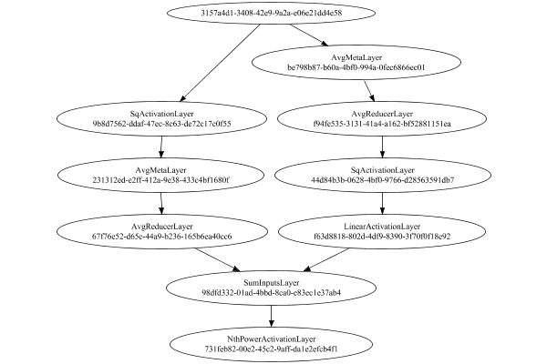

# StdDevMetaLayer
## StdDevMetaLayerTest
### Json Serialization
Code from [StandardLayerTests.java:68](../../../../../../../src/main/java/com/simiacryptus/mindseye/test/StandardLayerTests.java#L68) executed in 0.00 seconds: 
```java
    JsonObject json = layer.getJson();
    NNLayer echo = NNLayer.fromJson(json);
    if ((echo == null)) throw new AssertionError("Failed to deserialize");
    if ((layer == echo)) throw new AssertionError("Serialization did not copy");
    if ((!layer.equals(echo))) throw new AssertionError("Serialization not equal");
    return new GsonBuilder().setPrettyPrinting().create().toJson(json);
```

Returns: 

```
    {
      "class": "com.simiacryptus.mindseye.layers.java.StdDevMetaLayer",
      "id": "84164851-f1ab-4937-8c87-c067c2ad76f4",
      "isFrozen": false,
      "name": "StdDevMetaLayer/84164851-f1ab-4937-8c87-c067c2ad76f4",
      "inputs": [
        "3157a4d1-3408-42e9-9a2a-e06e21dd4e58"
      ],
      "nodes": {
        "c057dd23-3826-40f2-ad33-91fa00bb9efd": "be798b87-b60a-4bf0-994a-0fec6866ec01",
        "675bf37c-dd09-43f1-a1f9-41984ef507c5": "f94fe535-3131-41a4-a162-bf52881151ea",
        "1c92c4f7-52ce-4952-9ba4-40c1401cf2e2": "44d84b3b-0628-4bf0-9766-d28563591db7",
        "6671753a-22fd-4eaa-9fdb-9fd00730c2c2": "f63d8818-802d-4df9-8390-3f70f0f18e92",
        "a3e45f95-6d9b-4cf2-960c-27186f7b2c57": "9b8d7562-ddaf-47ec-8c63-de72c17c0f55",
        "6e24904d-45d4-4480-be06-dd9f24df2f8b": "231312ed-e2ff-412a-9e38-433c4bf1680f",
        "713ce921-6576-426e-8b20-94348ceb24a5": "67f76e52-d65c-44a9-b236-165b6ea40cc6",
        "5d2be6a0-c0f3-4b61-a48f-107a14125828": "98dfd332-01ad-4bbd-8ca0-e83ec1e37ab4",
        "438a1d23-5278-4da2-bb62-3d7272ec1722": "731feb82-00e2-45c2-9aff-da1
```
...[skipping 2605 bytes](etc/148.txt)...
```
    5
        }
      },
      "links": {
        "c057dd23-3826-40f2-ad33-91fa00bb9efd": [
          "3157a4d1-3408-42e9-9a2a-e06e21dd4e58"
        ],
        "675bf37c-dd09-43f1-a1f9-41984ef507c5": [
          "c057dd23-3826-40f2-ad33-91fa00bb9efd"
        ],
        "1c92c4f7-52ce-4952-9ba4-40c1401cf2e2": [
          "675bf37c-dd09-43f1-a1f9-41984ef507c5"
        ],
        "6671753a-22fd-4eaa-9fdb-9fd00730c2c2": [
          "1c92c4f7-52ce-4952-9ba4-40c1401cf2e2"
        ],
        "a3e45f95-6d9b-4cf2-960c-27186f7b2c57": [
          "3157a4d1-3408-42e9-9a2a-e06e21dd4e58"
        ],
        "6e24904d-45d4-4480-be06-dd9f24df2f8b": [
          "a3e45f95-6d9b-4cf2-960c-27186f7b2c57"
        ],
        "713ce921-6576-426e-8b20-94348ceb24a5": [
          "6e24904d-45d4-4480-be06-dd9f24df2f8b"
        ],
        "5d2be6a0-c0f3-4b61-a48f-107a14125828": [
          "713ce921-6576-426e-8b20-94348ceb24a5",
          "6671753a-22fd-4eaa-9fdb-9fd00730c2c2"
        ],
        "438a1d23-5278-4da2-bb62-3d7272ec1722": [
          "5d2be6a0-c0f3-4b61-a48f-107a14125828"
        ]
      },
      "labels": {},
      "head": "438a1d23-5278-4da2-bb62-3d7272ec1722"
    }
```


### Network Diagram
Code from [StandardLayerTests.java:79](../../../../../../../src/main/java/com/simiacryptus/mindseye/test/StandardLayerTests.java#L79) executed in 0.16 seconds: 
```java
    return Graphviz.fromGraph(TestUtil.toGraph((DAGNetwork) layer))
      .height(400).width(600).render(Format.PNG).toImage();
```

Returns: 




### Example Input/Output Pair
Code from [StandardLayerTests.java:152](../../../../../../../src/main/java/com/simiacryptus/mindseye/test/StandardLayerTests.java#L152) executed in 0.00 seconds: 
```java
    SimpleEval eval = SimpleEval.run(layer, inputPrototype);
    return String.format("--------------------\nInput: \n[%s]\n--------------------\nOutput: \n%s\n--------------------\nDerivative: \n%s",
      Arrays.stream(inputPrototype).map(t -> t.prettyPrint()).reduce((a, b) -> a + ",\n" + b).get(),
      eval.getOutput().prettyPrint(),
      Arrays.stream(eval.getDerivative()).map(t -> t.prettyPrint()).reduce((a, b) -> a + ",\n" + b).get());
```

Returns: 

```
    --------------------
    Input: 
    [[ 1.028, 1.344, -1.228 ]]
    --------------------
    Output: 
    [ 1.1452596018176646 ]
    --------------------
    Derivative: 
    [ 0.18821545369577608, 0.28018877849144397, -0.46840423218721994 ]
```


### Performance
Adding performance wrappers

Code from [TestUtil.java:269](../../../../../../../src/main/java/com/simiacryptus/mindseye/test/TestUtil.java#L269) executed in 0.00 seconds: 
```java
    network.visitNodes(node -> {
      if (!(node.getLayer() instanceof MonitoringWrapperLayer)) {
        node.setLayer(new MonitoringWrapperLayer(node.getLayer()).shouldRecordSignalMetrics(false));
      }
      else {
        ((MonitoringWrapperLayer) node.getLayer()).shouldRecordSignalMetrics(false);
      }
    });
```

Code from [StandardLayerTests.java:119](../../../../../../../src/main/java/com/simiacryptus/mindseye/test/StandardLayerTests.java#L119) executed in 0.01 seconds: 
```java
    getPerformanceTester().test(layer, permPrototype);
```
Logging: 
```
    100 batches
    Input Dimensions:
    	[100]
    Performance:
    	Evaluation performance: 0.000720s +- 0.000098s [0.000651s - 0.000915s]
    	Learning performance: 0.000012s +- 0.000005s [0.000005s - 0.000017s]
    
```

Per-layer Performance Metrics:

Code from [TestUtil.java:234](../../../../../../../src/main/java/com/simiacryptus/mindseye/test/TestUtil.java#L234) executed in 0.00 seconds: 
```java
    Map<NNLayer, MonitoringWrapperLayer> metrics = new HashMap<>();
    network.visitNodes(node -> {
      if ((node.getLayer() instanceof MonitoringWrapperLayer)) {
        MonitoringWrapperLayer layer = node.getLayer();
        metrics.put(layer.getInner(), layer);
      }
    });
    System.out.println("Forward Performance: \n\t" + metrics.entrySet().stream().map(e -> {
      PercentileStatistics performance = e.getValue().getForwardPerformance();
      return String.format("%s -> %.6fs +- %.6fs (%s)", e.getKey(), performance.getMean(), performance.getStdDev(), performance.getCount());
    }).reduce((a, b) -> a + "\n\t" + b));
    System.out.println("Backward Performance: \n\t" + metrics.entrySet().stream().map(e -> {
      PercentileStatistics performance = e.getValue().getBackwardPerformance();
      return String.format("%s -> %.6fs +- %.6fs (%s)", e.getKey(), performance.getMean(), performance.getStdDev(), performance.getCount());
    }).reduce((a, b) -> a + "\n\t" + b));
```
Logging: 
```
    Forward Performance: 
    	Optional[AvgMetaLayer/231312ed-e2ff-412a-9e38-433c4bf1680f -> 0.000255s +- 0.000066s (11.0)
    	NthPowerActivationLayer/731feb82-00e2-45c2-9aff-da1e2efcb4f1 -> 0.000002s +- 0.000001s (11.0)
    	LinearActivationLayer/f63d8818-802d-4df9-8390-3f70f0f18e92 -> 0.000002s +- 0.000001s (11.0)
    	AvgReducerLayer/f94fe535-3131-41a4-a162-bf52881151ea -> 0.000004s +- 0.000006s (11.0)
    	SqActivationLayer/9b8d7562-ddaf-47ec-8c63-de72c17c0f55 -> 0.000135s +- 0.000059s (11.0)
    	SumInputsLayer/98dfd332-01ad-4bbd-8ca0-e83ec1e37ab4 -> 0.000008s +- 0.000005s (11.0)
    	AvgMetaLayer/be798b87-b60a-4bf0-994a-0fec6866ec01 -> 0.000193s +- 0.000044s (11.0)
    	SqActivationLayer/44d84b3b-0628-4bf0-9766-d28563591db7 -> 0.000002s +- 0.000001s (11.0)
    	AvgReducerLayer/67f76e52-d65c-44a9-b236-165b6ea40cc6 -> 0.000006s +- 0.000003s (11.0)]
    Backward Performance: 
    	Optional[AvgMetaLayer/231312ed-e2ff-412a-9e38-433c4bf1680f -> 0.000027s +- 0.000000s (1.0)
    	NthPowerActivationLayer/731feb82-00e2-45c2-9aff-da1e2efcb4f1 -> 0.000008s +- 0.000004s (6.0)
    	LinearActivationLayer/f63d8818-802d-4df9-8390-3f70f0f18e92 -> 0.000005s +- 0.000000s (1.0)
    	AvgReducerLayer/f94fe535-3131-41a4-a162-bf52881151ea -> 0.000008s +- 0.000000s (1.0)
    	SqActivationLayer/9b8d7562-ddaf-47ec-8c63-de72c17c0f55 -> 0.000006s +- 0.000000s (1.0)
    	SumInputsLayer/98dfd332-01ad-4bbd-8ca0-e83ec1e37ab4 -> 0.000013s +- 0.000000s (1.0)
    	AvgMetaLayer/be798b87-b60a-4bf0-994a-0fec6866ec01 -> 0.000030s +- 0.000000s (1.0)
    	SqActivationLayer/44d84b3b-0628-4bf0-9766-d28563591db7 -> 0.000001s +- 0.000000s (1.0)
    	AvgReducerLayer/67f76e52-d65c-44a9-b236-165b6ea40cc6 -> 0.000015s +- 0.000000s (1.0)]
    
```

Removing performance wrappers

Code from [TestUtil.java:252](../../../../../../../src/main/java/com/simiacryptus/mindseye/test/TestUtil.java#L252) executed in 0.00 seconds: 
```java
    network.visitNodes(node -> {
      if (node.getLayer() instanceof MonitoringWrapperLayer) {
        node.setLayer(node.<MonitoringWrapperLayer>getLayer().getInner());
      }
    });
```

