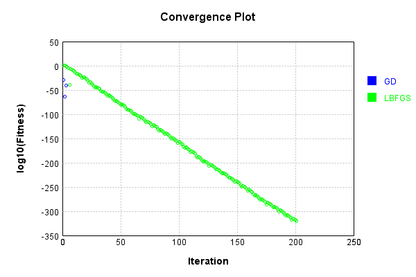
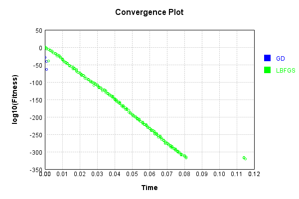

# SumInputsLayer
## N1Test
### Json Serialization
Code from [JsonTest.java:36](../../../../../../../../src/main/java/com/simiacryptus/mindseye/test/unit/JsonTest.java#L36) executed in 0.00 seconds: 
```java
    JsonObject json = layer.getJson();
    NNLayer echo = NNLayer.fromJson(json);
    if ((echo == null)) throw new AssertionError("Failed to deserialize");
    if ((layer == echo)) throw new AssertionError("Serialization did not copy");
    if ((!layer.equals(echo))) throw new AssertionError("Serialization not equal");
    return new GsonBuilder().setPrettyPrinting().create().toJson(json);
```

Returns: 

```
    {
      "class": "com.simiacryptus.mindseye.layers.java.SumInputsLayer",
      "id": "14dec7ed-b7ac-4f92-9892-772aa11d8207",
      "isFrozen": false,
      "name": "SumInputsLayer/14dec7ed-b7ac-4f92-9892-772aa11d8207"
    }
```


### Example Input/Output Pair
Code from [ReferenceIO.java:68](../../../../../../../../src/main/java/com/simiacryptus/mindseye/test/unit/ReferenceIO.java#L68) executed in 0.00 seconds: 
```java
    SimpleEval eval = SimpleEval.run(layer, inputPrototype);
    return String.format("--------------------\nInput: \n[%s]\n--------------------\nOutput: \n%s\n--------------------\nDerivative: \n%s",
      Arrays.stream(inputPrototype).map(t -> t.prettyPrint()).reduce((a, b) -> a + ",\n" + b).get(),
      eval.getOutput().prettyPrint(),
      Arrays.stream(eval.getDerivative()).map(t -> t.prettyPrint()).reduce((a, b) -> a + ",\n" + b).get());
```

Returns: 

```
    --------------------
    Input: 
    [[ -0.204, 0.272, 0.968 ],
    [ 0.24 ]]
    --------------------
    Output: 
    [ 0.036000000000000004, 0.512, 1.208 ]
    --------------------
    Derivative: 
    [ 1.0, 1.0, 1.0 ],
    [ 3.0 ]
```


### Batch Execution
Code from [BatchingTester.java:66](../../../../../../../../src/main/java/com/simiacryptus/mindseye/test/unit/BatchingTester.java#L66) executed in 0.00 seconds: 
```java
    return test(reference, inputPrototype);
```

Returns: 

```
    ToleranceStatistics{absoluteTol=0.0000e+00 +- 0.0000e+00 [0.0000e+00 - 0.0000e+00] (70#), relativeTol=0.0000e+00 +- 0.0000e+00 [0.0000e+00 - 0.0000e+00] (70#)}
```


Code from [SingleDerivativeTester.java:77](../../../../../../../../src/main/java/com/simiacryptus/mindseye/test/unit/SingleDerivativeTester.java#L77) executed in 0.00 seconds: 
```java
    return test(component, inputPrototype);
```
Logging: 
```
    Inputs: [ 1.852, -1.896, -0.372 ],
    [ -1.648 ]
    Inputs Statistics: {meanExponent=0.038674085076620145, negative=2, min=-0.372, max=-0.372, mean=-0.1386666666666666, count=3.0, positive=1, stdDev=1.5389843692802372, zeros=0},
    {meanExponent=0.21695720736109697, negative=1, min=-1.648, max=-1.648, mean=-1.648, count=1.0, positive=0, stdDev=0.0, zeros=0}
    Output: [ 0.20400000000000018, -3.5439999999999996, -2.02 ]
    Outputs Statistics: {meanExponent=0.05482508336251198, negative=2, min=-2.02, max=-2.02, mean=-1.7866666666666664, count=3.0, positive=1, stdDev=1.5389843692802367, zeros=0}
    Feedback for input 0
    Inputs Values: [ 1.852, -1.896, -0.372 ]
    Value Statistics: {meanExponent=0.038674085076620145, negative=2, min=-0.372, max=-0.372, mean=-0.1386666666666666, count=3.0, positive=1, stdDev=1.5389843692802372, zeros=0}
    Implemented Feedback: [ [ 1.0, 0.0, 0.0 ], [ 0.0, 1.0, 0.0 ], [ 0.0, 0.0, 1.0 ] ]
    Implemented Statistics: {meanExponent=0.0, negative=0, min=1.0, max=1.0, mean=0.3333333333333333, count=9.0, pos
```
...[skipping 842 bytes](etc/409.txt)...
```
    n=-1.648, max=-1.648, mean=-1.648, count=1.0, positive=0, stdDev=0.0, zeros=0}
    Implemented Feedback: [ [ 1.0, 1.0, 1.0 ] ]
    Implemented Statistics: {meanExponent=0.0, negative=0, min=1.0, max=1.0, mean=1.0, count=3.0, positive=3, stdDev=0.0, zeros=0}
    Measured Feedback: [ [ 0.9999999999998899, 0.9999999999976694, 1.0000000000021103 ] ]
    Measured Statistics: {meanExponent=-4.7830642341759385E-14, negative=0, min=1.0000000000021103, max=1.0000000000021103, mean=0.9999999999998899, count=3.0, positive=3, stdDev=0.0, zeros=0}
    Feedback Error: [ [ -1.1013412404281553E-13, -2.3305801732931286E-12, 2.1103119252074976E-12 ] ]
    Error Statistics: {meanExponent=-12.088755799140722, negative=2, min=2.1103119252074976E-12, max=2.1103119252074976E-12, mean=-1.1013412404281553E-13, count=3.0, positive=1, stdDev=1.8129866073473577E-12, zeros=0}
    Finite-Difference Derivative Accuracy:
    absoluteTol: 7.5850e-13 +- 1.0364e-12 [0.0000e+00 - 2.3306e-12] (12#)
    relativeTol: 7.5850e-13 +- 4.9943e-13 [5.5067e-14 - 1.1653e-12] (6#)
    
```

Returns: 

```
    ToleranceStatistics{absoluteTol=7.5850e-13 +- 1.0364e-12 [0.0000e+00 - 2.3306e-12] (12#), relativeTol=7.5850e-13 +- 4.9943e-13 [5.5067e-14 - 1.1653e-12] (6#)}
```


### Performance
Now we execute larger-scale runs to benchmark performance:

Code from [PerformanceTester.java:66](../../../../../../../../src/main/java/com/simiacryptus/mindseye/test/unit/PerformanceTester.java#L66) executed in 0.01 seconds: 
```java
    test(component, inputPrototype);
```
Logging: 
```
    100 batches
    Input Dimensions:
    	[100]
    	[1]
    Performance:
    	Evaluation performance: 0.000534s +- 0.000415s [0.000126s - 0.001062s]
    	Learning performance: 0.000297s +- 0.000055s [0.000246s - 0.000398s]
    
```

### Input Learning
In this test, we use a network to learn this target input, given it's pre-evaluated output:

Code from [LearningTester.java:127](../../../../../../../../src/main/java/com/simiacryptus/mindseye/test/unit/LearningTester.java#L127) executed in 0.00 seconds: 
```java
    return Arrays.stream(input_target).map(x -> x.prettyPrint()).reduce((a, b) -> a + "\n" + b).orElse("");
```

Returns: 

```
    [ 0.9, 0.272, 1.78, -1.76, -1.852, 1.476, -0.216, 1.936, ... ]
    [ -1.1 ]
```


First, we use a conjugate gradient descent method, which converges the fastest for purely linear functions.

Code from [LearningTester.java:300](../../../../../../../../src/main/java/com/simiacryptus/mindseye/test/unit/LearningTester.java#L300) executed in 0.01 seconds: 
```java
    return new IterativeTrainer(trainable)
      .setLineSearchFactory(label -> new QuadraticSearch())
      .setOrientation(new GradientDescent())
      .setMonitor(monitor)
      .setTimeout(30, TimeUnit.SECONDS)
      .setMaxIterations(250)
      .setTerminateThreshold(0)
      .run();
```
Logging: 
```
    Constructing line search parameters: GD
    F(0.0) = LineSearchPoint{point=PointSample{avg=8.968800800000002}, derivative=-1.4350081280000002}
    New Minimum: 8.968800800000002 > 8.968800799856501
    F(1.0E-10) = LineSearchPoint{point=PointSample{avg=8.968800799856501}, derivative=-1.43500812798852}, delta = -1.4350121091410983E-10
    New Minimum: 8.968800799856501 > 8.968800798995495
    F(7.000000000000001E-10) = LineSearchPoint{point=PointSample{avg=8.968800798995495}, derivative=-1.4350081279196396}, delta = -1.0045067000419294E-9
    New Minimum: 8.968800798995495 > 8.96880079296846
    F(4.900000000000001E-9) = LineSearchPoint{point=PointSample{avg=8.96880079296846}, derivative=-1.4350081274374769}, delta = -7.031541571222988E-9
    New Minimum: 8.96880079296846 > 8.968800750779222
    F(3.430000000000001E-8) = LineSearchPoint{point=PointSample{avg=8.968800750779222}, derivative=-1.4350081240623378}, delta = -4.922078034041988E-8
    New Minimum: 8.968800750779222 > 8.96880045545455
    F(2.4010000000000004E-7) = LineSearchPoint{poi
```
...[skipping 4158 bytes](etc/410.txt)...
```
    mple{avg=7.940206257303001E-42}, derivative=1.1277528501358076E-40}, delta = -1.7907505254638534E-35
    7.940206257303001E-42 <= 1.790751319484479E-35
    Converged to right
    Iteration 3 complete. Error: 7.940206257303001E-42 Total: 249862269948692.7200; Orientation: 0.0000; Line Search: 0.0002
    Zero gradient: 1.1271348637889258E-21
    F(0.0) = LineSearchPoint{point=PointSample{avg=7.940206257303001E-42}, derivative=-1.2704330011684803E-42}
    New Minimum: 7.940206257303001E-42 > 1.0076447591805995E-45
    F(12.640814652010798) = LineSearchPoint{point=PointSample{avg=1.0076447591805995E-45}, derivative=1.4311646477006059E-44}, delta = -7.93919861254382E-42
    1.0076447591805995E-45 <= 7.940206257303001E-42
    New Minimum: 1.0076447591805995E-45 > 0.0
    F(12.499999999999998) = LineSearchPoint{point=PointSample{avg=0.0}, derivative=0.0}, delta = -7.940206257303001E-42
    Right bracket at 12.499999999999998
    Converged to right
    Iteration 4 complete. Error: 0.0 Total: 249862270455099.7200; Orientation: 0.0000; Line Search: 0.0004
    
```

Returns: 

```
    0.0
```


Training Converged

Next, we run the same optimization using L-BFGS, which is nearly ideal for purely second-order or quadratic functions.

Code from [LearningTester.java:324](../../../../../../../../src/main/java/com/simiacryptus/mindseye/test/unit/LearningTester.java#L324) executed in 0.12 seconds: 
```java
    return new IterativeTrainer(trainable)
      .setLineSearchFactory(label -> new ArmijoWolfeSearch())
      .setOrientation(new LBFGS())
      .setMonitor(monitor)
      .setTimeout(30, TimeUnit.SECONDS)
      .setMaxIterations(250)
      .setTerminateThreshold(0)
      .run();
```
Logging: 
```
    LBFGS Accumulation History: 1 points
    Constructing line search parameters: GD
    th(0)=8.968800800000002;dx=-1.4350081280000002
    New Minimum: 8.968800800000002 > 6.143598216681823
    END: th(2.154434690031884)=6.143598216681823; dx=-1.187677624684727 delta=2.8252025833181795
    Iteration 1 complete. Error: 6.143598216681823 Total: 249862273508357.7200; Orientation: 0.0000; Line Search: 0.0003
    LBFGS Accumulation History: 1 points
    th(0)=6.143598216681823;dx=-0.9829757146690915
    New Minimum: 6.143598216681823 > 2.4281319074180137
    END: th(4.641588833612779)=2.4281319074180137; dx=-0.6179701865954438 delta=3.715466309263809
    Iteration 2 complete. Error: 2.4281319074180137 Total: 249862273802455.7200; Orientation: 0.0000; Line Search: 0.0002
    LBFGS Accumulation History: 1 points
    th(0)=2.4281319074180137;dx=-0.38850110518688236
    New Minimum: 2.4281319074180137 > 0.09712527629672042
    END: th(10.000000000000002)=0.09712527629672042; dx=-0.07770022103737641 delta=2.3310066311212934
    Iteration 3 complete. Error: 0.0971252
```
...[skipping 106864 bytes](etc/411.txt)...
```
    17 > 8.03415E-319
    END: th(10.57967178848433)=8.03415E-319; dx=-8.36745E-319 delta=3.3238034E-317
    Iteration 200 complete. Error: 8.03415E-319 Total: 249862388231253.6200; Orientation: 0.0000; Line Search: 0.0003
    LBFGS Accumulation History: 1 points
    th(0)=8.03415E-319;dx=-1.28546E-319
    New Minimum: 8.03415E-319 > 5.4478E-319
    WOLF (strong): th(22.793211910262304)=5.4478E-319; dx=1.05854E-319 delta=2.58633E-319
    New Minimum: 5.4478E-319 > 6.26E-321
    END: th(11.396605955131152)=6.26E-321; dx=-1.135E-320 delta=7.97155E-319
    Iteration 201 complete. Error: 6.26E-321 Total: 249862388769862.6200; Orientation: 0.0000; Line Search: 0.0004
    LBFGS Accumulation History: 1 points
    th(0)=6.26E-321;dx=-1.003E-321
    New Minimum: 6.26E-321 > 5.82E-321
    WOLF (strong): th(24.553243218358503)=5.82E-321; dx=9.63E-322 delta=4.4E-322
    New Minimum: 5.82E-321 > 0.0
    END: th(12.276621609179251)=0.0; dx=-2.0E-323 delta=6.26E-321
    Iteration 202 complete. Error: 0.0 Total: 249862389204739.6200; Orientation: 0.0000; Line Search: 0.0003
    
```

Returns: 

```
    0.0
```


Training Converged

Code from [LearningTester.java:96](../../../../../../../../src/main/java/com/simiacryptus/mindseye/test/unit/LearningTester.java#L96) executed in 0.00 seconds: 
```java
    return TestUtil.compare(runs);
```

Returns: 




Code from [LearningTester.java:99](../../../../../../../../src/main/java/com/simiacryptus/mindseye/test/unit/LearningTester.java#L99) executed in 0.00 seconds: 
```java
    return TestUtil.compareTime(runs);
```

Returns: 




